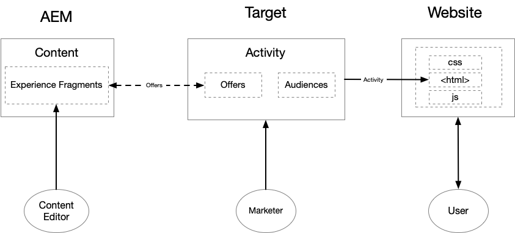

# Introdução ao AEM e ao Adobe Target {#getting-started-with-aem-target}

O AEM e o Target são soluções eficientes com recursos aparentemente sobrepostos. Às vezes, os clientes têm dificuldades em entender como e quando usar esses produtos em conjunto para fornecer experiência personalizada. Para fornecer experiência otimizada para cada usuário final, equipes diferentes em sua organização devem trabalhar em conjunto e definir quem faz o quê.

Neste tutorial, cobrimos três cenários diferentes para o AEM e o Target, o que ajuda você a entender o que funciona melhor para sua organização e como diferentes equipes colaboram.

* Cenário 1 : Personalização usando fragmentos de experiência do AEM
* Cenário 2 : Personalização usando o Visual Experience Composer
* Cenário 3 : Personalização de experiências completas de página da Web

## Personalização usando fragmentos de experiência do AEM {#personalization-using-aem-experience-fragment}

Nesse cenário, usaremos o AEM e o Target. Claramente, ambos os produtos têm seus próprios pontos fortes e, quando se trata de fornecer experiências personalizadas aos usuários do seu site, você precisa **conteúdo personalizado (conteúdo do AEM)** e um **modo inteligente (Target)** para veicular esse conteúdo com base em um usuário específico.

O AEM ajuda a criar conteúdo personalizado, reunindo todo o conteúdo e ativos em um local central para alimentar sua estratégia de personalização. O AEM permite que você crie conteúdo facilmente para desktops, tablets e dispositivos móveis em um único local, sem gravar código. Não há necessidade de criar páginas para cada dispositivo. O AEM ajusta automaticamente cada experiência usando seu conteúdo. Você também pode exportar o conteúdo do AEM para o Adobe Target como ofertas com um botão.

Agora temos conteúdo personalizado na forma de Ofertas do AEM no Target. O Target permite fornecer essas ofertas em escala com base em uma combinação de abordagens de aprendizado de máquina baseadas em regras e AI que incorporam variáveis comportamentais, contextuais e offline.  Com o Target, você pode configurar e executar facilmente atividades A/B e multivariadas (MVT) para determinar as melhores ofertas, conteúdo e experiências.

**Os** fragmentos de experiência representam um grande passo em frente para vincular os criadores de conteúdo/experiência aos profissionais de personalização que estão gerando resultados comerciais usando o Target.

* O editor de conteúdo do AEM cria conteúdo personalizado como Fragmentos de experiência e suas variações
* O AEM exporta o HTML do fragmento de experiência para o Target &#x200B;
* O Target &#x200B; usa a marcação do Fragmento de experiência do AEM como ofertas nas atividades
* O Target fornece HTML de Fragmento de experiência, o AEM fornece imagens referenciadas

   

**Para implementar esse cenário, é necessário:**

* [Integrar o AEM e o Adobe Target usando o Launch e o Adobe I/O](./implementation.md#integrating-aem-target-options)
* [AEM e Adobe Target usando serviços em nuvem herdados](./implementation.md#integrating-aem-target-options)

***Após implementar as integrações acima, vamos explorar o  [cenário em detalhes](./personalization-use-case-1.md).***

## Personalização usando o Visual Experience Composer

Os profissionais de marketing podem fazer alterações rápidas em seu site sem alterar qualquer código para executar um teste usando o Adobe Target Visual Experience Composer (VEC). O VEC é a interface do usuário WYSIWYG (O que você vê é o que você obtém) que permite criar e testar facilmente experiências e ofertas personalizadas no contexto do site. Você pode criar experiências e ofertas para atividades do Target arrastando e soltando, alternando e modificando o layout e o conteúdo de uma página da Web (ou Oferta) ou página da Web móvel.

O VEC é um dos principais recursos do Adobe Target. O VEC permite que profissionais de marketing e designers criem e alterem o conteúdo usando uma interface visual. Muitas opções de design podem ser feitas sem a necessidade de edição direta do código. A edição de HTML e JavaScript também é possível usando as opções de edição disponíveis no compositor.

* O conteúdo reside no AEM, e os editores de conteúdo criam e gerenciam as páginas do site
* O Target usa páginas de site hospedadas no AEM para executar testes e personalização
* O Target fornece conteúdo personalizado
* O novo conteúdo líquido é criado usando o VEC do Adobe Target
* Aplica-se a sites hospedados do AEM e a sites hospedados que não são do AEM

   

**Para implementar esse cenário, é necessário:**

* [Integrar o AEM e o Adobe Target usando o Launch e o Adobe I/O](./implementation.md#integrating-aem-target-options)

***Após implementar a integração acima, vamos explorar o  [cenário em detalhes.](./personalization-use-case-3.md)***

## Personalização de experiências completas de página da Web

A integração do Adobe Experience Manager com o Adobe Target ajuda a fornecer uma experiência personalizada para os usuários do site. Além disso, também ajuda você a entender melhor quais versões do conteúdo do seu site melhoram mais suas conversões durante um período de teste especificado. Por exemplo, um teste A/B compara duas ou mais versões do conteúdo do site para ver qual favorece mais suas conversões, vendas ou outras métricas identificadas. Um profissional de marketing pode criar atividades no Adobe Target para entender como os usuários interagem com o conteúdo do seu site e como isso afeta as métricas do seu site.

* O conteúdo reside no AEM, e os editores de conteúdo criam e gerenciam as páginas do site
* O Target usa páginas de site hospedadas no AEM para executar testes e personalização
* O Target fornece conteúdo personalizado
* Nenhum novo conteúdo é criado aqui
* Aplica-se a sites do AEM e não pertencentes ao AEM

   

**Para implementar esse cenário, é necessário:**

* [Integrar o AEM e o Adobe Target usando o Launch e o Adobe I/O](./implementation.md#integrating-aem-target-options)

***Após implementar a integração acima, vamos explorar o  [cenário em detalhes.](./personalization-use-case-2.md)***
