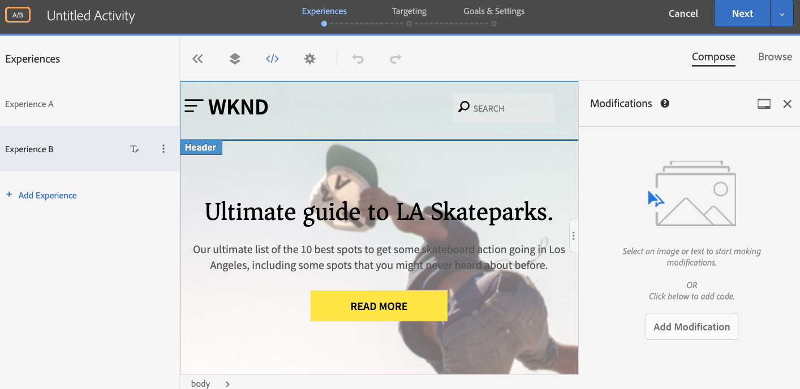

# Personalização de experiências completas de página da Web usando o Adobe Target

No capítulo anterior, aprendemos a criar uma atividade com base em localização geográfica no Adobe Target usando o conteúdo criado como Fragmentos de experiência e exportado do AEM como Ofertas HTML.

Neste capítulo, exploraremos a criação de atividades para redirecionar as páginas do site hospedadas em AEM para uma nova página usando o Adobe Target.

## Visão geral do cenário

O site da WKND reprojetou seu home page e gostaria de redirecionar seus visitantes atuais para o novo home page. Ao mesmo tempo, também saiba como o home page reprojetado ajuda a melhorar a participação e a receita do usuário. Como comerciante, você recebeu a tarefa para criar uma atividade para redirecionar os visitantes para o novo home page. Vamos explorar o home page do site da WKND e aprender a criar uma atividade usando o Adobe Target.

### Usuários envolvidos

Para este exercício, os usuários a seguir precisam estar envolvidos e para executar algumas tarefas, você pode precisar de acesso administrativo.

* **Content Producer/Editor** de conteúdo (Adobe Experience Manager)
* **Comerciante** (Adobe Target / Equipe de otimização)

### Home page do site WKND

### Pré-requisitos

* **AEM**
   * [AEM criação e publicação de instância](./implementation.md#getting-aem) em execução no localhost 4502 e 4503, respectivamente.
   * [AEM integrado ao Adobe Target usando o Adobe Experience Platform Launch](./using-launch-adobe-io.md#aem-target-using-launch-by-adobe)
* **Experience Cloud**
   * Acesso à Adobe Experience Cloud de suas organizações - <https://>`<yourcompany>`.experience.ecloud.adobe.com
   * Experience Cloud fornecido com as seguintes soluções
      * [Adobe Target](https://experiencecloud.adobe.com)

## Atividades do Editor de conteúdo

1. O profissional de marketing inicia a discussão de redesign do Home page WKND com AEM Editor de conteúdo e detalha os requisitos.
   * ***Requisito*** : Reprojete o Home page do site WKND com design baseado em cartão.
2. Com base nos requisitos, AEM Editor de conteúdo cria um novo home page do site WKND com um design baseado em cartão e publica o novo home page.

## Atividades do comerciante

1. O profissional de marketing cria uma atividade de público alvo A/B com a oferta de redirecionamento como uma Experiência e 100% de tráfego de site alocado para o novo home page com metas de sucesso e métricas adicionadas.
   1. Na janela do Adobe Target, navegue até a guia **Atividade** .
   2. Clique no botão **Criar Atividade** e selecione o tipo de atividade como Teste **A/B**

      
   3. Selecione o canal **Web** e escolha o **Visual Experience Composer**.
   4. Insira o URL **da** Atividade e clique em **Avançar** para abrir o Visual Experience Composer.
      
   5. Para que o **Visual Experience Composer** carregue, ative **Permitir carregamento de scripts** não seguros no seu navegador e recarregue sua página.
      
   6. Observe que o home page do site WKND é aberto no editor do Visual Experience Composer.
      
   7. Passe o mouse sobre a **Experiência B** e selecione visualização de outras opções.
      
   8. Selecione **Redirecionar para URL** e insira o URL para o novo Home page WKND. (http://localhost:4503/content/wknd/en1.html)
      
   9. **Salve** suas alterações e continue com as próximas etapas da Criação de Atividades.
   10. Selecione o Método **de alocação de** tráfego como manual e atribua 100% de tráfego à **Experiência B**.
      
   11. Clique em **Avançar**.
   12. Forneça métricas **de** metas para sua Atividade e Salve e feche seu teste A/B.
      
   13. Forneça um nome (**WKND Home page Redesign**) para a sua Atividade e salve as alterações.
   14. Na tela de detalhes da Atividade, certifique-se de **Ativar** sua atividade.
      
   15. Navegue até o Home page WKND (http://localhost:4503/content/wknd/en.html) e você será redirecionado para o Home page do site WKND reprojetado (http://localhost:4503/content/wknd/en1.html).
      

## Resumo

Neste capítulo, um profissional de marketing conseguiu criar uma atividade para redirecionar as páginas do site hospedadas em AEM para uma nova página usando o Adobe Target.
