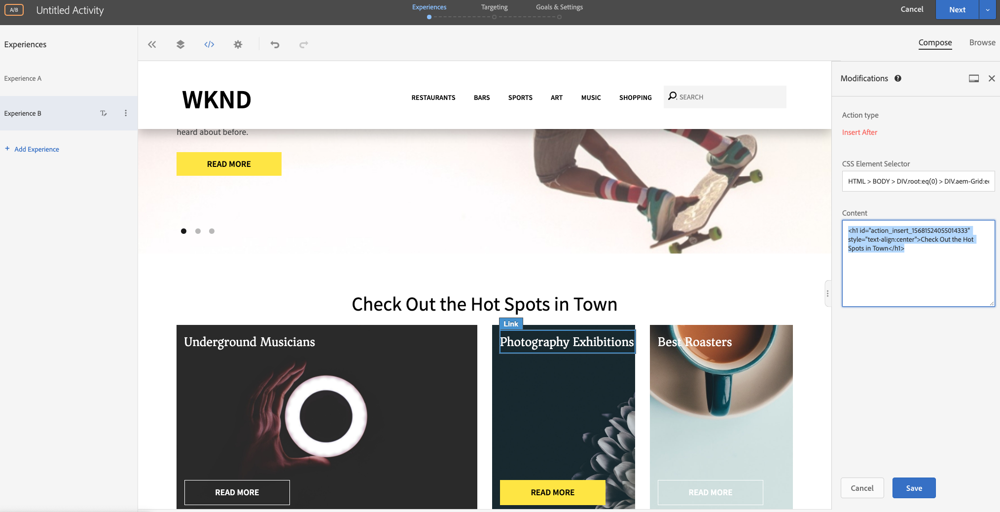

# Personalização usando o Visual Experience Composer

Neste capítulo, exploraremos a criação de experiências usando o **Visual Experience Composer** ao arrastar e soltar, trocar e modificar o layout e o conteúdo de uma página da Web a partir do Público alvo.

## Visão geral do cenário

O home page do site WKND exibe atividades locais ou a melhor coisa a se fazer em uma cidade na forma de layouts de cartão. Como comerciante, você recebeu a tarefa para modificar o home page, reorganizando os layouts do cartão para ver como isso afeta a participação do usuário e a conversão de drives.

### Usuários envolvidos

Para este exercício, os usuários a seguir precisam estar envolvidos e para executar algumas tarefas, você pode precisar de acesso administrativo.

* **Content Producer/Editor** de conteúdo (Adobe Experience Manager)
* **Comerciante** (Adobe Target / Equipe de otimização)

### Home page do site WKND


### Pré-requisitos

* **AEM**
   * [AEM instância](./implementation.md#getting-aem) de publicação em execução no 4503
   * [AEM integrado ao Adobe Target usando o Adobe Experience Platform Launch](./using-launch-adobe-io.md#aem-target-using-launch-by-adobe)
* **Experience Cloud**
   * Acesso à Adobe Experience Cloud de suas organizações - <https://>`<yourcompany>`.experience.ecloud.adobe.com
   * Experience Cloud fornecido com [Adobe Target](https://experiencecloud.adobe.com)

## Atividades do comerciante

1. O profissional de marketing cria uma atividade de público alvo A/B no Adobe Target.
   1. Na janela do Adobe Target, navegue até a guia **Atividade** .
   2. Clique no botão **Criar Atividade** e selecione o tipo de atividade como Teste **A/B**

      
   3. Selecione o canal **Web** e escolha o **Visual Experience Composer**.
   4. Insira o URL **da** Atividade e clique em **Avançar** para abrir o Visual Experience Composer.
      
   5. Para que o **Visual Experience Composer** carregue, ative **Permitir carregamento de scripts** não seguros no seu navegador e recarregue sua página.
      
   6. Observe que o home page do site WKND é aberto no editor do Visual Experience Composer.
      
   7. **A Experiência A** fornece o Home page WKND padrão e vamos editar o layout do conteúdo para a **Experiência B**.
      
   8. Clique em um dos container de layout de cartão (*Best Roasters*) e selecione a opção **Reorganizar** .
      
   9. Clique no container que deseja reorganizar e arraste e solte-o no local desejado. Vamos reorganizar o container *Best Roasters* da primeira linha da primeira coluna para a primeira linha da terceira. Agora o *melhor container de Roasters* estará ao lado do container de *Exposições* de Fotografia.
      

      **Após a troca**
      
   10. Da mesma forma, reorganize as posições dos outros container de cartão.
      
   11. Também vamos adicionar um texto de cabeçalho abaixo do componente de carrossel e acima do layout do cartão.
   12. Clique no container do carrossel e selecione a opção **Inserir depois > HTML** para adicionar HTML.
      

      ```html
      <h1 style="text-align:center">Check Out the Hot Spots in Town</h1>
      ```

      
   13. Clique em **Avançar** para continuar com sua atividade.
   14. Selecione o Método **de alocação de** tráfego como manual e atribua 100% de tráfego à **Experiência B**.
      
   15. Clique em **Avançar**.
   16. Forneça métricas **de** metas para sua Atividade e Salve e feche seu teste A/B.
      
   17. Forneça um nome (Atualização **de Home page** WKND) para a sua Atividade e salve as alterações.
   18. Na tela de detalhes da Atividade, certifique-se de **Ativar** sua atividade.
      
   19. Navegue até o Home page WKND (http://localhost:4503/content/wknd/en.html) e observe as alterações que adicionamos à atividade de Teste A/B de Atualização do Home page WKND.
      
   20. Abra o console do navegador e inspecione a guia rede para procurar a resposta do público alvo para a atividade de teste A/B de atualização do Home page WKND.
      

## Resumo

Neste capítulo, um profissional de marketing conseguiu criar uma experiência usando o Visual Experience Composer arrastando e soltando, trocando e modificando o layout e o conteúdo de uma página da Web sem alterar nenhum código para executar um teste.
