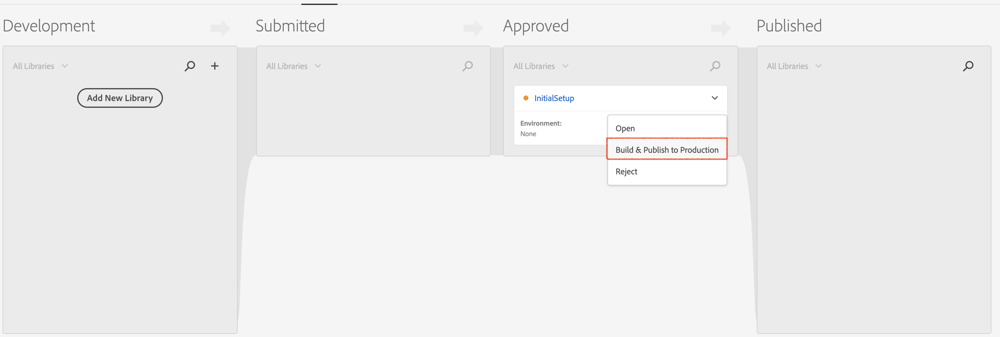

# Uso do Adobe Experience Platform Launch via Adobe I/O Console

## Pré-requisitos

* [AEM criar e publicar ](./implementation.md#set-up-aem) instruções na porta 4502 e 4503 localhost, respectivamente
* **Experience Cloud**
   * Acesso à Adobe Experience Cloud de suas organizações - <https://>`<yourcompany>`.experience.ecloud.adobe.com
   * Experience Cloud fornecido com as seguintes soluções
      * [Adobe Experience Platform Launch](https://experiencecloud.adobe.com)
      * [Adobe Target](https://experiencecloud.adobe.com)
      * [Adobe I/O Console](https://console.adobe.io)

      >[!NOTE]
      >Você deve ter permissão para Desenvolver, Aprovar, Publicar, Gerenciar extensões e Gerenciar Ambientes no Launch. Se você não conseguir concluir nenhuma dessas etapas porque as opções da interface do usuário não estão disponíveis, entre em contato com o administrador do Experience Cloud para solicitar acesso. Para obter mais informações sobre permissões de inicialização, [consulte a documentação](https://docs.adobelaunch.com/administration/user-permissions).

* **Plug-ins do navegador**
   * Adobe Experience Cloud Debugger ([Chrome](https://chrome.google.com/webstore/detail/adobe-experience-cloud-de/ocdmogmohccmeicdhlhhgepeaijenapj))
   * Iniciar e Comutador DTM ([Chrome](https://chrome.google.com/webstore/detail/launch-and-dtm-switch/nlgdemkdapolikbjimjajpmonpbpmipk))

## Usuários envolvidos

Para essa integração, as audiências a seguir precisam estar envolvidas e, para executar algumas tarefas, você pode precisar de acesso administrativo.

* Desenvolvedor
* Administrador AEM
* Administrador Experience Cloud

## Introdução

AEM oferta uma integração pronta para uso com o Experience Platform Launch. Essa integração permite que AEM administradores configurem facilmente o Experience Platform Launch através de uma interface fácil de usar, reduzindo assim o nível de esforço e o número de erros ao configurar essas duas ferramentas. E apenas adicionando a extensão do Adobe Target ao Experience Platform Launch nos ajudará a usar todos os recursos do Adobe Target nas páginas da Web AEM.

Nesta seção, estaríamos cobrindo as seguintes etapas de integração:

* Lançamento
   * Criar uma propriedade de inicialização
   * Adicionando Extensão do target
   * Criar um elemento de dados
   * Criar uma regra de página
   * Ambientes de configuração
   * Criar e publicar
* AEM
   * Criar um Cloud Service
   * Criar

### Lançamento

#### Criar uma propriedade de inicialização

Uma propriedade é um container que você preenche com extensões, regras, elementos de dados e bibliotecas à medida que implanta tags no site.

1. Navegue até suas organizações [Adobe Experience Cloud](https://experiencecloud.adobe.com/) (<https://>`<yourcompany>`.experience.ecloud.adobe.com)
2. Faça logon usando seu Adobe ID e verifique se você está na organização correta.
3. No alternador de soluções, clique em **Iniciar** e selecione o botão **Ir para inicialização**.

   

4. Verifique se você está na organização correta e continue criando uma propriedade Launch.
   

   *Para obter mais informações sobre como criar propriedades, consulte  [Criar uma ](https://docs.adobelaunch.com/administration/companies-and-properties#create-a-property) propriedade na documentação do produto.*
5. Clique no botão **Nova propriedade**
6. Forneça um nome para sua propriedade (Por exemplo, *AEM Tutorial do Público alvo*)
7. Como o domínio, digite *localhost.com*, pois este é o domínio em que o site de demonstração WKND está sendo executado. Embora o campo &#39;*Domain*&#39; seja obrigatório, a propriedade Launch funcionará em qualquer domínio em que for implementada. A finalidade principal desse campo é preencher previamente as opções de menu no Construtor de regras.
8. Clique no botão **Salvar**.

   

9. Abra a propriedade que acabou de criar e clique na guia Extensões.

#### Adicionando Extensão do target

A extensão do Adobe Target suporta implementações do lado do cliente usando o Público alvo JavaScript SDK para a Web moderna, `at.js`. Os clientes que ainda usam a biblioteca mais antiga do Público alvo, `mbox.js`, [devem atualizar para at.js](https://docs.adobe.com/content/help/en/target/using/implement-target/client-side/upgrading-from-atjs-1x-to-atjs-20.html) para usar o Launch.

A Extensão do target consiste em duas partes principais:

* A configuração da extensão, que gerencia as configurações da biblioteca principal
* Ações de regras para fazer o seguinte:
   * Carregar Público alvo (at.js)
   * Adicionar parâmetros a todas as mboxes
   * Adicionar parâmetros à mbox global
   * Mbox global Fire

1. Em **Extensões**, você pode ver a lista de Extensões que já estão instaladas para a propriedade Iniciar. ([O Experience Platform Launch Core Extension](https://exchange.adobe.com/experiencecloud.details.100223.adobe-launch-core-extension.html) está instalado por padrão)
2. Clique na opção **Catálogo de extensão** e procure o Público alvo no filtro.
3. Selecione a versão mais recente do Adobe Target at.js e clique na opção **Instalar**.
   

4. Clique no botão **Configurar** e você pode observar a janela de configuração com as credenciais de conta de Público alvo importadas e a versão at.js desta extensão.
   

   Quando o Público alvo é implantado por meio de códigos incorporados de inicialização assíncronos, você deve codificar um trecho pré-ocultado em suas páginas antes dos códigos incorporados de inicialização para gerenciar a oscilação do conteúdo. Aprenderemos mais sobre o snipper pré-oculto mais tarde. Você pode baixar o snippet de pré-ocultação [aqui](assets/using-launch-adobe-io/prehiding.js)

5. Clique em **Salvar** para concluir a adição da Extensão do target à propriedade Iniciar e agora você poderá ver a Extensão do target listada na lista de extensões **Instaladas**.

6. Repita as etapas acima para pesquisar a extensão &quot;Serviço de ID de Experience Cloud&quot; e instale-a.
   

#### Ambientes de configuração

1. Clique na guia **Ambiente** para obter a propriedade do site, e você pode ver a lista do ambiente que é criada para a propriedade do site. Por padrão, temos uma instância criada para desenvolvimento, armazenamento temporário e produção.

#### Criar e publicar

1. Clique na guia **Publicação** para a propriedade do site, e vamos criar uma biblioteca para criar e implantar nossas alterações (elementos de dados, regras) em um ambiente de desenvolvimento.
   >[!VIDEO](https://video.tv.adobe.com/v/28412?quality=12&learn=on)
2. Publique suas alterações de Desenvolvimento para um ambiente de armazenamento temporário.
   >[!VIDEO](https://video.tv.adobe.com/v/28419?quality=12&learn=on)
3. Execute a opção **Criar para armazenamento temporário**.
4. Quando a compilação estiver concluída, execute **Aprovar para publicação**, o que move suas alterações de um ambiente de armazenamento temporário para um ambiente de produção.
   
5. Por fim, execute a opção **Criar e Publicar na produção** para encaminhar suas alterações para a produção.
   

### Adobe Experience Manager

>[!VIDEO](https://video.tv.adobe.com/v/28416?quality=12&learn=on)

>[!NOTE]
>
> Conceda à integração da Adobe I/O o acesso a espaços de trabalho selecionados com a função [apropriada para permitir que uma equipe central faça alterações orientadas por API em apenas alguns espaços de trabalho](https://docs.adobe.com/content/help/en/target/using/administer/manage-users/enterprise/configure-adobe-io-integration.html).

1. Crie a integração IMS em AEM usando credenciais da Adobe I/O. (01:12 às 03:55)
2. No Experience Platform Launch, crie uma propriedade. (coberto [acima](#create-launch-property))
3. Usando a integração do IMS da Etapa 1, crie a integração do Experience Platform Launch para importar a propriedade Launch.
4. Em AEM, mapeie a integração do Experience Platform Launch para um site usando a configuração do navegador. (das 05:28 às 06:14)
5. Valide a integração manualmente. (das 06:15 às 06:33)
6. Usando o plug-in Iniciar/navegador DTM. (das 06:34 às 06:50)
7. Usando o plug-in do navegador do Adobe Experience Cloud Debugger. (das 06:51 às 07:22)

Neste ponto, você integrou [AEM com êxito ao Adobe Target usando o Adobe Experience Platform Launch](./using-aem-cloud-services.md#integrating-aem-target-options) conforme detalhado na Opção 1.

Para usar AEM ofertas de fragmento de experiência para potencializar suas atividades de personalização, vamos para o próximo capítulo e integremos AEM com a Adobe Target usando os serviços de nuvem herdados.
