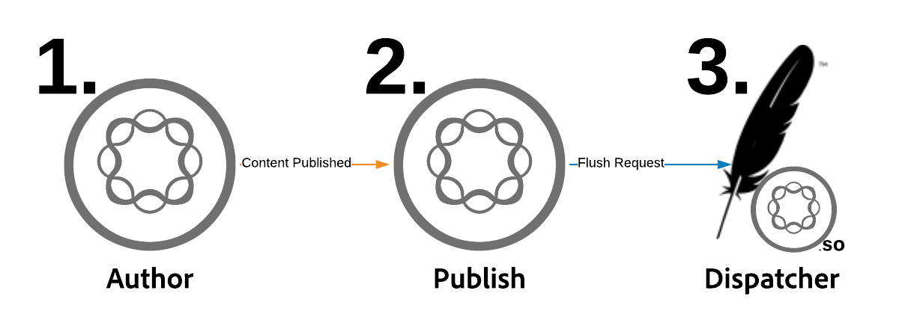
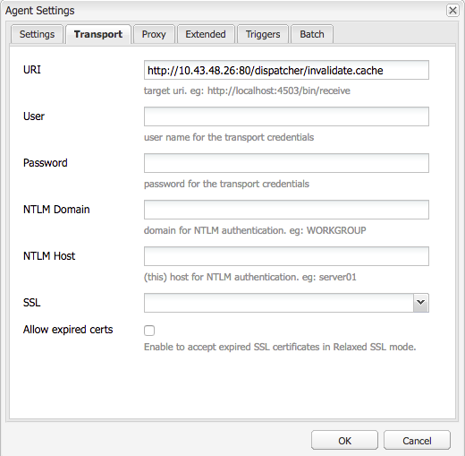

# URLs personalizadas do Dispatcher

[Índice](./overview.md)

[&lt;- Anterior: Uso e noções básicas sobre variáveis](./variables.md)

Este documento fornecerá orientação sobre como ocorre a liberação e explicará o mecanismo que executa a liberação e a invalidação do cache.


## Como funciona

### Ordem de operação

O fluxo de trabalho típico é melhor descrito quando os autores de conteúdo ativam uma página, quando o editor recebe o novo conteúdo, ele aciona uma solicitação de liberação para o Dispatcher, conforme mostrado no diagrama a seguir:

Essa cadeia de eventos destaca que apenas liberamos itens novos ou que foram alterados.  Isso garante que o conteúdo tenha sido recebido pelo editor antes de limpar o cache, para evitar condições de corrida, onde a liberação pode ocorrer antes que as alterações possam ser recebidas do editor.

## Agentes de replicação

No autor, há um agente de replicação configurado para apontar para o publicador que, quando algo é ativado, ele dispara para enviar o arquivo e todas as suas dependências para o publicador.

Quando o editor recebe o arquivo, ele tem um agente de replicação configurado para apontar para o Dispatcher que dispara no evento ao receber.  Em seguida, ele serializará uma solicitação de liberação e a postará no Dispatcher.

### AGENTE DE REPLICAÇÃO DO AUTOR

Aqui estão algumas capturas de tela de exemplo de um agente de replicação padrão configurado


Normalmente, há 1 ou 2 agentes de replicação configurados no autor para cada editor para o qual eles replicam conteúdo.

O primeiro é o agente de replicação padrão que envia ativações de conteúdo.

O segundo é o agente reverso.  Isso é opcional e está configurado para verificar a caixa de saída de cada publicador para ver se há novo conteúdo a ser extraído para o autor como uma atividade de replicação inversa

### AGENTE DE REPLICAÇÃO DO EDITOR

Veja um exemplo de capturas de tela de um agente de replicação de liberação padrão configurado


### REPLICAÇÃO DE LIBERAÇÃO DO DISPATCHER RECEBENDO HOST VIRTUAL

O módulo Dispatcher procura cabeçalhos específicos para saber quando uma solicitação POST é algo a ser transmitido para renderizações de AEM ou se é serializado como uma solicitação de liberação e precisa ser manipulado pelo próprio Dispatcher.

Esta é uma captura de tela da página de configuração que mostra estes valores:


A página de configuração padrão mostra o `Serialization Type` as `Dispatcher Flush` e define o nível de erro



No `Transport` guia você pode ver a variável `URI` sendo definido para apontar o endereço IP do Dispatcher que receberá as solicitações de liberação.  O caminho `/dispatcher/invalidate.cache` O não é como o módulo determina se é uma liberação, é apenas um terminal óbvio que você pode ver no log de acesso para saber se foi uma solicitação de liberação.  No `Extended` vamos analisar as coisas que estão lá para qualificar que esta é uma solicitação de liberação para o módulo Dispatcher.


O `HTTP Method` para solicitações de liberação é apenas um `GET` com alguns cabeçalhos de solicitação especiais:
- CQ-Action
   - Usa uma variável AEM com base na solicitação e o valor normalmente é *ativar ou excluir*
- CQ-Handle
   - Usa uma variável de AEM com base na solicitação e o valor normalmente é o caminho completo para o item liberado, por exemplo `/content/dam/logo.jpg`
- CQ-Path
   - Usa uma variável de AEM com base na solicitação e o valor normalmente é o caminho completo para o item que está sendo liberado, por exemplo `/content/dam`
- Host
   - É aqui que a variável `Host` O cabeçalho é falsificado para direcionar um `VirtualHost` que é configurado no servidor Web Apache do dispatcher (`/etc/httpd/conf.d/enabled_vhosts/aem_flush.vhost`).  É um valor codificado que corresponde a uma entrada no `aem_flush.vhost` do arquivo `ServerName` ou `ServerAlias`


No `Triggers` guia observaremos os acionadores alternados que usamos e o que eles são

- `Ignore default`
   - Isso é ativado para que o agente de replicação não seja acionado na ativação de uma página.  Isso é algo que, quando uma instância de autor fizesse uma alteração em uma página, acionaria uma liberação.  Como esse é um editor, não queremos desativar esse tipo de evento.
- `On Receive`
   - Quando um novo arquivo for recebido, queremos acionar uma liberação.  Portanto, quando o autor nos enviar um arquivo atualizado, acionaremos e enviaremos uma solicitação de liberação para o Dispatcher.
- `No Versioning`
   - Verificamos isso para evitar que o editor gere novas versões porque um novo arquivo foi recebido.  Vamos substituir o arquivo que temos e confiar no autor para rastrear as versões em vez do editor.

Agora, se olharmos para a aparência típica de uma solicitação de liberação na forma de um `curl` comando

```
$ curl \ 
-H "CQ-Action: Activate" \ 
-H "CQ-Handle: /content/dam/logo.jpg" \ 
-H "CQ-Path: /content/dam/" \ 
-H "Content-Length: 0" \  
-H "Content-Type: application/octect-stream" \ 
-H "Host: flush" \ 
http://10.43.0.32:80/dispatcher/invalidate.cache
```

Este exemplo de liberação liberaria a variável `/content/dam` atualizando o `.stat` nesse diretório.

## O `.stat` arquivo

O mecanismo de descarga é de natureza simples e queremos explicar a importância da `.stat` arquivos gerados na raiz do documento em que os arquivos de cache são criados.

Dentro do `.vhost` e `_farm.any` arquivos configuramos uma diretiva raiz de documento para especificar onde o cache está localizado e de onde armazenar / veicular arquivos quando uma solicitação de um usuário final chega.

Se você executasse o seguinte comando no servidor do Dispatcher, começaria a encontrar `.stat` arquivos

```
$ find /mnt/var/www/html/ -type f -name ".stat"
```

Este é um diagrama da aparência dessa estrutura de arquivo quando você tem itens no cache e tem uma solicitação de liberação enviada e processada pelo módulo Dispatcher


### NÍVEL DE ARQUIVO STAT

Observe que em cada diretório havia um `.stat` arquivo presente.  Este é um indicador de que ocorreu uma liberação.  No exemplo acima de `statfilelevel` foi definida como `3` dentro do arquivo de configuração farm correspondente.

O `statfilelevel` a configuração indica quantas pastas o módulo percorrerá e atualizará um `.stat` arquivo.  O arquivo .stat está vazio, não é nada mais do que um nome de arquivo com um carimbo de data e hora poderia ser criado manualmente, mas executando o comando touch na linha de comando do servidor Dispatcher.

Se a configuração de nível de arquivo stat estiver definida como muito alta, cada solicitação de liberação percorrerá a árvore de diretório tocando arquivos stat.  Isso pode se tornar um grande impacto no desempenho em árvores de cache grandes e pode afetar o desempenho geral do Dispatcher.

Definir esse nível de arquivo como muito baixo pode fazer com que uma solicitação de liberação apague mais do que o esperado.  O que, por sua vez, faria com que o cache fosse retornado com mais frequência, com menos solicitações sendo atendidas do cache, e poderia causar problemas de desempenho.

<div style="color: #000;border-left: 6px solid #2196F3;background-color:#ddffff;"><b>Nota:</b>

Defina as `statfilelevel` a um nível razoável.  Examine sua estrutura de pastas e verifique se está configurada para permitir liberações concisas sem ter que percorrer muitos diretórios.   Teste-o e certifique-se de que ele se ajuste às suas necessidades durante um teste de desempenho do sistema.

Um bom exemplo é um site que suporta idiomas.  A árvore de conteúdo típica teria os seguintes diretórios

`/content/brand1/en/us/`

Neste exemplo, use uma configuração de nível de arquivo stat de 4.  Isso garantirá quando você liberar o conteúdo contido no <b>`us`</b> que também não fará com que as pastas de idioma sejam liberadas.
</div>

### COMPARTILHAMENTO DE CARIMBO DE DATA E HORA DO ARQUIVO STAT

Quando uma solicitação de conteúdo ocorre na mesma rotina

1. Carimbo de data e hora do `.stat` é comparado ao carimbo de data e hora do arquivo solicitado
2. Se a variável `.stat` é mais recente do que o arquivo solicitado, ele exclui o conteúdo em cache e obtém um novo AEM e armazena em cache.  Em seguida, serve o conteúdo
3. Se a variável `.stat` O arquivo é mais antigo do que o arquivo solicitado e, em seguida, sabe que o arquivo é novo e pode servir o conteúdo.

### MANIPULAÇÃO DE CACHE - EXEMPLO 1

No exemplo acima, uma solicitação para o conteúdo `/content/index.html`

A hora do `index.html` O arquivo é 2019-11-01 às 18:21

A hora do mais próximo `.stat` O arquivo é 2019-11-01 às 12:22 PM

Ao entender o que lemos acima, você pode ver que o arquivo de índice é mais recente que o `.stat` e o arquivo seria distribuído do cache para o usuário final que o solicitou

### HANDSHAKE DE CACHE - EXEMPLO 2

No exemplo acima, uma solicitação para o conteúdo `/content/dam/logo.jpg`

A hora do `logo.jpg` O arquivo é 2019-10-31 às 13:13

A hora do mais próximo `.stat` O arquivo é 2019-11-01 às 12:22 PM

Como você pode ver neste exemplo, o arquivo é mais antigo do que a variável `.stat` e serão removidos e um novo será extraído do AEM para substituí-lo no cache antes de ser enviado ao usuário final que o solicitou.

## Configurações do arquivo farm

A documentação está aqui para o conjunto completo de opções de configuração: [https://docs.adobe.com/content/help/en/experience-manager-dispatcher/using/configuring/dispatcher-configuration.html#configuring-dispatcher_configuring-the-dispatcher-cache-cache](https://experienceleague.adobe.com/docs/experience-manager-dispatcher/using/configuring/dispatcher-configuration.html?lang=pt-BR)

Destacaremos alguns deles relacionados à liberação de cache

### Explorações de limpeza

Há duas chaves `document root` diretórios que armazenarão em cache arquivos do tráfego do autor e do editor.  Para manter esses diretórios atualizados com conteúdo novo, precisaremos liberar o cache.  Essas solicitações de liberação não querem ficar emaranhadas com as configurações normais do farm de tráfego de clientes que podem rejeitar a solicitação ou fazer algo indesejado.  Em vez disso, fornecemos dois farms de limpeza para esta tarefa:

- `/etc/httpd.conf.d/available_farms/001_ams_author_flush_farm.any`
- `/etc/httpd.conf.d/available_farms/001_ams_publish_flush_farm.any`

Esses arquivos farm não fazem nada além de liberar os diretórios raiz do documento.

```
/publishflushfarm {  
    /virtualhosts {
        "flush"
    }
    /cache {
        /docroot "${PUBLISH_DOCROOT}"
        /statfileslevel "${DEFAULT_STAT_LEVEL}"
        /rules {
            $include "/etc/httpd/conf.dispatcher.d/cache/ams_publish_cache.any"
        }
        /invalidate {
            /0000 {
                /glob "*"
                /type "allow"
            }
        }
        /allowedClients {
            /0000 {
                /glob "*.*.*.*"
                /type "deny"
            }
            $include "/etc/httpd/conf.dispatcher.d/cache/ams_publish_invalidate_allowed.any"
        }
    }
}
```

### Raiz do documento

Essa entrada de configuração está na seguinte seção do arquivo farm:

```
/myfarm { 
    /cache { 
        /docroot
```

Especifique o diretório no qual deseja que o Dispatcher preencha e gerencie como um diretório de cache.

<div style="color: #000;border-left: 6px solid #2196F3;background-color:#ddffff;"><b>Observação:</b>
Esse diretório deve corresponder à configuração raiz do documento Apache para o domínio que seu servidor da Web está configurado para usar.

Ter pastas docroot aninhadas por cada farm que vivem subpastas da raiz do documento Apache é uma péssima ideia por vários motivos.
</div>

### Nível dos arquivos stat

Essa entrada de configuração está na seguinte seção do arquivo farm:

```
/myfarm { 
    /cache { 
        /statfileslevel
```

Essa configuração mede o quão profundo `.stat` os arquivos precisarão ser gerados quando uma solicitação de liberação entrar.

`/statfileslevel` defina o seguinte número com a raiz do documento de `/var/www/html/` pode ter os seguintes resultados quando ocorrer rubor `/content/dam/brand1/en/us/logo.jpg`

- 0 - os arquivos stat a seguir seriam criados
   - `/var/www/html/.stat`
- 1 - os arquivos stat a seguir seriam criados
   - `/var/www/html/.stat`
   - `/var/www/html/content/.stat`
- 2 - os arquivos stat a seguir seriam criados
   - `/var/www/html/.stat`
   - `/var/www/html/content/.stat`
   - `/var/www/html/content/dam/.stat`
- 3 - os arquivos stat a seguir seriam criados
   - `/var/www/html/.stat`
   - `/var/www/html/content/.stat`
   - `/var/www/html/content/dam/.stat`
   - `/var/www/html/content/dam/brand1/.stat`
- 4 - os arquivos stat a seguir seriam criados
   - `/var/www/html/.stat`
   - `/var/www/html/content/.stat`
   - `/var/www/html/content/dam/.stat`
   - `/var/www/html/content/dam/brand1/.stat`
   - `/var/www/html/content/dam/brand1/en/.stat`
- 5 - os arquivos stat a seguir seriam criados
   - `/var/www/html/.stat`
   - `/var/www/html/content/.stat`
   - `/var/www/html/content/dam/.stat`
   - `/var/www/html/content/dam/brand1/.stat`
   - `/var/www/html/content/damn/brand1/en/.stat`
   - `/var/www/html/content/damn/brand1/en/us/.stat`


<div style="color: #000;border-left: 6px solid #2196F3;background-color:#ddffff;"><b>Nota:</b>

Lembre-se de que, quando ocorre a interação do carimbo de data e hora, ele procura o mais próximo `.stat` arquivo.

ter um `.stat` nível de arquivo 0 e um arquivo stat somente em `/var/www/html/.stat` significa o conteúdo sob o qual o está `/var/www/html/content/dam/brand1/en/us/` procuraria o mais próximo `.stat` e percorra até 5 pastas para encontrar a única `.stat` arquivo que existe no nível 0 e compare datas com esse.  Isso significa que uma liberação no nível mais alto invalidaria todos os itens em cache.
</div>

### Invalidação permitida

Essa entrada de configuração está na seguinte seção do arquivo farm:

```
/myfarm { 
    /cache { 
        /allowedClients {
```

Dentro dessa configuração, você coloca uma lista de endereços IP que podem enviar solicitações de liberação.  Se uma solicitação de liberação entrar no Dispatcher, ela deverá vir de um IP confiável.  Caso tenha configurado incorretamente ou enviado uma solicitação de liberação de um endereço IP não confiável, você verá o seguinte erro no arquivo de log:

```
[Mon Nov 11 22:43:05 2019] [W] [pid 3079 (tid 139859875088128)] Flushing rejected from 10.43.0.57
```

### Regras de invalidação

Essa entrada de configuração está na seguinte seção do arquivo farm:

```
/myfarm { 
    /cache { 
        /invalidate {
```

Normalmente, essas regras indicam quais arquivos podem ser invalidados com uma solicitação de liberação.

Para evitar que arquivos importantes sejam invalidados com uma ativação de página, você pode colocar regras que especificam quais arquivos são ok para invalidar e quais arquivos devem ser invalidados manualmente.  Este é um conjunto de amostras de configuração que permite que somente arquivos html sejam invalidados:

```
/invalidate { 
   /0000 { /glob "*" /type "deny" } 
   /0001 { /glob "*.html" /type "allow" } 
}
```

## Teste/solução de problemas

Ao ativar uma página e obter a luz verde informando que a ativação da página foi bem-sucedida, você deve esperar que o conteúdo ativado também seja liberado do cache.

Atualize sua página e veja o material antigo! o quê? havia um sinal verde?!

Vamos seguir alguns passos manualmente no processo de liberação para nos trazer uma ideia do que poderia estar errado.  No shell do editor, execute a seguinte solicitação de liberação usando curl:

```
$ curl -H "CQ-Action: Activate" \ 
-H "CQ-Handle: /content/<PATH TO ITEM TO FLUSH>" \ 
-H "CQ-Path: /content/<PATH TO ITEM TO FLUSH>" \ 
-H "Content-Length: 0" -H "Content-Type: application/octet-stream" \ 
-H "Host: flush" \ 
http://<DISPATCHER IP ADDRESS>/dispatcher/invalidate.cache
```

Exemplo de solicitação de liberação de teste

```
$ curl -H "CQ-Action: Activate" \ 
-H "CQ-Handle: /content/customer/en-us" \ 
-H "CQ-Path: /content/customer/en-us" \ 
-H "Content-Length: 0" -H "Content-Type: application/octet-stream" \ 
-H "Host: flush" \ 
http://169.254.196.222/dispatcher/invalidate.cache
```

Depois de disparar o comando de solicitação para o Dispatcher, você desejará ver o que é feito nos logs e o que é feito com o `.stat files`.  Siga o arquivo de log e você deve ver as seguintes entradas para confirmar a ocorrência da solicitação de liberação do módulo Dispatcher

```
[Wed Nov 13 16:54:12 2019] [I] [pid 19173:tid 140542721578752] Activation detected: action=Activate [/content/dam/logo.jpg] 
[Wed Nov 13 16:54:12 2019] [I] [pid 19173:tid 140542721578752] Touched /mnt/var/www/html/.stat 
[Wed Nov 13 16:54:12 2019] [I] [pid 19173:tid 140542721578752] Touched /mnt/var/www/html/content/.stat 
[Wed Nov 13 16:54:12 2019] [I] [pid 19173:tid 140542721578752] Touched /mnt/var/www/html/content/dam/.stat 
[Wed Nov 13 16:54:12 2019] [I] [pid 19173:tid 140542721578752] "GET /dispatcher/invalidate.cache" 200 purge [publishfarm/-] 0ms
```

Agora que vemos o módulo selecionado e reconhecemos a solicitação de liberação, precisamos ver como ele afetou o `.stat` arquivos.  Execute o seguinte comando e observe a atualização dos carimbos de data e hora à medida que emite outra liberação:

```
$ watch -n 3 "find /mnt/var/www/html/ -type f -name ".stat" | xargs ls -la $1"
```

Como você pode ver na saída do comando, os carimbos de data e hora do atual `.stat` arquivos

```
-rw-r--r--. 1 apache apache 0 Nov 13 16:54 /mnt/var/www/html/content/dam/.stat 
-rw-r--r--. 1 apache apache 0 Nov 13 16:54 /mnt/var/www/html/content/.stat 
-rw-r--r--. 1 apache apache 0 Nov 13 16:54 /mnt/var/www/html/.stat
```

Agora, se executarmos a liberação novamente, você verá os carimbos de data e hora serem atualizados

```
-rw-r--r--. 1 apache apache 0 Nov 13 17:17 /mnt/var/www/html/content/dam/.stat 
-rw-r--r--. 1 apache apache 0 Nov 13 17:17 /mnt/var/www/html/content/.stat 
-rw-r--r--. 1 apache apache 0 Nov 13 17:17 /mnt/var/www/html/.stat
```

Vamos comparar nossos carimbos de data e hora de conteúdo com nosso `.stat` arquivos carimbos de data e hora

```
$ stat /mnt/var/www/html/content/customer/en-us/.stat 
  File: `.stat' 
  Size: 0           Blocks: 0          IO Block: 4096   regular empty file 
Device: ca90h/51856d    Inode: 17154125    Links: 1 
Access: (0644/-rw-r--r--)  Uid: (   48/  apache)   Gid: (   48/  apache) 
Access: 2019-11-13 16:22:31.000000000 -0400 
Modify: 2019-11-13 16:22:31.000000000 -0400 
Change: 2019-11-13 16:22:31.000000000 -0400 
 
$ stat /mnt/var/www/html/content/customer/en-us/logo.jpg 
File: `logo.jpg' 
  Size: 15856           Blocks: 32          IO Block: 4096   regular file 
Device: ca90h/51856d    Inode: 9175290    Links: 1 
Access: (0644/-rw-r--r--)  Uid: (   48/  apache)   Gid: (   48/  apache) 
Access: 2019-11-11 22:41:59.642450601 +0000 
Modify: 2019-11-11 22:41:59.642450601 +0000 
Change: 2019-11-11 22:41:59.642450601 +0000
```

Se você observar qualquer um dos carimbos de data e hora, observará que o conteúdo tem um horário mais recente que o `.stat` arquivo que informa ao módulo para servir o arquivo do cache porque é mais recente que o `.stat` arquivo.

Em resumo, algo atualizou os carimbos de data e hora desse arquivo, o que não o qualifica como &quot;liberado&quot; ou substituído.

[Próximo -> URLs personalizados](./disp-vanity-url.md)