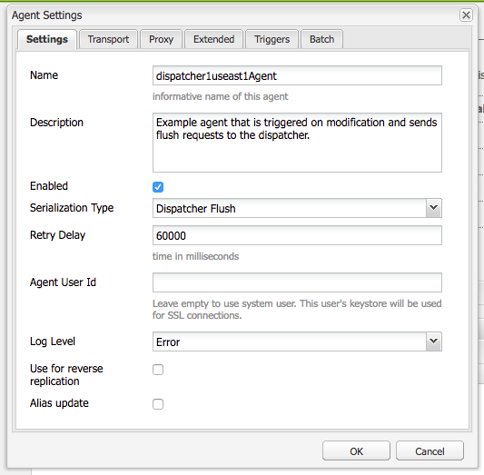

# URLs personalizados do Dispatcher

[Índice](./overview.md)

[&lt;- Anterior: Uso e noções básicas sobre variáveis](./variables.md)

Este documento fornece orientação sobre como ocorre a liberação e explica o mecanismo que executa a liberação de cache e a invalidação.


## Como funciona

### Ordem de operação

O fluxo de trabalho típico é melhor descrito quando os autores de conteúdo vão ativar uma página, quando o publicador recebe o novo conteúdo, ele aciona uma solicitação de liberação para o Dispatcher, conforme mostrado no diagrama a seguir:

Essa cadeia de eventos destaca que apenas liberamos os itens novos ou que foram alterados.  Isso garante que o conteúdo tenha sido recebido pelo publicador antes de limpar o cache, de forma a evitar condições de corrida, em que a liberação poderia ocorrer antes que as alterações pudessem ser recebidas do publicador.

## Agentes de replicação

Durante a criação, há um agente de replicação configurado para apontar para o publicador que, quando algo for ativado, ele acionará para enviar o arquivo e todas as suas dependências para o publicador.

Quando o publicador recebe o arquivo, ele tem um agente de replicação configurado para apontar para o Dispatcher que aciona no evento ao receber.  Em seguida, ele vai serializar uma solicitação de liberação e publicá-la no Dispatcher.

### AGENTE DE REPLICAÇÃO DO AUTOR

A seguir estão algumas capturas de tela de exemplo de um agente de replicação padrão configurado


Normalmente, há 1 ou 2 agentes de replicação configurados no autor para cada publicador com quem replicam conteúdo.

O primeiro é o agente de replicação padrão, que envia ativações de conteúdo.

O segundo é o agente reverso.  Isso é opcional e está configurado para verificar a caixa de saída de cada publicador para ver se há conteúdo novo a ser transmitido para o autor como uma atividade de replicação reversa

### AGENTE DE REPLICAÇÃO DO EDITOR

A seguir há uma captura de tela de exemplo de um agente de replicação de liberação padrão configurado


### REPLICAÇÃO DE LIBERAÇÃO DO DISPATCHER RECEBENDO HOST VIRTUAL

O módulo do Dispatcher procura por cabeçalhos específicos para saber quando uma solicitação POST é algo a ser transmitido para renderizações AEM ou se é serializado como uma solicitação de liberação e precisa ser manipulado pelo próprio manipulador do Dispatcher.

Esta é uma captura de tela da página de configuração, que mostra esses valores:


A página de configuração padrão mostra a `Serialization Type` as `Dispatcher Flush` e define o nível de erro


No `Transport` guia você pode ver a `URI` estar definido para apontar para o endereço IP do Dispatcher que receberá as solicitações de liberação.  O caminho `/dispatcher/invalidate.cache` não é como o módulo determina se é uma liberação, é apenas um endpoint óbvio que você pode ver no log de acesso para saber se era uma solicitação de liberação.  No `Extended` vamos analisar os itens existentes para qualificar se esta é uma solicitação de liberação para o módulo Dispatcher.


A variável `HTTP Method` para solicitações de liberação é apenas um `GET` solicitação com alguns cabeçalhos de solicitação especiais:
- CQ-Action
   - Usa uma variável AEM com base na solicitação, e o valor geralmente é *ativar ou excluir*
- CQ-Handle
   - Usa uma variável AEM com base na solicitação, e o valor geralmente é o caminho completo para o item liberado, por exemplo `/content/dam/logo.jpg`
- CQ-Path
   - Usa uma variável AEM com base na solicitação, e o valor geralmente é o caminho completo para o item que está sendo liberado, por exemplo `/content/dam`
- Host
   - É aqui que a `Host` O cabeçalho é falsificado para direcionar a um `VirtualHost` que está configurado no servidor Web Apache do Dispatcher (`/etc/httpd/conf.d/enabled_vhosts/aem_flush.vhost`).  O valor inserido no código que corresponde a uma entrada na variável `aem_flush.vhost` do arquivo `ServerName` ou `ServerAlias`


No `Triggers` registraremos os acionadores alternados que usamos e o que são

- `Ignore default`
   - Isso é ativado para que o agente de replicação não seja acionado em uma ativação de página.  Isso é algo que acionaria uma liberação quando uma instância do autor fizesse uma alteração na página.  Como é um publicador, não queremos desativar esse tipo de evento.
- `On Receive`
   - Quando um novo arquivo é recebido, queremos acionar uma liberação.  Assim, quando o autor nos enviar um arquivo atualizado, acionaremos e enviaremos uma solicitação de liberação para o Dispatcher.
- `No Versioning`
   - Marcamos essa opção para evitar que o publicador gere novas versões, pois um novo arquivo foi recebido.  Substituiremos o arquivo que temos e confiaremos que o autor irá monitorar as versões em vez do editor.

Agora, observaremos a aparência típica de uma solicitação de liberação na forma de um `curl` comando

```
$ curl \ 
-H "CQ-Action: Activate" \ 
-H "CQ-Handle: /content/dam/logo.jpg" \ 
-H "CQ-Path: /content/dam/" \ 
-H "Content-Length: 0" \  
-H "Content-Type: application/octect-stream" \ 
-H "Host: flush" \ 
http://10.43.0.32:80/dispatcher/invalidate.cache
```

Este exemplo de liberação liberaria o `/content/dam` caminho atualizando o `.stat` nesse diretório.

## A variável `.stat` arquivo

O mecanismo de descarga é de natureza simples e queremos explicar a importância da `.stat` arquivos gerados na raiz do documento onde os arquivos armazenados em cache são criados.

Dentro do `.vhost` e `_farm.any` arquivos configuramos uma diretiva raiz do documento para especificar onde o cache está localizado e onde armazenar / veicular arquivos quando entrar uma solicitação de um usuário final.

Se você executasse o seguinte comando no servidor do Dispatcher, começaria a encontrar `.stat` arquivos

```
$ find /mnt/var/www/html/ -type f -name ".stat"
```

Este é um diagrama da aparência dessa estrutura de arquivo ao armazenar itens em cache e enviar uma solicitação de liberação processada pelo módulo Dispatcher


### NÍVEL DO ARQUIVO STAT

Observe que em cada diretório havia uma `.stat` arquivo presente.  Isso é um indicador de que ocorreu uma liberação.  No exemplo acima, `statfilelevel` a configuração foi definida como `3` no arquivo de configuração farm correspondente.

A variável `statfilelevel` indica quantas pastas o módulo percorrerá e atualizará uma `.stat` arquivo.  O arquivo .stat está vazio e nada mais que um nome de arquivo com um carimbo de data e hora poderia ser criado manualmente além da execução do comando de toque na linha de comando do servidor do Dispatcher.

Se a configuração de nível do arquivo stat for definida como muito alta, cada solicitação de liberação percorrerá a árvore de diretório tocando os arquivos stat.  Isso pode se tornar uma importante ocorrência de desempenho em árvores de cache grandes e afetar o desempenho geral do Dispatcher.

Definir esse nível de arquivo como muito baixo pode fazer com que uma solicitação de liberação limpe mais do que o esperado.  O que, por sua vez, faria com que o cache fosse retido com mais frequência, com menos solicitações sendo atendidas do cache, o que pode causar problemas de desempenho.

>[!BEGINSHADEBOX &quot;Nota&quot;]

Defina o `statfilelevel` razoável. Observe a estrutura de pastas e verifique se ela está configurada para permitir liberações concisas sem precisar percorrer muitos diretórios. Teste e certifique-se de que ele atenda às suas necessidades durante um teste de desempenho do sistema.

Um bom exemplo é um site compatível com idiomas. A árvore de conteúdo típica teria os seguintes diretórios

`/content/brand1/en/us/`

Neste exemplo, use uma configuração de nível 4 do arquivo stat. Isso garantirá que, ao liberar o conteúdo contido em **`us`** que isso não fará com que as pastas de idioma também sejam liberadas.

>[!ENDSHADEBOX]

### HANDSHAKE DE CARIMBO DE DATA E HORA DO ARQUIVO STAT

Quando uma solicitação de conteúdo é recebida, ocorre a mesma rotina

1. Carimbo de data e hora do `.stat` é comparado ao carimbo de data e hora do arquivo solicitado
2. Se a variável `.stat` O arquivo é mais recente que o arquivo solicitado. Ele exclui o conteúdo em cache e busca um novo arquivo do AEM e o armazena em cache.  Em seguida, serve o conteúdo
3. Se a variável `.stat` for mais antigo que o arquivo solicitado, ele saberá que o arquivo é novo e pode fornecer o conteúdo.

### HANDSHAKE DE CACHE - EXEMPLO 1

No exemplo acima, uma solicitação para o conteúdo `/content/index.html`

A hora da `index.html` o arquivo é 01/11/2019 às 18:21

A hora do mais próximo `.stat` o arquivo é 01/11/2019 às 12:22

Ao entender o que lemos acima, você pode ver que o arquivo de índice é mais recente do que o `.stat` arquivo e o arquivo seria vinculado do cache para o usuário final que o solicitou

### HANDSHAKE DE CACHE - EXEMPLO 2

No exemplo acima, uma solicitação para o conteúdo `/content/dam/logo.jpg`

A hora da `logo.jpg` o arquivo é 31/10/2019 às 13:13

A hora do mais próximo `.stat` o arquivo é 01/11/2019 às 12:22

Como você pode ver neste exemplo, o arquivo é mais antigo que o `.stat` arquivo e serão removidos e um novo será extraído do AEM para substituí-lo no cache antes de ser enviado ao usuário final que o solicitou.

## Configurações do arquivo farm

Toda a documentação do conjunto completo de opções de configuração consta aqui: [https://docs.adobe.com/content/help/en/experience-manager-dispatcher/using/configuring/dispatcher-configuration.html#configuring-dispatcher_configuring-the-dispatcher-cache-cache](https://experienceleague.adobe.com/docs/experience-manager-dispatcher/using/configuring/dispatcher-configuration.html?lang=pt-BR)

Destacaremos algumas delas que pertencem à liberação de cache

### Limpar farms

Há duas chaves `document root` diretórios que armazenarão arquivos em cache a partir do tráfego do autor e do editor.  Para manter esses diretórios atualizados com conteúdo novo, precisaremos liberar o cache.  Essas solicitações de liberação não querem se envolver com as configurações normais do farm de tráfego do cliente que podem rejeitar a solicitação ou fazer algo indesejado.  Em vez disso, fornecemos dois farms de liberação para essa tarefa:

- `/etc/httpd.conf.d/available_farms/001_ams_author_flush_farm.any`
- `/etc/httpd.conf.d/available_farms/001_ams_publish_flush_farm.any`

Esses arquivos do farm não fazem nada além de liberar os diretórios raiz do documento.

```
/publishflushfarm {  
    /virtualhosts {
        "flush"
    }
    /cache {
        /docroot "${PUBLISH_DOCROOT}"
        /statfileslevel "${DEFAULT_STAT_LEVEL}"
        /rules {
            $include "/etc/httpd/conf.dispatcher.d/cache/ams_publish_cache.any"
        }
        /invalidate {
            /0000 {
                /glob "*"
                /type "allow"
            }
        }
        /allowedClients {
            /0000 {
                /glob "*.*.*.*"
                /type "deny"
            }
            $include "/etc/httpd/conf.dispatcher.d/cache/ams_publish_invalidate_allowed.any"
        }
    }
}
```

### Raiz do documento

Essa entrada de configuração consta na seguinte seção do arquivo farm:

```
/myfarm { 
    /cache { 
        /docroot
```

Você especifica o diretório em que deseja que o Dispatcher seja preenchido e gerenciado como um diretório de cache.

>[!NOTE]
>
>Esse diretório deve corresponder à configuração da raiz do documento Apache do domínio para o qual o servidor Web está configurado para usar.
>
>Ter pastas docroot aninhadas para cada farm contido nas subpastas da raiz do documento Apache é uma péssima ideia por vários motivos.

### Nível dos arquivos stat

Essa entrada de configuração consta na seguinte seção do arquivo farm:

```
/myfarm { 
    /cache { 
        /statfileslevel
```

Esta configuração mede a profundidade `.stat` os arquivos precisarão ser gerados quando entrar uma solicitação de liberação.

`/statfileslevel` defina no seguinte número com a raiz do documento de `/var/www/html/` teria os seguintes resultados ao liberar `/content/dam/brand1/en/us/logo.jpg`

- 0 - os arquivos stat a seguir seriam criados
   - `/var/www/html/.stat`
- 1 - os arquivos stat a seguir seriam criados
   - `/var/www/html/.stat`
   - `/var/www/html/content/.stat`
- 2 - os arquivos stat a seguir seriam criados
   - `/var/www/html/.stat`
   - `/var/www/html/content/.stat`
   - `/var/www/html/content/dam/.stat`
- 3 - os arquivos stat a seguir seriam criados
   - `/var/www/html/.stat`
   - `/var/www/html/content/.stat`
   - `/var/www/html/content/dam/.stat`
   - `/var/www/html/content/dam/brand1/.stat`
- 4 - os arquivos stat a seguir seriam criados
   - `/var/www/html/.stat`
   - `/var/www/html/content/.stat`
   - `/var/www/html/content/dam/.stat`
   - `/var/www/html/content/dam/brand1/.stat`
   - `/var/www/html/content/dam/brand1/en/.stat`
- 5 - os arquivos stat a seguir seriam criados
   - `/var/www/html/.stat`
   - `/var/www/html/content/.stat`
   - `/var/www/html/content/dam/.stat`
   - `/var/www/html/content/dam/brand1/.stat`
   - `/var/www/html/content/damn/brand1/en/.stat`
   - `/var/www/html/content/damn/brand1/en/us/.stat`

>[!NOTE]
>
>Lembre-se de que, quando ocorre a interação do carimbo de data e hora, ela procura o mais próximo `.stat` arquivo.
>
>Ter um `.stat` nível de arquivo 0 e um arquivo stat somente em `/var/www/html/.stat` significa que o conteúdo contido em `/var/www/html/content/dam/brand1/en/us/` procuraria o mais próximo `.stat` arquivo e percorra até 5 pastas para encontrar a única `.stat` arquivo que existe no nível 0 e comparar datas. Isso significa que uma liberação de nível tão alto invalidaria todos os itens em cache.

### Invalidação permitida

Essa entrada de configuração consta na seguinte seção do arquivo farm:

```
/myfarm { 
    /cache { 
        /allowedClients {
```

Você coloca nesta configuração uma lista de endereços IP permitidos para enviar solicitações de liberação.  Se uma solicitação de liberação entrar no Dispatcher, ela deverá vir de um IP confiável.  Se você tiver configurado incorretamente ou enviar uma solicitação de liberação de um endereço IP não confiável, verá o seguinte erro no arquivo de log:

```
[Mon Nov 11 22:43:05 2019] [W] [pid 3079 (tid 139859875088128)] Flushing rejected from 10.43.0.57
```

### Regras de invalidação

Essa entrada de configuração consta na seguinte seção do arquivo farm:

```
/myfarm { 
    /cache { 
        /invalidate {
```

Essas regras geralmente indicam quais arquivos podem ser invalidados com uma solicitação de liberação.

Para evitar que arquivos importantes sejam invalidados com uma ativação de página, coloque regras que especifiquem quais arquivos podem ser invalidados e quais devem ser invalidados manualmente.  Este é um conjunto de amostras das configurações que permitem que apenas arquivos html sejam invalidados:

```
/invalidate { 
   /0000 { /glob "*" /type "deny" } 
   /0001 { /glob "*.html" /type "allow" } 
}
```

## Teste/solução de problemas

Quando você ativa uma página e obtém a luz verde indicando que a ativação de página foi bem-sucedida, deve esperar que o conteúdo ativado também seja liberado do cache.

Atualize a página e veja os arquivos antigos! o quê? havia uma luz verde?!

Vamos seguir algumas etapas manuais do processo de liberação para nos informarmos sobre o que poderia dar errado.  No shell do publicador, execute a seguinte solicitação de liberação usando curl:

```
$ curl -H "CQ-Action: Activate" \ 
-H "CQ-Handle: /content/<PATH TO ITEM TO FLUSH>" \ 
-H "CQ-Path: /content/<PATH TO ITEM TO FLUSH>" \ 
-H "Content-Length: 0" -H "Content-Type: application/octet-stream" \ 
-H "Host: flush" \ 
http://<DISPATCHER IP ADDRESS>/dispatcher/invalidate.cache
```

Exemplo de solicitação de liberação de teste

```
$ curl -H "CQ-Action: Activate" \ 
-H "CQ-Handle: /content/customer/en-us" \ 
-H "CQ-Path: /content/customer/en-us" \ 
-H "Content-Length: 0" -H "Content-Type: application/octet-stream" \ 
-H "Host: flush" \ 
http://169.254.196.222/dispatcher/invalidate.cache
```

Depois de desativar o comando de solicitação para o Dispatcher, você desejará ver o que foi feito nos logs e o que foi feito com o `.stat files`.  Siga o arquivo de log e você verá as seguintes entradas para confirmar a ocorrência de solicitação de liberação do módulo Dispatcher

```
[Wed Nov 13 16:54:12 2019] [I] [pid 19173:tid 140542721578752] Activation detected: action=Activate [/content/dam/logo.jpg] 
[Wed Nov 13 16:54:12 2019] [I] [pid 19173:tid 140542721578752] Touched /mnt/var/www/html/.stat 
[Wed Nov 13 16:54:12 2019] [I] [pid 19173:tid 140542721578752] Touched /mnt/var/www/html/content/.stat 
[Wed Nov 13 16:54:12 2019] [I] [pid 19173:tid 140542721578752] Touched /mnt/var/www/html/content/dam/.stat 
[Wed Nov 13 16:54:12 2019] [I] [pid 19173:tid 140542721578752] "GET /dispatcher/invalidate.cache" 200 purge [publishfarm/-] 0ms
```

Agora que vemos o módulo selecionado e reconhecemos a solicitação de liberação, precisamos ver como ele afetou a `.stat` arquivos.  Execute o comando a seguir e veja os carimbos de data e hora serem atualizados conforme emite outra liberação:

```
$ watch -n 3 "find /mnt/var/www/html/ -type f -name ".stat" | xargs ls -la $1"
```

Como você pode ver na saída do comando, os carimbos de data e hora do `.stat` arquivos

```
-rw-r--r--. 1 apache apache 0 Nov 13 16:54 /mnt/var/www/html/content/dam/.stat 
-rw-r--r--. 1 apache apache 0 Nov 13 16:54 /mnt/var/www/html/content/.stat 
-rw-r--r--. 1 apache apache 0 Nov 13 16:54 /mnt/var/www/html/.stat
```

Agora, se executarmos a liberação novamente, você verá os carimbos de data e hora serem atualizados

```
-rw-r--r--. 1 apache apache 0 Nov 13 17:17 /mnt/var/www/html/content/dam/.stat 
-rw-r--r--. 1 apache apache 0 Nov 13 17:17 /mnt/var/www/html/content/.stat 
-rw-r--r--. 1 apache apache 0 Nov 13 17:17 /mnt/var/www/html/.stat
```

Vamos comparar nossos carimbos de data e hora de conteúdo aos nossos `.stat` carimbos de data e hora de arquivos

```
$ stat /mnt/var/www/html/content/customer/en-us/.stat 
  File: `.stat' 
  Size: 0           Blocks: 0          IO Block: 4096   regular empty file 
Device: ca90h/51856d    Inode: 17154125    Links: 1 
Access: (0644/-rw-r--r--)  Uid: (   48/  apache)   Gid: (   48/  apache) 
Access: 2019-11-13 16:22:31.000000000 -0400 
Modify: 2019-11-13 16:22:31.000000000 -0400 
Change: 2019-11-13 16:22:31.000000000 -0400 
 
$ stat /mnt/var/www/html/content/customer/en-us/logo.jpg 
File: `logo.jpg' 
  Size: 15856           Blocks: 32          IO Block: 4096   regular file 
Device: ca90h/51856d    Inode: 9175290    Links: 1 
Access: (0644/-rw-r--r--)  Uid: (   48/  apache)   Gid: (   48/  apache) 
Access: 2019-11-11 22:41:59.642450601 +0000 
Modify: 2019-11-11 22:41:59.642450601 +0000 
Change: 2019-11-11 22:41:59.642450601 +0000
```

Se você observar qualquer carimbo de data e hora observará que o conteúdo tem um horário mais recente do que o `.stat` arquivo que instrui o módulo a servir o arquivo do cache porque ele é mais recente que o `.stat` arquivo.

Resumindo, algo atualizou os carimbos de data e hora deste arquivo, o que não o qualifica como &quot;liberado&quot; ou substituído.

[Próximo -> URLs personalizados](./disp-vanity-url.md)
