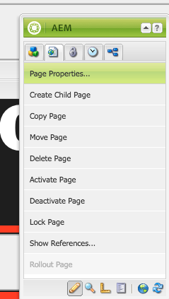

# URLs personalizados do Dispatcher

[Índice](./overview.md)

[&lt;- Anterior: Liberação do Dispatcher](./disp-flushing.md)

## Visão geral

Este documento ajuda você a entender como o AEM lida com urls personalizados e algumas técnicas adicionais usando regras de regravação para mapear o conteúdo mais próximo da borda do delivery

## O que são URLs personalizados

Quando você tem conteúdo em uma estrutura de pastas lógica, ele nem sempre está em um URL de fácil referência. URLs personalizados são como atalhos. URLs menores ou exclusivos que fazem referência ao local em que o conteúdo real está.

Um exemplo: `/aboutus` apontado para `/content/we-retail/us/en/about-us.html`

Os autores do AEM têm a opção de definir propriedades de url personalizado em um conteúdo no AEM e publicá-lo.

Para que esse recurso funcione, é necessário ajustar os filtros do Dispatcher para permitir a personalização. Isso não é aceitável para ajustar os arquivos de configuração do Dispatcher na taxa que os autores teriam para configurar essas entradas de página personalizada.

Por esse motivo, o módulo Dispatcher tem um recurso para permitir automaticamente qualquer item listado como personalizado na árvore de conteúdo.


## Como funciona

### Criação de URLs personalizados

O autor visita uma página no AEM, clica nas propriedades da página e adiciona entradas no _Vanity URL_ seção. Ao salvar as alterações e ativar a página, a personalização é atribuída à página.

Os autores também podem selecionar a variável _Redirecionar URL personalizado_ caixa de seleção ao adicionar _Vanity URL_ entradas, isso faz com que urls personalizados se comportem como redirecionamentos 302. Isso significa que o navegador é instruído a ir para o novo URL (via `Location` cabeçalho de resposta) e o navegador faz uma nova solicitação para o novo URL.

#### Interface do usuário para toque:


#### Localizador de conteúdo clássico:




>[!NOTE]
>
>Entenda que isso é propenso a problemas de espaço de nome. Entradas personalizadas são globais para todas as páginas, esta é apenas uma das falhas que você precisa planejar para soluções alternativas que explicaremos mais tarde.


## Resolução/mapeamento de recursos

Cada entrada personalizada é uma entrada de mapa de sling para um redirecionamento interno.

Os mapas são visíveis ao visitar o console Felix de instâncias do AEM ( `/system/console/jcrresolver` )

Esta é uma captura de tela de uma entrada de mapa criada por uma entrada personalizada:


No exemplo acima, quando solicitamos que a instância AEM visite `/aboutus` resolve para `/content/we-retail/us/en/about-us.html`

## Filtros de permissão automática do Dispatcher

O Dispatcher em um estado seguro filtra solicitações no caminho `/` por meio do Dispatcher, pois essa é a raiz da árvore do JCR.

É importante garantir que os editores só estejam permitindo o conteúdo do `/content` e outros caminhos seguros e assim por diante, e não caminhos como `/system`.

Aqui estão os urls personalizados na pasta base do `/` então, como permitimos que eles alcancem os editores enquanto permanecem seguros?

O Dispatcher simples tem um mecanismo de permissão de filtro automático e você precisa instalar um pacote AEM e configurar o Dispatcher para apontar para a página desse pacote.

[https://experience.adobe.com/#/downloads/content/software-distribution/en/aem.html?package=/content/software-distribution/en/details.html/content/dam/aem/public/adobe/packages/granite/vanityurls-components](https://experience.adobe.com/#/downloads/content/software-distribution/br/aem.html?package=/content/software-distribution/en/details.html/content/dam/aem/public/adobe/packages/granite/vanityurls-components)

O Dispatcher tem uma seção de configuração em seu arquivo farm:

```
/vanity_urls { 
    /url    "/libs/granite/dispatcher/content/vanityUrls.html" 
    /file   "/tmp/vanity_urls" 
    /delay  300 
}
```

A variável `/delay` O parâmetro, medido em segundos, não opera em uma base de intervalo fixo, mas em uma verificação baseada em condição. O Dispatcher avalia o carimbo de data e hora de modificação do `/file` (que armazena a lista de URLs personalizados reconhecidos) ao receber uma solicitação para um URL não listado. A variável `/file` não será atualizado se a diferença de tempo entre o momento atual e o horário `/file`A última modificação de é menor que a `/delay` duração. Atualizando o `/file` ocorre sob duas condições:

1. A solicitação de entrada é para um URL não armazenado em cache ou listado no `/file`.
1. Pelo menos `/delay` segundos se passaram desde que `/file` foi atualizado pela última vez.

Esse mecanismo foi projetado para proteger contra ataques de Negação de serviço (DoS), que poderiam sobrecarregar o Dispatcher com solicitações, explorando o recurso de URLs personalizados.

Em termos mais simples, a `/file` contendo URLs personalizados é atualizado somente se uma solicitação chegar para um URL que ainda não esteja na `/file` e se a variável `/file`A última modificação de foi há mais de `/delay` período.

Para acionar explicitamente uma atualização do `/file`, você pode solicitar um URL inexistente após verificar o `/delay` o tempo passou desde a última atualização. Exemplos de URLs para essa finalidade incluem:

- `https://dispatcher-host-name.com/this-vanity-url-does-not-exist`
- `https://dispatcher-host-name.com/please-hand-me-that-planet-maestro`
- `https://dispatcher-host-name.com/random-vanity-url`

Essa abordagem força o Dispatcher a atualizar o `/file`, desde que o especificado `/delay` intervalo decorrido desde a última modificação.

Ele armazena o cache da resposta no `/file` argumento, portanto, neste exemplo `/tmp/vanity_urls`

Portanto, se você visitar a instância do AEM no URI, verá o que ela encontra:


É literalmente uma lista, super simples

## Substituir regras como regras personalizadas

Por que mencionaríamos o uso de regras de regravação em vez do mecanismo padrão integrado ao AEM, como descrito acima?

Explicados de forma simples, problemas de namespace, desempenho e lógica de nível superior que podem ser melhor tratados.

Vamos ver um exemplo da entrada personalizada `/aboutus` ao seu conteúdo `/content/we-retail/us/en/about-us.html` uso do Apache `mod_rewrite` módulo para realizar isso.

```
RewriteRule ^/aboutus /content/we-retail/us/en/about-us.html [PT,L,NC]
```

Essa regra busca a personalização `/aboutus` e obtenha o caminho completo do renderizador com o sinalizador PT (Pass Through).

Ele também para de processar todas as outras regras do sinalizador L (Last), o que significa que não precisa atravessar uma enorme lista de regras, como a Resolução JCR precisa fazer.

Além de não ter que fazer o proxy da solicitação e esperar que o editor do AEM responda a esses dois elementos desse método, ele tem um desempenho muito maior.

Em seguida, a cereja do bolo aqui é o sinalizador NC (Sem distinção entre maiúsculas e minúsculas), o que significa se um cliente digita o URI com `/AboutUs` em vez de `/aboutus` ainda funciona.

Para criar uma regra de regravação para fazer isso, você criaria um arquivo de configuração no Dispatcher (exemplo: `/etc/httpd/conf.d/rewrites/examplevanity_rewrite.rules`) e incluí-lo no `.vhost` arquivo que manipula o domínio que precisa desses urls personalizados para serem aplicados.

Este é um trecho de código de exemplo de inclusão dentro `/etc/httpd/conf.d/enabled_vhosts/we-retail.vhost`

```
<VirtualHost *:80> 
 ServerName weretail.com 
 ServerAlias www.weretail.com 
        ........ SNIP ........ 
 <IfModule mod_rewrite.c> 
  ReWriteEngine on 
  LogLevel warn rewrite:info 
  Include /etc/httpd/conf.d/rewrites/examplevanity_rewrite.rules 
 </IfModule> 
        ........ SNIP ........ 
</VirtualHost>
```

## Que método e onde

Usar o AEM para controlar entradas personalizadas tem os seguintes benefícios

- Os autores podem criá-los dinamicamente
- Eles vivem com o conteúdo e podem ser empacotados com o conteúdo

Usar `mod_rewrite` controlar entradas personalizadas tem os seguintes benefícios

- Solução de conteúdo mais rápida
- Mais próximo da borda das solicitações de conteúdo do usuário final
- Mais extensibilidade e opções para controlar como o conteúdo é mapeado em outras condições
- Pode não diferenciar maiúsculas de minúsculas

Use ambos os métodos, mas aqui estão os conselhos e critérios que devem ser usados quando:

- Se a personalização for temporária e tiver níveis baixos de tráfego planejado, use o recurso integrado do AEM
- Se a personalização for um endpoint básico que não muda com frequência e tem uso frequente, use um `mod_rewrite` regra.
- Se o namespace personalizado (por exemplo: `/aboutus`) deve ser reutilizada para muitas marcas na mesma instância do AEM e, em seguida, usar regras de regravação.

<div style="color: #000;border-left: 6px solid #2196F3;background-color:#ddffff;"><b>Nota:</b>

Se você quiser usar o recurso personalizado AEM e evitar o namespace, é possível criar uma convenção de nomenclatura. Uso de urls personalizados aninhados como `/brand1/aboutus`, `brand2/aboutus`, `brand3/aboutus`.
</div>

[Próximo -> Logon comum](./common-logs.md)
