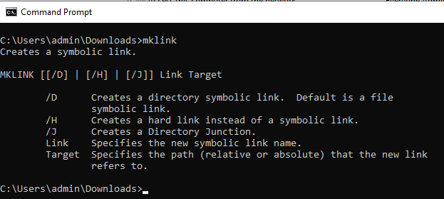

# Adição de links simbólicos no GIT

[Índice](./overview.md)

[&lt;- Anterior: Verificação de Integridade do Dispatcher](./health-check.md)

No AMS, você terá um repositório GIT pré-preenchido contendo o código-fonte do dispatcher maduro e pronto para iniciar o desenvolvimento e a personalização.

Depois de criar o primeiro `.vhost` arquivo ou nível superior `farm.any` será necessário criar um link simbólico no arquivo `available_*` para `enabled_*` diretório. O uso do tipo de link adequado será fundamental para uma implantação bem-sucedida por meio do pipeline do Cloud Manager. Esta página ajudará você a saber como fazer isso.

## Arquétipo do Dispatcher

O desenvolvedor do AEM inicia o projeto normalmente no [AEM arquétipo](https://github.com/adobe/aem-project-archetype)

Esta é uma amostra da área do código-fonte, onde você pode ver os links simbólicos usados:

```
$ tree dispatcher
dispatcher
└── src
   ├── conf.d
.....SNIP.....
    │   └── available_vhosts
    │   │   ├── 000_unhealthy_author.vhost
    │   │   ├── 000_unhealthy_publish.vhost
    │   │   ├── aem_author.vhost
    │   │   ├── aem_flush.vhost
    │   │   ├── aem_health.vhost
    │   │   ├── aem_lc.vhost
    │   │   └── aem_publish.vhost
    └── dispatcher_vhost.conf
    │   └── enabled_vhosts
    │   │   ├── aem_author.vhost -> ../available_vhosts/aem_author.vhost
    │   │   ├── aem_flush.vhost -> ../available_vhosts/aem_flush.vhost
    │   │   ├── aem_health.vhost -> ../available_vhosts/aem_health.vhost
    │   │   └── aem_publish.vhost -> ../available_vhosts/aem_publish.vhost
.....SNIP.....
    └── conf.dispatcher.d
    │   ├── available_farms
    │   │   ├── 000_ams_author_farm.any
    │   │   ├── 001_ams_lc_farm.any
    │   │   └── 002_ams_publish_farm.any
.....SNIP.....
    │   └── enabled_farms
    │   │   ├── 000_ams_author_farm.any -> ../available_farms/000_ams_author_farm.any
    │   │   └── 002_ams_publish_farm.any -> ../available_farms/002_ams_publish_farm.any
.....SNIP.....
17 directories, 60 files
```

Como exemplo, a variável `/etc/httpd/conf.d/available_vhosts/` o diretório contém o potencial preparado `.vhost` arquivos que podemos usar em nossa configuração em execução.

Ativado `.vhost` os arquivos serão exibidos como um caminho relativo `symlinks` dentro do `/etc/httpd/conf.d/enabled_vhosts/` diretório.

## Criação de um link simbólico

Usamos links simbólicos para o arquivo para que o servidor Web Apache trate o arquivo de destino como o mesmo arquivo.  Não queremos duplicar o arquivo em ambos os diretórios.  Em vez disso, apenas um atalho de um diretório (link simbólico) para outro.

Reconheça que suas configurações implantadas terão como alvo um host Linux.  Criar um link simbólico que não seja compatível com o sistema de destino causará falhas e resultados indesejados.

Se sua estação de trabalho não for uma máquina Linux, você provavelmente se perguntará quais comandos usar para criar esses links corretamente, de modo que eles possam confirmá-los em GIT.

> `TIP:` É importante usar links relativos, pois se você instalasse uma cópia local do servidor Web Apache e tivesse uma base de instalação diferente, os links ainda funcionariam.  Se você usar um caminho absoluto, sua estação de trabalho ou outros sistemas precisarão corresponder à mesma estrutura exata de diretórios.

### OSX / Linux

Os links simbólicos são nativos nesses sistemas operacionais e aqui estão alguns exemplos de como criar esses links.  Abra seu aplicativo de terminal favorito e use os seguintes comandos de exemplo para criar o link:

```
$ cd <LOCATION OF CLONED GIT REPO>\src\conf.d\enabled_vhosts
$ ln -s ../available_vhosts/<Destination File Name> <Target File Name>
```

Este é um exemplo de comando preenchido para referência:

```
$ git clone https://github.com/adobe/aem-project-archetype.git
$ cd aem-project-archetype/src/main/archetype/dispatcher.ams/src/conf.d/enabled_vhosts/
$ ln -s ../available_vhosts/aem_flush.vhost aem_flush.vhost
```

Este é um exemplo do link agora, se você listar o arquivo usando a variável `ls` comando:

```
ls -l
total 0
lrwxrwxrwx. 1 root root 35 Oct 13 21:38 aem_flush.vhost -> ../available_vhosts/aem_flush.vhost
```

### Windows

> `Note:` O MS Windows (melhor, NTFS) suporta ligações simbólicas desde... Windows Vista!



> `Warning:` O comando mklink para criar links simbólicos requer privilégios de administrador para ser executado corretamente. Mesmo como uma conta de administrador, será necessário executar o Prompt de comando &quot;Como administrador&quot;, a menos que o modo de desenvolvedor esteja ativado
> <br/>Permissões impróprias:
> 
> <br/>Permissões adequadas:
> 

Aqui estão os comandos para criar o link:

```
C:\<PATH TO SRC>\enabled_vhosts> mklink <Target File Name> ..\available_vhosts\<Destination File Name>
```


Este é um exemplo de comando preenchido para referência:

```
C:\> git clone https://github.com/adobe/aem-project-archetype.git
C:\> cd aem-project-archetype\src\main\archetype\dispatcher.ams\src\conf.d\enabled_vhosts\
C:\aem-project-archetype\src\main\archetype\dispatcher.ams\src\conf.d\enabled_vhosts> mklink aem_flush.vhost ..\available_vhost\aem_flush.vhost
symbolic link created for aem_flush.vhost <<===>> ..\available_vhosts\aem_flush.vhost
```

#### Modo de desenvolvedor ( Windows 10 )

Quando colocado em [Modo de desenvolvedor](https://docs.microsoft.com/en-us/windows/apps/get-started/enable-your-device-for-development), o Windows 10 permite testar mais facilmente os aplicativos que você está desenvolvendo, usar o ambiente shell Ubuntu Bash, alterar várias configurações focadas no desenvolvedor e fazer outras coisas desse tipo.

A Microsoft parece continuar adicionando recursos ao Modo do desenvolvedor, ou habilitando alguns desses recursos por padrão depois que eles atingem uma adoção mais ampla e são considerados estáveis (por exemplo, com a Atualização de criadores, o ambiente Ubuntu Bash Shell não precisa mais do Modo do desenvolvedor).

E os links simbólicos? Com o Modo de desenvolvedor ATIVADO, não há necessidade de executar um prompt de comando com privilégios elevados para poder criar links simbólicos. Portanto, quando o Modo de desenvolvedor estiver ativado, qualquer usuário poderá criar links simbólicos.

> Depois de ativar o Modo de desenvolvedor, os usuários devem fazer logoff/logon para que as alterações tenham efeito.

Agora você pode ver sem executar como um Administrador o comando funciona


#### Abordagem alternativa/programática

Há uma política específica que pode permitir que certos usuários criem links simbólicos → [Criar links simbólicos (Windows 10) - Segurança do Windows | Documentação da Microsoft](https://docs.microsoft.com/en-us/windows/security/threat-protection/security-policy-settings/create-symbolic-links)

PROs:
- Isso pode ser aproveitado pelos clientes para permitir de forma programática a criação de links simbólicos para todos os desenvolvedores em sua organização (ou seja, o Ative Diretory) sem precisar habilitar o Modo de desenvolvedor manualmente em cada dispositivo.
- Além disso, essa política deve estar disponível em versões anteriores do MS Windows que não oferecem o Modo de desenvolvedor.

CONs:
- Essa política parece não ter efeito sobre os usuários pertencentes ao grupo Administradores . Os administradores ainda precisariam executar o prompt de comando com privilégios elevados. Estranho.

> O logoff/logon do usuário será necessário para que as alterações na política local/de grupo tenham efeito.

Executar `gpedit.msc`, adicione/altere usuários, conforme necessário. Os administradores estão lá por padrão


#### Ativar links simbólicos no GIT

O Git lida com links simbólicos de acordo com a opção core.symlinks

Fonte: [Documentação do Git - git-config](https://git-scm.com/docs/git-config#Documentation/git-config.txt-coresymlinks)

*Se core.symlinks for falso, os links simbólicos serão verificados como pequenos arquivos simples que contêm o texto do link. `git-update-index[1]` e `git-add[1]` não alterará o tipo registrado para arquivo normal. Útil em sistemas de arquivos como o FAT, que não suportam links simbólicos.
O padrão é true, exceto `git-clone[1]` ou `git-init[1] will probe and set core.symlinks false if appropriate when the repository is created.` Na maioria dos casos, o Git presumirá que o Windows não é bom para links simbólicos e definirá isso como falso.*

O comportamento do Git no Windows é bem explicado aqui: Links simbólicos ・ Git-for-windows/git Wiki ・ GitHub

> `Info`: As suposições listadas na documentação vinculada acima parecem estar corretas com uma possível configuração do Desenvolvedor AEM no Windows, mais notavelmente NTFS e o fato de que temos apenas links simbólicos de arquivo vs. links simbólicos de diretórios

Aqui estão as boas notícias, já que [Git para Windows versão 2.10.2](https://github.com/git-for-windows/git/releases/tag/v2.10.2.windows.1) o instalador tem um [opção explícita para ativar o suporte a links simbólicos.](https://github.com/git-for-windows/git/issues/921)

> `Warning`: A opção core.symlink pode ser fornecida no tempo de execução durante a clonagem do repositório, ou pode ser armazenada como uma configuração global.


O Git para Windows armazenará as preferências globais em `"C:\Program Files\Git\etc\gitconfig"` . Essas configurações podem não ser consideradas por outros aplicativos de clientes de desktop Git.
Veja o que acontece, nem todos os desenvolvedores usarão o cliente nativo Git (ou seja, Git Cmd, Git Bash) e alguns dos aplicativos Git Desktop (por exemplo, GitHub Desktop, Atlassian Sourcetree) podem ter configurações/padrões diferentes para usar o Sistema ou um Git incorporado

Aqui está uma amostra do que está dentro do `gitconfig` arquivo

```
[diff "astextplain"]
    textconv = astextplain
[filter "lfs"]
    clean = git-lfs clean -- %f
    smudge = git-lfs smudge -- %f
    process = git-lfs filter-process
    required = true
[http]
    sslBackend = openssl
    sslCAInfo = C:/Program Files/Git/mingw64/ssl/certs/ca-bundle.crt
[core]
    autocrlf = true
    fscache = true
    symlinks = true
[pull]
    rebase = false
[credential]
    helper = manager-core
[credential "https://dev.azure.com"]
    useHttpPath = true
[init]
    defaultBranch = master
```

#### Dicas da linha de comando Git

Pode haver cenários em que você tenha que criar novos links simbólicos (por exemplo, adicionar um novo host ou um novo farm).

Vimos na documentação acima que o Windows oferece um comando &quot;mklink&quot; para criar links simbólicos.

Se você trabalhar em um ambiente Git Bash, poderá usar o comando Bash padrão `ln -s` mas terá que receber o prefixo de uma instrução especial como o exemplo aqui:

```
MSYS=winsymlinks:nativestrict ln -s test_vhost_symlink ../dispatcher/src/conf.d/available_vhosts/default.vhost
```

#### Resumo

Para ter o Git manipulando links simbólicos corretamente (pelo menos para o escopo da linha de base de configuração atual do AEM Dispatcher) em um sistema operacional Microsoft Windows, será necessário:

| Item | Versão/configuração mínima | Versão/Configuração Recomendada |
|------|---------------------------------|-------------------------------------|
| Sistema Operacional | Windows Vista ou mais recente | Atualização do criador do Windows 10 ou mais recente |
| Sistema de arquivos | NTFS | NTFS |
| Capacidade de lidar com links simbólicos para o usuário do Windows | `"Create symbolic links"` política local/de grupo `under "Group Computer Configuration\Windows Settings\Security Settings\Local Policies\User Rights Assignment"` | Modo de Desenvolvedor do Windows 10 habilitado |
| GIT | Versão 1.5.3 do cliente nativo | Cliente nativo versão 2.10.2 ou mais recente |
| Configuração do Git | `--core.symlinks=true` opção ao fazer um clone git a partir da linha de comando | Configuração global do Git<br/>`[core]`<br/>    symlinks = true <br/> Caminho de configuração do cliente Git nativo: `C:\Program Files\Git\etc\gitconfig` <br/>Localização padrão para clientes do Git Desktop: `%HOMEPATH%\.gitconfig` |

> `Note:` Se você já tiver um repositório local, precisará clonar uma atualização da origem. Você pode clonar para um novo local e mesclar as alterações locais não confirmadas/não preparadas manualmente no repositório recém-clonado.