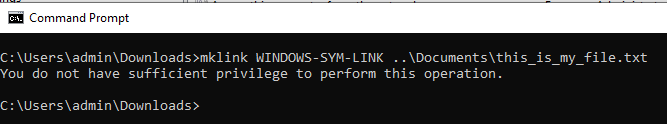

# Adição de symlinks ao GIT

[Índice](./overview.md)

[&lt;- Anterior: Verificação de integridade do Dispatcher](./health-check.md)

No AMS, você terá um repositório GIT pré-preenchido contendo o código-fonte do dispatcher pronto para iniciar o desenvolvimento e a personalização.

Depois de criar seu primeiro `.vhost` arquivo ou nível superior `farm.any` arquivo, será necessário criar um link simbólico a partir da `available_*` diretório para o `enabled_*` diretório. O uso do tipo de link apropriado será fundamental para uma implantação bem-sucedida por meio do pipeline do Cloud Manager. Esta página ajudará você a saber como fazer isso.

## Arquétipo do Dispatcher

O desenvolvedor do AEM inicia seu projeto normalmente a partir do [Arquétipo de AEM](https://github.com/adobe/aem-project-archetype)

Esta é uma amostra da área do código-fonte onde você pode ver os symlinks usados:

```
$ tree dispatcher
dispatcher
└── src
   ├── conf.d
.....SNIP.....
    │   └── available_vhosts
    │   │   ├── 000_unhealthy_author.vhost
    │   │   ├── 000_unhealthy_publish.vhost
    │   │   ├── aem_author.vhost
    │   │   ├── aem_flush.vhost
    │   │   ├── aem_health.vhost
    │   │   ├── aem_lc.vhost
    │   │   └── aem_publish.vhost
    └── dispatcher_vhost.conf
    │   └── enabled_vhosts
    │   │   ├── aem_author.vhost -> ../available_vhosts/aem_author.vhost
    │   │   ├── aem_flush.vhost -> ../available_vhosts/aem_flush.vhost
    │   │   ├── aem_health.vhost -> ../available_vhosts/aem_health.vhost
    │   │   └── aem_publish.vhost -> ../available_vhosts/aem_publish.vhost
.....SNIP.....
    └── conf.dispatcher.d
    │   ├── available_farms
    │   │   ├── 000_ams_author_farm.any
    │   │   ├── 001_ams_lc_farm.any
    │   │   └── 002_ams_publish_farm.any
.....SNIP.....
    │   └── enabled_farms
    │   │   ├── 000_ams_author_farm.any -> ../available_farms/000_ams_author_farm.any
    │   │   └── 002_ams_publish_farm.any -> ../available_farms/002_ams_publish_farm.any
.....SNIP.....
17 directories, 60 files
```

Como exemplo, a variável `/etc/httpd/conf.d/available_vhosts/` o diretório contém o potencial preparado `.vhost` arquivos que podemos usar em nossa configuração em execução.

O habilitado `.vhost` os arquivos serão exibidos como um caminho relativo `symlinks` dentro do `/etc/httpd/conf.d/enabled_vhosts/` diretório.

## Criação de uma ligação simbólica

Usamos links simbólicos para o arquivo, de modo que o Apache Webserver trate o arquivo de destino como o mesmo arquivo.  Não queremos duplicar o arquivo em ambos os diretórios.  Em vez disso, basta um atalho de um diretório (link simbólico) para o outro.

Reconhecer que suas configurações implantadas terão como alvo um host Linux.  A criação de um link simbólico incompatível com o sistema de destino causará falhas e resultados indesejados.

Se sua estação de trabalho não for uma máquina Linux, você provavelmente se perguntará quais comandos usar para criar esses links corretamente para que eles possam confirmá-los no GIT.

> `TIP:` É importante usar links relativos, pois se você instalasse uma cópia local do Apache Webserver e tivesse uma base de instalação diferente, os links ainda funcionariam.  Se você usar um caminho absoluto, sua estação de trabalho ou outros sistemas deverão corresponder à mesma estrutura de diretório exata.

### OSX/Linux

Os symlinks são nativos para esses sistemas operacionais e aqui estão alguns exemplos de como criar esses links.  Abra seu aplicativo de terminal favorito e use os seguintes comandos de exemplo para criar o link:

```
$ cd <LOCATION OF CLONED GIT REPO>\src\conf.d\enabled_vhosts
$ ln -s ../available_vhosts/<Destination File Name> <Target File Name>
```

Este é um exemplo de comando preenchido para referência:

```
$ git clone https://github.com/adobe/aem-project-archetype.git
$ cd aem-project-archetype/src/main/archetype/dispatcher.ams/src/conf.d/enabled_vhosts/
$ ln -s ../available_vhosts/aem_flush.vhost aem_flush.vhost
```

Este é um exemplo do link agora, se você listar o arquivo usando o `ls` comando:

```
ls -l
total 0
lrwxrwxrwx. 1 root root 35 Oct 13 21:38 aem_flush.vhost -> ../available_vhosts/aem_flush.vhost
```

### Windows

> `Note:` Acontece MS Windows (melhor, NTFS) suporta links simbólicos desde... Windows Vista


> `Warning:` O comando mklink para criar symlinks requer privilégios de administrador para ser executado corretamente. Mesmo como uma conta de administrador, será necessário executar o Prompt de comando &quot;Como administrador&quot;, a menos que o modo de desenvolvedor esteja ativado
> <br/>Permissões impróprias:
> 
> <br/>Permissões adequadas:
> 

Estes são os comandos para criar o link:

```
C:\<PATH TO SRC>\enabled_vhosts> mklink <Target File Name> ..\available_vhosts\<Destination File Name>
```


Este é um exemplo de comando preenchido para referência:

```
C:\> git clone https://github.com/adobe/aem-project-archetype.git
C:\> cd aem-project-archetype\src\main\archetype\dispatcher.ams\src\conf.d\enabled_vhosts\
C:\aem-project-archetype\src\main\archetype\dispatcher.ams\src\conf.d\enabled_vhosts> mklink aem_flush.vhost ..\available_vhost\aem_flush.vhost
symbolic link created for aem_flush.vhost <<===>> ..\available_vhosts\aem_flush.vhost
```

#### Modo de desenvolvedor ( Windows 10 )

Quando colocado em [Modo de desenvolvedor](https://docs.microsoft.com/en-us/windows/apps/get-started/enable-your-device-for-development), o Windows 10 permite testar mais facilmente os aplicativos que você está desenvolvendo, usar o ambiente shell do Ubuntu Bash, alterar uma variedade de configurações focadas no desenvolvedor e fazer outras coisas desse tipo.

O Microsoft parece continuar a adicionar recursos ao Modo de desenvolvedor ou habilitar alguns desses recursos por padrão, uma vez que alcançam uma adoção mais generalizada e são considerados estáveis (por exemplo, com a Atualização de criadores, o ambiente do Ubuntu Bash Shell não precisa mais do Modo de desenvolvedor).

E as ligações simbólicas? Com o Modo de desenvolvedor ATIVADO, não há necessidade de executar um prompt de comando com privilégios elevados para poder criar symlinks. Portanto, quando o Modo de desenvolvedor estiver ativado, qualquer usuário poderá criar symlinks.

> Depois de ativar o Modo de desenvolvedor, os usuários devem fazer logoff/logon para que as alterações entrem em vigor.

Agora você pode ver sem executar o como um administrador o comando funciona


#### Abordagem alternativa/programática

Há uma política específica que pode permitir que certos usuários criem links simbólicos → [Criar links simbólicos (Windows 10) - segurança do Windows | Documentação do Microsoft](https://docs.microsoft.com/en-us/windows/security/threat-protection/security-policy-settings/create-symbolic-links)

PROs:
- Isso pode ser aproveitado pelos clientes para permitir programaticamente a criação de links simbólicos para todos os desenvolvedores em sua organização (ou seja, o Ative Diretory) sem precisar habilitar o Modo de desenvolvedor manualmente em cada dispositivo.
- Além disso, essa política deve estar disponível em versões anteriores do MS Windows que não oferecem o Modo de Desenvolvedor.

Ícones:
- Esta política parece não ter efeito sobre os usuários pertencentes ao grupo Administradores. Os administradores ainda precisariam executar o prompt de comando com privilégios elevados. Estranho.

> O logoff/logon do usuário será necessário para que as alterações na diretiva local/de grupo tenham efeito.

Executar `gpedit.msc`, adicione/altere usuários conforme necessário. Administradores estão lá por padrão


#### Habilitar links simbólicos no GIT

O Git lida com symlinks de acordo com a opção core.symlinks

Fonte: [Git - Documentação de git-config](https://git-scm.com/docs/git-config#Documentation/git-config.txt-coresymlinks)

*Se core.symlinks for falso, os links simbólicos serão verificados como arquivos simples pequenos que contêm o texto do link. `git-update-index[1]` e `git-add[1]` não alterará o tipo gravado para arquivo regular. Útil em sistemas de arquivos como FAT, que não suportam links simbólicos.
O padrão é true, exceto `git-clone[1]` ou `git-init[1] will probe and set core.symlinks false if appropriate when the repository is created.` Na maioria dos casos, o Git presumirá que o Windows não é bom para symlinks e definirá como false.*

O comportamento do Git no Windows é bem explicado aqui: Links simbólicos · Wiki git para windows/git · GitHub

> `Info`: as premissas listadas na documentação vinculada acima parecem estar corretas com uma possível configuração do desenvolvedor do AEM no Windows, principalmente o NTFS e o fato de termos apenas symlinks de arquivos versus symlinks de diretórios

Eis a boa notícia, já que [Git para Windows versão 2.10.2](https://github.com/git-for-windows/git/releases/tag/v2.10.2.windows.1) o instalador tem um [opção explícita para ativar o suporte a links simbólicos.](https://github.com/git-for-windows/git/issues/921)

> `Warning`: a opção core.symlink pode ser fornecida no tempo de execução durante a clonagem do repositório, ou pode ser armazenada como uma configuração global.


O Git para Windows armazenará preferências globais em `"C:\Program Files\Git\etc\gitconfig"` . Essas configurações podem não ser consideradas por outros aplicativos clientes Git.
Este é o ponto positivo, nem todos os desenvolvedores usarão o cliente nativo Git (ou seja, Git Cmd, Git Bash) e alguns dos aplicativos do Git Desktop (por exemplo, GitHub Desktop, Atlassian Sourcetree) podem ter configurações/padrões diferentes para usar o Sistema ou um Git incorporado

Aqui está uma amostra do que está dentro do `gitconfig` arquivo

```
[diff "astextplain"]
    textconv = astextplain
[filter "lfs"]
    clean = git-lfs clean -- %f
    smudge = git-lfs smudge -- %f
    process = git-lfs filter-process
    required = true
[http]
    sslBackend = openssl
    sslCAInfo = C:/Program Files/Git/mingw64/ssl/certs/ca-bundle.crt
[core]
    autocrlf = true
    fscache = true
    symlinks = true
[pull]
    rebase = false
[credential]
    helper = manager-core
[credential "https://dev.azure.com"]
    useHttpPath = true
[init]
    defaultBranch = master
```

#### Dicas da linha de comando Git

Pode haver cenários em que seja necessário criar novos links simbólicos (por exemplo, adicionar um novo vhost ou um novo farm).

Vimos na documentação acima que o Windows oferece um comando &quot;mklink&quot; para criar links simbólicos.

Se você trabalhar em um ambiente Git Bash, poderá usar o comando Bash padrão `ln -s` mas terá que ser prefixado por uma instrução especial como o exemplo aqui:

```
MSYS=winsymlinks:nativestrict ln -s test_vhost_symlink ../dispatcher/src/conf.d/available_vhosts/default.vhost
```

#### Resumo

Para que o Git manipule links simbólicos corretamente (pelo menos para o escopo da linha de base de configuração atual do Dispatcher do AEM) em um sistema operacional Microsoft Windows, você precisará:

| Item | Versão/configuração mínima | Versão/configuração recomendada |
|------|---------------------------------|-------------------------------------|
| Sistema Operacional | Windows Vista ou mais recente | Atualização do Windows 10 Creator ou mais recente |
| Sistema de arquivos | NTFS | NTFS |
| Capacidade de lidar com symlinks para o usuário do Windows | `"Create symbolic links"` Diretiva de grupo/local `under "Group Computer Configuration\Windows Settings\Security Settings\Local Policies\User Rights Assignment"` | Modo de Desenvolvedor do Windows 10 habilitado |
| GIT | Versão 1.5.3 do cliente nativo | Native Client versão 2.10.2 ou mais recente |
| Configuração do Git | `--core.symlinks=true` opção ao fazer um clone do Git a partir da linha de comando | Configuração global do Git<br/>`[core]`<br/>    symlinks = true <br/> Caminho de configuração do cliente Git nativo: `C:\Program Files\Git\etc\gitconfig` <br/>Local padrão para clientes do Git Desktop: `%HOMEPATH%\.gitconfig` |

> `Note:` Se você já tiver um repositório local, precisará clonar novamente a partir da origem. Você pode clonar para um novo local e mesclar manualmente suas alterações locais não confirmadas/não preparadas no repositório recém-clonado.
