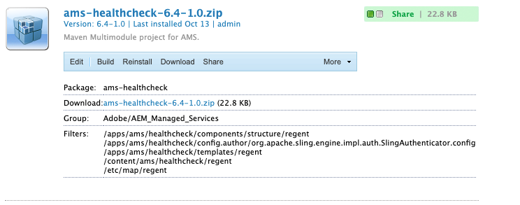
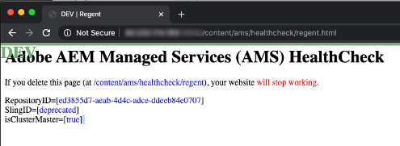

# Verificação de integridade do AMS Dispatcher

[Índice](./overview.md)

[&lt;- Anterior: Arquivos somente leitura](./immutable-files.md)

Quando você tem uma linha de base do AMS instalada no dispatcher, ela vem com alguns freebies.  Um desses recursos é um conjunto de scripts de verificação de integridade.
Esses scripts permitem que o balanceador de carga que lidera a pilha de AEM saiba quais trechos estão íntegros e os mantenha em serviço.


## Verificação de integridade básica do balanceador de carga

Quando o tráfego do cliente passar pela Internet para alcançar sua instância do AEM, ele passará por um balanceador de carga


Cada solicitação recebida pelo balanceador de carga arredondará o robin para cada instância.  O balanceador de carga tem um mecanismo de verificação de integridade integrado para garantir que esteja enviando tráfego para um host íntegro.

A verificação padrão geralmente é uma verificação de porta para ver se os servidores direcionados no balanceador de carga estão ouvindo quando o tráfego de porta entra em operação (ou seja, TCP 80 e 443)

> `Note:` Enquanto isso funciona, ele não tem medidor real sobre se o AEM é saudável.  Ele só testa se o Dispatcher (servidor Web Apache) está ativo e em execução.

## Verificação de integridade do AMS

Para evitar o envio de tráfego para um Dispatcher saudável que esteja enfrentando uma instância de AEM não íntegra, o AMS criou alguns extras que avaliam a integridade do trecho e não apenas do Dispatcher.


A verificação de integridade é composta pelas seguintes partes
- 1 `Load balancer`
- 1 `Apache web server`
- 3 `Apache *VirtualHost* config files`
- 5 `CGI-Bin scripts`
- 1 `AEM instance`
- 1 `AEM package`

Abordaremos o que cada peça está configurada para fazer e sua importância

### Pacote AEM

Para indicar se o AEM está funcionando, é necessário que ele faça uma compilação básica de páginas e forneça a página.  O Adobe Managed Services criou um pacote básico que contém a página de teste.  A página testa se o repositório está ativo e se os recursos e o modelo de página podem ser renderizados.



Aqui está a página.  Ele mostrará a ID do repositório da instalação



> `Note:` Garantimos que a página não seja compatível com cache.  Ele não verificaria o status real se cada vez que retornasse uma página em cache!

Este é o ponto final leve que podemos testar para ver se o AEM está funcionando.

### Configuração do balanceador de carga

Configuramos os balanceadores de carga para apontar para um ponto final CGI-BIN em vez de usar uma verificação de porta.


### Hosts virtuais de verificação de integridade do Apache

#### Host virtual CGI-BIN `(/etc/httpd/conf.d/available_vhosts/ams_health.vhost)`

Este é o `<VirtualHost>` Arquivo de configuração do Apache que permite a execução dos arquivos CGI-Bin.

```
Listen 81
<VirtualHost *:81>
    ServerName	"health"
    ...SNIP...
    ScriptAlias /health/ "/var/www/cgi-bin/health/"
</VirtualHost>
```

> `Note:` os arquivos cgi-bin são scripts que podem ser executados.  Isso pode ser um vetor de ataque vulnerável e esses scripts que o AMS usa não estão publicamente disponíveis apenas para o balanceador de carga testar.


#### Hosts virtuais de manutenção não íntegros

- `/etc/httpd/conf.d/available_vhosts/000_unhealthy_author.vhost`
- `/etc/httpd/conf.d/available_vhosts/000_unhealthy_publish.vhost`

Esses arquivos são nomeados como `000_` como o prefixo de propósito.  É configurado intencionalmente para usar o mesmo nome de domínio que o site ativo.  A intenção é que esse arquivo seja ativado quando a verificação de integridade detectar que há um problema com um dos backends AEM.  Em seguida, ofereça uma página de erro em vez de apenas um código de resposta HTTP 503 sem página.  Ele roubará o tráfego do normal `.vhost` arquivo porque foi carregado antes disso `.vhost` ao compartilhar o mesmo arquivo `ServerName` ou `ServerAlias`.  Resultando em páginas destinadas a um domínio específico que vão para o vhost não íntegro em vez do padrão pelo qual o tráfego normal flui.

Quando os scripts de verificação de integridade são executados, eles fazem logoff de seus status de integridade atuais.  Uma vez por minuto, há um cronjob em execução no servidor que procura por entradas não íntegras no log.  Se detectar que a instância AEM do autor não está íntegra, ele ativará o link simbólico:

Entrada do log:

```
# grep "ERROR\|publish" /var/log/lb/health_check.log
E, [2022-11-23T20:13:54.984379 #26794] ERROR -- : AUTHOR -- Exception caught: Connection refused - connect(2)
I, [2022-11-23T20:13:54.984403 #26794]  INFO -- : [checkpublish]-author:0-publish:1-[checkpublish]
```

Cron detectando o erro e reagindo:

```
# grep symlink /var/log/lb/health_check_reload.log
I, [2022-11-23T20:34:19.213179 #2275]  INFO -- : ADDING VHOST symlink /etc/httpd/conf.d/available_vhosts/000_unhealthy_author.vhost => /etc/httpd/conf.d/enabled_vhosts/000_unhealthy_author.vhost
```

Você pode controlar se os sites do autor ou publicados podem ter esse erro na página carregada ao configurar o modo de recarregamento no `/var/www/cgi-bin/health_check.conf`

```
# grep RELOAD_MODE /var/www/cgi-bin/health_check.conf
RELOAD_MODE='author'
```

Opções válidas:
- autor
   - Esta é a opção padrão.
   - Isso exibirá uma página de manutenção para o autor quando ele não estiver íntegro
- publicação
   - Esta opção colocará uma página de manutenção para o editor quando ele não estiver íntegro
- todas
   - Essa opção colocará uma página de manutenção para o autor ou editor, ou ambos, se eles se tornarem não íntegros
- nenhuma
   - Esta opção ignora este recurso da verificação de integridade

Ao examinar a `VirtualHost` ao configurar esses itens, você verá que eles carregam o mesmo documento como uma página de erro para cada solicitação que aparece quando ela é ativada:

```
<VirtualHost *:80>
	ServerName	unhealthyauthor
	ServerAlias	${AUTHOR_DEFAULT_HOSTNAME}
	ErrorDocument	503 /error.html
	DocumentRoot	/mnt/var/www/default
	<Directory />
		Options FollowSymLinks
		AllowOverride None
	</Directory>
	<Directory "/mnt/var/www/default">
		AllowOverride None
		Require all granted
	</Directory>
	<IfModule mod_headers.c>
		Header always add X-Dispatcher ${DISP_ID}
		Header always add X-Vhost "unhealthy-author"
	</IfModule>
	<IfModule mod_rewrite.c>
		ReWriteEngine   on
		RewriteCond %{REQUEST_URI} !^/error.html$
		RewriteRule ^/* /error.html [R=503,L,NC]
	</IfModule>
</VirtualHost>
```

O código de resposta ainda é um `HTTP 503`

```
# curl -I https://we-retail.com/
HTTP/1.1 503 Service Unavailable
X-Dispatcher: dispatcher1useast1
X-Vhost: unhealthy-author
```

Em vez de uma página em branco, eles receberão essa página.


### Scripts CGI-Bin

Há 5 scripts diferentes que podem ser definidos nas configurações do balanceador de carga pelo seu CSE que alteram o comportamento ou os critérios quando extrair um Dispatcher do balanceador de carga.

#### /bin/checkauthor

Este script, quando usado, verificará e registrará todas as instâncias que está apresentando, mas só retornará um erro se a variável `author` A instância do AEM não está íntegra

> `Note:` Lembre-se de que se a instância do AEM de publicação estivesse com problemas, o dispatcher permaneceria em serviço para permitir que o tráfego fluísse para a instância do AEM do autor

#### /bin/checkpublish (padrão)

Este script, quando usado, verificará e registrará todas as instâncias que está apresentando, mas só retornará um erro se a variável `publish` A instância do AEM não está íntegra

> `Note:` Lembre-se de que, se a instância do AEM do autor não estivesse íntegra, o dispatcher permaneceria em serviço para permitir que o tráfego fluísse para a instância de AEM de publicação

#### /bin/checkEIR

Este script, quando usado, verificará e registrará todas as instâncias que está apresentando, mas só retornará um erro se a variável `author` ou o `publisher` A instância do AEM não está íntegra

> `Note:` Lembre-se de que se a instância do AEM de publicação ou a instância do AEM do autor não estivesse íntegra, o Dispatcher desativaria o serviço.  Ou seja, se um deles estivesse saudável, também não receberia tráfego

#### /bin/checkboth

Este script, quando usado, verificará e registrará todas as instâncias que está apresentando, mas só retornará um erro se a variável `author` e a variável `publisher` A instância do AEM não está íntegra

> `Note:` Lembre-se de que se a instância de publicação do AEM ou a instância do AEM do autor estivesse com problemas, o dispatcher não deixaria de funcionar.  Isso significa que se um deles não estivesse saudável, ele continuaria a receber tráfego e a dar erros às pessoas que solicitavam recursos.

#### /bin/healthy

Esse script, quando usado, verificará e registrará todas as instâncias que está apresentando, mas retornará em bom estado, independentemente de o AEM estar ou não retornando um erro.

> `Note:` Esse script é usado quando a verificação de integridade não está funcionando como desejado e permite uma substituição para manter instâncias AEM no balanceador de carga.

[Próximo -> Links simbólicos GIT](./git-symlinks.md)
