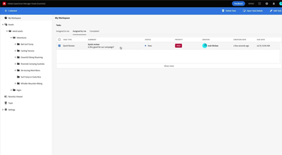

# Visão geral

O Experience Manager Assets Essentials fornece uma interface de usuário simplificada para gerenciamento e colaboração de ativos leves.

Confira nossos vídeos sobre como usar o Assets Essentials para gerenciar seus ativos, bem como como como ele pode ser integrado ao Adobe Jornada Orchestrator!

## Saiba mais sobre o Assets Essentials

<table>
<td>
   
   

      <a href="./basics/managing.md">
      <strong>Introdução ao Assets Essentials</strong>
      </a>
   

   

      <em>Saiba mais sobre as noções básicas de como o Assets Essentials!</em>
   

</td>
<td>
   
   

      <a href="./basics/collaborating.md">
      <strong>Colaboração com o Assets Essentials</strong>
      </a>
   

   

      <em>Saiba como a Assets Essentials oferece gerenciamento leve de tarefas para gerenciar os ciclos de vida de seus ativos!</em>
   

</td>
<td>
   
   

      <a href="https://experienceleague.adobe.com/docs/journey-optimizer-learn/tutorials/create-messages/create-email-content-with-the-message-editor.html">
      <strong>Adobe Journey Optimizer</strong>
      </a>
   

   

      <em>Saiba como o Assets Essentials se integra ao Adobe Journey Optimizer!</em>
   

</td>
</table>
