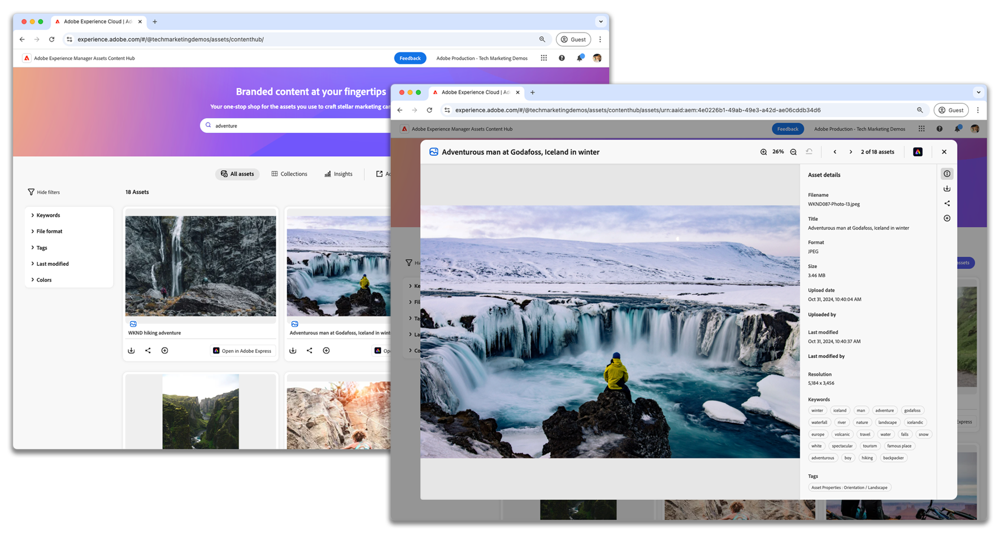

# AEM Assets Content Hub

{align=center}

Saiba como fazer upload de ativos, aplicar tags e entender o fluxo de trabalho de aprovação no Adobe Experience Manager Assets as a Cloud Service Content Hub.

## Saiba mais sobre os recursos do Content Hub

Esses vídeos abordam os principais recursos do AEM Assets Content Hub — desde o gerenciamento de ativos até a colaboração com sua equipe, cada vídeo fornece etapas claras e dicas práticas para ajudá-lo a aproveitar ao máximo o AEM Assets Content Hub no seu trabalho diário.

<!-- CARDS

* https://experienceleague.adobe.com/pt-br/docs/experience-manager-learn/assets/content-hub/set-up {title = Set up}
* https://experienceleague.adobe.com/pt-br/docs/experience-manager-learn/assets/content-hub/configure {title = Configure}
* https://experienceleague.adobe.com/pt-br/docs/experience-manager-learn/assets/content-hub/add-assets {title = Add assets}
* https://experienceleague.adobe.com/pt-br/docs/experience-manager-learn/assets/content-hub/download-assets {title = Download assets}
* https://experienceleague.adobe.com/pt-br/docs/experience-manager-learn/assets/content-hub/image-variants {title = Create image variants}
* https://experienceleague.adobe.com/pt-br/docs/experience-manager-learn/assets/content-hub/collections {title = Collections}
* https://experienceleague.adobe.com/pt-br/docs/experience-manager-learn/assets/content-hub/share {title = Sharing}

-->
<!-- START CARDS HTML - DO NOT MODIFY BY HAND -->

    

        

            

                <figure class="image x-is-16by9">
                    
                </figure>
            

            

                

                    

                        <a href="https://experienceleague.adobe.com/pt-br/docs/experience-manager-learn/assets/content-hub/set-up" target="_blank" rel="referrer" title="Configurar">Configurar</a>
                    

                    
Saiba como configurar o Adobe Experience Manager Assets Content Hub no AEM as a Cloud Service.

                

                <a href="https://experienceleague.adobe.com/pt-br/docs/experience-manager-learn/assets/content-hub/set-up" target="_blank" rel="referrer" class="spectrum-Button spectrum-Button--outline spectrum-Button--primary spectrum-Button--sizeM" style="align-self: flex-start; margin-top: 1rem;">
                    Assistir
                </a>
            

        

    

    

        

            

                <figure class="image x-is-16by9">
                    
                </figure>
            

            

                

                    

                        <a href="https://experienceleague.adobe.com/pt-br/docs/experience-manager-learn/assets/content-hub/configure" target="_blank" rel="referrer" title="Configurar ">Configurar</a>
                    

                    
Saiba como navegar pelas guias disponíveis e personalizar as opções de configuração para atender às necessidades da sua organização.

                

                <a href="https://experienceleague.adobe.com/pt-br/docs/experience-manager-learn/assets/content-hub/configure" target="_blank" rel="referrer" class="spectrum-Button spectrum-Button--outline spectrum-Button--primary spectrum-Button--sizeM" style="align-self: flex-start; margin-top: 1rem;">
                    Assistir
                </a>
            

        

    

    

        

            

                <figure class="image x-is-16by9">
                    
                </figure>
            

            

                

                    

                        <a href="https://experienceleague.adobe.com/pt-br/docs/experience-manager-learn/assets/content-hub/add-assets" target="_blank" rel="referrer" title="Adicionar ativos">Adicionar ativos</a>
                    

                    
Saiba como fazer upload de ativos, aplicar tags e entender o fluxo de trabalho de aprovação no Adobe Experience Manager Assets Content Hub.

                

                <a href="https://experienceleague.adobe.com/pt-br/docs/experience-manager-learn/assets/content-hub/add-assets" target="_blank" rel="referrer" class="spectrum-Button spectrum-Button--outline spectrum-Button--primary spectrum-Button--sizeM" style="align-self: flex-start; margin-top: 1rem;">
                    Saiba mais
                </a>
            

        

    

    

        

            

                <figure class="image x-is-16by9">
                    
                </figure>
            

            

                

                    

                        <a href="https://experienceleague.adobe.com/pt-br/docs/experience-manager-learn/assets/content-hub/download-assets" target="_blank" rel="referrer" title="Baixar ativos">Baixar ativos</a>
                    

                    
Saiba como navegar, pesquisar ativos, filtrar os ativos e baixá-los no Adobe Experience Manager Assets Content Hub.

                

                <a href="https://experienceleague.adobe.com/pt-br/docs/experience-manager-learn/assets/content-hub/download-assets" target="_blank" rel="referrer" class="spectrum-Button spectrum-Button--outline spectrum-Button--primary spectrum-Button--sizeM" style="align-self: flex-start; margin-top: 1rem;">
                    Assistir
                </a>
            

        

    

    

        

            

                <figure class="image x-is-16by9">
                    
                </figure>
            

            

                

                    

                        <a href="https://experienceleague.adobe.com/pt-br/docs/experience-manager-learn/assets/content-hub/image-variants" target="_blank" rel="referrer" title="Criar variantes de imagem">Criar variantes de imagem</a>
                    

                    
Saiba como criar e editar variantes de imagem usando o Adobe Express no Experience Manager Assets Content Hub.

                

                <a href="https://experienceleague.adobe.com/pt-br/docs/experience-manager-learn/assets/content-hub/image-variants" target="_blank" rel="referrer" class="spectrum-Button spectrum-Button--outline spectrum-Button--primary spectrum-Button--sizeM" style="align-self: flex-start; margin-top: 1rem;">
                    Assistir
                </a>
            

        

    

    

        

            

                <figure class="image x-is-16by9">
                    
                </figure>
            

            

                

                    

                        <a href="https://experienceleague.adobe.com/pt-br/docs/experience-manager-learn/assets/content-hub/collections" target="_blank" rel="referrer" title="Coleções">Coleções</a>
                    

                    
Saiba como criar e usar coleções no AEM Assets Content Hub para simplificar o acesso aos ativos e promover o compartilhamento colaborativo de recursos, garantindo um trabalho em equipe eficiente e organizado em vários projetos.

                

                <a href="https://experienceleague.adobe.com/pt-br/docs/experience-manager-learn/assets/content-hub/collections" target="_blank" rel="referrer" class="spectrum-Button spectrum-Button--outline spectrum-Button--primary spectrum-Button--sizeM" style="align-self: flex-start; margin-top: 1rem;">
                    Assistir
                </a>
            

        

    

    

        

            

                <figure class="image x-is-16by9">
                    
                </figure>
            

            

                

                    

                        <a href="https://experienceleague.adobe.com/pt-br/docs/experience-manager-learn/assets/content-hub/share" target="_blank" rel="referrer" title="Compartilhamento">Compartilhamento</a>
                    

                    
Saiba como compartilhar ativos e coleções com membros da equipe no AEM Assets Content Hub, promovendo o trabalho em equipe eficaz e o compartilhamento seguro de ativos.

                

                <a href="https://experienceleague.adobe.com/pt-br/docs/experience-manager-learn/assets/content-hub/share" target="_blank" rel="referrer" class="spectrum-Button spectrum-Button--outline spectrum-Button--primary spectrum-Button--sizeM" style="align-self: flex-start; margin-top: 1rem;">
                    Assistir
                </a>
            

        

    

<!-- END CARDS HTML - DO NOT MODIFY BY HAND -->

## Content Hub em ação

Explore casos de uso e cenários que demonstram como o AEM Assets Content Hub pode ser usado com eficiência em vários contextos. Esses exemplos fornecem insights sobre as aplicações práticas do Content Hub, demonstrando sua versatilidade e adaptabilidade a diferentes necessidades de gerenciamento de ativos.

<!-- CARDS
* ./use-cases/manage-assets.md
-->

<!-- START CARDS HTML - DO NOT MODIFY BY HAND -->

    

        

            

                <figure class="image x-is-16by9">
                    
                </figure>
            

            

                

                    

                        <a href="./use-cases/manage-assets.md" target="_blank" rel="referrer" title="Como gerenciar ativos com o AEM Assets Content Hub">Como gerenciar ativos com o AEM Assets Content Hub</a>
                    

                    
Saiba como usar o AEM Assets Content Hub para gerenciar e compartilhar facilmente os ativos de marca aprovados, permitindo que suas equipes executem campanhas de marketing mais rápido do que nunca.

                

                <a href="./use-cases/manage-assets.md" target="_blank" rel="referrer" class="spectrum-Button spectrum-Button--outline spectrum-Button--primary spectrum-Button--sizeM" style="align-self: flex-start; margin-top: 1rem;">
                    Assistir
                </a>
            

        

    

<!-- END CARDS HTML - DO NOT MODIFY BY HAND -->

## Documentação do Content Hub

Explore a documentação do produto da Content Hub para ajudá-lo a entender e usar completamente o AEM Assets Content Hub. Esses recursos fornecem orientação detalhada sobre como usar seus recursos e funções, garantindo que você tenha o suporte necessário para o gerenciamento eficiente de ativos.

<!-- CARDS

* https://experienceleague.adobe.com/pt-br/docs/experience-manager-cloud-service/content/assets/content-hub/product-overview {title=Content Hub documentation} {description=This documentation serves as your entry point to learn about Content Hub's key benefits, access methods, and how to provide feedback on the available options.}
* https://experienceleague.adobe.com/pt-br/docs/experience-manager-cloud-service/content/assets/content-hub/deploy-content-hub {description=Learn how to deploy and activate Content Hub, providing users with various privileges, including asset uploads and administrator access.}
* https://experienceleague.adobe.com/pt-br/docs/experience-manager-cloud-service/content/assets/content-hub/frequently-asked-questions-content-hub {title = Content Hub FAQs}

-->
<!-- START CARDS HTML - DO NOT MODIFY BY HAND -->

    

        

            

                <figure class="image x-is-16by9">
                    
                </figure>
            

            

                

                    

                        <a href="https://experienceleague.adobe.com/pt-br/docs/experience-manager-cloud-service/content/assets/content-hub/product-overview" target="_blank" rel="referrer" title="Documentação do Content Hub">Documentação do Content Hub</a>
                    

                    
Esta documentação serve como ponto de entrada para saber mais sobre os principais benefícios, métodos de acesso e como fornecer feedback sobre as opções disponíveis da Content Hub.

                

                <a href="https://experienceleague.adobe.com/pt-br/docs/experience-manager-cloud-service/content/assets/content-hub/product-overview" target="_blank" rel="referrer" class="spectrum-Button spectrum-Button--outline spectrum-Button--primary spectrum-Button--sizeM" style="align-self: flex-start; margin-top: 1rem;">
                    Saiba mais
                </a>
            

        

    

    

        

            

                <figure class="image x-is-16by9">
                    
                </figure>
            

            

                

                    

                        <a href="https://experienceleague.adobe.com/pt-br/docs/experience-manager-cloud-service/content/assets/content-hub/deploy-content-hub" target="_blank" rel="referrer" title="Implantar o Content Hub">Implantar Content Hub</a>
                    

                    
Saiba como implantar e ativar o Content Hub, fornecendo aos usuários vários privilégios, incluindo uploads de ativos e acesso de administrador.

                

                <a href="https://experienceleague.adobe.com/pt-br/docs/experience-manager-cloud-service/content/assets/content-hub/deploy-content-hub" target="_blank" rel="referrer" class="spectrum-Button spectrum-Button--outline spectrum-Button--primary spectrum-Button--sizeM" style="align-self: flex-start; margin-top: 1rem;">
                    Saiba mais
                </a>
            

        

    

    

        

            

                <figure class="image x-is-16by9">
                    
                </figure>
            

            

                

                    

                        <a href="https://experienceleague.adobe.com/pt-br/docs/experience-manager-cloud-service/content/assets/content-hub/frequently-asked-questions-content-hub" target="_blank" rel="referrer" title="Perguntas frequentes sobre o Content Hub">Perguntas frequentes sobre o Content Hub</a>
                    

                    
Obtenha respostas para algumas das perguntas mais frequentes do Content Hub.

                

                <a href="https://experienceleague.adobe.com/pt-br/docs/experience-manager-cloud-service/content/assets/content-hub/frequently-asked-questions-content-hub" target="_blank" rel="referrer" class="spectrum-Button spectrum-Button--outline spectrum-Button--primary spectrum-Button--sizeM" style="align-self: flex-start; margin-top: 1rem;">
                    Saiba mais
                </a>
            

        

    

<!-- END CARDS HTML - DO NOT MODIFY BY HAND -->

 
 
&gt;
