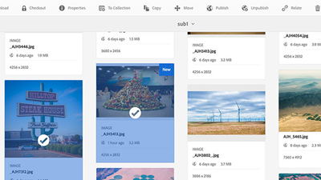

# Vídeos e Tutoriais do AEM Assets {#overview}

O Adobe Experience Manager (AEM) Assets é uma ferramenta de gerenciamento de ativos digitais AEM plataforma que permite que os usuários criem, gerenciem e compartilhem seus ativos digitais (imagens, vídeos, documentos e clipes de áudio) em um repositório baseado na Web. Este guia do usuário contém vídeos e tutoriais sobre os vários recursos e características do AEM Assets.

## Novidades

* **[Relacionar e não relacionar (Vídeo)](./authoring/relate-unrelate.md)**

   *Saiba como estabelecer e gerenciar relacionamentos entre ativos no AEM*

* **[Publicar ativos (vídeo)](./sharing/publish.md)**

   *Saiba mais sobre os recursos de publicação de ativos do AEM Author para AEM Publish*

* **[Marcas d&#39;água (Vídeo)](./advanced/watermarks.md)**

   *Saiba como marcar representações de ativos com marca d&#39;água em AEM as a Cloud Service*

* **[Permissões de linha de base (Vídeo)](./configuring/baseline-permissions.md)**

   *Saiba como e por que é importante configurar o AEM Assets com permissões de linha de base*

* **[Fluxos de trabalho de início automático (Vídeo)](./configuring/auto-start-workflows.md)**

   *Explore como chamar automaticamente AEM fluxo de trabalho em ativos carregados ou reprocessados*

## Pessoal

<table>
<td>
   
   

      <a href="./creative-workflows/aem-desktop-app.md">
      <strong>Uso do aplicativo de desktop do AEM</strong>
      </a>
   

   

      <em>Acessar ativos no AEM diretamente do desktop</em>
   

</td>
<td>
   
   

      <a href="./advanced/asset-insights-launch-tutorial.md">
      <strong>Uso do AEM Asset Insights com o Launch</strong>
      </a>
   

   

      <em>Obtenha insights sobre como os ativos são usados</em>
   

</td>
<td>
   
   

      <a href="./dynamic-media/dynamic-media-overview-feature-video-use.md">
      <strong>Visão geral da Dynamic Media</strong>
      </a>
   

   

      <em>Gerenciar e acessar conteúdo de mídia usando o Dynamic Media</em>
   

</td>
</table>

## Recursos adicionais

* [Experience League - Explorar AEM](https://experienceleague.adobe.com/#recommended/solutions/experience-manager)
* [Documentação do AEM Assets](https://experienceleague.adobe.com/docs/experience-manager-65/assets/home.html?lang=en)
* [Tutoriais do AEM as a Cloud Service](/help/cloud-service/overview.md)
* [Tutoriais do AEM Sites](/help/sites/overview.md)
* [Tutoriais do AEM Forms](/help/forms/overview.md)
* [Tutoriais da AEM Foundation](/help/foundation/overview.md)
