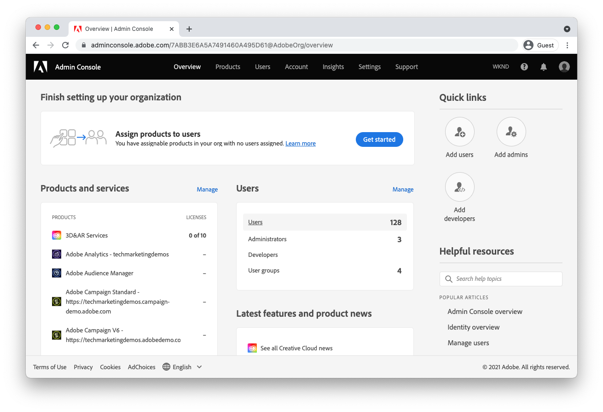

# Configuração do acesso ao AEM as a Cloud Service {#configuring-access-to-aem-as-a-cloud-service}

>[!CONTEXTUALHELP]
>id="aemcloud_adobeims_overview"
>title="Introdução ao Adobe IMS"
>abstract="O AEM as a Cloud Service utiliza o Adobe IMS (Identity Management System) para facilitar o logon de seus usuários, tanto administradores quanto usuários comuns, no serviço do AEM Author. Saiba como usuários, grupos e perfis de produto do Adobe IMS são usados em conjunto com grupos e permissões do AEM para fornecer acesso simplificado ao serviço AEM Author."

O AEM as a Cloud Service é a maneira nativa em nuvem de aproveitar os aplicativos do AEM e, como tal, aproveita o Adobe IMS (Identity Management AEM System) para facilitar o logon de seus usuários, tanto administradores quanto usuários regulares, no serviço de Autor do.

Saiba como usuários, grupos e perfis de produto do Adobe IMS são usados em conjunto com grupos e permissões do AEM para fornecer acesso simplificado ao serviço AEM Author.

## Usuários do Adobe IMS

Os usuários que exigem acesso ao serviço AEM Author são gerenciados como [Usuários do Adobe IMS](https://helpx.adobe.com/br/enterprise/using/set-up-identity.html) in [Adobe AdminConsole](https://adminconsole.adobe.com). Saiba mais sobre o que são usuários do Adobe IMS e como eles são acessados e gerenciados no Admin Console.

>[!NOTE]
>
>Quando um usuário IMS é excluído do Admin Console, ele não é excluído automaticamente do AEM, mas depois que a sessão (token) do AEM expira, ele NÃO pode fazer logon no AEM.

[Saiba mais sobre os usuários do Adobe IMS](./adobe-ims-users.md)

## Grupos de usuários do Adobe IMS

Os usuários que acessam o serviço AEM Author devem ser organizados em grupos lógicos usando [Grupos de usuários do Adobe IMS](https://helpx.adobe.com/br/enterprise/using/user-groups.html) in [Adobe AdminConsole](https://adminconsole.adobe.com). Os grupos de usuários do Adobe IMS não fornecem permissões diretas ou acesso ao AEM (esse é o trabalho do [Perfis de produto do Adobe IMS](#adobe-ims-product-profiles)), no entanto, são uma ótima maneira de definir agrupamentos lógicos de usuários que podem, por sua vez, ser traduzidos para níveis específicos de acesso no serviço de Autor de AEM, usando grupos e permissões de AEM.

[Saiba mais sobre os grupos de usuários do Adobe IMS](./adobe-ims-user-groups.md)

## Perfis de produtos do Adobe IMS

[Perfis de produto do Adobe IMS](https://helpx.adobe.com/enterprise/using/manage-permissions-and-roles.html), gerenciado em [Adobe AdminConsole](https://adminconsole.adobe.com), são os mecânicos que fornecem [Usuários do Adobe IMS](#adobe-ims-users) acesso para fazer logon no serviço AEM Author com um nível básico de acesso.

+ A variável __Usuários do AEM__ O perfil de produto oferece aos usuários acesso somente leitura ao AEM por meio da associação ao grupo AEM Contributors.
+ A variável __Administradores de AEM__ O perfil do produto oferece aos usuários acesso administrativo total ao AEM.

[Saiba mais sobre perfis de produtos do Adobe IMS](./adobe-ims-product-profiles.md)

## Grupos e permissões de usuários do AEM

O Adobe Experience Manager se baseia em usuários, grupos de usuários e perfis de produtos do Adobe IMS para fornecer aos usuários acesso personalizável ao AEM. Saiba como criar grupos e permissões de AEM e como eles trabalham em conjunto com abstrações do Adobe IMS para fornecer acesso fácil e personalizável ao AEM.

[Saiba mais sobre usuários, grupos e permissões do AEM](./aem-users-groups-and-permissions.md)

## Passo a passo de acesso e permissões

Uma apresentação resumida configurando usuários do Adobe IMS, grupos de usuários e perfis de produtos no Adobe Admin Console e como aproveitar essas abstrações do Adobe IMS no AEM Author para definir e gerenciar permissões específicas baseadas em grupos.

[Passo a passo de acesso e permissões do AEM](./walk-through.md)

## Recursos adicionais do Adobe Admin Console

A documentação a seguir aborda [Adobe Admin Console](https://adminconsole.adobe.com)Detalhes e preocupações específicos do que podem ajudar a entender melhor o Adobe Admin Console e usá-lo para gerenciar usuários e acessar em produtos Experience Cloud.

+ [Visão geral da identidade da Adobe Admin Console](https://helpx.adobe.com/br/enterprise/using/identity.html)
+ [Funções de administrador do Adobe Admin Console](https://helpx.adobe.com/enterprise/using/admin-roles.html)
+ [Funções do desenvolvedor do Adobe Admin Console](https://helpx.adobe.com/enterprise/using/manage-developers.html)
