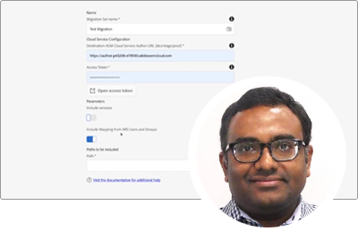
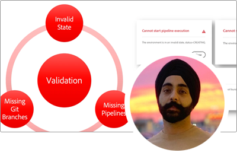

# Série Adobe Experience Manager as a Cloud Service Experts

Saiba mais sobre a AEM as a Cloud Service dos engenheiros da Adobe (Adobe Experience Manager) que a criam e da equipe de serviços profissionais que a entregam. Junte-se a especialistas em Adobe e veja o que AEM é o mesmo que o AEM 6, e como se mover do AEM 6 AEM as a Cloud Service.

  
 

## Introdução ao AEM as a Cloud Service

Saiba mais sobre os fundamentos do AEM as a Cloud Services e como ele difere do AEM 6, dos Arquitetos da Nuvem Sênior da Adobe Engineering.

<table>
  <tr>
   <td>
      
      

         <a href="./migration/moving-to-aem-as-a-cloud-service/introduction.md"><strong>Pensando de forma diferente</strong></a>         
          <em>com Darin Kuntze, Arquiteto da Nuvem Sênior</em>
      

      

         
         Uma análise AEM arquitetura do as a Cloud Service e como pensar de forma diferente sobre AEM implementações as a Cloud Service.
      

     </td>   
     <td>
      
      

         <a href="./migration/moving-to-aem-as-a-cloud-service/onboarding.md"><strong>Integração com AEM as a Cloud Service</strong></a>
          <em>com Damian Langsweirdt, Arquiteto da Nuvem Sênior</em>
      

      

         
         Saiba mais sobre integração ao AEM as a Cloud Service, começando pela fase de contrato, para configurar ambientes de autoatendimento usando o Cloud Manager.
      

   </td>     
   </td>   
     <td>
      
      

         <a href="./migration/moving-to-aem-as-a-cloud-service/cloud-manager.md"><strong>Cloud Manager para AEM as a Cloud Service</strong></a>
          <em>com Bryan Stopp, Arquiteto da Nuvem Sênior</em>
      

      

         
         Saiba mais sobre o Cloud Manager para AEM as a Cloud Service e suas diferenças com o Cloud Manager para AEM no Adobe Manage Services (AMS).
      

   </td> 
  </tr>
</table>

## Migração para o AEM as a Cloud Service?

Planejar mudar do AEM 6 para AEM as a Cloud Service? Saiba mais sobre a metodologia Adobe, perfeita para mudar para AEM as a Cloud Service, bem como sobre as várias ferramentas que tornam isso uma transição.

<table>
  <tr>
   <td>
      
      

         <a href="./migration/moving-to-aem-as-a-cloud-service/bpa-and-cam.md" target="_aem-experts-series-video"><strong>Metodologia de migração</strong></a>
          <em>com Roger Blanton, Adobe Consulting Services Technical Architect</em>
      

      

         
        Consulte a metodologia de migração de práticas recomendadas para migrar do AEM 6 para AEM as a Cloud Service usando o AEM Best Practice Analyzer (BPA) e o Cloud Acceleration Manager (CAM).
      

   </td>   
     <td>
      
      

         <a href="./migration/moving-to-aem-as-a-cloud-service/aem-modernization-tools.md" target="_aem-experts-series-video"><strong>Modernização de seu conteúdo</strong></a>
          <em>com Bryan Stopp, Arquiteto da Nuvem Sênior</em>
      

      

         
         Saiba como modernizar automaticamente seu conteúdo de AEM para aproveitar os recursos as a Cloud Service mais recentes AEM.
      

   </td>     
   </td>   
     <td>
      
      

         <a href="./migration/moving-to-aem-as-a-cloud-service/repository-modernization.md" target="_aem-experts-series-video"><strong>Modernizar seu projeto AEM Maven</strong></a>
          <em>com Varun Mitra, Arquiteto da nuvem</em>
      

      

         
         Saiba como modernizar automaticamente a estrutura e a organização do projeto Maven do aplicativo de AEM personalizado para ser as a Cloud Service e compatível com as práticas recomendadas mais recentes do Adobe AEM.
      

   </td> 
  </tr>
  <tr>
   <td>
      
      

         <a href="./migration/moving-to-aem-as-a-cloud-service/search-and-indexing.md" target="_aem-experts-series-video"><strong>Modernização de índices do Oak</strong></a>
          <em>com Darin Kuntze, Arquiteto da Nuvem Sênior</em>
      

      

         
        Saiba como converter automaticamente AEM 6 definições de índice Oak para serem AEM as a Cloud Service compatíveis, bem como manter índices Oak para AEM as a Cloud Service a partir de agora.
      

   </td>   
     <td>
      
      

         <a href="./migration/moving-to-aem-as-a-cloud-service/dispatcher.md" target="_aem-experts-series-video"><strong>Modernização da configuração do Dispatcher</strong></a>
          <em>com Bryan Stopp, Arquiteto da Nuvem Sênior</em>
      

      

         
         Saiba mais sobre AEM Dispatcher para AEM as a Cloud Service, com foco nas alterações importantes do Dispatcher para AEM 6, na ferramenta de conversão do Dispatcher e em como usar o SDK de Ferramentas do Dispatcher.
      

   </td>     
   </td>   
     <td>
      
      

         <a href="./migration/moving-to-aem-as-a-cloud-service/content-migration/content-transfer-tool.md" target="_aem-experts-series-video"><strong>Transferência do conteúdo para AEM as a Cloud Service</strong></a>
          <em>com Kiran Murugulla, Arquiteto da Nuvem Sênior</em>
      

      

         
         Saiba como a ferramenta Transferência de conteúdo ajuda a migrar o conteúdo para o AEM as a Cloud Service do AEM 6.3+.
      

   </td> 
  </tr>  
</table>

## AEM como recursos do Cloud Services

Saiba mais sobre AEM recursos exclusivos de especialistas as a Cloud Service da Adobe.

<table>
  <tr>
   <td>
      
      

         <a href="./migration/moving-to-aem-as-a-cloud-service/asset-compute-microservices.md" target="_aem-experts-series-video"><strong>Microsserviços de asset compute</strong></a>
          <em>com Amol Anand, principal Cloud Architect</em>
      

      

         
        Saiba mais sobre os microsserviços de Asset compute do AEM Assets, como eles substituem AEM 6 processamento de ativos e como eles podem ser estendidos para gerar representações de ativos personalizados.
      

   </td>   
   <td>
      
      

         <a href="./migration/moving-to-aem-as-a-cloud-service/content-migration/bulk-import-service.md" target="_aem-experts-series-video"><strong>Importação de conteúdo em massa</strong></a>
          <em>com Kiran Murugulla, Arquiteto da Nuvem Sênior</em>
      

      

         
        Saiba como importar conteúdo em massa de forma segura e eficiente para AEM as a Cloud Service usando o Serviço de importação em massa e o Gerenciador de pacotes AEM.
      

   </td> 
    <td></td>
  </tr>
</table>

## Precisa de ajuda com o AEM as a Cloud Services?

Saiba como depurar e solucionar problemas AEM as a Cloud Service e o SDK AEM dos especialistas!

<table>
  <tr>
   <td>
      
      

         <a href="./migration/moving-to-aem-as-a-cloud-service/troubleshooting.md" 
         target="_aem-experts-series-video"><strong>Solução de problemas AEM as a Cloud Service</strong></a>
          <em>com Kunwar Saluja, Arquiteto da Nuvem</em>
      

      

         
        Saiba como solucionar vários aspectos do AEM as a Cloud Service, desde a depuração do SDK AEM e AEM as a Cloud Service até falhas de build e implantação do Cloud Manager.
      

   </td>   
    <td></td>
    <td></td>
  </tr>
</table>
