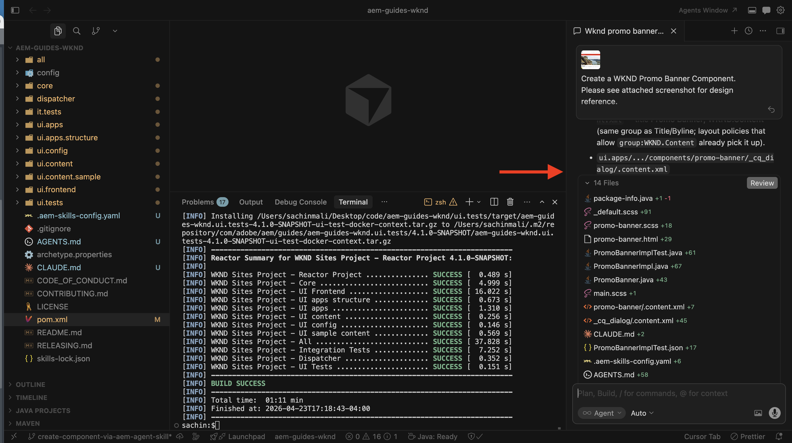

# Desenvolvimento assistido por IA

O desenvolvimento assistido por IA usa um IDE alimentado por IA ou agentes de codificação juntamente com `AGENTS.md`, Habilidades do agente e servidores MCP para ajudar a produzir código de alta qualidade e pronto para produção para projetos do AEM as a Cloud Service.

Ferramentas como [Cursor](https://www.cursor.com/), [GitHub Copilot no Visual Studio Code](https://code.visualstudio.com/docs/copilot/overview), [Claude Code](https://code.claude.com/docs/en/overview) e IDEs e agentes de codificação similares alimentados por IA ajudam de algumas maneiras principais:

- **Iteração mais rápida**: gerar ou refatorar o código a partir de prompts de linguagem natural que descrevem o recurso ou alteração desejada.
- **Ajuda de aprendizado**: explique caminhos de código, configurações, conceitos ou práticas recomendadas desconhecidos quando solicitado.

No entanto, esses benefícios dependem muito do _contexto disponível para o agente de codificação_. Dados de treinamento genéricos e um único instantâneo do repositório geralmente _não são suficientes_ para produzir de forma confiável um código AEM pronto para produção.

## Por que a IA sozinha é insuficiente

Sem o contexto correto, os modelos de IA (por meio de um IDE alimentado por IA ou agente de codificação) podem:

- **Alucinar APIs ou ciclos de vida**: sugira código ou configurações que não estejam alinhadas às práticas recomendadas ou aos recursos mais recentes do AEM as a Cloud Service.
- **Falhas nas etapas de procedimento**: omitir etapas necessárias não visíveis no repositório de código ou nos dados de treinamento.
- **Desvio dos padrões do projeto**: ignore os padrões estabelecidos para componentes, serviços OSGi, fluxos de trabalho ou configurações do Dispatcher.

Esta lacuna é onde o _contexto estruturado_ (Habilidades do Agente e AGENTS.md) e a _visibilidade de tempo de execução_ (servidores MCP) se tornam essenciais para tornar o desenvolvimento assistido por IA _produtivo_ e _confiável_.

## Como o Adobe ajuda no desenvolvimento assistido por IA

Para projetos do AEM as a Cloud Service, a Adobe fornece:

- Habilidades do agente e AGENTS.md via [Habilidades da Adobe para agentes de codificação de IA](https://github.com/adobe/skills)
- Servidores MCP locais para o AEM SDK e Dispatcher local por meio do [portal de Distribuição de Software](https://experience.adobe.com/#/downloads/content/software-distribution/en/aemcloud.html?fulltext=mcp*&1_group.propertyvalues.property=.%2Fjcr%3Acontent%2Fmetadata%2Fdc%3AsoftwareType&1_group.propertyvalues.operation=equals&1_group.propertyvalues.0_values=software-type%3Atooling&orderby=%40jcr%3Acontent%2Fjcr%3AlastModified&orderby.sort=desc&layout=list&p.offset=0&p.limit=3)
- Servidores MCP da AEM hospedados pela Adobe para conteúdo e fluxos de trabalho do Cloud Manager a partir de seu aplicativo de bate-papo ou IDE — consulte [Servidores MCP no AEM](../mcp/overview.md)

As seções a seguir resumem cada item. Use as seções **Configuração** e **Casos de Uso** no final desta página para instalação e apresentações para o desenvolvimento assistido por IA.

## O que são habilidades de agentes

As Habilidades do Agente são _conhecimento ou experiência processual_ para ajudar os agentes de codificação _a executar trabalho real de maneira confiável_. Para obter mais informações, consulte a [Habilidades do agente](https://agentskills.io).

Para um projeto do AEM as a Cloud Service, as Habilidades do agente estão disponíveis no [repositório de Habilidades do Adobe para Agentes de Codificação de IA](https://github.com/adobe/skills).

## O que é AGENTS.md

AGENTS.md fornece o _contexto e as instruções_ para ajudar os agentes de codificação _a trabalhar no seu projeto_. Para obter mais informações, consulte [AGENTS.md](https://agents.md/).

Para um projeto AEM as a Cloud Service, a habilidade de inicialização `ensure-agents-md` cria **AGENTS.md** na raiz do repositório **quando está ausente**. A habilidade inspeciona seu projeto (por exemplo, a raiz `pom.xml` e módulos) e gera orientação personalizada em vez de usar um arquivo estático. Se **AGENTS.md** já existir, ele **não** será substituído.

Depois que o arquivo existir, você poderá editá-lo para adicionar mais contexto e instruções para as práticas recomendadas da sua equipe ou organização. A habilidade também pode criar **CLAUDE.md** que faz referência a **AGENTS.md**, de modo que as ferramentas baseadas em Claude seguem a mesma orientação.

## O que são servidores MCP

Os servidores MCP expõem ferramentas e dados ao agente de codificação por meio do [Protocolo de Contexto de Modelo](https://modelcontextprotocol.io/), que dá suporte a ações como depuração, inspeção, execução e validação de alterações. Um servidor MCP pode ser executado na sua estação de trabalho (**local**) ou como um serviço hospedado (**remoto**).

Para o **desenvolvimento local** em relação ao AEM SDK e Dispatcher, instale estes **servidores MCP locais** do portal [Distribuição de Software](https://experience.adobe.com/#/downloads/content/software-distribution/en/aemcloud.html?fulltext=mcp*&1_group.propertyvalues.property=.%2Fjcr%3Acontent%2Fmetadata%2Fdc%3AsoftwareType&1_group.propertyvalues.operation=equals&1_group.propertyvalues.0_values=software-type%3Atooling&orderby=%40jcr%3Acontent%2Fjcr%3AlastModified&orderby.sort=desc&layout=list&p.offset=0&p.limit=3):

- **AEM Quickstart Local MCP server**: Exposes live runtime data from a local AEM SDK instance to support troubleshooting and development. For more information, see [AEM Quickstart MCP Server](https://experienceleague.adobe.com/pt-br/docs/experience-manager-cloud-service/content/ai-in-aem/local-development-with-ai-tools#aem-quickstart-mcp-server).
- **Dispatcher Local MCP server**: Enables runtime validation and inspection of a local Dispatcher instance. For more information, see [Dispatcher MCP Server](https://experienceleague.adobe.com/pt-br/docs/experience-manager-cloud-service/content/ai-in-aem/local-development-with-ai-tools#dispatcher-mcp-server).

For Adobe-hosted AEM MCP servers (for example, content, read-only content, and Cloud Manager), see [MCP Servers in AEM](../mcp/overview.md).

## Configurar

<!-- 
CARDS
{target = _self}

* ./setup/agent-skills.md
    {title = Set up AEM Agent Skills}
    {description = Learn how to set up AEM Agent Skills for AI-assisted development.}
    {image = ./assets/agent-skills/select-aem-agent-skills-to-install.png}
    {cta = Install AEM Agent Skills}

-->
<!-- START CARDS HTML - DO NOT MODIFY BY HAND -->

    

        

            

                <figure class="image x-is-16by9">
                    
                </figure>
            

            

                

                    

                        <a href="./setup/agent-skills.md" target="_self" rel="referrer" title="Configurar habilidades do agente do AEM">Set up AEM Agent Skills</a>
                    

                    
Saiba como configurar as Habilidades do agente do AEM para o desenvolvimento assistido por IA.

                

                <a href="./setup/agent-skills.md" target="_self" rel="referrer" class="spectrum-Button spectrum-Button--outline spectrum-Button--primary spectrum-Button--sizeM" style="align-self: flex-start; margin-top: 1rem;">
                    Install AEM Agent Skills
                </a>
            

        

    

<!-- END CARDS HTML - DO NOT MODIFY BY HAND -->

## Casos de uso

<!-- 
CARDS
{target = _self}

* ./use-cases/component-development.md    
    {title = Create AEM Component with AI-assisted development}
    {description = Learn how to use AI-assisted development to develop AEM components.}
    {image = ./assets/component-development/review-generated-code.png}
    {cta = Create AEM Component}
-->
<!-- START CARDS HTML - DO NOT MODIFY BY HAND -->

    

        

            

                <figure class="image x-is-16by9">
                    
                </figure>
            

            

                

                    

                        <a href="./use-cases/component-development.md" target="_self" rel="referrer" title="Criar componente do AEM com desenvolvimento assistido por IA">Criar componente do AEM com desenvolvimento assistido por IA</a>
                    

                    
Saiba como usar o desenvolvimento assistido por IA para desenvolver componentes do AEM.

                

                <a href="./use-cases/component-development.md" target="_self" rel="referrer" class="spectrum-Button spectrum-Button--outline spectrum-Button--primary spectrum-Button--sizeM" style="align-self: flex-start; margin-top: 1rem;">
                    Criar Componente do AEM
                </a>
            

        

    

<!-- END CARDS HTML - DO NOT MODIFY BY HAND -->

## Recursos adicionais

- [Local development with AI Tools](https://experienceleague.adobe.com/pt-br/docs/experience-manager-cloud-service/content/ai-in-aem/local-development-with-ai-tools)

- [Habilidades do Adobe para agentes de codificação de IA](https://github.com/adobe/skills)

- [AGENTS.md](https://agents.md/)

- [Habilidades do agente](https://agentskills.io/home)