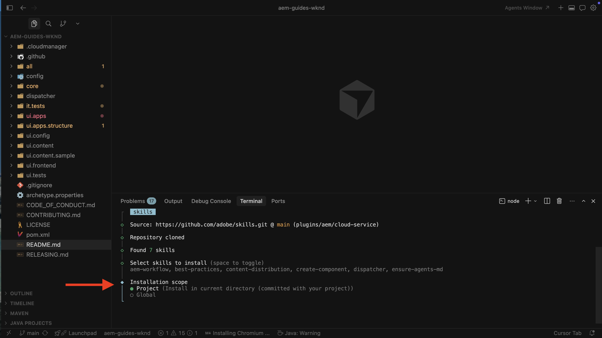

# Configurar habilidades do agente do AEM

Saiba como configurar as Habilidades do agente do AEM para o desenvolvimento assistido por IA.

Quando você solicita a um agente de codificação por meio de um IDE alimentado por IA que trabalhe em tarefas de desenvolvimento do AEM, ele pode usar as **Habilidades do AEM Agent**, orientações de procedimentos da Adobe, em vez de depender apenas do treinamento de modelo genérico ou o que for possível deduzir apenas do seu repositório.

A Adobe fornece as Habilidades do AEM Agent por meio do repositório [Habilidades da Adobe](https://github.com/adobe/skills). Consulte também o [Desenvolvimento assistido por IA](../overview.md) para saber como o Adobe ajuda no desenvolvimento assistido por IA.

Neste tutorial, você instala as habilidades em um clone local do [Projeto de sites WKND](https://github.com/adobe/aem-guides-wknd). Você pode usar as mesmas etapas para seu próprio projeto do AEM as a Cloud Service.

>[!VIDEO](https://video.tv.adobe.com/v/3484940/?learn=on&enablevpops)

## Pré-requisitos

Para seguir este tutorial, você precisa do seguinte:

- Um clone local do [Projeto de sites WKND](https://github.com/adobe/aem-guides-wknd) ou de seu próprio projeto do AEM as a Cloud Service.
- Um IDE alimentado por IA, como Cursor, ou código do Visual Studio com GitHub Copilot.

## Instalar habilidades do agente do AEM

Instale Habilidades do Agente do AEM com o comando `npx` (requer [Node.js](https://nodejs.org/) para que `npx` esteja disponível). Para outras opções de instalação, por exemplo, plug-ins do Claude Code ou a extensão CLI do GitHub, consulte a seção [Instalação](https://github.com/adobe/skills/tree/main#installation) no repositório de Habilidades do Adobe.

1. Clonar o [Projeto de Sites WKND](https://github.com/adobe/aem-guides-wknd) localmente:

   ```shell
   $ git clone https://github.com/adobe/aem-guides-wknd.git
   ```

1. Abra o projeto clonado em seu IDE alimentado por IA (por exemplo, Cursor) e abra o terminal integrado.
   

1. Execute o seguinte comando para adicionar Habilidades do agente AEM para o cursor:

   ```shell
   $ npx skills add https://github.com/adobe/skills/tree/main/plugins/aem/cloud-service --agent cursor
   ```

   Para outros tipos de agente, consulte a seção [Instalação](https://github.com/adobe/skills/tree/main#installation) no repositório de Habilidades da Adobe.

1. Quando solicitado, escolha quais Habilidades do AEM Agent instalar.
   

   Selecione a habilidade **sure-agents-md** para que o instalador possa criar arquivos **AGENTS.md** e **CLAUDE.md** na raiz do repositório. Essa habilidade de inicialização inspeciona seu projeto, por exemplo, a raiz `pom.xml` e os módulos, e gera orientação de agente personalizada.

   Se **AGENTS.md** já existir, ele **não** será substituído.

1. Escolha o escopo de instalação. Para esta apresentação, o escopo do **Projeto** é típico para que os arquivos de habilidade residam no repositório.
   

1. Confirme a instalação em `.agents/skills`. Você deve ver **SKILLS.md** e a referência relacionada e as pastas de ativos.
   

1. Quando o Adobe adiciona ou atualiza habilidades, use a CLI para adicioná-las, atualizá-las, removê-las ou listá-las. Para ver todos os comandos:

   ```shell
   $ npx skills --help
   ```

   

## Casos de uso

<!-- 
CARDS
{target = _self}

* ../use-cases/component-development.md    
    {title = Create AEM Component with AI-assisted development}
    {description = Learn how to use AI-assisted development to develop AEM components.}
    {image = ../assets/component-development/review-generated-code.png}
    {cta = Create AEM Component}
-->
<!-- START CARDS HTML - DO NOT MODIFY BY HAND -->
<div class="columns">
    <div class="column is-half-tablet is-half-desktop is-one-third-widescreen" aria-label="Create AEM Component with AI-assisted development">
        <div class="card" style="height: 100%; display: flex; flex-direction: column; height: 100%;">
            <div class="card-image">
                <figure class="image x-is-16by9">
                    <a href="../use-cases/component-development.md" title="Criar componente do AEM com desenvolvimento assistido por IA" target="_self" rel="referrer">
                        
                    </a>
                </figure>
            </div>
            <div class="card-content is-padded-small" style="display: flex; flex-direction: column; flex-grow: 1; justify-content: space-between;">
                <div class="top-card-content">
                    <p class="headline is-size-6 has-text-weight-bold">
                        <a href="../use-cases/component-development.md" target="_self" rel="referrer" title="Criar componente do AEM com desenvolvimento assistido por IA">Criar componente do AEM com desenvolvimento assistido por IA</a>
                    </p>
                    <p class="is-size-6">Saiba como usar o desenvolvimento assistido por IA para desenvolver componentes do AEM.</p>
                </div>
                <a href="../use-cases/component-development.md" target="_self" rel="referrer" class="spectrum-Button spectrum-Button--outline spectrum-Button--primary spectrum-Button--sizeM" style="align-self: flex-start; margin-top: 1rem;">
                    <span class="spectrum-Button-label has-no-wrap has-text-weight-bold">Criar Componente do AEM</span>
                </a>
            </div>
        </div>
    </div>
</div>
<!-- END CARDS HTML - DO NOT MODIFY BY HAND -->

## Recursos adicionais

- [Desenvolvimento local com ferramentas de IA](https://experienceleague.adobe.com/en/docs/experience-manager-cloud-service/content/ai-in-aem/local-development-with-ai-tools)

- [Habilidades do Adobe para agentes de codificação de IA](https://github.com/adobe/skills)

- [AGENTS.md](https://agents.md/)

- [Habilidades do agente](https://agentskills.io/home)
