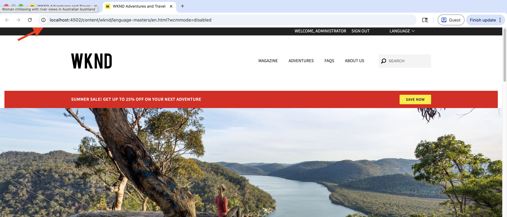

# Desenvolvimento de componentes usando as habilidades do agente do AEM

Saiba como desenvolver um componente do AEM usando as Habilidades do AEM Agent como parte do [desenvolvimento assistido por IA](../overview.md).

Nesta apresentação, você usa a linguagem natural em um IDE alimentado por IA (por exemplo, Cursor) para desenvolver um componente **Banner promocional** no [Projeto de sites WKND](https://github.com/adobe/aem-guides-wknd). O agente de codificação aplica a `create-component` Habilidade do AEM Agent para gerar a implementação.

>[!VIDEO](https://video.tv.adobe.com/v/3484952/?learn=on&enablevpops)

## Pré-requisitos

Para seguir este tutorial, você precisa do seguinte:

- Um IDE alimentado por IA, como Cursor, ou código do Visual Studio com GitHub Copilot.
- Um clone local do [Projeto de sites do WKND](https://github.com/adobe/aem-guides-wknd), criado e implantado em uma instância do _AEM SDK_ local.
- _Habilidades do AEM Agent_ instaladas nesse projeto. Se você ainda não tiver feito isso, conclua a [Instalação das Habilidades do Agente do AEM](../setup/agent-skills.md).

## Necessidade de componente

Suponhamos que a equipe da WKND deseje exibir um banner promocional na página inicial, e a referência de design seja a seguinte:


Os autores devem ser capazes de definir os campos _Rótulo promocional_, _Rótulo do CTA_ e _Link do CTA_ na caixa de diálogo de componentes.

A referência de design é uma captura de tela obtida por wireframe, maquete ou captura de marcação estática.

## Desenvolver o componente

1. Abra o projeto WKND no IDE. Confirme se as Habilidades do Agente do AEM estão presentes (por exemplo, em `.agents/skills`) e inicie um novo chat do agente.
   

1. Digite um prompt como o seguinte. Anexe a captura de tela de design do componente (obtida via wireframe, mockup ou captura de marcação estática) se o IDE suportar imagens no chat:

   ```text
   Create a WKND Promo Banner Component. Please see attached screenshot for design reference.
   
   Dialog specification are:
   
   1. Promo Label - Textfield, required
   2. CTA Text - Textfield, required
   3. CTA Link - Pathfield, required
   ```

1. O agente de codificação usa a Habilidade do AEM Agent `create-component` para gerar o componente. Revise o HTL, o modelo Sling, o XML da caixa de diálogo e os arquivos relacionados propostos.
   

>[!TIP]
>
>Em vez de fornecer a referência de design como uma captura de tela, você também pode fornecer um design do Figma por meio do [servidor MCP Figma](https://www.figma.com/mcp-catalog/) para gerar o componente. A habilidade `create-component` dá suporte à [integração de design do Figma](https://github.com/adobe/skills/blob/main/plugins/aem/cloud-service/skills/create-component/references/figma-design-rules.md)


1. Implante o componente na instância local do AEM/SDK.

   ```shell
   $ mvn clean install -PautoInstallSinglePackage
   ```

1. Na criação, coloque o banner promocional na página inicial e valide o comportamento. Refine a implementação se ela ainda divergir da referência do design.
   

1. Revise o componente recém-criado publicando a página ou Visualizar como publicado.
   

Parabéns! Você criou com sucesso um novo componente do AEM usando as Habilidades do agente do AEM como parte do desenvolvimento assistido por IA.

## Além dos componentes simples

Esta apresentação usa um componente simples. A mesma habilidade `create-component` também suporta casos mais ricos, incluindo:

- Campos múltiplos e de caixas de diálogo aninhadas
- Extensões dos Componentes principais do AEM (incluindo padrões Sling Resource Merger)
- URLs de arquivo ou quadro Figma para layout e estilo, quando o servidor Figma MCP (por exemplo, `plugin-figma-figma`) estiver habilitado no IDE

Para tipos de campos, padrões de caixas de diálogo, regras de figuras e exemplos, leia `SKILL.md` na pasta de habilidades instalada, por exemplo, `.agents/skills/create-component/SKILL.md`.

Para obter uma visão geral, caminhos de instalação por IDE e solução de problemas, consulte [Agente de Desenvolvimento de Componentes do AEM](https://github.com/adobe/skills/blob/main/plugins/aem/cloud-service/skills/create-component/README.md) no repositório de Habilidades do Adobe.

## AGENTS.md

Antes de concluirmos, vamos entender como o AGENTS.md foi gerado como parte da criação do componente.

Para projetos AEM as a Cloud Service, a habilidade de inicialização `ensure-agents-md` (selecionada durante [Configurar Habilidades do AEM Agent](../setup/agent-skills.md)) cria `AGENTS.md` na raiz do repositório quando está **ausente**. Ele usa o que aprende no layout do seu projeto.

Ele **não** substitui um arquivo `AGENTS.md` existente.


## Recursos adicionais

- [Desenvolvimento local com ferramentas de IA](https://experienceleague.adobe.com/en/docs/experience-manager-cloud-service/content/ai-in-aem/local-development-with-ai-tools)

- [Habilidades do Adobe para agentes de codificação de IA](https://github.com/adobe/skills)

- [AGENTS.md](https://agents.md/)

- [Habilidades do agente](https://agentskills.io/home)
