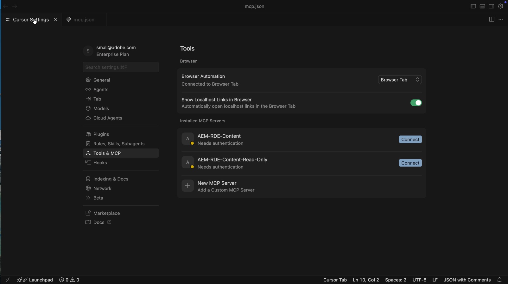

# Acelere as operações de conteúdo do AEM usando o servidor MCP de conteúdo

Use o **Servidor MCP de Conteúdo** de um IDE alimentado por IA, como o [IDE de Cursor](https://www.cursor.com/), para trabalhar com conteúdo do AEM em linguagem natural, sem código de API de baixo nível ou navegação pela interface do usuário.

Neste tutorial, você _revisa_ detalhes do fragmento de conteúdo Adventure, _atualiza_ um fragmento (por exemplo, o preço de uma aventura) e _verifica_ a alteração no [aplicativo WKND Adventures React](https://github.com/adobe/aem-guides-wknd-graphql/tree/main/react-app) de seu IDE em um _ambiente AEM inferior_ (RDE ou Desenvolvimento) sem sair do fluxo do MCP.

>[!VIDEO](https://video.tv.adobe.com/v/3480895/?learn=on&enablevpops)

## Visão geral

A AEM as a Cloud Service fornece _Servidores MCP_ para que o IDE ou aplicativo de chat funcione com a AEM de forma segura. O **Servidor MCP de Conteúdo** oferece suporte a páginas, fragmentos e ativos. Consulte [Servidores MCP no AEM](./overview.md) para obter mais informações.

## Como os desenvolvedores podem usá-lo

Conecte o [IDE de Cursor](https://www.cursor.com/) ao Servidor MCP de Conteúdo e execute o cenário abaixo.

### Configuração - Servidor MCP de Conteúdo no Cursor

Vamos configurar o Servidor de MCP de Conteúdo no Cursor com essas etapas.

1. Abra o cursor em sua máquina.

1. Vá para **Configurações** > **Configurações do Cursor** no menu Cursor para abrir a janela de configurações.
   

1. Na barra lateral esquerda, clique em **Ferramentas &amp; MCP** para abrir esse painel.
   

1. Clique em **Adicionar MCP personalizado** ou **Novo servidor MCP** para abrir o `mcp.json` e cole nesta configuração:

   ```json
   {
       "mcpServers": {
           // Use this for create, read, update, and delete operations
           "AEM-RDE-Content": {
               "url": "https://mcp.adobeaemcloud.com/adobe/mcp/content"
           },
           //Use this for read-only operations
           "AEM-RDE-Content-Read-Only": {
               "url": "https://mcp.adobeaemcloud.com/adobe/mcp/content-readonly"
           }
       }
   }
   ```

   >[!CAUTION]
   >
   > Para fins de tutorial, a configuração acima adiciona **Conteúdo** e **Conteúdo (somente leitura)** para este tutorial. Na prática, o **Conteúdo** já inclui todas as ofertas de **Conteúdo (somente leitura)**, além das ferramentas de criação/atualização/exclusão.
   >
   >
   > Para evitar qualquer possibilidade de criação, modificação ou exclusão de conteúdo, configure apenas **Conteúdo (somente leitura)** (`/content-readonly`) e omita **Conteúdo** (`/content`). Dessa forma, você evita alterações acidentais.

   

1. Na janela Configurações do cursor, clique em **Conectar** para iniciar o processo de autenticação. Ele usa o fluxo PKCE do OAuth 2.0 para obter o **Token de Acesso Específico do Usuário** para acessar o Servidor MCP do AEM.
   

1. Faça logon com a Adobe ID e volte para a janela Configurações do cursor.
   

1. Confirme se o **AEM-RDE-Content-Read-Only** e o **AEM-RDE-Content** aparecem como conectados. Você pode expandir cada servidor para ver suas ferramentas.

   

### Configuração - Aplicativo WKND Adventures React

Em seguida, configure o [Aplicativo WKND Adventures React](https://github.com/adobe/aem-guides-wknd-graphql/tree/main/react-app) no Cursor.

1. Clonar estes dois repositórios no computador:

   ```bash
   ## WKND GraphQL repo, the `react-app` folder is the WKND Adventures app
   $ git clone git@github.com:adobe/aem-guides-wknd-graphql.git
   
   ## WKND Site repo, you deploy this to RDE so the app can use its content fragments data via GraphQL
   $ git clone git@github.com:adobe/aem-guides-wknd.git
   ```

1. Implante o projeto [WKND Site](https://github.com/adobe/aem-guides-wknd) no RDE. Para obter etapas detalhadas, consulte [Como usar o Ambiente de Desenvolvimento Rápido](https://experienceleague.adobe.com/en/docs/experience-manager-learn/cloud-service/developing/rde/how-to-use#deploy-aem-artifacts-using-the-aem-rde-plugin).

1. Abra a pasta `react-app` no IDE.

1. Editar `.env.development` e definir:
   - `REACT_APP_HOST_URI`: sua URL de Autor RDE
   - `REACT_APP_AUTH_METHOD`: ser `basic`
   - `REACT_APP_BASIC_AUTH_USER` e `REACT_APP_AEM_AUTH_PASSWORD`: ser `aem-headless` (criar este usuário no RDE e adicioná-lo ao grupo `administrators`)

1. No terminal IDE, execute:

   ```bash
   $ cd aem-guides-wknd-graphql/react-app
   $ npm install
   $ npm start
   ```

1. Em seu navegador, vá para [http://localhost:3000](http://localhost:3000) para exibir o aplicativo WKND Adventures.

   

### Cenário de produtividade - Revisão e atualização de conteúdo do AEM

Suponha que você precise mostrar um banner de _HOT DEAL_ em cartões Adventure quando uma regra simples é atendida. A abordagem habitual seria:

- Observe o código do componente Cartões de aventura
- Adicionar a lógica de quando mostrar o banner
- Verifique o modelo de fragmento de conteúdo do Adventure no AEM
- Altere uma ou mais propriedades do fragmento Aventura para testar a regra

Para simplificar as coisas, vamos mostrar o banner _HOT DEAL_ quando o preço da aventura estiver abaixo de US$ 100.

Como o aplicativo React obtém os dados do ambiente RDE, é necessário conhecer o modelo de fragmento de conteúdo Adventure e atualizar as propriedades do fragmento correto. É exatamente com isso que o AEM Content MCP Server pode ajudar. Veja como.

1. No Cursor, abra um novo chat e digite:

   ```text
   I want to review my Content Fragment Models from AEM RDE, can you list the Adventure Content Fragment details.
   ```

   


   Antes de chamar o Servidor MCP de Conteúdo, ele solicita a confirmação para continuar. Dessa forma, você permanece no controle das operações de conteúdo.

   A IA usa o servidor MCP de conteúdo para buscar os dados e, em seguida, os apresenta de forma clara e estruturada. Inclui detalhes do modelo do fragmento de conteúdo, o número de fragmentos e informações de resumo.

1. Para acionar o banner _OFERTA DIRETA_, atualize o preço de uma aventura. No mesmo bate-papo, tente:

   ```text
   Can you update adventure Beervana in Portland's price to 99.99
   ```

   

   Da mesma forma, a IA solicita a confirmação para continuar antes de atualizar o conteúdo. Ele também resume a operação do conteúdo antes e depois da atualização.

1. No aplicativo React, confirme se o cartão Beervana agora mostra o banner _HOT DEAL_.

   

### Prompts adicionais

Experimente esses prompts focados em conteúdo em seu IDE (com o Servidor MCP de Conteúdo conectado) para explorar mais fluxos de trabalho e recursos.

- Descobrir conteúdo:

  ```text
  List all content fragments in the WKND Adventures folder
  
  List all WKND Site pages from US English site
  
  Can you give me page metadata for Tahoe Skiing English page? 
  
  List assets of Bali Surf camp
  
  What Content Fragment models are available in this environment?
  ```

- Pesquisar conteúdo:

  ```text
  Search for content fragments that mention 'cycling'
  
  Do we have a magazine page in US English site with "Camping" in it
  ```

- Atualizar conteúdo:

  ```text
  In WKND US English create a copy of Downhill Skiing Wyoming as "Test Downhill Skiing Wyoming"
  
  In newly created "Test Downhill Skiing Wyoming" please change title to "Duplicated Page"
  ```

- Publicar ou desfazer a publicação:

  ```text
  Can you publish the page at /us/en/adventures/test-downhill-skiing-wyoming and give me publish page URL
  
  Can you unpublish the test-downhill-skiing-wyoming page
  ```

## Resumo

Você configurou o Servidor MCP de Conteúdo do AEM no Cursor e o conectou ao seu ambiente RDE (ou Desenvolvimento). Em seguida, você usou o aplicativo WKND Adventures React e conversou em linguagem natural para analisar os detalhes do fragmento de conteúdo do Adventure. Você também atualizou o preço de um fragmento com a IA, solicitando sua confirmação antes de cada operação de conteúdo. Você verificou a alteração no aplicativo em execução. Você pode usar o mesmo fluxo centrado no ser humano do IDE para revisar, atualizar e criar conteúdo do AEM sem alternar para a interface do usuário do AEM ou gravar código de API de baixo nível.
