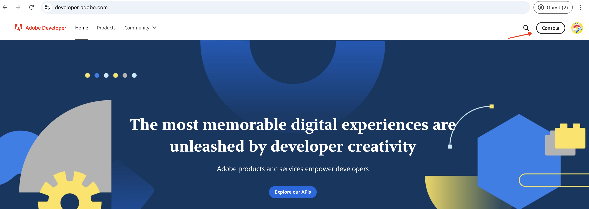
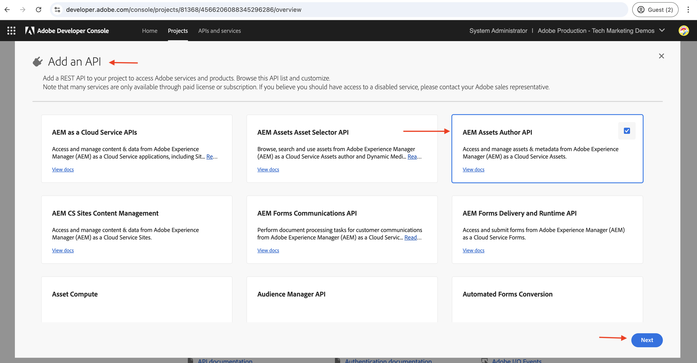
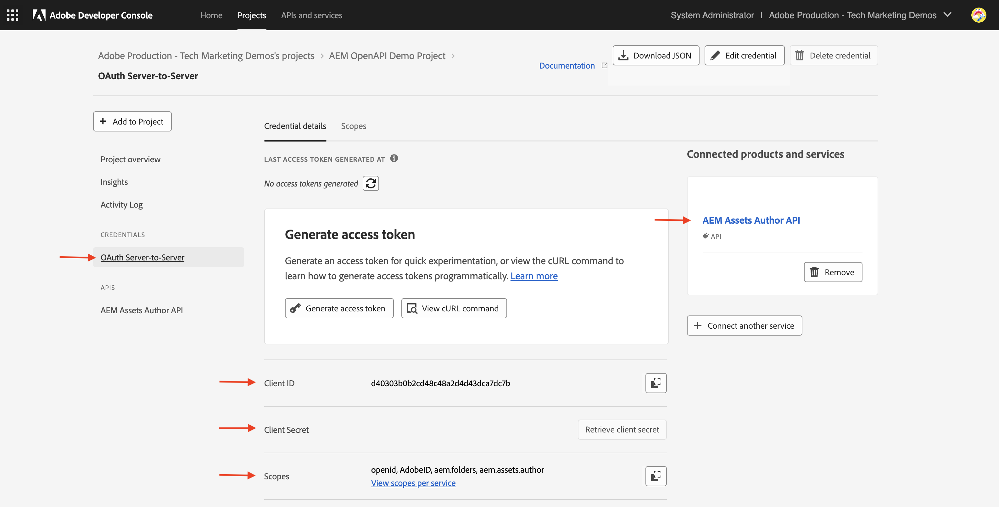

# Como chamar APIs do AEM baseadas em OpenAPI{#invoke-openapi-based-aem-apis}

Saiba como invocar APIs do AEM com base em OpenAPI no AEM as a Cloud Service a partir de aplicativos personalizados.

>[!AVAILABILITY]
>
>As APIs de AEM baseadas em OpenAPI estão disponíveis como parte de um programa de acesso antecipado. Se você estiver interessado em acessá-las, recomendamos enviar um email para [aem-apis@adobe.com](mailto:aem-apis@adobe.com) com uma descrição do seu caso de uso.

Neste tutorial, você aprenderá a:

- Habilite o acesso às APIs do AEM com base em OpenAPI para o seu ambiente do AEM as a Cloud Service.
- Crie e configure um projeto do Adobe Developer Console (ADC) para acessar APIs AEM usando a autenticação de servidor para servidor OAuth.
- Desenvolva um aplicativo NodeJS de amostra que chame a API do autor do Assets para recuperar metadados de um ativo específico.

Antes de começar, verifique se você revisou a seção [Acessando APIs de Adobe e conceitos relacionados](overview.md#accessing-adobe-apis-and-related-concepts).

## Pré-requisitos

Para concluir este tutorial, você precisa:

- Ambiente AEM as a Cloud Service modernizado com o seguinte:
   - Versão do AEM `2024.10.18459.20241031T210302Z` ou posterior.
   - Novos perfis de produto de estilo (se o ambiente tiver sido criado antes de novembro de 2024)

- O projeto [WKND Sites](https://github.com/adobe/aem-guides-wknd?#aem-wknd-sites-project) de amostra deve ser implantado nele.

- Acesso à [Adobe Developer Console](https://developer.adobe.com/developer-console/docs/guides/getting-started/).

- Instale o [Node.js](https://nodejs.org/en/) no computador local para executar o aplicativo NodeJS de amostra.

## Etapas de desenvolvimento

As etapas de desenvolvimento de alto nível são:

1. Modernização do ambiente do AEM as a Cloud Service.
1. Habilite o acesso às APIs do AEM.
1. Criar projeto do Adobe Developer Console (ADC).
1. Configurar projeto ADC
   1. Adicionar as APIs de AEM desejadas
   1. Configurar sua autenticação
   1. Associar o perfil de produto à configuração de autenticação
1. Configurar a instância do AEM para habilitar a comunicação do Projeto ADC
1. Desenvolver um aplicativo NodeJS de amostra
1. Verificar o fluxo de ponta a ponta

## Modernização do ambiente do AEM as a Cloud Service

Vamos começar modernizando o ambiente do AEM as a Cloud Service. Essa etapa só será necessária se o ambiente não for modernizado.

A modernização do ambiente do AEM as a Cloud Service é um processo de duas etapas,

- Atualização para a versão mais recente do AEM
- Adicione novos Perfis de produto a ele.

### Atualizar instância AEM

Para atualizar a instância do AEM, na seção _Ambientes_ do Adobe [Cloud Manager](https://my.cloudmanager.adobe.com/), selecione o ícone _reticências_ ao lado do nome do ambiente e selecione a opção **Atualizar**.


Em seguida, clique no botão **Enviar** e execute o pipeline de pilha completa sugerido.


No meu caso, o nome do Pipeline de Pilha Completa é _Dev :: Fullstack-Deploy_ e o nome do ambiente AEM é _wknd-program-dev_, ele pode variar no seu caso.

### Adicionar novos perfis de produto

Para adicionar novos Perfis de produto à instância do AEM, na seção _Ambientes_ do Adobe [Cloud Manager](https://my.cloudmanager.adobe.com/), selecione o ícone _reticências_ ao lado do nome do ambiente e selecione a opção **Adicionar Perfis de Produto**.


Você pode revisar os Perfis de Produtos recém-adicionados clicando no ícone _reticências_ ao lado do nome do ambiente e selecionando **Gerenciar Acesso** > **Perfis de Autores**.

A janela _Admin Console_ exibe os Perfis de produto adicionados recentemente.


As etapas acima concluem a modernização do ambiente do AEM as a Cloud Service.

## Habilitar o acesso às APIs do AEM

Os novos Perfis de produto permitem o acesso à API AEM com base em OpenAPI no Adobe Developer Console (ADC).

Os Perfis de produto adicionados recentemente estão associados aos _Serviços_ que representam grupos de usuários AEM com ACLs (Listas de Controle de Acesso) predefinidas. Os _Serviços_ são usados para controlar o nível de acesso às APIs do AEM.

Você também pode marcar ou desmarcar os _Serviços_ associados ao Perfil de Produto para reduzir ou aumentar o nível de acesso.

Revise a associação clicando no ícone _Exibir Detalhes_ ao lado do nome do Perfil do Produto.


Por padrão, o **Serviço de Usuários da API do AEM Assets** não está associado a nenhum Perfil de Produto. Vamos associá-lo aos **Administradores do AEM - autor - Programa XXX - Ambiente XXX** Perfil do produto recém-adicionados. Após essa associação, a _API do Autor do Ativo_ do ADC Project pode configurar a autenticação de Servidor para Servidor OAuth e associar a conta de autenticação ao Perfil do Produto.


É importante observar que, antes da modernização, na instância do Autor do AEM, dois Perfis de Produto estavam disponíveis: **Administradores de AEM-XXX** e **Usuários de AEM-XXX**. Também é possível associar esses Perfis de produto existentes aos novos Serviços.

## Criar projeto do Adobe Developer Console (ADC)

Em seguida, crie um Projeto ADC para acessar APIs AEM.

1. Faça logon no [Adobe Developer Console](https://developer.adobe.com/console) usando sua Adobe ID.

   

1. Na seção _Início Rápido_, clique no botão **Criar novo projeto**.

   

1. Ele cria um novo projeto com o nome padrão.

   

1. Edite o nome do projeto clicando no botão **Editar projeto** no canto superior direito. Forneça um nome significativo e clique em **Salvar**.

   

## Configurar projeto ADC

Em seguida, configure o projeto ADC para adicionar APIs AEM, configure sua autenticação e associe o perfil de produto.

1. Para adicionar APIs AEM, clique no botão **Adicionar API**.

   

1. Na caixa de diálogo _Adicionar API_, filtre por _Experience Cloud_, selecione o cartão **API de Autor do AEM Assets** e clique em **Avançar**.

   

1. Em seguida, na caixa de diálogo _Configurar API_, selecione a opção de autenticação de **Servidor para Servidor** e clique em **Avançar**. A autenticação de servidor para servidor é ideal para serviços de back-end que precisam de acesso à API sem interação com o usuário.

   

1. Renomeie a credencial para facilitar a identificação (se necessário) e clique em **Avançar**. Para fins de demonstração, o nome padrão é usado.

   

1. Selecione o **Perfil de Produto Administradores do AEM - autor - Programa XXX - Ambiente XXX** e clique em **Salvar**. Como você pode ver, somente o Perfil de produto associado ao Serviço de usuários da API do AEM Assets está disponível para seleção.

   

1. Revise a configuração da API e da autenticação do AEM.

   

   


## Configurar instância AEM para habilitar a comunicação do Projeto ADC

Para habilitar a ClientID de credencial servidor para servidor OAuth do projeto ADC para comunicação com a instância do AEM, é necessário configurar a instância do AEM.

Isso é feito definindo a configuração no arquivo `config.yaml` no Projeto AEM. Em seguida, implante o arquivo `config.yaml` usando o Pipeline de configuração na Cloud Manager.

1. No Projeto AEM, localize ou crie o arquivo `config.yaml` da pasta `config`.

   

1. Adicione a configuração a seguir ao arquivo `config.yaml`.

   ```yaml
   kind: "API"
   version: "1.0"
   metadata: 
       envTypes: ["dev", "stage", "prod"]
   data:
       allowedClientIDs:
           author:
           - "<ADC Project's OAuth Server-to-Server credential ClientID>"
   ```

   Substitua `<ADC Project's OAuth Server-to-Server credential ClientID>` pela ClientID real da credencial servidor para servidor OAuth do projeto ADC. O ponto de extremidade de API usado neste tutorial está disponível somente na camada do autor, mas para outras APIs, a configuração yaml também pode ter um nó _publicar_ ou _visualizar_.

1. Confirme as alterações de configuração no repositório Git e envie as alterações para o repositório remoto.

1. Implante as alterações acima usando o Pipeline de configuração no Cloud Manager. Observe que o arquivo `config.yaml` também pode ser instalado em um RDE, usando ferramentas de linha de comando.

   

## Desenvolver um aplicativo NodeJS de amostra

Vamos desenvolver um aplicativo NodeJS de amostra que chame a API do autor do Assets.

Você pode usar outras linguagens de programação, como Java, Python, etc., para desenvolver o aplicativo.

Para fins de teste, você pode usar o [Postman](https://www.postman.com/), [curl](https://curl.se/) ou qualquer outro cliente REST para invocar as APIs AEM.

### Revise a API

Antes de desenvolver o aplicativo, vamos revisar [entregar o ponto de extremidade de metadados](https://developer.adobe.com/experience-cloud/experience-manager-apis/api/experimental/assets/author/#operation/getAssetMetadata) do ativo especificado pela _API do Autor do Assets_. A sintaxe da API é:

```http
GET https://{bucket}.adobeaemcloud.com/adobe/assets/{assetId}/metadata
```

Para recuperar os metadados de um ativo específico, você precisa dos valores `bucket` e `assetId`. O `bucket` é o nome da instância AEM sem o nome de domínio Adobe (.adobeaemcloud.com), por exemplo, `author-p63947-e1420428`.

O `assetId` é a JCR UUID do ativo com o prefixo `urn:aaid:aem:`, por exemplo, `urn:aaid:aem:a200faf1-6d12-4abc-bc16-1b9a21f870da`. Há várias maneiras de obter o `assetId`:

- Anexe a extensão `.json` do caminho de ativos AEM para obter os metadados dos ativos. Por exemplo, `https://author-p63947-e1420429.adobeaemcloud.com/content/dam/wknd-shared/en/adventures/cycling-southern-utah/adobestock-221043703.jpg.json` e procure a propriedade `jcr:uuid`.

- Como alternativa, obtenha o `assetId` ao inspecionar o ativo no inspetor de elementos do navegador. Procure o atributo `data-id="urn:aaid:aem:..."`.

  

### Chame a API usando o navegador

Antes de desenvolver o aplicativo, vamos invocar a API usando o recurso **Experimentar** na [documentação sobre APIs](https://developer.adobe.com/experience-cloud/experience-manager-apis/api/experimental/assets/author/#operation/getAssetMetadata).

1. Abra a [Documentação da API do Assets Author](https://developer.adobe.com/experience-cloud/experience-manager-apis/api/experimental/assets/author) no navegador.

1. Expanda a seção _Metadados_ e clique na opção **Fornece os metadados do ativo especificado**.

1. No painel direito, clique no botão **Experimente**.
   

1. Insira os seguintes valores:
   1. O valor `bucket` é o nome da instância AEM sem o nome de domínio Adobe (.adobeaemcloud.com), por exemplo, `author-p63947-e1420428`.

   1. Os valores `Bearer Token` e `X-Api-Key` relacionados à seção **Security** são obtidos da credencial OAuth Server-to-Server do projeto ADC. Clique em **Gerar token de acesso** para obter o valor `Bearer Token` e usar o valor `ClientID` como `X-Api-Key`.
      

   1. O valor `assetId` relacionado à seção **Parâmetros** é o identificador exclusivo do ativo no AEM. O `X-Adobe-Accept-Experimental` está definido como 1.

      

1. Clique em **Enviar** para invocar a API.

1. Revise a guia **Resposta** para ver a resposta da API.

   

As etapas acima confirmam a modernização do ambiente do AEM as a Cloud Service, permitindo o acesso às APIs do AEM. Ele também confirma a configuração bem-sucedida do projeto ADC e a comunicação da credencial do servidor para servidor OAuth com a instância do autor do AEM.

### Exemplo de aplicativo NodeJS

Vamos desenvolver um aplicativo NodeJS de amostra.

Para desenvolver o aplicativo, você pode usar as instruções _Run-the-sample-application_ ou _Step-by-step-development_.


>[!BEGINTABS]

>[!TAB Executar-o-aplicativo-de-amostra]

1. Baixe o arquivo zip do aplicativo [demo-nodejs-app-to-invoke-aem-openapi](assets/demo-nodejs-app-to-invoke-aem-openapi.zip) de amostra e extraia-o.

1. Navegue até a pasta extraída e instale as dependências.

   ```bash
   $ npm install
   ```

1. Substitua os espaços reservados no arquivo `.env` pelos valores reais da credencial servidor para servidor OAuth do projeto ADC.

1. Substitua `<BUCKETNAME>` e `<ASSETID>` no arquivo `src/index.js` pelos valores reais.

1. Execute o aplicativo NodeJS.

   ```bash
   $ node src/index.js
   ```

>[!TAB Desenvolvimento passo a passo]

1. Crie um novo projeto NodeJS.

   ```bash
   $ mkdir demo-nodejs-app-to-invoke-aem-openapi
   $ cd demo-nodejs-app-to-invoke-aem-openapi
   $ npm init -y
   ```

1. Instale a biblioteca _fetch_ e _dotenv_ para fazer solicitações HTTP e ler as variáveis de ambiente, respectivamente.

   ```bash
   $ npm install node-fetch
   $ npm install dotenv
   ```

1. Abra o projeto em seu editor de código favorito e atualize o arquivo `package.json` para adicionar o `type` a `module`.

   ```json
   {
       ...
       "version": "1.0.0",
       "type": "module",
       "main": "index.js",
       ...
   }
   ```

1. Crie o arquivo `.env` e adicione a seguinte configuração. Substitua os espaços reservados pelos valores reais da credencial servidor a servidor OAuth do projeto ADC.

   ```properties
   CLIENT_ID=<ADC Project OAuth Server-to-Server credential ClientID>
   CLIENT_SECRET=<ADC Project OAuth Server-to-Server credential Client Secret>
   SCOPES=<ADC Project OAuth Server-to-Server credential Scopes>
   ```

1. Crie o arquivo `src/index.js` e adicione o código a seguir e substitua `<BUCKETNAME>` e `<ASSETID>` pelos valores reais.

   ```javascript
   // Import the dotenv configuration to load environment variables from the .env file
   import "dotenv/config";
   
   // Import the fetch function to make HTTP requests
   import fetch from "node-fetch";
   
   // REPLACE THE FOLLOWING VALUES WITH YOUR OWN
   const bucket = "<BUCKETNAME>"; // Bucket name is the AEM instance name (e.g. author-p63947-e1420428)
   const assetId = "<ASSETID>"; // Asset ID is the unique identifier for the asset in AEM (e.g. urn:aaid:aem:a200faf1-6d12-4abc-bc16-1b9a21f870da). You can get it by inspecting the asset in browser's element inspector, look for data-id="urn:aaid:aem:..."
   
   // Load environment variables for authentication
   const clientId = process.env.CLIENT_ID; // Adobe IMS client ID
   const clientSecret = process.env.CLIENT_SECRET; // Adobe IMS client secret
   const scopes = process.env.SCOPES; // Scope for the API access
   
   // Adobe IMS endpoint for obtaining an access token
   const adobeIMSV3TokenEndpointURL =
   "https://ims-na1.adobelogin.com/ims/token/v3";
   
   // Function to obtain an access token from Adobe IMS
   const getAccessToken = async () => {
       console.log("Getting access token from IMS"); // Log process initiation
       //console.log("Client ID: " + clientId); // Display client ID for debugging purposes
   
       // Configure the HTTP POST request to fetch the access token
       const options = {
           method: "POST",
           headers: {
           "Content-Type": "application/x-www-form-urlencoded", // Specify form data content type
           },
           // Send client ID, client secret, and scopes as the request body
           body: `grant_type=client_credentials&client_id=${clientId}&client_secret=${clientSecret}&scope=${scopes}`,
       };
   
       // Make the HTTP request to fetch the access token
       const response = await fetch(adobeIMSV3TokenEndpointURL, options);
   
       //console.log("Response status: " + response.status); // Log the HTTP status for debugging
   
       const responseJSON = await response.json(); // Parse the JSON response
   
       console.log("Access token received"); // Log success message
   
       // Return the access token
       return responseJSON.access_token;
   };
   
   // Function to retrieve metadata for a specific asset from AEM
   const getAssetMetadat = async () => {
       // Fetch the access token using the getAccessToken function
       const accessToken = await getAccessToken();
   
       console.log("Getting asset metadata from AEM");
   
       // Invoke the Assets Author API to retrieve metadata for a specific asset
       const resp = await fetch(
           `https://${bucket}.adobeaemcloud.com/adobe/assets/${assetId}/metadata`, // Construct the URL with bucket and asset ID
           {
           method: "GET",
           headers: {
               "If-None-Match": "string", // Header to handle caching (not critical for this tutorial)
               "X-Adobe-Accept-Experimental": "1", // Header to enable experimental Adobe API features
               Authorization: "Bearer " + accessToken, // Provide the access token for authorization
               "X-Api-Key": clientId, // Include the OAuth S2S ClientId for identification
           },
           }
       );
   
       const data = await resp.json(); // Parse the JSON response
   
       console.log("Asset metadata received"); // Log success message
       console.log(data); // Display the retrieved metadata
   };
   
   // Call the getAssets function to start the process
   getAssetMetadat();
   ```

1. Execute o aplicativo NodeJS.

   ```bash
   $ node src/index.js
   ```

>[!ENDTABS]

### Resposta da API

Após a execução bem-sucedida, a resposta da API é exibida no console. A resposta contém os metadados do ativo especificado.

```json
{
  "assetId": "urn:aaid:aem:9c09ff70-9ee8-4b14-a5fa-ec37baa0d1b3",
  "assetMetadata": {    
    ...
    "dc:title": "A Young Mountain Biking Couple Takes A Minute To Take In The Scenery",
    "xmp:CreatorTool": "Adobe Photoshop Lightroom Classic 7.5 (Macintosh)",
    ...
  },
  "repositoryMetadata": {
    ...
    "repo:name": "adobestock-221043703.jpg",
    "repo:path": "/content/dam/wknd-shared/en/adventures/cycling-southern-utah/adobestock-221043703.jpg",
    "repo:state": "ACTIVE",
    ...
  }
}
```

Parabéns! Você invocou com êxito as APIs do AEM baseadas em OpenAPI do aplicativo personalizado usando a autenticação de servidor para servidor do OAuth.

### Revisar o código do aplicativo

As principais chamadas do código do aplicativo NodeJS de amostra são:

1. **Autenticação IMS**: busca um token de acesso usando a configuração de credenciais de servidor para servidor OAuth no Projeto ADC.

   ```javascript
   // Function to obtain an access token from Adobe IMS
   const getAccessToken = async () => {
   
       // Configure the HTTP POST request to fetch the access token
       const options = {
           method: "POST",
           headers: {
           "Content-Type": "application/x-www-form-urlencoded", // Specify form data content type
           },
           // Send client ID, client secret, and scopes as the request body
           body: `grant_type=client_credentials&client_id=${clientId}&client_secret=${clientSecret}&scope=${scopes}`,
       };
   
       // Make the HTTP request to fetch the access token from Adobe IMS token endpoint https://ims-na1.adobelogin.com/ims/token/v3
       const response = await fetch(adobeIMSV3TokenEndpointURL, options);
   
       const responseJSON = await response.json(); // Parse the JSON response
   
       // Return the access token
       return responseJSON.access_token;
   };
   ...
   ```

1. **Invocação de API**: invoca a API do autor do Assets para recuperar metadados para um ativo específico fornecendo o token de acesso para autorização.

   ```javascript
   // Function to retrieve metadata for a specific asset from AEM
   const getAssetMetadat = async () => {
       // Fetch the access token using the getAccessToken function
       const accessToken = await getAccessToken();
   
       console.log("Getting asset metadata from AEM");
   
       // Invoke the Assets Author API to retrieve metadata for a specific asset
       const resp = await fetch(
           `https://${bucket}.adobeaemcloud.com/adobe/assets/${assetId}/metadata`, // Construct the URL with bucket and asset ID
           {
           method: "GET",
           headers: {
               "If-None-Match": "string", // Header to handle caching (not critical for this tutorial)
               "X-Adobe-Accept-Experimental": "1", // Header to enable experimental Adobe API features
               Authorization: "Bearer " + accessToken, // Provide the access token for authorization
               "X-Api-Key": clientId, // Include the OAuth S2S ClientId for identification
           },
           }
       );
   
       const data = await resp.json(); // Parse the JSON response
   
       console.log("Asset metadata received"); // Log success message
       console.log(data); // Display the retrieved metadata
   };
   ...
   ```

## Resumo

Neste tutorial, você aprendeu a chamar APIs de AEM baseadas em OpenAPI de aplicativos personalizados. Você habilitou o acesso a APIs AEM, criou e configurou um projeto Adobe Developer Console (ADC).
No Projeto ADC, você adicionou as APIs do AEM, configurou seu tipo de autenticação e associou o Perfil do produto. Você também configurou a instância do AEM para habilitar a comunicação do Projeto ADC e desenvolveu um aplicativo NodeJS de amostra que chama a API do Autor do Assets.

