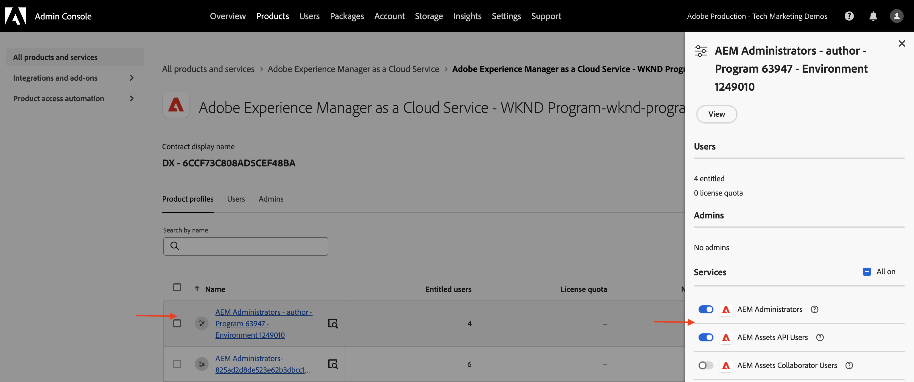

# Credenciais da API e gerenciamento do Perfil do produto

Saiba como gerenciar _Credenciais e Perfil de Produto_ para APIs do AEM baseadas em OpenAPI.

Neste tutorial, você aprenderá a adicionar ou remover:

- _Credenciais_: forneça autenticação para uma API do AEM.
- _Perfis de produto_: forneça permissões (ou autorização) para as credenciais acessarem os recursos do AEM.

## Fundo

Ao usar uma API do AEM, você precisa definir as _Credenciais_ e o _Perfil do Produto_ no projeto do Adobe Developer Console (ou ADC). Na captura de tela a seguir, você pode ver as _Credenciais_ e o _Perfil do Produto_ para uma API de Autor do AEM Assets:

As _Credenciais_ fornecem o mecanismo de autenticação para a API. O _Perfil de Produto_ concede _permissões (ou autorização)_ às credenciais, fornecendo acesso aos recursos do AEM. A solicitação da API pode ser feita em nome de um aplicativo ou usuário.

Um Perfil de Produto está associado a um ou mais _Serviços_. No AEM as a Cloud Service, um _Serviço_ representa grupos de usuários com ACLs (Listas de Controle de Acesso) predefinidas para nós de repositório, permitindo o gerenciamento granular de permissões.

Após a invocação bem-sucedida da API, um usuário que representa a credencial do projeto ADC é criado no serviço do Autor do AEM, juntamente com os grupos de usuários que correspondem à configuração do Perfil de produto e dos Serviços.

No cenário acima, o usuário `1323d2...` é criado no serviço de Autor do AEM e é membro dos grupos de usuários `AEM Assets Collaborator Users - Service` e `AEM Assets Collaborator Users - author - Program XXX - Environment XXX`.

## Adicionar ou remover credenciais

As APIs do AEM são compatíveis com os seguintes tipos de credenciais para autenticação:

1. **OAuth Server-to-Server**: projetado para interações máquina a máquina.
1. **Aplicativo Web OAuth**: projetado para interações orientadas pelo usuário com um servidor back-end em seu aplicativo cliente.
1. **Aplicativo de Página Única do OAuth**: projetado para interações orientadas pelo usuário sem um servidor back-end no aplicativo cliente.

Você pode dar suporte a vários casos de uso usando diferentes tipos de credenciais.

Todas as credenciais são gerenciadas no projeto ADC.

>[!BEGINTABS]

>[!TAB Adicionar credenciais]

Para adicionar credenciais para uma API do AEM, vá para a seção **APIs** do projeto ADC e clique em **Conectar outra credencial**. Em seguida, siga as instruções para o tipo de credencial específico.

>[!TAB Remover credenciais]

Para remover uma credencial de API do AEM, selecione-a na seção **APIs** do projeto ADC e clique em **Excluir credencial**.

>[!ENDTABS]

## Adicionar ou remover perfis de produto

O _Perfil de Produto_ fornece as _permissões (ou autorização)_ às credenciais para acessar os recursos do AEM. As permissões fornecidas pelo _Perfil de Produto_ são baseadas nos _Serviços_ associados ao _Perfil de Produto_. A maioria dos _Serviços_ fornece a permissão _LER_ para os recursos do AEM, por meio dos grupos de usuários na instância do AEM que têm o mesmo nome que o _Serviço_.

Às vezes, as credenciais (também conhecidas como usuário de conta técnica) precisam de permissões adicionais, como _Criar, Atualizar, Excluir_ (CUD) dos recursos do AEM. Nesses casos, você precisa adicionar um novo _Perfil de Produto_ que esteja associado aos _Serviços_ que fornecem as permissões necessárias.

Por exemplo, quando a invocação da API do autor do AEM Assets recebe o erro [403 para solicitações que não sejam da GET](../use-cases/invoke-api-using-oauth-s2s.md#403-error-for-non-get-requests), você pode adicionar **Administradores do AEM - autor - Programa XXX - Ambiente XXX** _Perfil do produto_ para resolver o problema.

>[!CAUTION]
>
>O serviço **Administradores do AEM** fornece acesso administrativo _COMPLETO_ ao Experience Manager. Como alternativa, você pode atualizar as [permissões de serviços](./services-user-group-permission-management.md) para fornecer somente as permissões necessárias.

>[!BEGINTABS]

>[!TAB Adicionar Perfis de Produto]

Para adicionar Perfis de produto para uma API do AEM, clique em **Editar perfis de produto** na seção **APIs** do projeto ADC, selecione o Perfil de Produto desejado na caixa de diálogo **Configurar API** e salve as alterações.

Selecione o Perfil de Produto desejado (por exemplo, **Administradores do AEM - autor - Programa XXX - Ambiente XXX**) associado aos serviços necessários e salve as alterações.

Observe que o **Perfil de Produto de Administradores do AEM - Autor - Programa XXX - Ambiente XXX** está associado ao serviço de **Administradores do AEM** e ao serviço de **Usuários da API AEM Assets**. Sem esse último, o Perfil do produto não aparecerá na lista de Perfis de produto disponíveis.

A solicitação **PATCH** para atualizar os metadados do ativo agora deve funcionar sem problemas.

>[!TAB Remover Perfis de Produto]

Para remover Perfis de Produto de uma API do AEM, clique em **Editar perfis de produto** na seção **APIs** do projeto ADC, desmarque o Perfil de Produto desejado na caixa de diálogo **Configurar API** e salve as alterações.

>[!ENDTABS]

## Resumo

Você aprendeu a alterar o mecanismo de autenticação e as permissões das APIs do AEM usando as _Credenciais e o Perfil do Produto_ no projeto do Adobe Developer Console (ADC).
