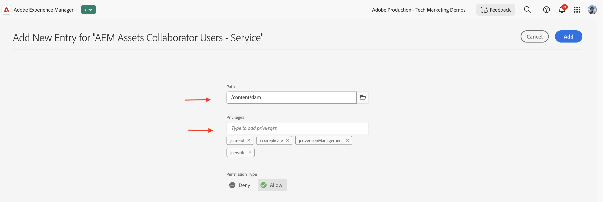

# Gerenciamento de permissões do perfil do produto e do grupo de usuários de Serviços

Saiba como gerenciar permissões para o Perfil de produto e grupos de usuários de serviços no AEM as a Cloud Service.

Neste tutorial, você aprenderá:

- Perfil do produto e sua associação com os serviços.
- Atualização das permissões do grupo de usuários Serviços.

## Fundo

Ao usar uma API do AEM, você precisa atribuir o _Perfil de Produto_ às _Credenciais_ no projeto do Adobe Developer Console (ou ADC). O _Perfil de Produto_ (e o Serviço associado) fornece as _permissões ou autorização_ para as credenciais acessarem os recursos do AEM. Na captura de tela a seguir, você pode ver as _Credenciais_ e o _Perfil do Produto_ para uma API de Autor do AEM Assets:


Um Perfil de Produto está associado a um ou mais _Serviços_. No AEM as a Cloud Service, um _Serviço_ representa grupos de usuários com ACLs (Listas de Controle de Acesso) predefinidas para nós de repositório, permitindo o gerenciamento granular de permissões.


Após a invocação bem-sucedida da API, um usuário que representa a credencial do projeto ADC é criado no serviço do Autor do AEM, juntamente com os grupos de usuários que correspondem à configuração do Perfil de produto e dos Serviços.


No cenário acima, o usuário `1323d2...` é criado no serviço de Autor do AEM e é membro dos grupos de usuários `AEM Assets Collaborator Users - Service` e `AEM Assets Collaborator Users - author - Program XXX - Environment XXX`.

## Permissões do grupo de usuários do Update Services

A maioria dos _Serviços_ fornece a permissão _LER_ para os recursos do AEM, por meio dos grupos de usuários na instância do AEM que têm o mesmo nome que o _Serviço_.

Às vezes, as credenciais (também conhecidas como usuário de conta técnica) precisam de permissões adicionais, como _Criar, Atualizar, Excluir_ (CUD) dos recursos do AEM. Nesses casos, você pode atualizar as permissões dos grupos de usuários _Serviços_ na instância do AEM.

Por exemplo, quando a invocação da API do Autor do AEM Assets recebe um erro [403 para solicitações que não são da GET](../use-cases/invoke-api-using-oauth-s2s.md#403-error-for-non-get-requests), você pode atualizar as permissões do grupo de usuários _Usuários do AEM Assets Collaborator - Serviço_ na instância do AEM.

Usando a interface de usuário de permissões ou o script de [Inicialização do Repositório do Sling](https://sling.apache.org/documentation/bundles/repository-initialization.html), você pode atualizar as permissões dos grupos de usuários predefinidos na instância do AEM.

### Atualizar permissões usando a interface do usuário de permissões

Para atualizar as permissões do grupo de usuários de serviços (por exemplo, `AEM Assets Collaborator Users - Service`) usando a interface de usuário permissões, siga estas etapas:

- Navegue até **Ferramentas** > **Segurança** > **Permissões** na instância do AEM.

- Procure o grupo de usuários de serviços (por exemplo, `AEM Assets Collaborator Users - Service`).

  

- Clique em **Adicionar ACE** para adicionar uma nova Entrada de Controle de Acesso (ACE) para o grupo de usuários.

  

### Atualizar permissões usando o script de inicialização do repositório

Para atualizar as permissões do grupo de usuários de serviços (por exemplo, `AEM Assets Collaborator Users - Service`) usando o script de inicialização de repositório, siga estas etapas:

- Abra o projeto AEM em seu IDE favorito.

- Navegar até o módulo `ui.config`

- Crie um arquivo em `ui.config/src/main/content/jcr_root/apps/<PROJECT-NAME>/osgiconfig/config.author` com o nome `org.apache.sling.jcr.repoinit.RepositoryInitializer-services-group-acl-update.cfg.json`, com o seguinte conteúdo:

  ```json
  {
      "scripts": [
          "set ACL for \"AEM Assets Collaborator Users - Service\" (ACLOptions=ignoreMissingPrincipal)",
          "    allow jcr:read,jcr:versionManagement,crx:replicate,rep:write on /content/dam",
          "end"
      ]
  }
  ```

- Confirme e envie as alterações para o repositório.

- Implante as alterações na instância do AEM usando o [pipeline de pilha completa do Cloud Manager](https://experienceleague.adobe.com/pt-br/docs/experience-manager-cloud-service/content/implementing/using-cloud-manager/cicd-pipelines/introduction-ci-cd-pipelines#full-stack-pipeline).

- Você também pode verificar as permissões do grupo de usuários usando a exibição **Permissões**. Navegue até **Ferramentas** > **Segurança** > **Permissões** na instância do AEM.

  

### Verificar as permissões

Depois de atualizar as permissões usando qualquer um dos métodos acima, a solicitação do PATCH para atualizar os metadados do ativo agora deve funcionar sem problemas.


## Resumo

Você aprendeu a gerenciar permissões para o Perfil do produto e grupos de usuários de Serviços no AEM as a Cloud Service. Você pode atualizar as permissões dos grupos de usuários de serviços na instância do AEM usando a interface de usuário de permissões ou o script de inicialização do repositório.
