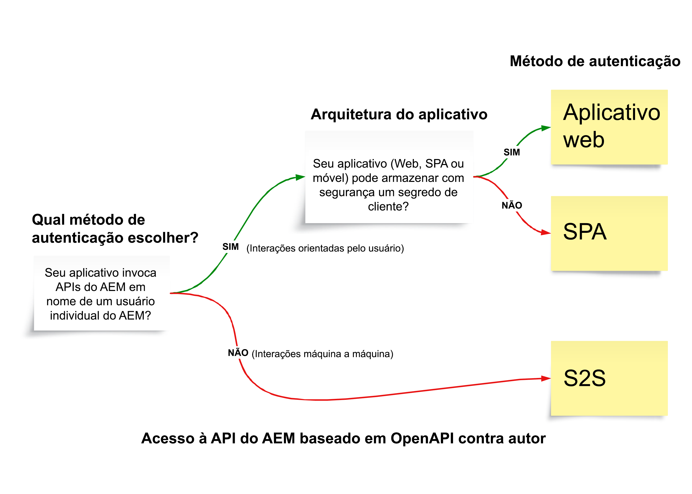

# APIs do AEM baseadas na OpenAPI

>[!IMPORTANT]
>
>As APIs do AEM baseadas na OpenAPI só estão disponíveis no AEM as a Cloud Service e não são compatíveis com o AEM 6.X.

Saiba mais sobre as APIs do AEM baseadas na OpenAPI, incluindo autenticações compatíveis, conceitos principais e como acessar APIs da Adobe.

A [Especificação da OpenAPI](https://swagger.io/specification/) (anteriormente conhecida como Swagger) é um padrão amplamente usado para definir APIs RESTful. O AEM as a Cloud Service fornece várias APIs baseadas na especificação OpenAPI (ou simplesmente APIs do AEM baseadas na OpenAPI), facilitando a criação de aplicativos personalizados que interagem com os tipos de serviço de criação ou publicação do AEM. Confira abaixo alguns exemplos:

**Sites**

- [APIs de sites](https://developer.adobe.com/experience-cloud/experience-manager-apis/api/stable/sites/): APIs para trabalhar com fragmentos de conteúdo.

**Ativos**

- [API de pastas](https://developer.adobe.com/experience-cloud/experience-manager-apis/api/experimental/folders/): APIs para trabalhar com pastas, como criar, listar e excluir pastas.

- [API de criação de ativos](https://developer.adobe.com/experience-cloud/experience-manager-apis/api/experimental/assets/author/): APIs para trabalhar com ativos e seus metadados.

**Formulários**

- [APIs de comunicações de formulários](https://developer.adobe.com/experience-cloud/experience-manager-apis/api/experimental/document/): APIs para trabalhar com formulários e documentos.

Em versões futuras, mais APIs do AEM baseadas na OpenAPI serão adicionadas para permitir casos de uso adicionais.

## Autenticação compatível{#authentication-support}

As APIs do AEM baseadas na OpenAPI são compatíveis com a autenticação OAuth 2.0, incluindo os seguintes tipos de concessão:

- **Credencial OAuth de servidor para servidor**: ideal para serviços de back-end que precisam de acesso à API sem interação com o usuário. Ela usa o tipo de concessão _client_credentials_, permitindo um gerenciamento de acesso seguro na camada do servidor. Para mais informações, consulte [Credencial OAuth de servidor para servidor](https://developer.adobe.com/developer-console/docs/guides/authentication/ServerToServerAuthentication/#oauth-server-to-server-credential).

- **Credencial OAuth para aplicativos web**: adequada para aplicativos web com componentes de front-end e _back-end_ que acessam as APIs do AEM em nome dos usuários. Ela usa o tipo de concessão _authorization_code_, com a qual o servidor de back-end gerencia segredos e tokens de forma segura. Para mais informações, consulte [Credencial OAuth para aplicativos web](https://developer.adobe.com/developer-console/docs/guides/authentication/UserAuthentication/implementation#oauth-web-app-credential).

- **Credencial OAuth para aplicativos de página única**: projetada para aplicativos de página única (SPAs) em execução no navegador que precisam acessar APIs em nome de um usuário sem um servidor de back-end. Ela usa o tipo de concessão _authorization_code_ e depende de mecanismos de segurança do lado do cliente que utilizam uma PKCE (chave de prova para troca de código) para proteger o fluxo do código de autorização. Para mais informações, consulte [Credencial OAuth para aplicativos de página única](https://developer.adobe.com/developer-console/docs/guides/authentication/UserAuthentication/implementation#oauth-single-page-app-credential).

## Qual método de autenticação usar{#auth-method-decision}

Ao decidir qual método de autenticação usar, considere o seguinte:

A autenticação do usuário (no aplicativo web ou aplicativo de página única) deve ser a opção padrão sempre que o contexto do usuário do AEM estiver envolvido. Isso garante que todas as ações no repositório sejam corretamente atribuídas ao usuário autenticado e que o usuário seja restrito somente às permissões às quais tem direito.
O uso do sistema de servidor para servidor (ou conta de sistema técnico) para executar ações em nome de um usuário individual ignora o modelo de segurança e traz riscos, como escalonamento de privilégios e auditorias imprecisas.

## Diferença entre credenciais OAuth de servidor para servidor, para aplicativos web e para aplicativos de página única{#difference-between-oauth-server-to-server-vs-web-app-vs-single-page-app-credentials}

A tabela a seguir resume as diferenças entre os três métodos de autenticação OAuth compatíveis com as APIs do AEM baseadas na OpenAPI:

|  | OAuth de servidor para servidor | Aplicativo Web OAuth | OAuth para aplicativos de página única (SPA) |
| --- | --- | --- | --- |
| **Finalidade da autenticação** | Projetado para interações entre computadores. | Projetado para interações orientadas pelo usuário em um aplicativo web com um _back-end_. | Projetado para interações orientadas pelo usuário em um _aplicativo JavaScript do lado do cliente_. |
| **Comportamento do token** | Emite tokens de acesso que representam o próprio aplicativo cliente. | Emite tokens de acesso em nome de um usuário autenticado _via back-end_. | Emite tokens de acesso em nome de um usuário autenticado _por meio de um fluxo somente de front-end_. |
| **Casos de uso** | Serviços de back-end que precisam de acesso à API sem interação com o usuário. | Aplicativos web com componentes de front-end e back-end que acessam APIs em nome dos usuários. | Aplicativos somente de front-end (JavaScript) que acessam APIs em nome de usuários sem um back-end. |
| **Considerações sobre segurança** | Armazene credenciais confidenciais (`client_id`, `client_secret`) com segurança em sistemas back-end. | Após a autenticação do usuário, ele(a) recebe seu próprio _token de acesso temporário por meio de uma chamada de back-end_. Armazene com segurança as credenciais confidenciais (`client_id`, `client_secret`) nos sistemas de back-end para trocar o código de autorização pelo token de acesso. | Após a autenticação do usuário, ele(a) recebe seu próprio _token de acesso temporário por meio de uma chamada de front-end_. Não usa `client_secret`, pois não é seguro armazenar em aplicativos front-end. Depende da PKCE para trocar o código de autorização por um token de acesso. |
| **Tipo de concessão** | _client_credentials_ | _authorization_code_ | _authorization_code_ com **PKCE** |
| **Tipo de credencial do Adobe Developer Console** | OAuth de servidor para servidor | Aplicativo Web OAuth | OAuth para aplicativos de página única |
| **Tutorial** | [Invocar API usando a autenticação de servidor para servidor](./use-cases/invoke-api-using-oauth-s2s.md) | [Invocar API usando a autenticação de aplicativo web](./use-cases/invoke-api-using-oauth-web-app.md) | [Invocar API usando a autenticação de aplicativo de página única](./use-cases/invoke-api-using-oauth-single-page-app.md) |

## Acesso às APIs da Adobe e conceitos relacionados{#accessing-adobe-apis-and-related-concepts}

Antes de acessar as APIs da Adobe, é essencial compreender estes conceitos principais:

- **[Adobe Developer Console](https://developer.adobe.com/)**: o hub de desenvolvimento para acessar APIs, SDKs, eventos em tempo real, funções sem servidor da Adobe e muito mais. Observe que ele é diferente do Developer Console do _AEM_, que é usado para depurar aplicativos do AEM.

- **[Projeto do Adobe Developer Console](https://developer.adobe.com/developer-console/docs/guides/projects/)**: local central para gerenciar integrações de API, eventos e funções de tempo de execução. Aqui é possível configurar APIs, definir a autenticação e gerar as credenciais necessárias.

- **[Perfis de produto](https://helpx.adobe.com/br/enterprise/using/manage-product-profiles.html)**: os perfis de produto fornecem uma predefinição de permissão que permite controlar o acesso do usuário ou do aplicativo a produtos da Adobe, como o AEM, Adobe Target, Adobe Analytics, entre outros. Todos os produtos da Adobe têm perfis de produto predefinidos associados.

- **Serviços**: definem as permissões reais e estão associados ao perfil de produto. Para reduzir ou aumentar a predefinição de permissões, é possível desmarcar ou selecionar os serviços associados ao perfil do produto. Dessa forma, você pode controlar o nível de acesso ao produto e suas APIs. No AEM as a Cloud Service, os serviços representam grupos de usuários com listas de controle de acesso (ACLs) predefinidas para nós de repositório, permitindo o gerenciamento granular de permissões.

## Introdução

Saiba como configurar seu ambiente do AEM as a Cloud Service e um projeto do Adobe Developer Console para habilitar o acesso às APIs do AEM baseadas em OpenAPI. Também é possível acessar a API do AEM usando o navegador para verificar a configuração e revisar a solicitação e a resposta.

<!-- CARDS
{target = _self}

* ./setup.md
  {title = Set up OpenAPI-based AEM APIs}
  {description = Learn how to set up your AEM as a Cloud Service environment to enable access to the OpenAPI-based AEM APIs.}
  {image = ./assets/setup/OpenAPI-Setup.png}
-->
<!-- START CARDS HTML - DO NOT MODIFY BY HAND -->

    

        

            

                <figure class="image x-is-16by9">
                    
                </figure>
            

            

                

                    

                        <a href="./setup.md" target="_self" rel="referrer" title="Configurar APIs do AEM baseadas em OpenAPI">Configurar APIs do AEM baseadas em OpenAPI</a>
                    

                    
Saiba como configurar o ambiente do AEM as a Cloud Service para habilitar o acesso às APIs do AEM baseadas em OpenAPI.

                

                <a href="./setup.md" target="_self" rel="referrer" class="spectrum-Button spectrum-Button--outline spectrum-Button--primary spectrum-Button--sizeM" style="align-self: flex-start; margin-top: 1rem;">
                    Saiba mais
                </a>
            

        

    

<!-- END CARDS HTML - DO NOT MODIFY BY HAND -->

## Tutoriais sobre APIs

Saiba como usar as APIs do AEM baseadas em OpenAPI, usando diferentes métodos de autenticação por OAuth:

<!-- CARDS
{target = _self}

* ./use-cases/invoke-api-using-oauth-s2s.md
  {title = Invoke API using Server-to-Server authentication}
  {description = Learn how to invoke OpenAPI-based AEM APIs from a custom NodeJS application using OAuth Server-to-Server authentication.}
  {image = ./assets/s2s/OAuth-S2S.png}
* ./use-cases/invoke-api-using-oauth-web-app.md
  {title = Invoke API using Web App authentication}
  {description = Learn how to invoke OpenAPI-based AEM APIs from a custom web application using OAuth Web App authentication.}
  {image = ./assets/web-app/OAuth-WebApp.png}
* ./use-cases/invoke-api-using-oauth-single-page-app.md
  {title = Invoke API using Single Page App authentication}
  {description = Learn how to invoke OpenAPI-based AEM APIs from a custom Single Page App (SPA) using OAuth Single Page App authentication.}
  {image = ./assets/spa/OAuth-SPA.png}  
-->
<!-- START CARDS HTML - DO NOT MODIFY BY HAND -->

    

        

            

                <figure class="image x-is-16by9">
                    
                </figure>
            

            

                

                    

                        <a href="./use-cases/invoke-api-using-oauth-s2s.md" target="_self" rel="referrer" title="Invocar API com autenticação de servidor para servidor">Invocar API com autenticação de servidor para servidor</a>
                    

                    
Saiba como invocar as APIs do AEM baseadas em OpenAPI de um aplicativo NodeJS personalizado por meio da autenticação OAuth de servidor para servidor.

                

                <a href="./use-cases/invoke-api-using-oauth-s2s.md" target="_self" rel="referrer" class="spectrum-Button spectrum-Button--outline spectrum-Button--primary spectrum-Button--sizeM" style="align-self: flex-start; margin-top: 1rem;">
                    Saiba mais
                </a>
            

        

    

    

        

            

                <figure class="image x-is-16by9">
                    
                </figure>
            

            

                

                    

                        <a href="./use-cases/invoke-api-using-oauth-web-app.md" target="_self" rel="referrer" title="Invocar API com autenticação para aplicativos web">Invocar API com autenticação para aplicativos web</a>
                    

                    
Saiba como invocar as APIs do AEM baseadas em OpenAPI de um aplicativo web personalizado por meio da autenticação OAuth para aplicativos web.

                

                <a href="./use-cases/invoke-api-using-oauth-web-app.md" target="_self" rel="referrer" class="spectrum-Button spectrum-Button--outline spectrum-Button--primary spectrum-Button--sizeM" style="align-self: flex-start; margin-top: 1rem;">
                    Saiba mais
                </a>
            

        

    

    

        

            

                <figure class="image x-is-16by9">
                    
                </figure>
            

            

                

                    

                        <a href="./use-cases/invoke-api-using-oauth-single-page-app.md" target="_self" rel="referrer" title="Invocar API com autenticação para aplicativos de página única">Invocar API com autenticação para aplicativos de página única</a>
                    

                    
Saiba como invocar as APIs do AEM baseadas em OpenAPI de um aplicativo de página única (SPA) personalizado por meio da autenticação OAuth para aplicativos de página única.

                

                <a href="./use-cases/invoke-api-using-oauth-single-page-app.md" target="_self" rel="referrer" class="spectrum-Button spectrum-Button--outline spectrum-Button--primary spectrum-Button--sizeM" style="align-self: flex-start; margin-top: 1rem;">
                    Saiba mais
                </a>
            

        

    

<!-- END CARDS HTML - DO NOT MODIFY BY HAND -->
