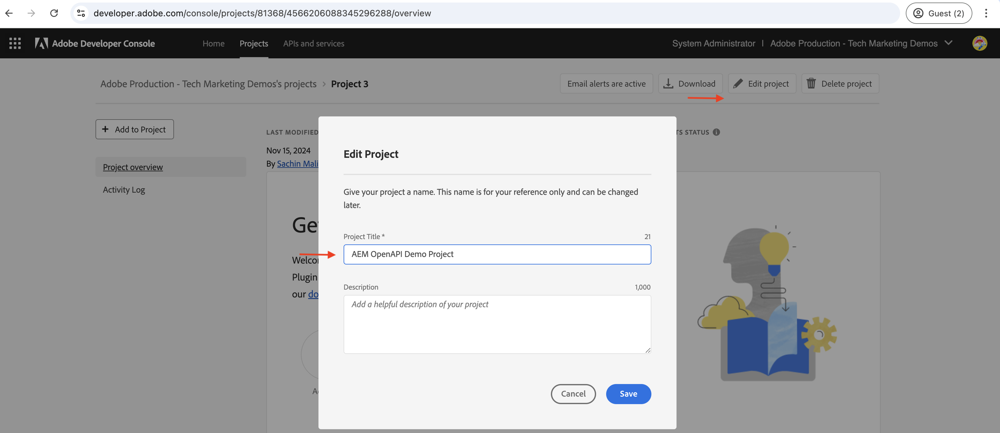
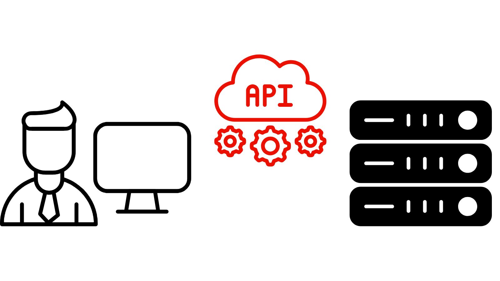

# Configurar APIs do AEM baseadas em OpenAPI

Saiba como configurar o ambiente do AEM as a Cloud Service para habilitar o acesso às APIs do AEM baseadas em OpenAPI.

>[!AVAILABILITY]
>
>As APIs do AEM baseadas em OpenAPI estão disponíveis como parte de um programa de acesso antecipado. Se você estiver interessado em acessá-las, recomendamos enviar um email para [aem-apis@adobe.com](mailto:aem-apis@adobe.com) com uma descrição do seu caso de uso.

>[!VIDEO](https://video.tv.adobe.com/v/3457510?quality=12&learn=on)


O processo de configuração de alto nível envolve as seguintes etapas:

1. Modernização do ambiente do AEM as a Cloud Service.
1. Ative o acesso às APIs do AEM.
1. Criar projeto do Adobe Developer Console (ADC).
1. Configurar projeto ADC.
1. Configure a instância do AEM para habilitar a comunicação do Projeto ADC.

## Modernização do ambiente do AEM as a Cloud Service{#modernization-of-aem-as-a-cloud-service-environment}

A modernização do ambiente do AEM as a Cloud Service é uma atividade única por ambiente que envolve as seguintes etapas:

- Atualize para o AEM versão **2024.10.18459.20241031T210302Z** ou posterior.
- Adicione novos Perfis de produto a ele se o ambiente tiver sido criado antes da versão 2024.10.18459.20241031T210302Z.

### Atualizar instância do AEM{#update-aem-instance}

Para atualizar a instância do AEM, na seção _Ambientes_ do Adobe [Cloud Manager](https://my.cloudmanager.adobe.com/), selecione o ícone _reticências_ ao lado do nome do ambiente e selecione a opção **Atualizar**.


Em seguida, clique no botão **Enviar** e execute o Pipeline de Pilha Completa _sugerido_.


No meu caso, o Pipeline de Pilha Completa é nomeado como **Dev :: Fullstack-Deploy**, e o ambiente do AEM é chamado **wknd-program-dev**. Seus nomes podem ser diferentes.

### Adicionar novos perfis de produto{#add-new-product-profiles}

Para adicionar novos Perfis de produto à instância do AEM, na seção _Ambientes_ do Adobe [Cloud Manager](https://my.cloudmanager.adobe.com/), selecione o ícone _reticências_ ao lado do nome do ambiente e selecione a opção **Adicionar Perfis de Produto**.


Você pode revisar os Perfis de Produtos recém-adicionados clicando no ícone _reticências_ ao lado do nome do ambiente e selecionando **Gerenciar Acesso** > **Perfis de Autores**.

A janela _Admin Console_ exibe os Perfis de Produto adicionados recentemente.


As etapas acima concluem a modernização do ambiente do AEM as a Cloud Service.

## Habilitar o acesso às APIs do AEM{#enable-aem-apis-access}

A presença dos _novos Perfis de produto_ habilita o acesso à API do AEM com base em OpenAPI no Adobe Developer Console (ADC). Lembre-se de que o [Adobe Developer Console (ADC)](./overview.md#accessing-adobe-apis-and-related-concepts) é o hub do desenvolvedor para acessar APIs, SDKs, eventos em tempo real, funções sem servidor da Adobe e muito mais.

Os Perfis de Produto adicionados recentemente estão associados aos _Serviços_ que representam os _grupos de usuários da AEM com ACLs (Listas de Controle de Acesso) predefinidas_. Os _Serviços_ são usados para controlar o nível de acesso às APIs do AEM.

Você também pode marcar ou desmarcar os _Serviços_ associados ao Perfil de Produto para reduzir ou aumentar o nível de acesso.

Revise a associação clicando no ícone _Exibir Detalhes_ ao lado do nome do Perfil do Produto.


Por padrão, o **Serviço de Usuários da API do AEM Assets** não está associado a nenhum Perfil de Produto. Vamos associá-lo aos **Usuários do AEM Assets Collaborator recentemente adicionados - autor - Programa XXX - Ambiente XXX** Perfil do produto. Após essa associação, a _API do Autor de Ativos_ do ADC Project pode configurar a autenticação de Servidor para Servidor desejada e associar a conta de autenticação do projeto ADC (criada na próxima etapa) ao Perfil do Produto.


>[!IMPORTANT]
>
>A etapa acima é crítica para habilitar a autenticação de servidor para servidor para a API do AEM Assets. Sem essa associação, a API do AEM Assets não pode ser usada com o método de autenticação de servidor para servidor.

## Criar projeto do Adobe Developer Console (ADC){#adc-project}

O projeto ADC é usado para adicionar as APIs desejadas, configurar sua autenticação e associar a conta de autenticação ao Perfil do produto.

Para criar um projeto ADC:

1. Faça logon no [Adobe Developer Console](https://developer.adobe.com/console) usando sua Adobe ID.

   

1. Na seção _Início Rápido_, clique no botão **Criar novo projeto**.

   

1. Ele cria um novo projeto com o nome padrão.

   

1. Edite o nome do projeto clicando no botão **Editar projeto** no canto superior direito. Forneça um nome significativo e clique em **Salvar**.

   

## Configurar projeto ADC{#configure-adc-project}

Depois de criar o projeto ADC, é necessário adicionar as APIs do AEM desejadas, configurar sua autenticação e associar a conta de autenticação ao Perfil do produto.

1. Para adicionar APIs do AEM, clique no botão **Adicionar API**.

   

1. Na caixa de diálogo _Adicionar API_, filtre por _Experience Cloud_ e selecione a API do AEM desejada. Por exemplo, neste caso, a _API do autor do ativo_ está selecionada.

   

1. Em seguida, na caixa de diálogo _Configurar API_, selecione a opção de autenticação desejada. Por exemplo, neste caso, a opção de autenticação **Servidor para Servidor** está selecionada.

   

   A autenticação de servidor para servidor é ideal para serviços de back-end que precisam de acesso à API sem interação com o usuário. As opções de autenticação Aplicativo Web e Aplicativo de página única são adequadas para aplicativos que precisam de acesso à API em nome dos usuários. Consulte [Diferença entre credenciais de Servidor para Servidor do OAuth vs. Aplicativo Web vs. Aplicativo de Página Única](./overview.md#difference-between-oauth-server-to-server-vs-web-app-vs-single-page-app-credentials) para obter mais informações.

1. Se necessário, é possível renomear a API para facilitar a identificação. Para fins de demonstração, o nome padrão é usado.

   

1. Nesse caso, o método de autenticação é **Servidor a Servidor OAuth**, portanto, você precisa associar a conta de autenticação ao Perfil do Produto. Selecione o **Perfil de Produto Usuários do AEM Assets Collaborator - autor - Programa XXX - Ambiente XXX** e clique em **Salvar**.

   

1. Revise a API do AEM e a configuração de autenticação.

   

   

Se você escolher o método de autenticação do **Aplicativo Web OAuth** ou do **Aplicativo de Página Única** do OAuth, a associação do Perfil de Produto não será solicitada, mas o URI de redirecionamento do aplicativo será necessário. O URI de redirecionamento do aplicativo é usado para redirecionar o usuário para o aplicativo após a autenticação com um código de autorização. Os tutoriais de casos de uso relevantes descrevem essas configurações específicas de autenticação.

## Configure a instância do AEM para habilitar a comunicação do Projeto ADC{#configure-aem-instance}

Para habilitar a ClientID do projeto ADC para comunicação com a instância do AEM, é necessário configurar a instância do AEM.

Isso é feito definindo a configuração da API no arquivo `config.yaml` de
o projeto do AEM e implantá-lo usando o Pipeline de configuração na Cloud Manager.

1. No AEM Project, localize ou crie o arquivo `config.yaml` da pasta `config`.

   

1. Adicione a configuração a seguir ao arquivo `config.yaml`.

   ```yaml
   kind: "API"
   version: "1.0"
   metadata: 
       envTypes: ["dev", "stage", "prod"]
   data:
       allowedClientIDs:
           author:
           - "<ADC Project's Credentials ClientID>"
   ```

   Substitua `<ADC Project's Credentials ClientID>` pela ClientID real do valor de Credenciais do Projeto ADC. O ponto de extremidade de API usado neste tutorial está disponível somente na camada do autor, mas para outras APIs, a configuração yaml também pode ter um nó _publicar_ ou _visualizar_.

   >[!CAUTION]
   >
   > Para fins de demonstração, a mesma ClientID é usada para todos os ambientes. É recomendável usar uma ID do cliente separada por ambiente (desenvolvimento, preparo, produção) para melhorar a segurança e o controle.

1. Confirme as alterações de configuração e envie as alterações para o repositório Git remoto ao qual o pipeline do Cloud Manager está conectado.

1. Implante as alterações acima usando o Pipeline de configuração no Cloud Manager. Observe que o arquivo `config.yaml` também pode ser instalado em um RDE, usando ferramentas de linha de comando.

   

## Próximas etapas

Depois que a instância do AEM for configurada para habilitar a comunicação do Projeto ADC, você poderá começar a usar as APIs do AEM baseadas em OpenAPI. Saiba como usar as APIs do AEM baseadas em OpenAPI usando diferentes métodos de autenticação OAuth:

<!-- CARDS
{target = _self}

* ./use-cases/invoke-api-using-oauth-s2s.md
  {title = Invoke API using Server-to-Server authentication}
  {description = Learn how to invoke OpenAPI-based AEM APIs from a custom NodeJS application using OAuth Server-to-Server authentication.}
  {image = ./assets/s2s/OAuth-S2S.png}
* ./use-cases/invoke-api-using-oauth-web-app.md
  {title = Invoke API using Web App authentication}
  {description = Learn how to invoke OpenAPI-based AEM APIs from a custom web application using OAuth Web App authentication.}
  {image = ./assets/web-app/OAuth-WebApp.png}
* ./use-cases/invoke-api-using-oauth-single-page-app.md
  {title = Invoke API using Single Page App authentication}
  {description = Learn how to invoke OpenAPI-based AEM APIs from a custom Single Page App (SPA) using OAuth 2.0 PKCE flow.}
  {image = ./assets/spa/OAuth-SPA.png}  
-->
<!-- START CARDS HTML - DO NOT MODIFY BY HAND -->
<div class="columns">
    <div class="column is-half-tablet is-half-desktop is-one-third-widescreen" aria-label="Invoke API using Server-to-Server authentication">
        <div class="card" style="height: 100%; display: flex; flex-direction: column; height: 100%;">
            <div class="card-image">
                <figure class="image x-is-16by9">
                    <a href="./use-cases/invoke-api-using-oauth-s2s.md" title="Chamar API usando autenticação de servidor para servidor" target="_self" rel="referrer">
                        
                    </a>
                </figure>
            </div>
            <div class="card-content is-padded-small" style="display: flex; flex-direction: column; flex-grow: 1; justify-content: space-between;">
                <div class="top-card-content">
                    <p class="headline is-size-6 has-text-weight-bold">
                        <a href="./use-cases/invoke-api-using-oauth-s2s.md" target="_self" rel="referrer" title="Chamar API usando autenticação de servidor para servidor">Invocar API usando autenticação de Servidor para Servidor</a>
                    </p>
                    <p class="is-size-6">Saiba como chamar APIs do AEM baseadas em OpenAPI de um aplicativo NodeJS personalizado usando a autenticação de servidor para servidor do OAuth.</p>
                </div>
                <a href="./use-cases/invoke-api-using-oauth-s2s.md" target="_self" rel="referrer" class="spectrum-Button spectrum-Button--outline spectrum-Button--primary spectrum-Button--sizeM" style="align-self: flex-start; margin-top: 1rem;">
                    <span class="spectrum-Button-label has-no-wrap has-text-weight-bold">Saiba mais</span>
                </a>
            </div>
        </div>
    </div>
    <div class="column is-half-tablet is-half-desktop is-one-third-widescreen" aria-label="Invoke API using Web App authentication">
        <div class="card" style="height: 100%; display: flex; flex-direction: column; height: 100%;">
            <div class="card-image">
                <figure class="image x-is-16by9">
                    <a href="./use-cases/invoke-api-using-oauth-web-app.md" title="Chamar API usando autenticação do Aplicativo Web" target="_self" rel="referrer">
                        
                    </a>
                </figure>
            </div>
            <div class="card-content is-padded-small" style="display: flex; flex-direction: column; flex-grow: 1; justify-content: space-between;">
                <div class="top-card-content">
                    <p class="headline is-size-6 has-text-weight-bold">
                        <a href="./use-cases/invoke-api-using-oauth-web-app.md" target="_self" rel="referrer" title="Chamar API usando autenticação do Aplicativo Web">Invocar API usando autenticação de Aplicativo Web</a>
                    </p>
                    <p class="is-size-6">Saiba como chamar APIs do AEM baseadas em OpenAPI de um aplicativo web personalizado usando a autenticação do OAuth Web App.</p>
                </div>
                <a href="./use-cases/invoke-api-using-oauth-web-app.md" target="_self" rel="referrer" class="spectrum-Button spectrum-Button--outline spectrum-Button--primary spectrum-Button--sizeM" style="align-self: flex-start; margin-top: 1rem;">
                    <span class="spectrum-Button-label has-no-wrap has-text-weight-bold">Saiba mais</span>
                </a>
            </div>
        </div>
    </div>
    <div class="column is-half-tablet is-half-desktop is-one-third-widescreen" aria-label="Invoke API using Single Page App authentication">
        <div class="card" style="height: 100%; display: flex; flex-direction: column; height: 100%;">
            <div class="card-image">
                <figure class="image x-is-16by9">
                    <a href="./use-cases/invoke-api-using-oauth-single-page-app.md" title="Chamar API usando autenticação de aplicativo de página única" target="_self" rel="referrer">
                        
                    </a>
                </figure>
            </div>
            <div class="card-content is-padded-small" style="display: flex; flex-direction: column; flex-grow: 1; justify-content: space-between;">
                <div class="top-card-content">
                    <p class="headline is-size-6 has-text-weight-bold">
                        <a href="./use-cases/invoke-api-using-oauth-single-page-app.md" target="_self" rel="referrer" title="Chamar API usando autenticação de aplicativo de página única">Invocar API usando autenticação de Aplicativo de Página Única</a>
                    </p>
                    <p class="is-size-6">Saiba como chamar APIs do AEM baseadas em OpenAPI de um aplicativo de página única (SPA) personalizado usando o fluxo de PKCE do OAuth 2.0.</p>
                </div>
                <a href="./use-cases/invoke-api-using-oauth-single-page-app.md" target="_self" rel="referrer" class="spectrum-Button spectrum-Button--outline spectrum-Button--primary spectrum-Button--sizeM" style="align-self: flex-start; margin-top: 1rem;">
                    <span class="spectrum-Button-label has-no-wrap has-text-weight-bold">Saiba mais</span>
                </a>
            </div>
        </div>
    </div>
</div>
<!-- END CARDS HTML - DO NOT MODIFY BY HAND -->
