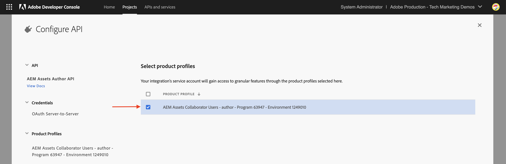
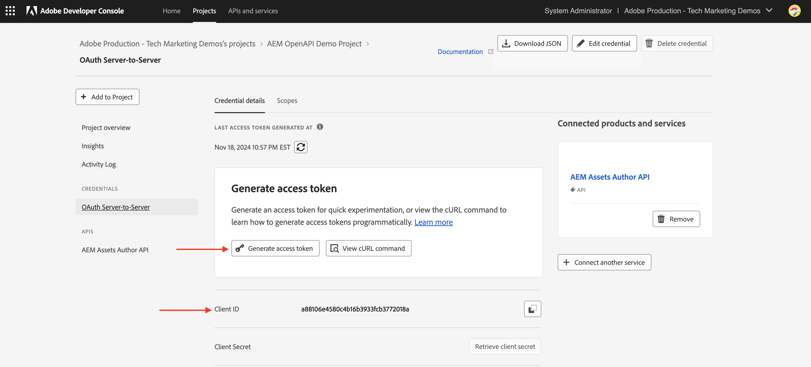

# Chamar APIs do AEM baseadas em OpenAPI usando a autenticação de servidor para servidor OAuth

Saiba como invocar APIs do AEM baseadas em OpenAPI no AEM as a Cloud Service a partir de aplicativos personalizados usando a autenticação de _servidor para servidor do OAuth_.

A autenticação de servidor para servidor OAuth é ideal para serviços de back-end que precisam de acesso à API sem interação com o usuário. Ele usa o tipo de concessão OAuth 2.0 _client_credentials_ para autenticar o aplicativo cliente.

## O que você aprenderá{#what-you-learn}

Neste tutorial, você aprenderá a:

- Configure um projeto do Adobe Developer Console (ADC) para acessar a API do Assets Author usando a _autenticação de Servidor para Servidor do OAuth_.

- Desenvolva um aplicativo NodeJS de amostra que chame a API do autor do Assets para recuperar metadados de um ativo específico.

Antes de começar, verifique se você revisou o seguinte:

- [Seção Acessando APIs do Adobe e conceitos relacionados](../overview.md#accessing-adobe-apis-and-related-concepts).
- [Artigo sobre as APIs do AEM baseadas em OpenAPI](../setup.md).

## Pré-requisitos

Para concluir este tutorial, você precisa:

- Ambiente AEM as a Cloud Service modernizado com o seguinte:
   - Versão do AEM `2024.10.18459.20241031T210302Z` ou posterior.
   - Novos perfis de produto de estilo (se o ambiente tiver sido criado antes de novembro de 2024)

  Consulte o artigo [Configurar APIs do AEM baseadas em OpenAPI](../setup.md) para obter mais detalhes.

- O projeto [WKND Sites](https://github.com/adobe/aem-guides-wknd?#aem-wknd-sites-project) de amostra deve ser implantado nele.

- Acesso à [Adobe Developer Console](https://developer.adobe.com/developer-console/docs/guides/getting-started).

- Instale o [Node.js](https://nodejs.org/pt) no computador local para executar o aplicativo NodeJS de amostra.

## Etapas de desenvolvimento

As etapas de desenvolvimento de alto nível são:

1. Configurar projeto ADC
   1. Adicionar a API do autor do Assets
   1. Configurar seu método de autenticação como OAuth Server-to-Server
   1. Associar o perfil de produto à configuração de autenticação
1. Configure a instância do AEM para habilitar a comunicação do Projeto ADC
1. Desenvolver um aplicativo NodeJS de amostra
1. Verificar o fluxo de ponta a ponta

## Configurar projeto ADC

A etapa de configuração do Projeto ADC é _repetida_ das [APIs do AEM baseadas em OpenAPI de Instalação](../setup.md). É repetido adicionar a API do autor do Assets e configurar seu método de autenticação como servidor para servidor OAuth.

>[!TIP]
>
>Verifique se você concluiu a etapa **Habilitar acesso às APIs do AEM** do artigo [Configurar APIs do AEM baseadas em OpenAPI](../setup.md#enable-aem-apis-access). Sem ela, a opção de autenticação de servidor para servidor não está disponível.


1. No [Adobe Developer Console](https://developer.adobe.com/console/projects), abra o projeto desejado.

1. Para adicionar APIs do AEM, clique no botão **Adicionar API**.

   

1. Na caixa de diálogo _Adicionar API_, filtre por _Experience Cloud_, selecione o cartão **API do AEM Assets Author** e clique em **Avançar**.
Se você precisar de uma API do AEM baseada em OpenAPI diferente, consulte a [Documentação do Adobe Developer](https://developer.adobe.com/experience-cloud/experience-manager-apis/#openapi-based-apis) para encontrar aquela que corresponde ao seu caso de uso.

   O exemplo abaixo aborda a adição da **API do AEM Assets Author**.

   

   >[!TIP]
   >
   >Se o **cartão de API do AEM** desejado estiver desabilitado e _Por que isso está desabilitado?As informações do_ mostram a mensagem **Licença necessária**, uma das razões pode ser que você NÃO tenha modernizado seu ambiente do AEM as a Cloud Service. Consulte [Modernização do ambiente do AEM as a Cloud Service](../setup.md#modernization-of-aem-as-a-cloud-service-environment) para obter mais informações.

1. Em seguida, na caixa de diálogo _Configurar API_, selecione a opção de autenticação de **Servidor para Servidor** e clique em **Avançar**. A autenticação de servidor para servidor é ideal para serviços de back-end que precisam de acesso à API sem interação com o usuário.

   

   >[!TIP]
   >
   >Se você não vir a opção de autenticação de servidor para servidor, significa que o usuário que está configurando a integração não é adicionado como Desenvolvedor ao Perfil do produto ao qual o Serviço está associado. Consulte [Habilitar autenticação de Servidor para Servidor](../setup.md#enable-server-to-server-authentication) para obter mais informações.

1. Renomeie a credencial para facilitar a identificação (se necessário) e clique em **Avançar**. Para fins de demonstração, o nome padrão é usado.

   

1. Selecione o **Perfil de Produto Usuários do AEM Assets Collaborator - autor - Programa XXX - Ambiente XXX** e clique em **Salvar**. Como você pode ver, somente o Perfil de produto associado ao Serviço de usuários da API do AEM Assets está disponível para seleção.

   

1. Revise a API do AEM e a configuração de autenticação.

   

   

## Configurar instância do AEM para habilitar a comunicação do Projeto ADC

Siga as instruções do artigo [Configurar APIs do AEM baseadas em OpenAPI](../setup.md#configure-the-aem-instance-to-enable-adc-project-communication) para configurar a instância do AEM para habilitar a comunicação do Projeto ADC.

## Desenvolver um aplicativo NodeJS de amostra

Vamos desenvolver um aplicativo NodeJS de amostra que chame a API do autor do Assets.

Você pode usar outras linguagens de programação, como Java, Python, etc., para desenvolver o aplicativo.

Para fins de teste, você pode usar o [Postman](https://www.postman.com/), [curl](https://curl.se/) ou qualquer outro cliente REST para chamar as APIs do AEM.

### Revise a API

Antes de desenvolver o aplicativo, vamos revisar [entregar o ponto de extremidade de metadados](https://developer.adobe.com/experience-cloud/experience-manager-apis/api/experimental/assets/author/#operation/getAssetMetadata) do ativo especificado pela _API do Autor do Assets_. A sintaxe da API é:

```http
GET https://{bucket}.adobeaemcloud.com/adobe/../assets/{assetId}/metadata
```

Para recuperar os metadados de um ativo específico, você precisa dos valores `bucket` e `assetId`. O `bucket` é o nome da instância do AEM sem o nome de domínio do Adobe (.adobeaemcloud.com), por exemplo, `author-p63947-e1420428`.

O `assetId` é a JCR UUID do ativo com o prefixo `urn:aaid:aem:`, por exemplo, `urn:aaid:aem:a200faf1-6d12-4abc-bc16-1b9a21f870da`. Há várias maneiras de obter o `assetId`:

- Anexe a extensão `.json` do caminho de ativos do AEM para obter os metadados dos ativos. Por exemplo, `https://author-p63947-e1420429.adobeaemcloud.com/content/dam/wknd-shared/en/adventures/cycling-southern-utah/adobestock-221043703.jpg.json` e procure a propriedade `jcr:uuid`.

- Como alternativa, obtenha o `assetId` ao inspecionar o ativo no inspetor de elementos do navegador. Procure o atributo `data-id="urn:aaid:aem:..."`.

  

### Chame a API usando o navegador

Antes de desenvolver o aplicativo, vamos invocar a API usando o recurso **Experimentar** na [documentação sobre APIs](https://developer.adobe.com/experience-cloud/experience-manager-apis/api/stable/assets/author/).

1. Abra a [Documentação da API do Assets Author](https://developer.adobe.com/experience-cloud/experience-manager-apis/api/stable/assets/author/) no navegador.

1. Expanda a seção _Metadados_ e clique na opção **Fornece os metadados do ativo especificado**.

1. No painel direito, clique no botão **Experimente**.
   

1. Insira os seguintes valores:

   | Seção | Parâmetro | Valor |
   | --- | --- | --- |
   |  | balde | O nome da instância do AEM sem o nome de domínio do Adobe (.adobeaemcloud.com), por exemplo, `author-p63947-e1420428`. |
   | **Segurança** | Token de portador | Use o token de acesso da credencial servidor para servidor OAuth do projeto ADC. |
   | **Segurança** | X-Api-Key | Use o valor `ClientID` da credencial OAuth Server-to-Server do projeto ADC. |
   | **Parâmetros** | assetId | O identificador exclusivo do ativo no AEM, por exemplo, `urn:aaid:aem:a200faf1-6d12-4abc-bc16-1b9a21f870da` |
   | **Parâmetros** | X-Adobe-Accept-Experimental | 1 |

   

   

1. Clique em **Enviar** para invocar a API e revisar a resposta na guia **Resposta**.

   

As etapas acima confirmam a modernização do ambiente do AEM as a Cloud Service, permitindo o acesso às APIs do AEM. Ele também confirma a configuração bem-sucedida do projeto ADC e a comunicação da credencial do servidor para servidor OAuth com a instância do autor do AEM.

### Exemplo de aplicativo NodeJS

Vamos desenvolver um aplicativo NodeJS de amostra.

Para desenvolver o aplicativo, você pode usar as instruções _Run-the-sample-application_ ou _Step-by-step-development_.

>[!BEGINTABS]

>[!TAB Executar-o-aplicativo-de-amostra]

1. Baixe o arquivo zip do aplicativo [demo-nodejs-app-to-invoke-aem-openapi](../assets/s2s/demo-nodejs-app-to-invoke-aem-openapi.zip) de amostra e extraia-o.

1. Navegue até a pasta extraída e instale as dependências.

   ```bash
   $ npm install
   ```

1. Substitua os espaços reservados no arquivo `.env` pelos valores reais da credencial servidor para servidor OAuth do projeto ADC.

1. Substitua `<BUCKETNAME>` e `<ASSETID>` no arquivo `src/index.js` pelos valores reais.

1. Execute o aplicativo NodeJS.

   ```bash
   $ node src/index.js
   ```

>[!TAB Desenvolvimento passo a passo]

1. Crie um novo projeto NodeJS.

   ```bash
   $ mkdir demo-nodejs-app-to-invoke-aem-openapi
   $ cd demo-nodejs-app-to-invoke-aem-openapi
   $ npm init -y
   ```

1. Instale a biblioteca _fetch_ e _dotenv_ para fazer solicitações HTTP e ler as variáveis de ambiente, respectivamente.

   ```bash
   $ npm install node-fetch
   $ npm install dotenv
   ```

1. Abra o projeto em seu editor de código favorito e atualize o arquivo `package.json` para adicionar o `type` a `module`.

   ```json
   {
       ...
       "version": "1.0.0",
       "type": "module",
       "main": "index.js",
       ...
   }
   ```

1. Crie o arquivo `.env` e adicione a seguinte configuração. Substitua os espaços reservados pelos valores reais da credencial servidor a servidor OAuth do projeto ADC.

   ```properties
   CLIENT_ID=<ADC Project OAuth Server-to-Server credential ClientID>
   CLIENT_SECRET=<ADC Project OAuth Server-to-Server credential Client Secret>
   SCOPES=<ADC Project OAuth Server-to-Server credential Scopes>
   ```

1. Crie o arquivo `src/index.js` e adicione o código a seguir e substitua `<BUCKETNAME>` e `<ASSETID>` pelos valores reais.

   ```javascript
   // Import the dotenv configuration to load environment variables from the .env file
   import "dotenv/config";
   
   // Import the fetch function to make HTTP requests
   import fetch from "node-fetch";
   
   // REPLACE THE FOLLOWING VALUES WITH YOUR OWN
   const bucket = "<BUCKETNAME>"; // Bucket name is the AEM instance name (e.g. author-p63947-e1420428)
   const assetId = "<ASSETID>"; // Asset ID is the unique identifier for the asset in AEM (e.g. urn:aaid:aem:a200faf1-6d12-4abc-bc16-1b9a21f870da). You can get it by inspecting the asset in browser's element inspector, look for data-id="urn:aaid:aem:..."
   
   // Load environment variables for authentication
   const clientId = process.env.CLIENT_ID; // Adobe IMS client ID
   const clientSecret = process.env.CLIENT_SECRET; // Adobe IMS client secret
   const scopes = process.env.SCOPES; // Scope for the API access
   
   // Adobe IMS endpoint for obtaining an access token
   const adobeIMSV3TokenEndpointURL =
   "https://ims-na1.adobelogin.com/ims/token/v3";
   
   // Function to obtain an access token from Adobe IMS
   const getAccessToken = async () => {
       console.log("Getting access token from IMS"); // Log process initiation
       //console.log("Client ID: " + clientId); // Display client ID for debugging purposes
   
       // Configure the HTTP POST request to fetch the access token
       const options = {
           method: "POST",
           headers: {
           "Content-Type": "application/x-www-form-urlencoded", // Specify form data content type
           },
           // Send client ID, client secret, and scopes as the request body
           body: `grant_type=client_credentials&client_id=${clientId}&client_secret=${clientSecret}&scope=${scopes}`,
       };
   
       // Make the HTTP request to fetch the access token
       const response = await fetch(adobeIMSV3TokenEndpointURL, options);
   
       //console.log("Response status: " + response.status); // Log the HTTP status for debugging
   
       const responseJSON = await response.json(); // Parse the JSON response
   
       console.log("Access token received"); // Log success message
   
       // Return the access token
       return responseJSON.access_token;
   };
   
   // Function to retrieve metadata for a specific asset from AEM
   const getAssetMetadat = async () => {
       // Fetch the access token using the getAccessToken function
       const accessToken = await getAccessToken();
   
       console.log("Getting asset metadata from AEM");
   
       // Invoke the Assets Author API to retrieve metadata for a specific asset
       const resp = await fetch(
           `https://${bucket}.adobeaemcloud.com/adobe/../assets/${assetId}/metadata`, // Construct the URL with bucket and asset ID
           {
           method: "GET",
           headers: {
               "If-None-Match": "string", // Header to handle caching (not critical for this tutorial)
               "X-Adobe-Accept-Experimental": "1", // Header to enable experimental Adobe API features
               Authorization: "Bearer " + accessToken, // Provide the access token for authorization
               "X-Api-Key": clientId, // Include the OAuth S2S ClientId for identification
           },
           }
       );
   
       const data = await resp.json(); // Parse the JSON response
   
       console.log("Asset metadata received"); // Log success message
       console.log(data); // Display the retrieved metadata
   };
   
   // Call the getAssets function to start the process
   getAssetMetadat();
   ```

1. Execute o aplicativo NodeJS.

   ```bash
   $ node src/index.js
   ```

>[!ENDTABS]

### Resposta da API

Após a execução bem-sucedida, a resposta da API é exibida no console. A resposta contém os metadados do ativo especificado.

```json
{
  "assetId": "urn:aaid:aem:9c09ff70-9ee8-4b14-a5fa-ec37baa0d1b3",
  "assetMetadata": {    
    ...
    "dc:title": "A Young Mountain Biking Couple Takes A Minute To Take In The Scenery",
    "xmp:CreatorTool": "Adobe Photoshop Lightroom Classic 7.5 (Macintosh)",
    ...
  },
  "repositoryMetadata": {
    ...
    "repo:name": "adobestock-221043703.jpg",
    "repo:path": "/content/dam/wknd-shared/en/adventures/cycling-southern-utah/adobestock-221043703.jpg",
    "repo:state": "ACTIVE",
    ...
  }
}
```

Parabéns! Você invocou com êxito as APIs do AEM baseadas em OpenAPI do aplicativo personalizado usando a autenticação de servidor para servidor do OAuth.

### Revisar o código do aplicativo

As principais chamadas do código do aplicativo NodeJS de amostra são:

1. **Autenticação IMS**: busca um token de acesso usando a configuração de credenciais de servidor para servidor OAuth no Projeto ADC.

   ```javascript
   // Function to obtain an access token from Adobe IMS
   const getAccessToken = async () => {
   
       // Configure the HTTP POST request to fetch the access token
       const options = {
           method: "POST",
           headers: {
           "Content-Type": "application/x-www-form-urlencoded", // Specify form data content type
           },
           // Send client ID, client secret, and scopes as the request body
           body: `grant_type=client_credentials&client_id=${clientId}&client_secret=${clientSecret}&scope=${scopes}`,
       };
   
       // Make the HTTP request to fetch the access token from Adobe IMS token endpoint https://ims-na1.adobelogin.com/ims/token/v3
       const response = await fetch(adobeIMSV3TokenEndpointURL, options);
   
       const responseJSON = await response.json(); // Parse the JSON response
   
       // Return the access token
       return responseJSON.access_token;
   };
   ...
   ```

1. **Invocação de API**: invoca a API do autor do Assets para recuperar metadados para um ativo específico fornecendo o token de acesso para autorização.

   ```javascript
   // Function to retrieve metadata for a specific asset from AEM
   const getAssetMetadat = async () => {
       // Fetch the access token using the getAccessToken function
       const accessToken = await getAccessToken();
   
       console.log("Getting asset metadata from AEM");
   
       // Invoke the Assets Author API to retrieve metadata for a specific asset
       const resp = await fetch(
           `https://${bucket}.adobeaemcloud.com/adobe/../assets/${assetId}/metadata`, // Construct the URL with bucket and asset ID
           {
           method: "GET",
           headers: {
               "If-None-Match": "string", // Header to handle caching (not critical for this tutorial)
               "X-Adobe-Accept-Experimental": "1", // Header to enable experimental Adobe API features
               Authorization: "Bearer " + accessToken, // Provide the access token for authorization
               "X-Api-Key": clientId, // Include the OAuth S2S ClientId for identification
           },
           }
       );
   
       const data = await resp.json(); // Parse the JSON response
   
       console.log("Asset metadata received"); // Log success message
       console.log(data); // Display the retrieved metadata
   };
   ...
   ```

## Nos bastidores

Após a invocação bem-sucedida da API, um usuário que representa a credencial OAuth de servidor para servidor do projeto ADC é criado no serviço do autor do AEM, juntamente com os grupos de usuários que correspondem à configuração do Perfil do produto e dos Serviços. O _usuário da conta técnica_ está associado ao Perfil de Produto e ao grupo de usuários _Serviços_, que tem as permissões necessárias para _LER_ os metadados do ativo.

Para verificar a criação do usuário da conta técnica e do grupo de usuários, siga estas etapas:

- No ADC Project, navegue até a configuração de credencial **OAuth Server-to-Server**. Anote o valor de **Email de Conta Técnica**.

  

- No serviço de Autor do AEM, navegue até **Ferramentas** > **Segurança** > **Usuários** e procure o valor **Email de Conta Técnica**.

  

- Clique no usuário da conta técnica para exibir os detalhes do usuário, como a associação de **Grupos**. Como mostrado abaixo, o usuário da conta técnica está associado aos **Usuários do AEM Assets Collaborator - autor - Programa XXX - Ambiente XXX** e aos **Usuários do AEM Assets Collaborator - Serviços** grupos de usuários.

  

- Observe que o usuário da conta técnica está associado ao **Perfil de produto Usuários do AEM Assets Collaborator - autor - Programa XXX - Ambiente XXX**. O Perfil de Produto está associado aos **Serviços de Usuários da API do AEM Assets** e **Usuários do AEM Assets Collaborator**.

  

- A associação do usuário do Perfil do produto e da conta técnica pode ser verificada na guia **Credenciais de API** dos **Perfis de produto**.

  

## Erro 403 para solicitações que não são da GET

Para _LER_ os metadados do ativo, o usuário da conta técnica criado para a credencial OAuth de servidor para servidor tem as permissões necessárias por meio do grupo de usuários Serviços (por exemplo, Usuários do AEM Assets Collaborator - Serviço).

No entanto, para _Criar, Atualizar, Excluir_ (CUD) os metadados de ativos, o usuário da conta técnica requer permissões adicionais. Você pode verificá-la chamando a API com uma solicitação diferente de GET (por exemplo, PATCH, DELETE) e observar a resposta ao erro 403.

Vamos invocar a solicitação _PATCH_ para atualizar os metadados do ativo e observar a resposta de erro 403.

- Abra a [Documentação da API do Assets Author](https://developer.adobe.com/experience-cloud/experience-manager-apis/api/experimental/assets/author/) no navegador.

- Insira os seguintes valores:

  | Seção | Parâmetro | Valor |
  | --- | --- | --- |
  | **Balde** |  | O nome da instância do AEM sem o nome de domínio do Adobe (.adobeaemcloud.com), por exemplo, `author-p63947-e1420428`. |
  | **Segurança** | Token de portador | Use o token de acesso da credencial servidor para servidor OAuth do projeto ADC. |
  | **Segurança** | X-Api-Key | Use o valor `ClientID` da credencial OAuth Server-to-Server do projeto ADC. |
  | **Corpo** |  | `[{ "op": "add", "path": "foo","value": "bar"}]` |
  | **Parâmetros** | assetId | O identificador exclusivo do ativo no AEM, por exemplo, `urn:aaid:aem:a200faf1-6d12-4abc-bc16-1b9a21f870da` |
  | **Parâmetros** | X-Adobe-Accept-Experimental | * |
  | **Parâmetros** | X-Adobe-Accept-Experimental | 1 |

- Clique em **Enviar** para invocar a solicitação do _PATCH_ e observar a resposta de erro 403.

  

Para corrigir o erro 403, você tem duas opções:

- No ADC Project, atualize o Perfil de Produto associado da credencial OAuth de servidor para servidor com um Perfil de Produto apropriado que tenha as permissões necessárias para _Criar, Atualizar, Excluir_ (CUD) os metadados do ativo, por exemplo, **Administradores do AEM - autor - Programa XXX - Ambiente XXX**. Para obter mais informações, consulte o artigo [Como fazer - Credenciais conectadas da API e gerenciamento de Perfil de Produto](../how-to/credentials-and-product-profile-management.md).

- Usando o AEM Project, atualize as permissões do grupo de usuários associado do Serviço do AEM (por exemplo, Usuários do AEM Assets Collaborator - Serviço) no AEM Author para permitir _Criar, Atualizar, Excluir_ (CUD) dos metadados do ativo. Para obter mais informações, consulte o artigo [Como fazer - Gerenciamento de permissões de grupo de usuários do AEM Service](../how-to/services-user-group-permission-management.md).

## Resumo

Neste tutorial, você aprendeu a chamar APIs do AEM baseadas em OpenAPI de aplicativos personalizados. Você ativou o acesso às APIs do AEM, criou e configurou um projeto do Adobe Developer Console (ADC).
No Projeto ADC, você adicionou as APIs do AEM, configurou o tipo de autenticação e associou o Perfil do produto. Você também configurou a instância do AEM para habilitar a comunicação do Projeto ADC e desenvolveu um aplicativo NodeJS de amostra que chama a API do Autor do Assets.

## Recursos adicionais

- [Guia de implementação de credenciais de servidor para servidor do OAuth](https://developer.adobe.com/developer-console/docs/guides/authentication/ServerToServerAuthentication/implementation)

