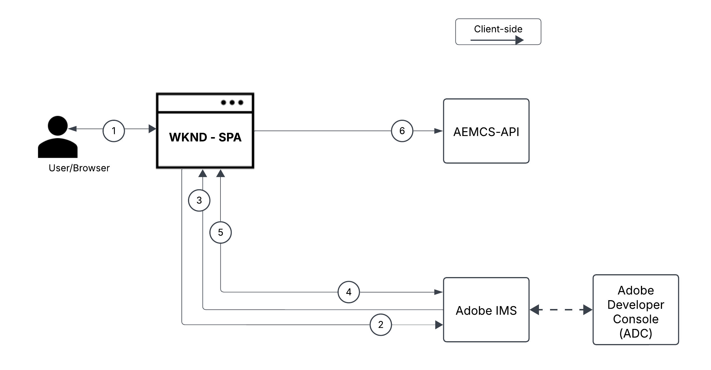
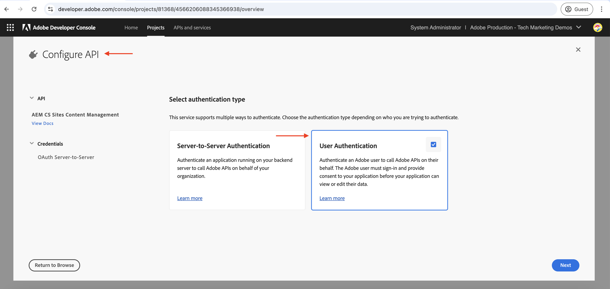
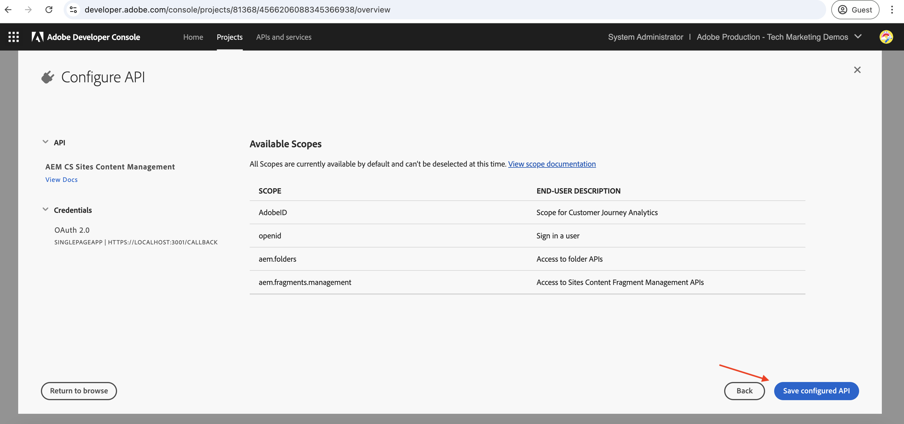

# Chamar APIs do AEM baseadas em OpenAPI usando o aplicativo de página única OAuth

Saiba como invocar APIs do AEM baseadas em OpenAPI no AEM as a Cloud Service usando a **autenticação de aplicativo de página única do OAuth**. Ela segue o fluxo de PKCE (Chave de prova para troca de código) do OAuth 2.0 para autenticação baseada no usuário em um aplicativo de página única (SPA).

A autenticação de aplicativo de página única do OAuth é ideal para aplicativos baseados em JavaScript em execução no navegador. Se eles não têm um servidor de back-end ou precisam buscar tokens de acesso para interagir com as APIs do AEM em nome de um usuário.

O fluxo PKCE estende o tipo de concessão OAuth 2.0 _authorization_code_, aumentando a segurança ao impedir a interceptação do código de autorização. Para obter mais informações, consulte a seção [Diferença entre credenciais de servidor para servidor do OAuth vs. aplicativo da Web vs. aplicativo de página única](../overview.md#difference-between-oauth-server-to-server-vs-web-app-vs-single-page-app-credentials).

## O que você aprenderá{#what-you-learn}

Neste tutorial, você aprenderá a:

- Configure um projeto do Adobe Developer Console (ADC) para acessar as APIs do AEM baseadas em OpenAPI usando a autenticação _Aplicativo de página única OAuth_ ou conhecido como _Fluxo de PKCE do OAuth 2.0_.

- Implemente o fluxo de autenticação do aplicativo de página única OAuth em um SPA personalizado.
   - Autenticação de usuário IMS e autorização de aplicativo.
   - Recuperação de token de acesso usando o fluxo PKCE do OAuth 2.0.
   - Use o token de acesso para chamar APIs do AEM baseadas em OpenAPI.

Antes de começar, verifique se você revisou o seguinte:

- [Seção Acessando APIs do Adobe e conceitos relacionados](../overview.md#accessing-adobe-apis-and-related-concepts).
- [Artigo sobre as APIs do AEM baseadas em OpenAPI](../setup.md).

## Visão geral e fluxo funcional do WKND SPA{#wknd-spa-overview-and-functional-flow}

Vamos explorar o que é o WKND SPA, como ele é construído e como ele funciona.

O WKND SPA é um **Aplicativo de página única baseado no React** que demonstra como obter com segurança um token de acesso específico do usuário e interagir com APIs do AEM diretamente do lado do cliente. Ele implementa o fluxo de autenticação PKCE do OAuth 2.0 por meio do Adobe IMS e se integra a duas APIs principais do AEM:

1. **API de sites**: para acessar modelos de fragmento de conteúdo
1. **API Assets**: para gerenciar pastas DAM

O projeto Adobe Developer Console (ADC) está configurado para habilitar a autenticação do Aplicativo de página única OAuth, fornecendo o **client_id** necessário para iniciar o fluxo de PKCE do OAuth 2.0.

>[!IMPORTANT]
>
>O Projeto ADC NÃO fornece um _client_secret_. Em vez disso, o SPA gera um _code_verifier_ e _code_Challenge_ para trocar com segurança o código de autorização por um _token de acesso_. Ele elimina a necessidade de armazenar um segredo do cliente no lado do cliente, melhorando a segurança.


>[!VIDEO](https://video.tv.adobe.com/v/3456964?quality=12&learn=on)


O diagrama a seguir ilustra o fluxo funcional do WKND SPA _obtendo token de acesso específico do usuário para invocar APIs do AEM baseadas em OpenAPI_:



1. O SPA inicia o fluxo de autenticação direcionando o usuário para o Adobe Identity Management System (IMS) por meio de uma solicitação de autorização.
1. Como parte da solicitação de autorização, o SPA envia o _client_id_, _redirect_uri_ e _code_Challenge_ para o IMS, seguindo o fluxo PKCE do OAuth 2.0. O SPA gera um _code_verifier_ aleatório, coloca hash nele usando SHA-256 e Base64 codifica o resultado para criar o _code_Challenge_.
1. O IMS autentica o usuário e, após a autenticação bem-sucedida, emite um _authorization_code_, que é enviado de volta ao SPA por meio do _redirect_uri_.
1. O SPA troca o _authorization_code_ por um _token de acesso_ enviando uma solicitação POST para o ponto de extremidade do token IMS. Inclui o _code_verifier_ na solicitação para validar o _code_Challenge_ enviado anteriormente. Isso garante que a solicitação de autorização (Etapa 2) e a solicitação de token (Etapa 4) estejam vinculadas ao mesmo fluxo de autenticação, evitando ataques de interceptação.
1. O IMS valida o _code_verifier_ e retorna o _token de acesso_ específico do usuário.
1. O SPA inclui o _token de acesso_ em solicitações de API para o AEM autenticar e recuperar conteúdo específico do usuário.

O SPA do WKND é um aplicativo baseado no [React](https://react.dev/) e usa o[Contexto React](https://react.dev/reference/react/createContext) para gerenciamento de estado de autenticação e o [Roteador React](https://reactrouter.com/home) para navegação.

Outras estruturas de SPA, como Angular, Vue ou Vanilla JavaScript, podem ser usadas para criar SPAs que se integram às APIs do Adobe usando as abordagens ilustradas neste tutorial.

## Como usar este tutorial{#how-to-use-this-tutorial}

Você pode abordar este tutorial de duas maneiras:

- [Revise os trechos de código de chave SPA](#review-spa-key-code-snippets): Entenda o fluxo de autenticação do Aplicativo de página única OAuth e explore as implementações de chamada de API de chave no SPA do WKND.
- [Configurar e executar o SPA](#setup-and-run-the-spa): siga as instruções passo a passo para configurar e executar o WKND SPA no computador local.

Escolha o caminho que melhor atenda às suas necessidades!

## Revisar trechos de código-chave SPA{#review-spa-key-code-snippets}

Vamos nos aprofundar nos fragmentos de código principais do SPA do WKND que demonstram como:

- Obtenha um token de acesso específico do usuário usando o fluxo de autenticação do Aplicativo de página única OAuth.

- Chame APIs do AEM baseadas em OpenAPI diretamente do lado do cliente.

Esses snippets ajudam você a entender o processo de autenticação e as interações da API no SPA.

### Baixar o código SPA{#download-the-spa-code}

1. Baixe o [arquivo zip SPA e AEM do WKND - Aplicativo de demonstração](../assets/spa/wknd-spa-with-aemapis-demo.zip) e extraia-o.

1. Navegue até a pasta extraída e abra o arquivo `.env.example` em seu editor de código favorito. Revise os parâmetros de configuração necessários.

   ```plaintext
   ########################################################################
   # Adobe IMS, Adobe Developer Console (ADC), and AEM as a Cloud Service Information
   ########################################################################
   # Adobe IMS OAuth endpoints
   REACT_APP_ADOBE_IMS_AUTHORIZATION_ENDPOINT=https://ims-na1.adobelogin.com/ims/authorize/v2
   REACT_APP_ADOBE_IMS_TOKEN_ENDPOINT=https://ims-na1.adobelogin.com/ims/token/v3
   
   # Adobe Developer Console (ADC) Project's OAuth Single-Page App credential
   REACT_APP_ADC_CLIENT_ID=<ADC Project OAuth Single-Page App credential ClientID>
   REACT_APP_ADC_SCOPES=<ADC Project OAuth Single-Page App credential Scopes>
   
   # AEM Assets Information
   REACT_APP_AEM_ASSET_HOSTNAME=<AEMCS Hostname, e.g., https://author-p63947-e1502138.adobeaemcloud.com/>
   
   ################################################
   # Single Page Application Information
   ################################################
   
   # Enable HTTPS for local development
   HTTPS=true
   PORT=3001
   
   # SSL Certificate and Key for local development 
   SSL_CRT_FILE=./ssl/server.crt
   SSL_KEY_FILE=./ssl/server.key
   
   # The URL to which the user will be redirected after the OAuth flow is complete
   REACT_APP_REDIRECT_URI=https://localhost:3000/callback
   ```

   É necessário substituir os espaços reservados pelos valores reais do projeto Adobe Developer Console (ADC) e da instância do AEM as a Cloud Service Assets.

### Autenticação de usuário IMS e autorização SPA{#ims-user-authentication-and-spa-authorization}

Vamos explorar o código que manipula a autenticação de usuário do IMS e a autorização de SPA. Para recuperar modelos de fragmento de conteúdo e pastas DAM, o usuário deve se autenticar com o Adobe IMS e conceder a permissão WKND SPA para acessar APIs do AEM em nome dele.

Durante o logon inicial, o usuário é solicitado a fornecer consentimento, permitindo que o SPA do WKND acesse com segurança os recursos necessários.


1. No arquivo `src/context/IMSAuthContext.js`, a função `login` inicia a autenticação de usuário IMS e o fluxo de autorização do aplicativo. Ele gera um `code_verifier` e `code_challenge` aleatórios para trocar com segurança o `code` por um token de acesso. O `code_verifier` é armazenado no armazenamento local para uso posterior. Como mencionado anteriormente, o SPA não armazena ou usa o `client_secret`, ele gera um dinamicamente e o usa em duas etapas: `authorize` e `token` solicitações.

   ```javascript
   ...
   const login = async () => {
       try {
           const codeVerifier = generateCodeVerifier();
           const codeChallenge = generateCodeChallenge(codeVerifier);
   
           localStorage.setItem(STORAGE_KEYS.CODE_VERIFIER, codeVerifier);
   
           const params = new URLSearchParams(
               getAuthParams(AUTH_METHODS.S256, codeChallenge, codeVerifier)
           );
   
           window.location.href = `${
               APP_CONFIG.adobe.ims.authorizationEndpoint //https://ims-na1.adobelogin.com/ims/authorize/v2
           }?${params.toString()}`;
       } catch (error) {
           console.error("Login initialization failed:", error);
           throw error;
       }
   };
   ...
   
   // Generate a random code verifier
   export function generateCodeVerifier() {
       const array = new Uint8Array(32);
       window.crypto.getRandomValues(array);
       const wordArray = CryptoJS.lib.WordArray.create(array);
       return base64URLEncode(wordArray);
   }
   
   // Generate code challenge using SHA-256
   export function generateCodeChallenge(codeVerifier) {
       const hash = CryptoJS.SHA256(codeVerifier);
       return base64URLEncode(hash);
   }
   
   // Get authorization URL parameters
   const getAuthParams = useCallback((method, codeChallenge, codeVerifier) => {
       const baseParams = {
           client_id: APP_CONFIG.adobe.adc.clientId, // ADC Project OAuth Single-Page App credential ClientID
           scope: APP_CONFIG.adobe.adc.scopes, // ADC Project OAuth Single-Page App credential Scopes
           response_type: "code",
           redirect_uri: APP_CONFIG.adobe.spa.redirectUri, // SPA redirect URI https://localhost:3000/callback
           code_challenge_method: method, // S256 or plain
       };
   
       return {
           ...baseParams,
           code_challenge:
               method === AUTH_METHODS.S256 ? codeChallenge : codeVerifier,
           };
   }, []);    
   ...
   ```

   Se o usuário não estiver autenticado no Adobe IMS, a página de logon do Adobe ID será exibida solicitando a autenticação do usuário.

   Se já estiver autenticado, o usuário será redirecionado de volta para o _redirect_uri_ especificado do SPA do WKND com um _authorization_code_.

### Recuperação de token de acesso usando o fluxo PKCE do OAuth 2.0{#access-token-retrieval-using-oauth-20-pkce-flow}

O SPA do WKND troca com segurança o _authorization_code_ com o Adobe IMS por um token de acesso específico do usuário usando a _client_id_ e o _code_verifier_.

1. No arquivo `src/context/IMSAuthContext.js`, a função `exchangeCodeForToken` troca o _authorization_code_ por um token de acesso específico do usuário.

   ```javascript
   ...
   // Handle the callback from the Adobe IMS authorization endpoint
   const handleCallback = async (code) => {
       if (authState.isProcessingCallback) return;
   
       try {
           updateAuthState({ isProcessingCallback: true });
   
           const data = await exchangeCodeForToken(code);
   
           if (data.access_token) {
               handleStorageToken(data.access_token);
               localStorage.removeItem(STORAGE_KEYS.CODE_VERIFIER);
           }
       } catch (error) {
           console.error("Error exchanging code for token:", error);
           throw error;
       } finally {
           updateAuthState({ isProcessingCallback: false });
       }
   };
   
   ...
   // Exchange the authorization code for an access token
   const exchangeCodeForToken = useCallback(async (code) => {
       const codeVerifier = localStorage.getItem(STORAGE_KEYS.CODE_VERIFIER);
   
       if (!codeVerifier) {
           throw new Error("No code verifier found");
       }
   
       //https://ims-na1.adobelogin.com/ims/token/v3
       const response = await fetch(APP_CONFIG.adobe.ims.tokenEndpoint, {
           method: "POST",
           headers: { "Content-Type": "application/x-www-form-urlencoded" },
           body: new URLSearchParams({
               grant_type: "authorization_code",
               client_id: APP_CONFIG.adobe.adc.clientId, // ADC Project OAuth Single-Page App credential ClientID
               code_verifier: codeVerifier, // Code verifier generated during login
               code, // Authorization code received from the IMS
               redirect_uri: `${window.location.origin}/callback`,
           }),
       });
   
       if (!response.ok) {
           throw new Error("Token request failed");
       }
   
       return response.json();
   }, []);
   
   const handleStorageToken = useCallback(
       (token) => {
           if (token) {
               localStorage.setItem(STORAGE_KEYS.ACCESS_TOKEN, token);
               updateAuthState({ isLoggedIn: true, accessToken: token });
           }
       },
       [updateAuthState]
   );
   ...
   ```

   O token de acesso é armazenado no armazenamento local do navegador e usado nas chamadas de API subsequentes para as APIs do AEM.

### Acesso a APIs do AEM baseadas em OpenAPI usando o token de acesso{#accessing-openapi-based-aem-apis-using-the-access-token}

O SPA do WKND usa o token de acesso específico do usuário para chamar os modelos de fragmento de conteúdo e os endpoints de API das pastas do DAM.

No arquivo `src/components/InvokeAemApis.js`, a função `fetchContentFragmentModels` demonstra como usar o token de acesso para invocar as APIs do AEM baseadas em OpenAPI do lado do cliente.

```javascript
    ...
  // Fetch Content Fragment Models
  const fetchContentFragmentModels = useCallback(async () => {
    try {
      updateState({ isLoading: true, error: null });
      const data = await makeApiRequest({
        endpoint: `${API_PATHS.CF_MODELS}?cursor=0&limit=10&projection=summary`,
      });
      updateState({ cfModels: data.items });
    } catch (err) {
      updateState({ error: err.message });
      console.error("Error fetching CF models:", err);
    } finally {
      updateState({ isLoading: false });
    }
  }, [makeApiRequest, updateState]);

  // Common API request helper
  const makeApiRequest = useCallback(
    async ({ endpoint, method = "GET", passAPIKey = false, body = null }) => {
    
      // Get the access token from the local storage
      const token = localStorage.getItem("adobe_ims_access_token");
      if (!token) {
        throw new Error("No access token available. Please login again.");
      }

      const headers = {
        Authorization: `Bearer ${token}`,
        "Content-Type": "application/json",
        ...(passAPIKey && { "x-api-key": APP_CONFIG.adobe.adc.clientId }),
      };

      const response = await fetch(
        `${APP_CONFIG.adobe.aem.hostname}${endpoint}`,
        {
          method,
          headers,
          ...(body && { body: JSON.stringify(body) }),
        }
      );

      if (!response.ok) {
        throw new Error(`API request failed: ${response.statusText}`);
      }

      return method === "DELETE" ? null : response.json();
    },
    []
  );
  ...
```

## Configure e execute o SPA{#setup-and-run-the-spa}

Vamos configurar e executar o WKND SPA no computador local para entender o fluxo de autenticação do aplicativo de página única OAuth e as chamadas da API.

### Pré-requisitos{#prerequisites}

Para concluir este tutorial, você precisa:

- Ambiente AEM as a Cloud Service modernizado com o seguinte:
   - Versão do AEM `2024.10.18459.20241031T210302Z` ou posterior.
   - Novos perfis de produto de estilo (se o ambiente tiver sido criado antes de novembro de 2024)

  Consulte o artigo [Configurar APIs do AEM baseadas em OpenAPI](../setup.md) para obter mais detalhes.

- O projeto [WKND Sites](https://github.com/adobe/aem-guides-wknd?#aem-wknd-sites-project) de amostra deve ser implantado nele.

- Acesso à [Adobe Developer Console](https://developer.adobe.com/developer-console/docs/guides/getting-started).

- Instale o [Node.js](https://nodejs.org/pt) no computador local para executar o aplicativo NodeJS de amostra.

### Etapas de desenvolvimento{#development-steps}

As etapas de desenvolvimento de alto nível são:

1. Configurar projeto ADC
   1. Adicione as APIs do Assets e do Sites.
   1. Configure as credenciais do aplicativo de página única OAuth.
1. Configurar a instância do AEM
   1. Para habilitar a comunicação do projeto ADC
   1. Para permitir que o SPA acesse as APIs do AEM definindo as configurações do CORS.
1. Configure e execute o WKND SPA no computador local
1. Verificar o fluxo de ponta a ponta

### Configurar projeto ADC{#configure-adc-project}

A etapa de configuração do Projeto ADC é _repetida_ das [APIs do AEM baseadas em OpenAPI de Instalação](../setup.md). É repetido adicionar a Assets, a API do Sites e configurar seu método de autenticação como o Aplicativo de página única OAuth.

1. No [Adobe Developer Console](https://developer.adobe.com/console/projects), abra o projeto desejado.

1. Para adicionar APIs do AEM, clique no botão **Adicionar API**.

   

1. Na caixa de diálogo _Adicionar API_, filtre por _Experience Cloud_, selecione o cartão **Gerenciamento de Conteúdo de Sites do AEM CS** e clique em **Avançar**.

   

   >[!TIP]
   >
   >Se o **cartão de API do AEM** desejado estiver desabilitado e _Por que isso está desabilitado?As informações do_ mostram a mensagem **Licença necessária**, uma das razões pode ser que você NÃO tenha modernizado seu ambiente do AEM as a Cloud Service. Consulte [Modernização do ambiente do AEM as a Cloud Service](../setup.md#modernization-of-aem-as-a-cloud-service-environment) para obter mais informações.

1. Em seguida, na caixa de diálogo _Configurar API_, selecione a opção de autenticação **Autenticação de Usuário** e clique em **Avançar**.

   

1. Na próxima caixa de diálogo _Configurar API_, selecione a opção de autenticação **Aplicativo de página única** do OAuth e clique em **Avançar**.

   

1. Na caixa de diálogo _Configurar aplicativo de página única do OAuth_, insira os detalhes a seguir e clique em **Avançar**.
   - URI de redirecionamento padrão: `https://localhost:3001/callback`
   - Padrão de URI de redirecionamento: `https://localhost:3001/callback`

   

1. Revise os escopos disponíveis e clique em **Salvar API configurada**.

   

1. Repita as etapas acima para adicionar a **API do AEM Assets Author**.

1. Revise a API do AEM e a configuração de autenticação.

   

   

### Configurar instância do AEM para habilitar a comunicação do Projeto ADC{#configure-aem-instance-to-enable-adc-project-communication}

Siga as instruções do artigo [Configurar APIs do AEM baseadas em OpenAPI](../setup.md#configure-the-aem-instance-to-enable-adc-project-communication) para configurar a instância do AEM para habilitar a comunicação do Projeto ADC.

### Configuração do AEM CORS{#aem-cors-configuration}

O Compartilhamento de recursos entre origens (CORS) da AEM as a Cloud Service facilita que propriedades da Web que não sejam da AEM façam chamadas do lado do cliente baseadas em navegador para APIs do AEM.

1. No AEM Project, localize ou crie o arquivo `com.adobe.granite.cors.impl.CORSPolicyImpl~wknd-graphql.cfg.json` da pasta `/ui.config/src/main/content/jcr_root/apps/wknd/osgiconfig/config.author/`.

   

1. Adicione a seguinte configuração ao arquivo.

   ```json
   {
       "alloworigin":[
         ""
       ],
       "alloworiginregexp":[
         "https://localhost:.*",
         "http://localhost:.*"
       ],
       "allowedpaths": [
         "/adobe/sites/.*",
         "/graphql/execute.json.*",
         "/content/_cq_graphql/wknd-shared/endpoint.json",
         "/content/experience-fragments/.*"
       ],
       "supportedheaders": [
         "Origin",
         "Accept",
         "X-Requested-With",
         "Content-Type",
         "Access-Control-Request-Method",
         "Access-Control-Request-Headers",
         "Authorization"
       ],
       "supportedmethods":[
         "GET",
         "HEAD",
         "POST"
       ],
       "maxage:Integer": 1800,
       "supportscredentials": true,
       "exposedheaders":[ "" ]
   }
   ```

1. Confirme as alterações de configuração e envie as alterações para o repositório Git remoto ao qual o pipeline do Cloud Manager está conectado.

1. Implante as alterações acima usando o pipeline de pilha completa na Cloud Manager.

### Configurar e executar o SPA{#configure-and-run-the-spa}

1. Baixe o [arquivo zip SPA e AEM do WKND - Aplicativo de demonstração](../assets/spa/wknd-spa-with-aemapis-demo.zip) e extraia-o.

1. Navegue até a pasta extraída e copie o arquivo `.env.example` para `.env`.

1. Atualize o arquivo `.env` com os parâmetros de configuração necessários do projeto do Adobe Developer Console (ADC) e do ambiente do AEM as a Cloud Service. Por exemplo:

   ```plaintext
   ########################################################################
   # Adobe IMS, Adobe Developer Console (ADC), and AEM as a Cloud Service Information
   ########################################################################
   # Adobe IMS OAuth endpoints
   REACT_APP_ADOBE_IMS_AUTHORIZATION_ENDPOINT=https://ims-na1.adobelogin.com/ims/authorize/v2
   REACT_APP_ADOBE_IMS_TOKEN_ENDPOINT=https://ims-na1.adobelogin.com/ims/token/v3
   REACT_APP_ADOBE_IMS_USERINFO_ENDPOINT=https://ims-na1.adobelogin.com/ims/userinfo/v2
   
   # Adobe Developer Console (ADC) Project's OAuth Single-Page App credential
   REACT_APP_ADC_CLIENT_ID=ddsfs455a4a440c48c7474687c96945d
   REACT_APP_ADC_SCOPES=AdobeID,openid,aem.folders,aem.assets.author,aem.fragments.management
   
   # AEM Assets Information
   REACT_APP_AEM_ASSET_HOSTNAME=https://author-p69647-e1453424.adobeaemcloud.com/
   
   ################################################
   # Single Page Application Information
   ################################################
   
   # Enable HTTPS for local development
   HTTPS=true
   PORT=3001
   
   # SSL Certificate and Key for local development 
   SSL_CRT_FILE=./ssl/server.crt
   SSL_KEY_FILE=./ssl/server.key
   
   # The URL to which the user will be redirected after the OAuth flow is complete
   REACT_APP_REDIRECT_URI=https://localhost:3000/callback
   ```

1. Abra um terminal e navegue até a pasta extraída. Instale as dependências necessárias e inicie o WKND SPA usando o comando a seguir.

   ```bash
   $ npm install
   $ npm start
   ```

### Verificar o fluxo de ponta a ponta{#verify-the-end-to-end-flow}

1. Abra um navegador e navegue até `https://localhost:3001` para acessar o WKND SPA. Aceite o aviso de certificado autoassinado.

   

1. Clique no botão **Logon do Adobe IMS** para iniciar o fluxo de autenticação do aplicativo de página única OAuth.

1. Autentique no Adobe IMS e forneça o consentimento para permitir que o WKND SPA acesse os recursos em seu nome.

1. Após a autenticação bem-sucedida, você é redirecionado de volta à rota `/invoke-aem-apis` do SPA do WKND e o token de acesso é armazenado no armazenamento local do navegador.

   

1. Na rota `https://localhost:3001/invoke-aem-apis`, clique no botão **Buscar modelos de fragmento de conteúdo** para chamar a API de modelos de fragmento de conteúdo. O SPA exibe a lista de modelos de fragmento de conteúdo.

   

1. Da mesma forma, na guia **Assets - API de pastas**, é possível listar, criar e excluir pastas DAM.

   

1. Nas ferramentas de desenvolvedor do navegador, você pode inspecionar as solicitações e respostas da rede para entender as chamadas de API do.

   

>[!IMPORTANT]
>
>Se o usuário autenticado não tiver as permissões necessárias para listar, criar ou excluir recursos do AEM, as chamadas de API falharão com um erro 403 Forbidden. Ela garante que, mesmo que o usuário seja autenticado e possua um token de acesso IMS válido, ele não possa acessar os recursos do AEM sem as permissões necessárias.

### Revisar o código SPA{#review-the-spa-code}

Vamos revisar a estrutura de código de alto nível e os principais pontos de entrada do SPA do WKND. O SPA é criado usando a estrutura do React e usa a API de contexto do React para autenticação e gerenciamento de estado.

1. O arquivo `src/App.js` é o principal ponto de entrada do SPA do WKND. O componente de Aplicativo envolve todo o aplicativo e inicializa o contexto `IMSAuthProvider`.

1. O `src/context/IMSAuthContext.js` cria o Adobe IMSAuthContext para fornecer o estado de autenticação aos componentes filhos. Ele inclui as funções login, logout e handleCallback para iniciar o fluxo de autenticação do aplicativo de página única OAuth.

1. A pasta `src/components` contém vários componentes para demonstrar as chamadas de API para as APIs do AEM. O componente `InvokeAemApis.js` demonstra como usar o token de acesso para chamar as APIs do AEM.

1. O arquivo `src/config/config.js` carrega as variáveis de ambiente do arquivo `.env` e as exporta para uso no aplicativo.

1. O arquivo `src/utils/auth.js` contém funções utilitárias para gerar o verificador de código e o desafio de código para o fluxo PKCE do OAuth 2.0.

1. A pasta `ssl` contém o certificado autoassinado e os arquivos de chave para executar o proxy HTTP SSL local.

Você pode desenvolver ou integrar o SPA existente com as APIs do Adobe usando as abordagens ilustradas neste tutorial.

## Resumo{#summary}

Neste tutorial, você aprendeu a chamar APIs do AEM baseadas em OpenAPI no AEM as a Cloud Service usando a autenticação baseada em usuário de um aplicativo de página única (SPA) por meio do fluxo de PKCE do OAuth 2.0.

## Recursos adicionais{#additional-resources}

- [APIs do Adobe Experience Manager as a Cloud Service](https://developer.adobe.com/experience-cloud/experience-manager-apis/)
- [Guia de Implementação de Autenticação do Usuário](https://developer.adobe.com/developer-console/docs/guides/authentication/UserAuthentication/implementation)
- [Solicitação de autorização](https://developer.adobe.com/developer-console/docs/guides/authentication/UserAuthentication/ims#authorize-request)
- [Buscando tokens de acesso](https://developer.adobe.com/developer-console/docs/guides/authentication/UserAuthentication/ims#fetching-access-tokens)
