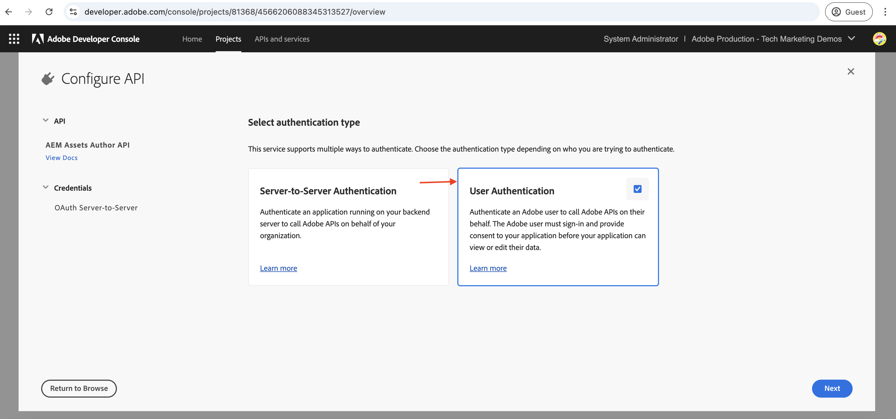
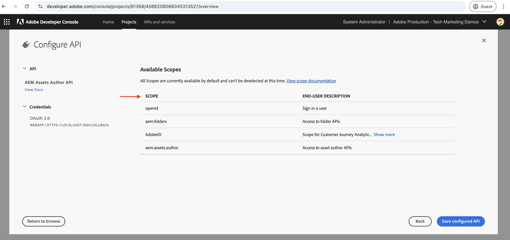

# Chamar APIs do AEM baseadas em OpenAPI usando a autenticação do OAuth Web App

Saiba como chamar APIs do AEM baseadas em OpenAPI no AEM as a Cloud Service usando a autenticação baseada em usuário de um aplicativo Web personalizado que usa o OAuth Web App.

A autenticação do Aplicativo Web OAuth é ideal para aplicativos Web com componentes de front-end e _back-end_ que precisam **acessar APIs do AEM em nome de um usuário**. Ele usa o tipo de concessão OAuth 2.0 _authorization_code_ para obter um token de acesso em nome do usuário para acessar as APIs do AEM. Para obter mais informações, consulte [Diferença entre credenciais de servidor para servidor do OAuth vs. aplicativo da Web vs. aplicativo de página única](../overview.md#difference-between-oauth-server-to-server-vs-web-app-vs-single-page-app-credentials).

## O que você aprenderá{#what-you-learn}

Neste tutorial, você aprenderá a:

- Configure um projeto do Adobe Developer Console (ADC) para acessar a API do Assets Author usando a autenticação do _OAuth Web App_.

- Implemente o fluxo de autenticação do OAuth Web App em um aplicativo Web personalizado.
   - Autenticação de usuário IMS e autorização de aplicativo.
   - Recuperação de token de acesso específico do usuário.
   - Acesso a APIs do AEM baseadas em OpenAPI usando o token de acesso específico do usuário.

Antes de começar, verifique se você revisou o seguinte:

- [Seção Acessando APIs do Adobe e conceitos relacionados](../overview.md#accessing-adobe-apis-and-related-concepts).
- [Artigo sobre as APIs do AEM baseadas em OpenAPI](../setup.md).

## Aplicativo Web de amostra: Visão geral e fluxo funcional do WKND-PIM

Vamos entender o aplicativo da Web de amostra, o Gerenciamento de informações de produto (PIM) da WKND e seu fluxo funcional.

O aplicativo WKND PIM é um aplicativo da Web de amostra projetado para gerenciar atributos de produto e seus metadados de ativos armazenados no AEM as a Cloud Service. Este exemplo demonstra como os aplicativos da Web podem se integrar perfeitamente às APIs do Adobe para fornecer fluxos de trabalho eficientes e centrados no usuário.

O projeto Adobe Developer Console (ADC) é configurado para acessar a API do autor do Assets usando a autenticação do aplicativo web OAuth. Ele fornece o _client_id_ e o _client_secret_ necessários ao aplicativo Web WKND-PIM para iniciar o fluxo de concessão do _authorization_code_.

>[!VIDEO](https://video.tv.adobe.com/v/3442757?quality=12&learn=on)


O diagrama a seguir ilustra o fluxo funcional do aplicativo Web WKND-PIM _obtendo tokens de acesso específicos do usuário para interagir com a API do Assets Author_.


1. O aplicativo web inicia o processo redirecionando o usuário para o Adobe Identity Management System (IMS) para autenticação.
1. Junto com o redirecionamento, o aplicativo Web passa o _client_id_ e o _redirect_uri_ necessários para o IMS.
1. O IMS autentica o usuário e o envia de volta para o _redirect_uri_ especificado com um _authorization_code_.
1. O aplicativo Web troca o _authorization_code_ com IMS por um token de acesso específico do usuário, usando sua _client_id_ e _client_secret_.
1. Após a validação bem-sucedida, o IMS emite o _token de acesso_ específico do usuário.
1. O aplicativo Web usa com segurança o _token de acesso_ para interagir com a API do Autor do Assets, permitindo que o usuário recupere ou atualize os metadados do ativo do produto.

O aplicativo Web WKND-PIM é desenvolvido com o [Node.js](https://nodejs.org/en) e o [Express](https://expressjs.com/). O Express atua como o servidor que gerencia com segurança segredos privados e tokens de acesso específicos do usuário.

Outras pilhas da Web (Java, Python, baseado em .NET etc.) podem ser usadas para criar aplicativos Web que se integram às APIs do Adobe usando as abordagens ilustradas neste tutorial.

## Como usar este tutorial{#how-to-use-this-tutorial}

Você pode [Revisar a seção de trechos de código da chave do aplicativo Web](#review-web-app-key-code-snippets) para entender o fluxo de autenticação do aplicativo Web OAuth e os trechos de código de chamadas da API usados no aplicativo Web WKND-PIM. Ou prossiga diretamente para a seção [Configurar e executar o aplicativo Web](#setup-run-web-app) para configurar e executar o aplicativo Web WKND-PIM no computador local para entender o fluxo de autenticação e as chamadas de API do aplicativo Web OAuth.

## Revisar trechos de código-chave do aplicativo da Web{#review-web-app-key-code-snippets}

Vamos analisar os trechos de código principais usados no aplicativo Web WKND-PIM para entender o fluxo de autenticação do aplicativo Web OAuth e as chamadas de API.

### Baixe o código do aplicativo Web WKND-PIM

1. Baixe o arquivo zip do [aplicativo Web WKND-PIM](../assets/web-app/wknd-pim-demo-web-app.zip) e extraia-o.

1. Navegue até a pasta extraída e abra o arquivo `.env.example` em seu editor de código favorito. Revise os parâmetros de configuração necessários.

   ```plaintext
   ########################################################################
   # Adobe IMS, Adobe Developer Console (ADC), and AEM Assets Information
   ########################################################################
   # Adobe IMS OAuth endpoints
   ADOBE_IMS_AUTHORIZATION_ENDPOINT=https://ims-na1.adobelogin.com/ims/authorize/v2
   ADOBE_IMS_TOKEN_ENDPOINT=https://ims-na1.adobelogin.com/ims/token/v3
   ADOBE_IMS_USERINFO_ENDPOINT=https://ims-na1.adobelogin.com/ims/userinfo/v2
   
   # Adobe Developer Console (ADC) Project's OAuth Web App credential
   ADC_CLIENT_ID=<ADC Project OAuth Web App credential ClientID>
   ADC_CLIENT_SECRET=<ADC Project OAuth Web App credential Client Secret>
   ADC_SCOPES=<ADC Project OAuth Web App credential credential Scopes>
   
   # AEM Assets Information
   AEM_ASSET_HOSTNAME=<AEM Assets Hostname, e.g., https://author-p63947-e1502138.adobeaemcloud.com/>
   AEM_ASSET_IDS=< AEM Asset IDs Comma Seperated, e.g., urn:aaid:aem:9f20a8ce-934a-4560-8720-250e529fbb17,urn:aaid:aem:6e0123cd-8a67-4d1f-b721-1b3da987d831>
   
   ################################################
   # Web App Information
   ################################################
   # The port number on which this server (web app) will run
   PORT = 3000
   
   # The URL to which the user will be redirected after the OAuth flow is complete
   REDIRECT_URI=https://localhost:3001/callback
   
   # The Express (express-session) uses this secret to encrypt and verify the authenticity of that cookie
   EXPRESS_SESSION_SECRET=<Express Session Secret>
   ```

   É necessário substituir os espaços reservados pelos valores reais do projeto Adobe Developer Console (ADC) e da instância do AEM as a Cloud Service Assets.

### Autenticação de usuário IMS e autorização de aplicativo

Vamos revisar o código que inicia a autenticação de usuário IMS e a autorização do aplicativo. Para revisar ou atualizar os metadados do ativo, o usuário deve se autenticar no Adobe IMS e autorizar que o aplicativo Web WKND-PIM acesse a API do autor do Assets em nome dele.

Na primeira tentativa de logon, o usuário deve fornecer consentimento para permitir que o aplicativo Web WKND-PIM acesse a API do autor do Assets em nome dele.


1. O arquivo `routes/update-product-attributes.js` verifica se a [Sessão expressa](https://www.npmjs.com/package/express-session) do usuário tem um token de acesso. Caso contrário, ele redireciona o usuário para a rota `/auth`.

   ```javascript
   ...
   // The update-product-attributes route, shows the product attributes form with tabs
   router.get("/update-product-attributes", async (req, res) => {
     // Check if the user is authenticated, if not redirect to the auth route
     if (!req.session.accessToken) {
         return res.redirect("/auth");
     }
     ...
   });
   ```

1. No arquivo `routes/adobe-ims-auth.js`, a rota `/auth` inicia a autenticação de usuário IMS e o fluxo de autorização do aplicativo. Observe os parâmetros _client_id_, _redirect_uri_ e _response_type_ passados para o ponto de extremidade de autorização do Adobe IMS.

   ```javascript
   ...
   // Route to initiate Adobe IMS user authentication
   router.get("/auth", (req, res) => {
     // Redirect user to Adobe IMS authorization endpoint
     try {
         // Constructing the authorization URL
         const params = new URLSearchParams({
         client_id: adobeADCConfig.clientId,
         redirect_uri: redirectUri,
         response_type: "code",
         });
   
         // Append scopes if defined in configuration
         if (adobeADCConfig?.scopes) params.append("scope", adobeADCConfig.scopes);
   
         // Redirect user to Adobe IMS authorization URL
         const imsAuthorizationUrl = `${
         adobeIMSConfig.authorizationEndpoint
         }?${params.toString()}`;
   
         res.redirect(imsAuthorizationUrl);
     } catch (error) {
         console.error("Error initiating Adobe IMS authentication:", error);
         res.status(500).send("Unable to initiate authentication");
     }
   });
   ...
   ```

Se o usuário não estiver autenticado no Adobe IMS, a página de logon do Adobe ID será exibida solicitando a autenticação do usuário.

Se já estiver autenticado, o usuário será redirecionado de volta para o _redirect_uri_ especificado do aplicativo Web WKND-PIM com um _authorization_code_.

### Recuperação de token de acesso

O aplicativo Web WKND-PIM troca com segurança o _authorization_code_ com o Adobe IMS por um token de acesso específico do usuário usando o _client_id_ e o _client_secret_ da credencial do aplicativo Web OAuth do projeto ADC.

No arquivo `routes/adobe-ims-auth.js`, a rota `/callback` troca o _authorization_code_ com o Adobe IMS para um token de acesso específico do usuário.

```javascript
...
// Callback route to exchange authorization code for access token
router.get("/callback", async (req, res) => {
  // Extracting authorization code from the query parameters
  const authorizationCode = req.query.code;

  if (!authorizationCode) {
    return res.status(400).send("Missing authorization code");
  }

  // Exchange authorization code for access token
  try {
    // Fetch access token from Adobe IMS token endpoint
    const response = await fetch(adobeIMSConfig.tokenEndpoint, {
      method: "POST",
      headers: {
        "Content-Type": "application/x-www-form-urlencoded",
        Authorization: `Basic ${Buffer.from(
          `${adobeADCConfig.clientId}:${adobeADCConfig.clientSecret}`
        ).toString("base64")}`,
      },
      body: new URLSearchParams({
        code: authorizationCode,
        grant_type: "authorization_code",
      }),
    });

    if (!response.ok) {
      console.error("Failed to fetch access token:", response.statusText);
      return res.status(500).send("Failed to fetch access token");
    }

    const data = await response.json();

    if (!data.access_token) {
      console.error("Access token missing in the response:", data);
      return res.status(500).send("Invalid response from token endpoint");
    }

    // For debugging purposes
    console.log("Access token:", data.access_token);

    // Store the access token in the session
    req.session.accessToken = data.access_token;

    // Redirect user to update product attributes
    res.redirect("/update-product-attributes");
  } catch (error) {
    console.error("Error exchanging authorization code:", error);
    res.status(500).send("Error during token exchange");
  }
});
```

O token de acesso é armazenado na [sessão expressa](https://www.npmjs.com/package/express-session) para solicitações subsequentes à API do autor do Assets.

### Acesso a APIs do AEM baseadas em OpenAPI usando o token de acesso

O aplicativo Web WKND-PIM usa com segurança o token de acesso específico do usuário para interagir com a API do autor do Assets, permitindo que o usuário recupere ou atualize os metadados de ativos do produto.

No arquivo `routes/invoke-aem-apis.js`, as rotas `/api/getAEMAssetMetadata` e `/api/updateAEMAssetMetadata` invocam as APIs de Autor do Assets usando o token de acesso.

```javascript
...
// API Route: Get AEM Asset Metadata
router.get("/api/getAEMAssetMetadata", async (req, res) => {
  const assetId = req.query.assetId;
  const bucketName = getBucketName(aemAssetsConfig.hostname);

  if (!assetId || !bucketName) {
    return res.status(400).json({ error: "Missing AEM Information" });
  }

  // Get the access token from the session
  const accessToken = req.session.accessToken;

  if (!accessToken) {
    return res.status(401).json({ error: "Not Authenticated with Adobe IMS" });
  }

  try {
    const assetMetadata = await invokeGetAssetMetadataAPI(
      bucketName,
      assetId,
      accessToken
    );

    const filteredMetadata = getFilteredMetadata(JSON.parse(assetMetadata));
    res.status(200).json(filteredMetadata);
  } catch (error) {
    console.error("Error getting asset metadata:", error.message);
    res.status(500).json({ error: `Internal Server Error: ${error.message}` });
  }
});

// Helper function to invoke the AEM API to get asset metadata
async function invokeGetAssetMetadataAPI(bucketName, assetId, accessToken) {
  const apiUrl = `https://${bucketName}.adobeaemcloud.com/adobe/assets/${assetId}/metadata`;


  // For debugging purposes
  console.log("API URL:", apiUrl);
  console.log("Access Token:", accessToken);
  console.log("API Key:", adobeADCConfig.clientId);

  try {
    const response = await fetch(apiUrl, {
      method: "GET",
      headers: {
        "If-None-Match": "string",
        "X-Adobe-Accept-Experimental": "1",
        Authorization: `Bearer ${accessToken}`,
        "X-Api-Key": adobeADCConfig.clientId,
      },
    });

    console.log("Response Status:", response.status);

    if (!response.ok) {
      throw new Error(`AEM API Error: ${response.statusText}`);
    }

    return await response.text();
  } catch (error) {
    throw new Error(`Failed to fetch asset metadata: ${error.message}`);
  }
}

// Helper function to filter the metadata properties like pim: and dc:
function getFilteredMetadata(data) {
  if (!data || !data.assetMetadata) {
    throw new Error("Invalid metadata structure received from API");
  }

  const properties = data.assetMetadata;
  return Object.keys(properties).reduce((filtered, key) => {
    if (
      key.startsWith("pim:") ||
      key === "dc:title" ||
      key === "dc:description"
    ) {
      filtered[key] = properties[key];
    }
    return filtered;
  }, {});
}

// API Route: Update AEM Asset Metadata
router.post("/api/updateAEMAssetMetadata", async (req, res) => {
  const { assetId, metadata } = req.body;

  if (!assetId || !metadata || typeof metadata !== "object") {
    return res.status(400).json({ error: "Invalid or Missing Metadata" });
  }

  const bucketName = getBucketName(aemAssetsConfig.hostname);
  if (!bucketName) {
    return res.status(400).json({ error: "Missing AEM Information" });
  }

  const accessToken = req.session.accessToken;
  if (!accessToken) {
    return res.status(401).json({ error: "Not Authenticated with Adobe IMS" });
  }

  try {
    const updatedMetadata = await invokePatchAssetMetadataAPI(
      bucketName,
      assetId,
      metadata,
      accessToken
    );
    res.status(200).json(updatedMetadata);
  } catch (error) {
    console.error("Error updating asset metadata:", error.message);
    res.status(500).json({ error: `Internal Server Error: ${error.message}` });
  }
});

// Helper function to invoke the AEM API to update asset metadata
async function invokePatchAssetMetadataAPI(
  bucketName,
  assetId,
  metadata,
  accessToken
) {
  const apiUrl = `https://${bucketName}.adobeaemcloud.com/adobe/assets/${assetId}/metadata`;
  const headers = {
    "Content-Type": "application/json-patch+json",
    "If-Match": "*",
    "X-Adobe-Accept-Experimental": "1",
    Authorization: `Bearer ${accessToken}`,
    "X-Api-Key": adobeADCConfig.clientId,
  };

  try {
    const response = await fetch(apiUrl, {
      method: "PATCH",
      headers,
      body: JSON.stringify(getTransformedMetadata(metadata)),
    });

    if (!response.ok) {
      throw new Error(`AEM API Error: ${response.statusText}`);
    }

    return await response.json();
  } catch (error) {
    throw new Error(`Failed to update asset metadata: ${error.message}`);
  }
}

// Helper function to transform metadata into JSON Patch format, e.g. [{ op: "add", path: "dc:title", value: "New Title" }]
function getTransformedMetadata(metadata) {
  return Object.keys(metadata).map((key) => ({
    op: "add",
    path: `/${key}`,
    value: metadata[key],
  }));
}
```

As chamadas da API do AEM baseadas em OpenAPI são feitas do lado do servidor (middleware expresso) e não diretamente do lado do cliente (navegador) para garantir que o token de acesso seja gerenciado com segurança e não exposto ao lado do cliente.

### Atualizar o token de acesso

Para atualizar o token de acesso antes que ele expire, você pode implementar o fluxo do token de atualização. No entanto, para manter o tutorial simples, o aplicativo Web WKND-PIM não implementa o fluxo de token de atualização.


>[!TIP]
>
>Você pode seguir a próxima seção para experimentar o aplicativo Web WKND-PIM no computador local e obter experiência prática com o fluxo de autenticação do aplicativo Web OAuth e chamadas de API.

## Configurar e executar o aplicativo Web

Vamos configurar e executar o aplicativo Web WKND-PIM no computador local para entender o fluxo de autenticação do aplicativo Web OAuth e as chamadas de API.

### Pré-requisitos

Para concluir este tutorial, você precisa:

- Ambiente AEM as a Cloud Service modernizado com o seguinte:
   - Versão do AEM `2024.10.18459.20241031T210302Z` ou posterior.
   - Novos perfis de produto de estilo (se o ambiente tiver sido criado antes de novembro de 2024)

  Consulte o artigo [Configurar APIs do AEM baseadas em OpenAPI](../setup.md) para obter mais detalhes.

- O projeto [WKND Sites](https://github.com/adobe/aem-guides-wknd?#aem-wknd-sites-project) de amostra deve ser implantado nele.

- Acesso à [Adobe Developer Console](https://developer.adobe.com/developer-console/docs/guides/getting-started).

- Instale o [Node.js](https://nodejs.org/pt) no computador local para executar o aplicativo NodeJS de amostra.

- Instale um [local-ssl-proxy](https://www.npmjs.com/package/local-ssl-proxy#local-ssl-proxy) no computador local para criar um proxy HTTP SSL local usando um certificado autoassinado.


### Etapas de desenvolvimento

As etapas de desenvolvimento de alto nível são:

1. Configurar projeto ADC
   1. Adicionar a API do autor do Assets
   1. Configurar a credencial do aplicativo web OAuth
1. Configure a instância do AEM para habilitar a comunicação do Projeto ADC
1. No AEM, crie e aplique o esquema de metadados de ativos
1. Configure e execute o aplicativo Web WKND-PIM
1. Verificar o fluxo de ponta a ponta

### Configurar projeto ADC

A etapa de configuração do Projeto ADC é _repetida_ das [APIs do AEM baseadas em OpenAPI de Instalação](../setup.md). É repetido adicionar a API do autor do Assets e configurar seu método de autenticação como OAuth Web App.

1. No [Adobe Developer Console](https://developer.adobe.com/console/projects), abra o projeto desejado.

1. Para adicionar APIs do AEM, clique no botão **Adicionar API**.

   

1. Na caixa de diálogo _Adicionar API_, filtre por _Experience Cloud_, selecione o cartão **API do AEM Assets Author** e clique em **Avançar**.

   

   >[!TIP]
   >
   >Se o **cartão de API do AEM** desejado estiver desabilitado e _Por que isso está desabilitado?As informações do_ mostram a mensagem **Licença necessária**, uma das razões pode ser que você NÃO tenha modernizado seu ambiente do AEM as a Cloud Service. Consulte [Modernização do ambiente do AEM as a Cloud Service](../setup.md#modernization-of-aem-as-a-cloud-service-environment) para obter mais informações.

1. Em seguida, na caixa de diálogo _Configurar API_, selecione a opção de autenticação **Autenticação de Usuário** e clique em **Avançar**.

   

1. Na próxima caixa de diálogo _Configurar API_, selecione a opção de autenticação **Aplicativo Web OAuth** e clique em **Avançar**.

   

1. Na caixa de diálogo _Configurar OAuth Web App_, insira os detalhes a seguir e clique em **Avançar**.
   - URI de redirecionamento padrão: `https://localhost:3001/callback`
   - Padrão de URI de redirecionamento: `https://localhost:3001/callback`

   

1. Revise os escopos disponíveis e clique em **Salvar API configurada**.

   

1. Revise a API do AEM e a configuração de autenticação.

   

   

### Configurar instância do AEM para habilitar a comunicação do Projeto ADC

Siga as instruções do artigo [Configurar APIs do AEM baseadas em OpenAPI](../setup.md#configure-the-aem-instance-to-enable-adc-project-communication) para configurar a instância do AEM para habilitar a comunicação do Projeto ADC.

### Criar e aplicar o esquema de metadados de ativos

Por padrão, o projeto WKND Sites não tem o esquema de metadados de ativos necessário para exibir os atributos do produto. Vamos criar e aplicar o esquema de metadados de ativos a uma pasta de ativos na instância do AEM.

1. Faça logon na instância do AEM as a Cloud Service Asset. Usando a [Exibição de ativos](https://experienceleague.adobe.com/en/docs/experience-manager-learn/assets/authoring/switch-views), navegue até a pasta `/content/dam/wknd-shared/en`.

   

1. Crie um **PIM** e dentro dele crie a pasta **Camping** e carregue [imagens de exemplo](../assets/web-app/camping-gear-imgs.zip) na pasta **Camping**.

   

Em seguida, vamos criar o esquema de metadados específico do atributo PIM e aplicá-lo à pasta **PIM**.

1. Navegue até a opção **Configurações** > **Forms de metadados** no painel esquerdo e clique no botão **Criar**.

1. Na caixa de diálogo **Criar Formulário de Metadados**, insira os detalhes a seguir e clique em **Criar**.
   - Nome: `PIM`
   - Usar estrutura de formulário existente como modelo: `Check`
   - Escolher de: `default`

   

1. Clique no ícone **+** para adicionar uma nova guia **PIM** e adicionar componentes de **Texto de Linha Única** a ela. Os nomes de propriedades de metadados devem começar com o prefixo `pim:`.

   

   | Rótulo | Espaço reservado | Propriedade de metadados |
   | --- | --- | --- |
   | SKU | Inserir ID da SKU | `pim:sku` |
   | Tipo de produto | Por exemplo, mochila, tenda, jaqueta | `pim:productType` |
   | Categoria do produto | Por exemplo, Acampamento, Caminhada, Escalada | `pim:productCategory` |
   | Fabricante | Inserir nome do fabricante | `pim:manufacturer` |
   | Modelo | Inserir nome do modelo | `pim:model` |
   | Nome da marca | Inserir o nome da marca | `pim:brandName` |

1. Clique em **Salvar** e **Fechar** para salvar o formulário de metadados.

1. Finalmente, aplique o esquema de metadados **PIM** à pasta **PIM**.

   

Com as etapas acima, os ativos da pasta **PIM** estão prontos para armazenar os metadados de atributos do produto.

### Configure e execute o aplicativo Web WKND-PIM

1. Baixe o arquivo zip do [aplicativo Web WKND-PIM](../assets/web-app/wknd-pim-demo-web-app.zip) e extraia-o.

1. Navegue até a pasta extraída e copie o arquivo `.env.example` para `.env`.

1. Atualize o arquivo `.env` com os parâmetros de configuração necessários do Projeto do Adobe Developer Console (ADC) e da instância do AEM as a Cloud Service Assets.

   ```plaintext
   ########################################################################
   # Adobe IMS, Adobe Developer Console (ADC), and AEM Assets Information
   ########################################################################
   # Adobe IMS OAuth endpoints
   ADOBE_IMS_AUTHORIZATION_ENDPOINT=https://ims-na1.adobelogin.com/ims/authorize/v2
   ADOBE_IMS_TOKEN_ENDPOINT=https://ims-na1.adobelogin.com/ims/token/v3
   ADOBE_IMS_USERINFO_ENDPOINT=https://ims-na1.adobelogin.com/ims/userinfo/v2
   
   # Adobe Developer Console (ADC) Project OAuth Web App credential
   ADC_CLIENT_ID=e1adsfsd59384320bbe4f9298f00b7ab
   ADC_CLIENT_SECRET=p8e-Mdfgfdsg43RHugVRTEOyWlmEU5m
   ADC_SCOPES=AdobeID,openid,aem.folders,aem.assets.author
   
   # AEM Assets Information
   AEM_ASSET_HOSTNAME=https://author-p3947-e1542138.adobeaemcloud.com/
   AEM_ASSET_IDS=urn:aaid:aem:aa689a9f-04da-4fbb-b460-74a5b6a69090,urn:aaid:aem:e4fdb6f6-1007-4e84-9726-a9522931786a
   
   ################################################
   # Web App Information
   ################################################
   # The port number on which this server (web app) will run
   PORT = 3000
   
   # The URL to which the user will be redirected after the OAuth flow is complete
   REDIRECT_URI=http://localhost:3000/auth/callback
   
   # The Express (express-session) uses this secret to encrypt and verify the authenticity of that cookie
   # For demonstration purposes, this is a simple secret. In production, you should use a strong secret
   EXPRESS_SESSION_SECRET=1234554321
   ```

   O `AEM_ASSET_IDS` é o valor da propriedade `jcr:uuid` das imagens carregadas na pasta **Camping**. Consulte esta [seção](./invoke-api-using-oauth-s2s.md#review-the-api) para obter mais detalhes.

1. Abra um terminal e navegue até a pasta extraída. Instale as dependências necessárias usando o comando a seguir.

   ```bash
   $ npm install
   ```

1. Inicie o aplicativo Web WKND-PIM usando o comando a seguir.

   ```bash
   $ npm start
   ```

1. Execute o proxy HTTP SSL local usando o comando a seguir.

   ```bash
   $ local-ssl-proxy --source 3001 --target 3000 --cert ./ssl/server.crt --key ./ssl/server.key
   ```

   O proxy HTTP SSL local é usado, pois o IMS requer que o URI de redirecionamento seja HTTPS.

### Verificar o fluxo de ponta a ponta

1. Abra um navegador e navegue até `https://localhost:3001` para acessar o aplicativo Web WKND-PIM. Aceite o aviso de certificado autoassinado.

   

1. Clique em **Experimente agora** para revisar e atualizar os metadados de atributos do produto. Ele inicia a autenticação de usuário IMS e o fluxo de autorização do aplicativo.

1. Faça logon com suas credenciais do Adobe ID e forneça o consentimento para permitir que o aplicativo Web WKND-PIM acesse a API do autor do Assets em seu nome.

1. Na rota/página `https://localhost:3001/update-product-attributes`, clique na guia **Atributos de ativos do AEM**. Na lista suspensa **ID do ativo**, selecione uma ID do ativo para exibir os metadados do ativo.

   

1. Atualize os metadados do ativo e clique em **Atualizar atributos de ativo do AEM** para atualizar os metadados do ativo.

   

>[!IMPORTANT]
>
>Se o usuário autenticado não tiver as permissões necessárias para revisar ou atualizar metadados de ativos, as APIs do AEM baseadas em OpenAPI retornarão um erro 403 Forbidden. Ela garante que, mesmo que o usuário seja autenticado e possua um token de acesso IMS válido, ele não possa acessar os recursos do AEM sem as permissões necessárias.


### Revisar o código do aplicativo

Vamos analisar a estrutura de código de alto nível e os principais pontos de entrada do aplicativo Web WKND-PIM. O aplicativo é desenvolvido usando Node.js + Express.

1. O `app.js` é o principal ponto de entrada do aplicativo. Ele inicializa o aplicativo Express, configura a sessão e monta as rotas.

1. A pasta `public` contém os ativos estáticos, como CSS, JavaScript e imagens. O arquivo `script.js` contém o código JavaScript do lado do cliente para interagir com as rotas Expresso `/api/getAEMAssetMetadata` e `/api/updateAEMAssetMetadata`.

1. A pasta `routes` contém as rotas Expressas:
   1. `index.js`: a rota principal que renderiza a página inicial.
   1. `update-product-attributes.js`: a rota que renderiza o formulário de atributos do produto com guias também verifica a sessão Expressa para o token de acesso.
   1. `adobe-ims-auth.js`: a rota que inicia a autenticação de usuário do Adobe IMS e o fluxo de autorização do aplicativo.
   1. `invoke-aem-apis.js`: a rota que chama as APIs do AEM baseadas em OpenAPI usando o token de acesso específico do usuário.

1. A pasta `views` contém os modelos EJS para renderizar as páginas do HTML.

1. A pasta `utils` contém as funções de utilitário.

1. A pasta `ssl` contém o certificado autoassinado e os arquivos de chave para executar o proxy HTTP SSL local.

Você pode desenvolver ou integrar o aplicativo web existente com as APIs do Adobe usando outras tecnologias do lado do servidor, como Java, Python ou .NET.

## Resumo

Neste tutorial, você aprendeu a chamar APIs do AEM baseadas em OpenAPI no AEM as a Cloud Service a partir de um aplicativo web personalizado usando a autenticação do aplicativo web OAuth. Você analisou os trechos de código-chave usados no aplicativo Web WKND-PIM para entender o fluxo de autenticação do aplicativo Web OAuth.

Você pode usar o tutorial como referência para integrar as APIs do AEM baseadas em OpenAPI aos seus aplicativos Web personalizados, a fim de fornecer fluxos de trabalho eficientes e centrados no usuário.

## Recursos adicionais

- [Guia de Implementação de Autenticação do Usuário](https://developer.adobe.com/developer-console/docs/guides/authentication/UserAuthentication/implementation)
- [Solicitação de autorização](https://developer.adobe.com/developer-console/docs/guides/authentication/UserAuthentication/ims#authorize-request)
- [Buscando tokens de acesso](https://developer.adobe.com/developer-console/docs/guides/authentication/UserAuthentication/ims#fetching-access-tokens)
- [Atualizando tokens de acesso](https://developer.adobe.com/developer-console/docs/guides/authentication/UserAuthentication/ims#refreshing-access-tokens)
