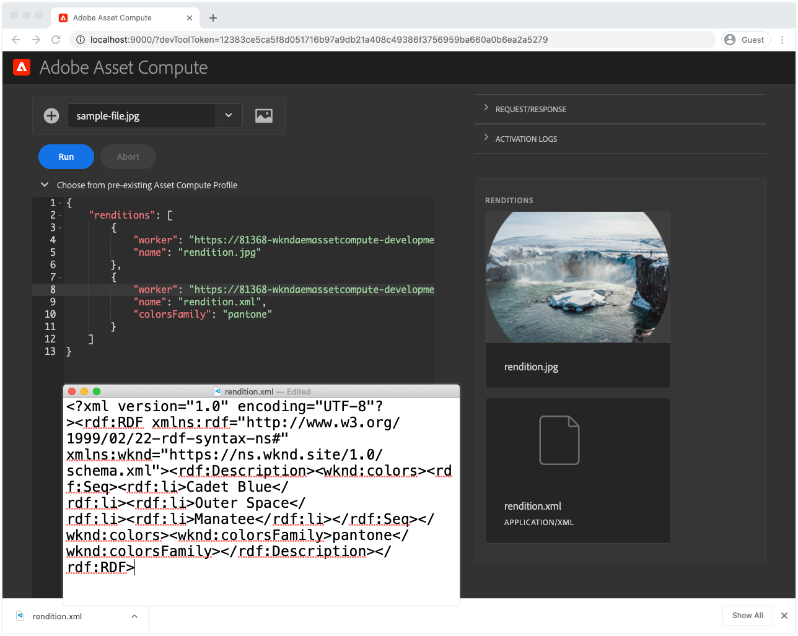
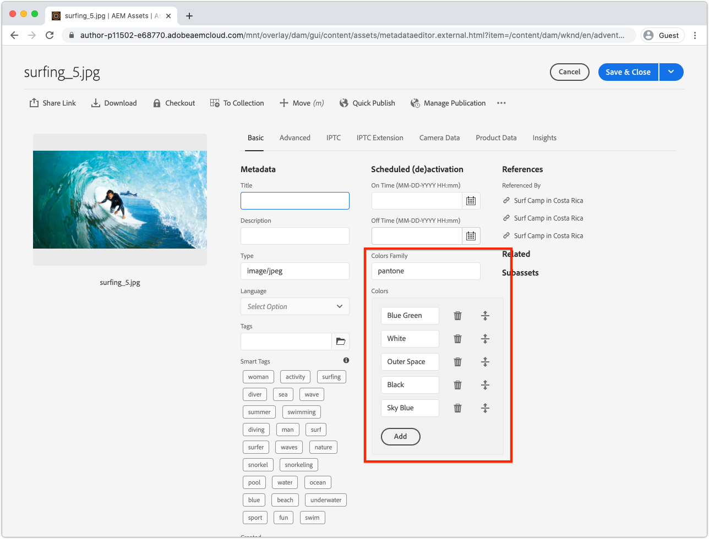
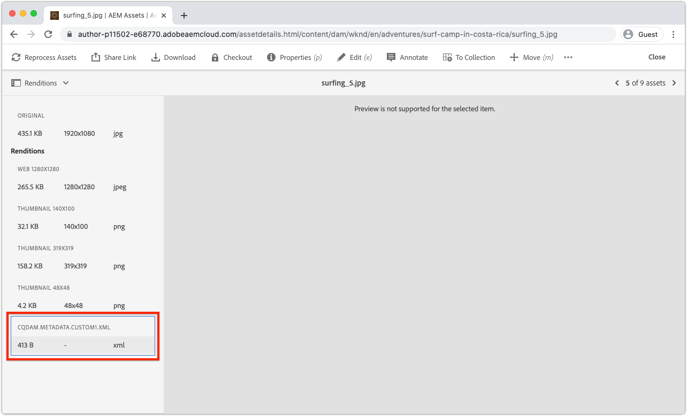

# Desenvolver um trabalhador de metadados de Asset computes

Os funcionários do Asset compute personalizado podem produzir dados de XMP (XML) que são enviados para AEM e armazenados como metadados em um ativo.

Os casos de uso frequentes incluem:

+ Integrações com sistemas de terceiros, como um PIM (Product Information Management system), em que metadados adicionais devem ser recuperados e armazenados no ativo
+ Integrações com serviços de Adobe, como o AI de Conteúdo e Comércio para aumentar os metadados de ativos com atributos adicionais de aprendizado de máquina
+ Derivar metadados sobre o ativo de seu binário e armazená-lo como metadados de ativos em AEM como um Cloud Service

## O que você vai fazer

>[!VIDEO](https://video.tv.adobe.com/v/327313?quality=12&learn=on)

Neste tutorial, criaremos um trabalhador de metadados de Asset compute que deriva as cores mais usadas em um ativo de imagem e gravará os nomes das cores de volta nos metadados do ativo no AEM. Embora o próprio trabalhador seja básico, este tutorial o usa para explorar como os trabalhadores do Asset compute podem ser usados para gravar metadados em ativos no AEM como Cloud Service.

## Fluxo lógico de uma invocação do trabalhador de metadados de Asset compute

A invocação de trabalhadores de metadados de Asset compute é quase idêntica à de [trabalhadores geradores de execuções binárias](../develop/worker.md), com a diferença principal sendo o tipo de retorno é uma representação XMP (XML) cujos valores também são gravados nos metadados do ativo.

Os funcionários do asset compute implementam o contrato da API de trabalho do SDK do Asset compute, na função `renditionCallback(...)`, que é conceitualmente:

+ __Entrada:__ os parâmetros originais do binário e do Perfil de processamento de um ativo AEM
+ __Saída:__ uma representação XMP (XML) persistiu para o ativo AEM como uma representação e para os metadados do ativo


1. O serviço de autor de AEM chama o trabalhador de metadados do Asset compute, fornecendo o binário original __(1a)__ do ativo e __(1b)__ quaisquer parâmetros definidos no Perfil de processamento.
1. O SDK do Asset compute orquestra a execução da função `renditionCallback(...)` do funcionário de metadados do Asset compute personalizado, derivando uma execução XMP (XML), com base no binário do ativo __(1a)__ e em quaisquer parâmetros do Perfil de processamento __(1b)__.
1. O trabalhador do Asset compute salva a representação do XMP (XML) em `rendition.path`.
1. Os dados XMP (XML) gravados em `rendition.path` são transportados pelo SDK do Asset compute para o serviço de autor de AEM e os expõe como __(4a)__ uma renderização de texto e __(4b)__ persistidos no nó de metadados do ativo.

## Configure o manifest.yml{#manifest}

Todos os trabalhadores do Asset compute devem estar registrados em [manifest.yml](../develop/manifest.md).

Abra o `manifest.yml` do projeto e adicione uma entrada de trabalhador que configure o novo trabalhador, neste caso `metadata-colors`.

_Lembre-se de que  `.yml` o espaço em branco é sensível._

```
packages:
  __APP_PACKAGE__:
    license: Apache-2.0
    actions: 
      worker:
        function: actions/worker/index.js 
        web: 'yes' 
        runtime: 'nodejs:12'
        limits:
          timeout: 60000 # in ms
          memorySize: 512 # in MB
          concurrency: 10 
        annotations:
          require-adobe-auth: true
      metadata-colors:
        function: actions/metadata-colors/index.js 
        web: 'yes' 
        runtime: 'nodejs:12'
        limits:
          memorySize: 512 # in MB   
```

`function` aponta para a implementação do trabalhador criada na  [próxima etapa](#metadata-worker). Nomeie trabalhadores semânticos (por exemplo, `actions/worker/index.js` pode ter sido mais bem nomeado `actions/rendition-circle/index.js`), como mostram o URL [do trabalhador](#deploy) e também determinam o [nome da pasta de conjunto de testes do trabalhador](#test).

Os `limits` e `require-adobe-auth` são configurados separadamente por trabalhador. Neste trabalhador, `512 MB` da memória é alocada como o código inspeciona (potencialmente) grandes dados de imagem binária. Os outros `limits` são removidos para usar os padrões.

## Desenvolver um trabalhador de metadados{#metadata-worker}

Crie um novo arquivo JavaScript do trabalhador de metadados no projeto do Asset compute no caminho [manifest.yml definido para o novo trabalhador](#manifest), em `/actions/metadata-colors/index.js`

### Instalar módulos npm

Instale os módulos npm adicionais ([@adobe/asset-compute-xmp](https://www.npmjs.com/package/@adobe/asset-compute-xmp?activeTab=versions), [get-image-color](https://www.npmjs.com/package/get-image-colors) e [color-namer](https://www.npmjs.com/package/color-namer)) que serão utilizados neste trabalhador de Asset computes.

```
$ npm install @adobe/asset-compute-xmp
$ npm install get-image-colors
$ npm install color-namer
```

### Código do trabalhador de metadados

Este trabalhador parece muito semelhante ao [trabalhador gerador de execuções](../develop/worker.md), a principal diferença é que grava dados XMP (XML) no `rendition.path` para ser salvo de volta para AEM.


```javascript
"use strict";

const { worker, SourceCorruptError } = require("@adobe/asset-compute-sdk");
const fs = require("fs").promises;

// Require the @adobe/asset-compute-xmp module to create XMP 
const { serializeXmp } = require("@adobe/asset-compute-xmp");

// Require supporting npm modules to derive image colors from image data
const getColors = require("get-image-colors");
// Require supporting npm modules to convert image colors to color names
const namer = require("color-namer");

exports.main = worker(async (source, rendition, params) => {
  // Perform any necessary source (input) checks
  const stats = await fs.stat(source.path);
  if (stats.size === 0) {
    // Throw appropriate errors whenever an erring condition is met
    throw new SourceCorruptError("source file is empty");
  }
  const MAX_COLORS = 10;
  const DEFAULT_COLORS_FAMILY = 'basic';

  // Read the color family parameter to use to derive the color names
  let colorsFamily = rendition.instructions.colorsFamily || DEFAULT_COLORS_FAMILY;

  if (['basic', 'hex', 'html', 'ntc', 'pantone', 'roygbiv'].indexOf(colorsFamily) === -1) { 
      colorsFamily = DEFAULT_COLORS_FAMILY;
  }
  
  // Use the `get-image-colors` module to derive the most common colors from the image
  let colors = await getColors(source.path, { options: MAX_COLORS });

  // Convert the color Chroma objects to their closest names
  let colorNames = colors.map((color) => getColorName(colorsFamily, color));

  // Serialize the data to XMP metadata
  // These properties are written to the [dam:Asset]/jcr:content/metadata resource
  // This stores
  // - The list of color names is stored in a JCR property named `wknd:colors`
  // - The colors family used to derive the color names is stored in a JCR property named `wknd:colorsFamily`
  const xmp = serializeXmp({
      // Use a Set to de-duplicate color names
      "wknd:colors": [...new Set(colorNames)],
      "wknd:colorsFamily": colorsFamily
    }, {
      // Define any property namespaces used in the above property/value definition
      // These namespaces will be automatically registered in AEM if they do not yet exist
      namespaces: {
        wknd: "https://wknd.site/assets/1.0/",
      },
    }
  );

  // Save the XMP metadata to be written back to the asset's metadata node
  await fs.writeFile(rendition.path, xmp, "utf-8");
});

/**
 * Helper function that derives the closest color name for the color, based on the colors family
 * 
 * @param {*} colorsFamily the colors name family to use
 * @param {*} color the color to convert to a name
 */
function getColorName(colorsFamily, color) {
    if ('hex' === colorsFamily) {  return color; }

    let names = namer(color.rgb())[colorsFamily];

    if (names.length >= 1) { return names[0].name; }
}
```

## Executar o trabalhador de metadados localmente{#development-tool}

Com o código de trabalho concluído, ele pode ser executado usando a ferramenta local de desenvolvimento de Asset computes.

Como nosso projeto de Asset compute contém dois trabalhadores (a renderização [círculo anterior](../develop/worker.md) e este `metadata-colors` trabalhador), a definição de perfil [Ferramenta de Desenvolvimento de Asset computes](../develop/development-tool.md) lista perfis de execução para ambos os trabalhadores. A segunda definição de perfil aponta para o novo trabalhador `metadata-colors`.



1. Da raiz do projeto do Asset compute
1. Execute `aio app run` para start da Ferramenta de Desenvolvimento de Asset computes
1. Em __Selecione um ficheiro...__ menu suspenso, escolha [imagem de amostra](../assets/samples/sample-file.jpg) para processar
1. Na segunda configuração de definição de perfil, que aponta para o trabalhador `metadata-colors`, atualize `"name": "rendition.xml"` à medida que este trabalhador gera uma execução XMP (XML). Como opção, adicione um parâmetro `colorsFamily` (valores suportados `basic`, `hex`, `html`, `ntc`, `pantone`, `roygbiv`).

   ```json
   {
       "renditions": [
           {
               "worker": "...",
               "name": "rendition.xml",
               "colorsFamily": "pantone"
           }
       ]
   }
   ```
1. Toque em __Executar__ e aguarde a execução XML ser gerada
   + Como ambos os trabalhadores estão listados na definição do perfil, ambas as execuções serão geradas. Como opção, a definição do perfil superior que aponta para o [trabalhador de representação em círculo](../develop/worker.md) pode ser excluída, para evitar executá-la da Ferramenta de Desenvolvimento.
1. A seção __Representações__ pré-visualização a representação gerada. Toque em `rendition.xml` para baixá-lo e abra-o no Código VS (ou no editor de texto XML/texto favorito) para revisá-lo.

## Testar o trabalhador{#test}

Os trabalhadores de metadados podem ser testados usando a mesma estrutura de teste de Asset compute [que as renderizações binárias](../test-debug/test.md). A única diferença é que o arquivo `rendition.xxx` no caso de teste deve ser a execução XMP (XML) esperada.

1. Crie a seguinte estrutura no projeto do Asset compute:

   ```
   /test/asset-compute/metadata-colors/success-pantone/
   
       file.jpg
       params.json
       rendition.xml
   ```

2. Use o [arquivo de amostra](../assets/samples/sample-file.jpg) como `file.jpg` do caso de teste.
3. Adicione o seguinte JSON ao `params.json`.

   ```
   {
       "fmt": "xml",
       "colorsFamily": "pantone"
   }
   ```

   Observe que `"fmt": "xml"` é necessário para instruir o conjunto de testes a gerar uma renderização `.xml` baseada em texto.

4. Forneça o XML esperado no arquivo `rendition.xml`. Esta informação pode ser obtida:
   + Executar o arquivo de entrada de teste por meio da ferramenta de desenvolvimento e salvar a execução XML (validada) fora.

   ```
   <?xml version="1.0" encoding="UTF-8"?><rdf:RDF xmlns:rdf="http://www.w3.org/1999/02/22-rdf-syntax-ns#" xmlns:wknd="https://wknd.site/assets/1.0/"><rdf:Description><wknd:colors><rdf:Seq><rdf:li>Silver</rdf:li><rdf:li>Black</rdf:li><rdf:li>Outer Space</rdf:li></rdf:Seq></wknd:colors><wknd:colorsFamily>pantone</wknd:colorsFamily></rdf:Description></rdf:RDF>
   ```

5. Execute `aio app test` da raiz do projeto do Asset compute para executar todos os conjuntos de teste.

### Implantar o trabalhador no Adobe I/O Runtime{#deploy}

Para chamar esse novo trabalhador de metadados do AEM Assets, ele deve ser implantado no Adobe I/O Runtime usando o comando:

```
$ aio app deploy
```


Observe que isso implantará todos os funcionários no projeto. Revise as [instruções de implantação não abreviadas](../deploy/runtime.md) para saber como implantar nos espaços de trabalho do Stage e do Production.

### Integrar a Perfis de processamento AEM{#processing-profile}

Chame o trabalhador de AEM criando um novo serviço de Perfil de processamento personalizado existente ou modificando um existente que chame esse funcionário implantado.


1. Faça logon no AEM como um serviço de autor de Cloud Service como um __AEM Administrador__
1. Navegue até __Ferramentas > Ativos > Perfis de processamento__
1. ____ Crie um Perfil de processamento novo ou  ____ editável e existente
1. Toque na guia __Personalizado__ e toque em __Adicionar novo__
1. Definir o novo serviço
   + __Criar representação__ de metadados: Alternar para ativo
   + __Ponto de extremidade:__ `https://...adobeioruntime.net/api/v1/web/wkndAemAssetCompute-0.0.1/metadata-colors`
      + Este é o URL do trabalhador obtido durante a [implantação](#deploy) ou usando o comando `aio app get-url`. Verifique se o URL aponta para a área de trabalho correta com base no AEM como um ambiente Cloud Service.
   + __Parâmetros de serviço__
      + Toque em __Adicionar Parâmetro__
         + Chave: `colorFamily`
         + Valor: `pantone`
            + Valores suportados: `basic`, `hex`, `html`, `ntc`, `pantone`, `roygbiv`
   + __Tipos de mime__
      + __Inclui:__ `image/jpeg`,  `image/png`,  `image/gif`,  `image/svg`
         + Esses são os únicos tipos MIME suportados pelos módulos npm de terceiros usados para derivar as cores.
      + __Exclui:__ `Leave blank`
1. Toque em __Salvar__ no canto superior direito
1. Aplique o Perfil de processamento a uma pasta do AEM Assets se ainda não tiver feito isso

### Atualizar o Schema de Metadados{#metadata-schema}

Para revisar os metadados de cores, mapeie dois novos campos no schema de metadados da imagem para as novas propriedades de dados de metadados que o trabalhador preenche.


1. No serviço Autor de AEM, navegue até __Ferramentas > Ativos > Schemas de metadados__
1. Navegue até __padrão__ e selecione e edite __imagem__ e adicione campos de formulário somente leitura para expor os metadados de cor gerados
1. Adicionar um __Texto de Linha Única__
   + __Rótulo do campo__: `Colors Family`
   + __Mapear para a propriedade__: `./jcr:content/metadata/wknd:colorsFamily`
   + __Regras > Campo > Desativar edição__: Verificado
1. Adicionar um __Texto com vários valores__
   + __Rótulo do campo__: `Colors`
   + __Mapear para a propriedade__: `./jcr:content/metadata/wknd:colors`
1. Toque em __Salvar__ no canto superior direito

## Processando ativos



1. No serviço Autor de AEM, navegue até __Ativos > Arquivos__
1. Navegue até a pasta ou subpasta à qual o Perfil Processamento é aplicado
1. Carregue uma nova imagem (JPEG, PNG, GIF ou SVG) na pasta ou reprocesse imagens existentes usando o Perfil de processamento [atualizado](#processing-profile)
1. Quando o processamento estiver concluído, selecione o ativo e toque __propriedades__ na barra de ação superior para exibir seus metadados
1. Analise os `Colors Family` e `Colors` [campos de metadados](#metadata-schema) para obter os metadados escritos a partir do trabalhador de metadados de Asset compute personalizado.

Com os metadados coloridos gravados nos metadados do ativo, no recurso `[dam:Asset]/jcr:content/metadata`, esses metadados são indexados e aumentam a capacidade de descoberta do ativo usando esses termos por meio da pesquisa, e podem até ser gravados de volta no binário do ativo se o fluxo de trabalho __DAM Metadata Writeback__ for chamado nele.

### Execução de metadados no AEM Assets



O arquivo de XMP real gerado pelo trabalhador de metadados do Asset compute também é armazenado como uma representação discreta no ativo. Normalmente, esse arquivo não é usado, em vez disso, os valores aplicados ao nó de metadados do ativo são usados, mas a saída XML bruta do trabalhador está disponível no AEM.

## código de trabalho de cores de metadados no Github

O `metadata-colors/index.js` final está disponível no Github em:

+ [aem-guides-wknd-asset-compute/actions/metadata-colors/index.js](https://github.com/adobe/aem-guides-wknd-asset-compute/blob/master/actions/metadata-colors/index.js)

O conjunto de testes final `test/asset-compute/metadata-colors` está disponível no Github em:

+ [aem-guides-wknd-asset-compute/test/asset-compute/metadata-color](https://github.com/adobe/aem-guides-wknd-asset-compute/blob/master/test/asset-compute/metadata-colors)
