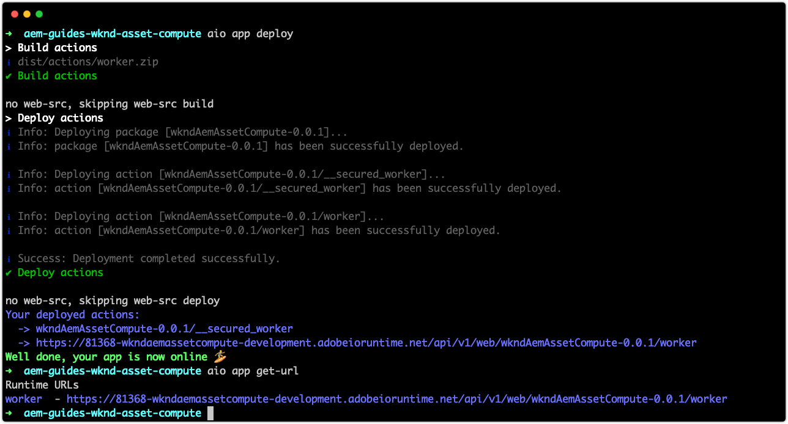

# Implantar no Adobe I/O Runtime

Os projetos do Asset Compute e os trabalhadores que eles contêm devem ser implantados no Adobe I/O Runtime por meio da CLI do Adobe I/O para serem usados pelo AEM as a Cloud Service.

Ao implantar no Adobe I/O Runtime para uso pelos serviços do AEM as a Cloud Service Author, somente duas variáveis de ambiente são necessárias:

+ `AIO_runtime_namespace` aponta o App Builder Workspace para implantar
+ `AIO_runtime_auth` são as credenciais de autenticação do espaço de trabalho do App Builder

As outras variáveis padrão definidas no arquivo `.env` são fornecidas implicitamente pela AEM as a Cloud Service quando ela invoca o trabalhador do Asset Compute.

## Workspace de desenvolvimento

Como este projeto foi gerado usando `aio app init` o espaço de trabalho `Development`, `AIO_runtime_namespace` é automaticamente definido como `81368-wkndaemassetcompute-development` com o `AIO_runtime_auth` correspondente em nosso arquivo `.env` local.  Se um arquivo `.env` existir no diretório usado para emitir o comando de implantação, seus valores serão usados, a menos que sejam substituídos por uma exportação de variável de nível de SO, que é como os espaços de trabalho de [estágio e produção](#stage-and-production) são direcionados.



Para implantar no espaço de trabalho definido no arquivo de projetos `.env`:

1. Abra a linha de comando na raiz do projeto Asset Compute
1. Executar o comando `aio app deploy`
1. Execute o comando `aio app get-url` para obter a URL do trabalhador a ser usada no Perfil de Processamento do AEM as a Cloud Service para fazer referência a esse trabalhador personalizado do Asset Compute. Se o projeto contiver vários workers, os URLs discretos para cada worker serão listados.

Se os ambientes de desenvolvimento local e AEM as a Cloud Service Development usarem implantações separadas do Asset Compute, as implantações no AEM as a Cloud Service Dev poderão ser gerenciadas da mesma maneira que as [implantações de Preparo e Produção](#stage-and-production).

## Espaços de trabalho de preparo e produção{#stage-and-production}

A implantação em espaços de trabalho de preparo e produção geralmente é feita pelo sistema de CI/CD de sua escolha. O projeto do Asset Compute deve ser implantado em cada Workspace (Preparação e, em seguida, Produção) de forma separada.

Definir variáveis de ambiente verdadeiras substitui valores para as variáveis de mesmo nome em `.env`.


A abordagem geral, normalmente automatizada por um sistema CI/CD, para implantação em ambientes de Preparo e Produção é:

1. Verifique se o [módulo npm da CLI do Adobe I/O e o plug-in do Asset Compute](../set-up/development-environment.md#aio) estão instalados
1. Confira o projeto do Asset Compute para implantar do Git
1. Defina as variáveis de ambiente com os valores que correspondem ao espaço de trabalho de destino (Preparo ou Produção)
   + As duas variáveis necessárias são `AIO_runtime_namespace` e `AIO_runtime_auth` e são obtidas por espaço de trabalho no Adobe I/O Developer Console por meio do recurso __Baixar tudo__ da Workspace.


Os valores dessas chaves podem ser definidos emitindo comandos export a partir da linha de comando:

```
$ export AIO_runtime_namespace=81368-wkndaemassetcompute-stage
$ export AIO_runtime_auth=27100f9f-2676-4cce-b73d-b3fb6bac47d1:0tDu307W6MboQf5VWB1BAK0RHp8xWqSy1CQc3lKe7f63o3aNtAu0Y3nAmN56502W
```

Se os funcionários do Asset Compute exigirem outras variáveis, como no armazenamento em nuvem, elas também deverão ser exportadas como variáveis de ambiente.

1. Depois que todas as variáveis de ambiente forem definidas para o espaço de trabalho de destino no qual implantar, execute o comando deploy:
   + `aio app deploy`
1. Os URLs de trabalho referenciados pelo Perfil de processamento do AEM as a Cloud Service também estão disponíveis por meio de:
   + `aio app get-url`.

Se a versão do projeto do Asset Compute alterar, os URLs do trabalhador também serão alterados para refletir a nova versão, e o URL precisará ser atualizado nos Perfis de processamento.

## Provisionamento da API do Workspace{#workspace-api-provisioning}

Quando o [projeto do App Builder foi configurado no Adobe I/O Asset Compute](../set-up/app-builder.md) para oferecer suporte ao desenvolvimento local, um novo espaço de trabalho de Desenvolvimento foi criado e __foram adicionados a ele os Eventos de E/S__ e __APIs de Gerenciamento de Eventos de E/S__.

As APIS do __Asset Compute, Eventos de E/S__ e __Gerenciamento de Eventos de E/S__ só são adicionadas explicitamente aos espaços de trabalho usados para desenvolvimento local. Os espaços de trabalho que se integram (exclusivamente) a ambientes AEM as a Cloud Service __não__ precisam dessas APIs explicitamente adicionadas, pois elas são disponibilizadas naturalmente para o AEM as a Cloud Service.
