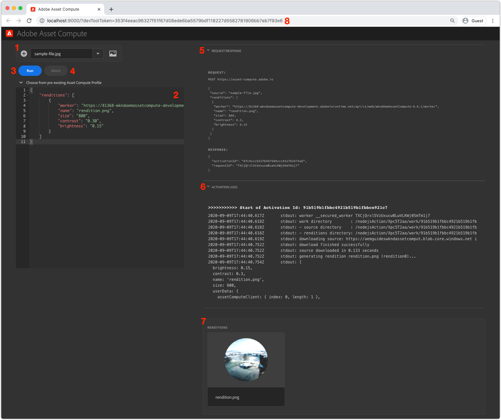

# Ferramenta de desenvolvimento de computação de ativos

A Asset Compute Development Tool é um recurso da Web local que permite aos desenvolvedores configurar e executar os funcionários do Asset Computer localmente, fora do contexto do SDK do AEM em relação aos recursos do Asset Compute no Adobe I/O Runtime.

## Execute a ferramenta de desenvolvimento Asset Compute

A Ferramenta de desenvolvimento de computação de ativos pode ser executada a partir da raiz do projeto Computação de ativos por meio do comando terminal:

```
$ aio app run
```

Isso start a ferramenta de desenvolvimento em __http://localhost:9000__ e a abre automaticamente em uma janela do navegador. Para que a ferramenta de desenvolvimento seja executada, [um devToolToken válido gerado automaticamente deve ser fornecido por meio de um parâmetro](#troubleshooting__devtooltoken)de query.

## Entenda a interface das ferramentas de desenvolvimento da Asset Compute{#interface}



1. __Arquivo de origem:__ A seleção do arquivo de origem é usada para:
   + Selecionado o binário de ativo que será o `source` binário passado para o funcionário de Computação de ativos
   + Carregar arquivos de origem
1. __Definição do perfil do Asset Compute:__ Define o trabalhador do Asset Compute a ser executado incluindo parâmetros: incluindo o ponto final do URL do trabalhador, o nome da representação resultante e quaisquer parâmetros
1. __Executar:__ O botão Executar executa o perfil Asset Compute, conforme definido no editor do perfil de configuração Asset Compute
1. __Abortar:__ O botão Abortar cancela uma execução iniciada ao tocar no botão Executar
1. __Solicitação/resposta:__ Fornece a solicitação HTTP e a resposta para/do trabalhador Asset Compute em execução no Adobe I/O Runtime. Isso pode ser útil para depurar
1. __Logs de ativação:__ Os registros que descrevem a execução do trabalhador do Asset Compute, juntamente com quaisquer erros. Essas informações também estão disponíveis no `aio app run` padrão
1. __Representações:__ Exibe todas as representações geradas pela execução do trabalhador do Asset Compute
1. __parâmetro do query devToolToken:__ O token Asset Compute Development Tool requer que um parâmetro de `devToolToken` query válido esteja presente. Esse token é gerado automaticamente sempre que uma nova ferramenta de desenvolvimento é gerada

### Executar um trabalhador personalizado

>[!VIDEO](https://video.tv.adobe.com/v/40241?quality=12&learn=on)

_Click-through de executar um trabalho de Computação de ativos na Ferramenta de desenvolvimento (Sem áudio)_

1. Certifique-se de que a Ferramenta de desenvolvimento de computação de ativo seja iniciada da raiz do seu projeto usando o `aio app run` comando.
1. Na Ferramenta de desenvolvimento de computação de ativos, carregue ou selecione um arquivo de imagem de [amostra](../assets/samples/sample-file.jpg)
   + Verifique se o arquivo está selecionado na lista suspensa Arquivo ____ de origem
1. Revise a área de texto de definição __do perfil__ Asset Compute
   + A `worker` chave define o URL para o trabalhador implantado do Asset Compute
   + A `name` chave define o nome da representação a ser gerada
   + Outras chaves/valores podem ser fornecidos neste objeto JSON e estarão disponíveis no trabalhador sob o `rendition.instructions` objeto
      + Como opção, adicione valores para `size`, `contrast` e `brightness`:

         ```json
         {
             "renditions": [
                 {
                     "worker": "...",
                     "name": "rendition.png",
                     "size":"800",
                     "contrast": "0.30",
                     "brightness": "-0.15"
                 }
             ]
         }
         ```

1. Toque no botão __Executar__
1. A seção ____ Representações será preenchida com um espaço reservado para representação
1. Quando o trabalhador for concluído, o espaço reservado da representação exibirá a representação gerada

Fazer alterações de código no código de trabalho enquanto a Ferramenta de Desenvolvimento estiver em execução &quot;implantará&quot; as alterações em tempo real. A &quot;implantação ativa&quot; leva vários segundos, portanto, permita que a implantação seja concluída antes de reexecutar o funcionário da ferramenta de desenvolvimento.

## Resolução de problemas

### Menu suspenso de arquivos de origem incorreto{#troubleshooting__dev-tool-application-cache}

A Ferramenta de Desenvolvimento de Computação de Ativo pode inserir um estado em que extrai dados obsoletos e é mais visível na lista suspensa Arquivo ____ de origem exibindo itens incorretos.

+ __Erro:__ A lista suspensa do arquivo de origem exibe itens incorretos.
+ __Causa:__ O estado do navegador em cache obsoleto causa a
+ __Resolução:__ Em seu navegador, limpe completamente o &quot;estado do aplicativo&quot; da guia do navegador, o cache do navegador, o armazenamento local e o trabalhador do serviço.

### Parâmetro de query devToolToken ausente ou inválido{#troubleshooting__devtooltoken}

+ __Erro:__ Notificação &quot;Não autorizada&quot; na ferramenta de desenvolvimento de computação de ativos
+ __Causa:__ `devToolToken` está ausente ou inválido
+ __Resolução:__ Feche a janela do navegador Asset Compute Development Tool, encerre todos os processos em execução da Ferramenta de desenvolvimento iniciados por meio do `aio app run` comando e refaça o start Development Tool (usando `aio app run`).

### Não é possível remover arquivos de origem{#troubleshooting__remove-source-files}

+ __Erro:__ Não há como remover arquivos de origem adicionados da interface do usuário das Ferramentas de Desenvolvimento
+ __Causa:__ Esta funcionalidade não foi implementada
+ __Resolução:__ Faça logon no provedor de armazenamentos na nuvem usando as credenciais definidas em `.env`. Localize o container usado pelas Ferramentas de desenvolvimento (também especificadas em `.env`), navegue até a pasta __de origem__ e exclua as imagens de origem. Talvez seja necessário executar as etapas descritas na lista suspensa Arquivos [de origem incorretas](#troubleshooting__dev-tool-application-cache) se os arquivos de origem excluídos continuarem a ser exibidos na lista suspensa, pois podem ser armazenados em cache localmente no &quot;estado do aplicativo&quot; das Ferramentas de desenvolvimento.

   
