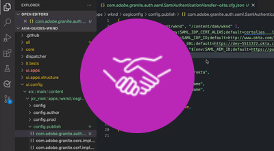

# Autenticação AEM as a Cloud Service

O AEM as a Cloud Service oferece suporte a várias opções de autenticação e varia de acordo com o tipo de serviço.

|                       | Autor do AEM | Publicação no AEM |
|-----------------------|:----------:|:-----------:|
| [Adobe IMS](../accessing/overview.md) | ✔ | ✘ |
| · [SAML 2.0 via Adobe IMS](https://experienceleague.adobe.com/docs/experience-manager-cloud-service/content/security/ims-support.html#how-to-set-up) | ✔ | ✘ |
| [SAML 2.0](./saml-2-0.md) | ✘ | ✔ |
| [Logon único (SSO)](https://experienceleague.adobe.com/docs/experience-manager-cloud-service/content/sites/authoring/personalization/user-and-group-sync-for-publish-tier.html#integration-with-an-idp) | ✘ | ✔ |
| [OAuth](https://experienceleague.adobe.com/docs/experience-manager-cloud-service/content/sites/authoring/personalization/user-and-group-sync-for-publish-tier.html#integration-with-an-idp) | ✘ | ✔ |
| [Autenticação do token](../../headless-tutorial/authentication/overview.md) | ✔ | ✔ |
| Autenticação básica | ✘ | ✘ |

## Opções de autenticação

Clique no link correspondente abaixo para obter detalhes sobre como configurar e usar a abordagem de autenticação.

<table>
  <tr>
   <td>
      
      
<strong><a href="../accessing/overview.md">Adobe IMS</a></strong>

      

          Gerencie o acesso do autor do AEM usando o Adobe IMS pela Adobe Admin Console.
      

    </td>   
   <td>
      
      
<strong><a href="./saml-2-0.md">SAML 2.0</a></strong>

      

        Autentique o usuário do site em um IDP usando a integração SAML 2.0 do serviço AEM Publish.
      

    </td>   
   <td>
      
      
<strong><a href="../../headless-tutorial/authentication/overview.md">Autenticação do token</a></strong>

      

        Permitir que aplicativos e middleware se autentiquem no AEM usando um token de serviço de API.
      

    </td>   
  </tr>
</table>
