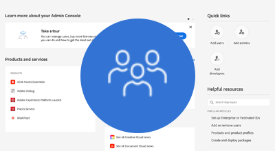

# AEM autenticação as a Cloud Service

AEM as a Cloud Service suporta várias opções de autenticação e varia de acordo com o tipo de serviço.

|  | Autor do AEM | AEM Publish |
|-----------------------|:----------:|:-----------:|
| [Adobe IMS](../accessing/overview.md) | ✔ | ✘ |
| [SAML 2.0](./saml-2-0.md) | ✘ | ✔ |
| [Autenticação de token](../../headless-tutorial/authentication/overview.md) | ✔ | ✔ |

## Opções de autenticação

Clique no link correspondente abaixo para obter detalhes sobre como configurar e usar a abordagem de autenticação.

<table>
  <tr>
   <td>
      
      
<strong><a href="../accessing/overview.md">Adobe IMS</a></strong>

      

          Gerencie o acesso do autor do AEM usando o Adobe IMS por meio da Adobe Admin Console.
      

    </td>   
   <td>
      
      
<strong><a href="./saml-2-0.md">SAML 2.0</a></strong>

      

        Autentique o usuário de seu site para um IDP usando a integração SAML 2.0 do serviço de publicação do AEM.
      

    </td>   
   <td>
      
      
<strong><a href="../../headless-tutorial/authentication/overview.md">Autenticação de token</a></strong>

      

        Permita que aplicativos e middleware sejam autenticados em AEM usando um token de serviço de API.
      

    </td>   
  </tr>
</table>
