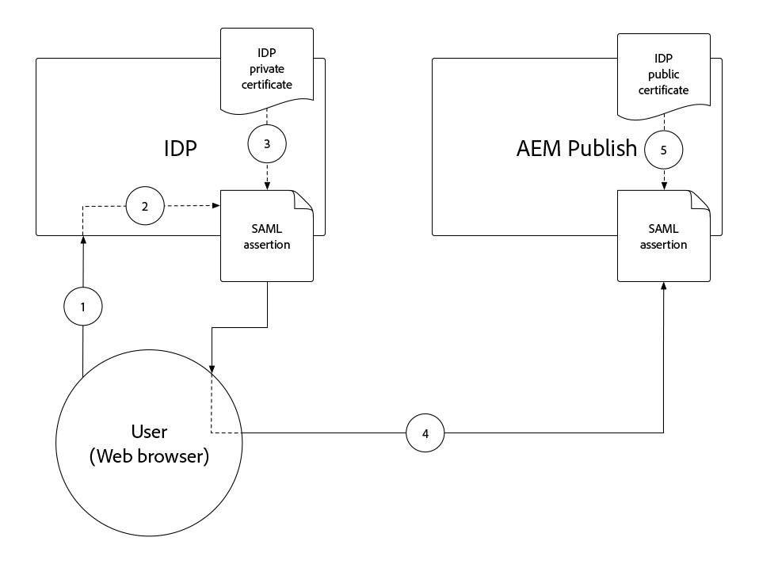
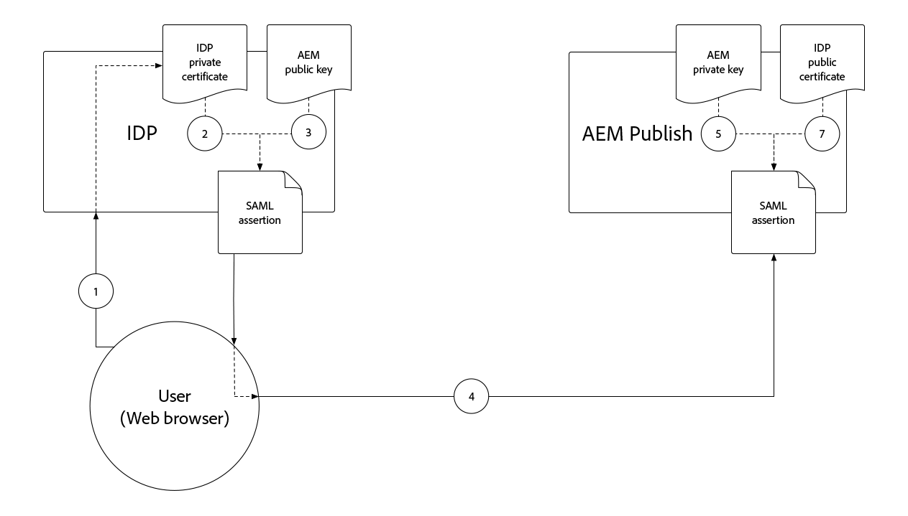

# Autenticação SAML 2.0{#saml-2-0-authentication}

Saiba como configurar e autenticar usuários finais (não autores do AEM) em um IDP compatível com SAML 2.0 de sua escolha.

## Qual SAML para AEM as a Cloud Service?

A integração do SAML 2.0 com o AEM Publish (ou Preview) permite que os usuários finais de uma experiência da Web com base no AEM se autentiquem em um IDP (Identity Provider) que não seja da Adobe e acessem o AEM como um usuário nomeado e autorizado.

|                       | Autor do AEM | AEM Publish |
|-----------------------|:----------:|:-----------:|
| Suporte ao SAML 2.0 | ✘ | ✔ |

+++ Entender o fluxo do SAML 2.0 com o AEM

O fluxo típico de uma integração do AEM Publish SAML é o seguinte:

1. O usuário faz uma solicitação para o AEM Publish, o indica que a autenticação é necessária.
   + O usuário solicita um recurso protegido CUGs/ACL.
   + O usuário solicita um recurso que está sujeito a um Requisito de autenticação.
   + O usuário segue um link para o ponto de extremidade de logon do AEM (ou seja, `/system/sling/login`) que solicita explicitamente a ação de logon.
1. O AEM faz uma AuthnRequest ao IDP, solicitando que ele inicie o processo de autenticação.
1. O usuário é autenticado no IDP.
   + O IDP solicita as credenciais ao usuário.
   + O usuário já está autenticado com o IDP e não precisa fornecer mais credenciais.
1. O IDP gera uma asserção SAML contendo os dados do usuário e a assina usando o certificado privado do IDP.
1. O IDP envia a asserção SAML via HTTP POST, por meio do navegador da Web do usuário (RESPECTIVE_PROTECTED_PATH/saml_login), para o AEM Publish.
1. O AEM Publish recebe a asserção SAML e valida a integridade e autenticidade da asserção SAML usando o certificado público IDP.
1. O AEM Publish gerencia o registro de usuário do AEM com base na configuração OSGi do SAML 2.0 e no conteúdo da Asserção SAML.
   + Cria usuário
   + Sincroniza os atributos do usuário
   + Atualiza a associação do grupo de usuários do AEM
1. O AEM Publish define o cookie AEM `login-token` na resposta HTTP, que é usado para autenticar solicitações subsequentes ao AEM Publish.
1. A Publicação do AEM redireciona o usuário para a URL na Publicação do AEM conforme especificado pelo cookie `saml_request_path`.

+++

## Passo a passo da configuração

>[!VIDEO](https://video.tv.adobe.com/v/343040?quality=12&learn=on)

Este vídeo aborda a configuração da integração do SAML 2.0 com o serviço de publicação do AEM as a Cloud Service e o uso do Okta como o IDP.

## Pré-requisitos

Os seguintes itens são necessários ao configurar a autenticação SAML 2.0:

+ Acesso do gerente de implantação ao Cloud Manager
+ Acesso do administrador do AEM ao ambiente do AEM as a Cloud Service
+ Acesso de administrador ao IDP
+ Opcionalmente, acesso a um par de chaves público/privado usado para criptografar cargas SAML

O SAML 2.0 é compatível apenas com usos de autenticação para Publicação ou Pré-visualização do AEM. Para gerenciar a autenticação do AEM Author usando e o IDP, [integre o IDP ao Adobe IMS](https://helpx.adobe.com/br/enterprise/using/set-up-identity.html).


## Instalar certificado público do IDP no AEM

O certificado público do IDP é adicionado ao armazenamento global de confiança da AEM e usado para validar se a asserção SAML enviada pelo IDP é válida.

+++Fluxo de assinatura de asserção SAML



1. O usuário é autenticado no IDP.
1. O IDP gera uma asserção SAML contendo os dados do usuário.
1. O IDP assina a asserção SAML usando o certificado privado do IDP.
1. O IDP inicia uma HTTP POST do lado do cliente para o ponto de extremidade SAML (`.../saml_login`) do AEM Publish que inclui a declaração SAML assinada.
1. O AEM Publish recebe o HTTP POST contendo a asserção SAML assinada, que pode validar a assinatura usando o certificado público IDP.

+++


1. Obtenha o arquivo de __certificado público__ do IDP. Esse certificado permite que o AEM valide a asserção SAML fornecida ao AEM pelo IDP.

   O certificado está no formato PEM e deve se parecer com:

   ```
   -----BEGIN CERTIFICATE-----
   MIIC4jCBAcoCCQC33wnybT5QZDANBgkqhkiG9w0BAQsFADAyMQswCQYDVQQGEwJV
   ...
   m0eo2USlSRTVl7QHRTuiuSThHpLKQQ==
   -----END CERTIFICATE-----
   ```

1. Faça logon no AEM Author como Administrador do AEM.
1. Navegue até __Ferramentas > Segurança > Armazenamento confiável__.
1. Crie ou abra o Armazenamento global de confiança. Se estiver criando um armazenamento global de confiança, armazene a senha em algum lugar seguro.
1. Expanda __Adicionar certificado do arquivo CER__.
1. Selecione __Selecionar arquivo de certificado__ e carregue o arquivo de certificado fornecido pelo IDP.
1. Deixe __Mapear certificado para o usuário__ em branco.
1. Selecione __Enviar__.
1. O certificado adicionado recentemente aparece acima da seção __Adicionar certificado do arquivo CRT__.
1. Anote o __alias__, pois esse valor é usado na [configuração OSGi do Manipulador de Autenticação do SAML 2.0](#saml-2-0-authentication-handler-osgi-configuration).
1. Selecione __Salvar e fechar__.

O armazenamento global de confiança está configurado com o certificado público do IDP no AEM Author, mas como o SAML é usado somente no AEM Publish, o armazenamento global de confiança deve ser replicado para o AEM Publish para que o certificado público do IDP fique acessível lá.


1. Navegue até __Ferramentas > Implantação > Pacotes__.
1. Criar um pacote
   + Nome do pacote: `Global Trust Store`
   + Versão: `1.0.0`
   + Grupo: `com.your.company`
1. Edite o novo pacote __Armazenamento Global de Confiança__.
1. Selecione a guia __Filtros__ e adicione um filtro para o caminho raiz `/etc/truststore`.
1. Selecione __Concluído__ e depois __Salvar__.
1. Selecione o botão __Build__ para o pacote __Armazenamento global de confiança__.
1. Depois de criado, selecione __Mais__ > __Replicar__ para ativar o nó de Repositório de Confiança Global (`/etc/truststore`) para Publicação do AEM.

## Criar armazenamento de chaves do serviço de autenticação{#authentication-service-keystore}

_A criação de um keystore para o serviço de autenticação é necessária quando a [propriedade de configuração OSGi do manipulador de autenticação SAML 2.0 `handleLogout` está definida como `true`](#saml-20-authenticationsaml-2-0-authentication) ou quando a [criptografia de assinatura AuthnRequest/asserção SAML](#install-aem-public-private-key-pair) é necessária_

1. Faça logon no AEM Author como Administrador do AEM para fazer upload da chave privada.
1. Navegue até __Ferramentas > Segurança > Usuários__, selecione o usuário __serviço de autenticação__ e selecione __Propriedades__ na barra de ações superior.
1. Selecione a guia __Armazenamento de chaves__.
1. Crie ou abra o armazenamento de chaves. Se estiver criando um armazenamento de chaves, mantenha a senha segura.
   + Um [armazenamento de chaves público/privado está instalado neste armazenamento de chaves](#install-aem-public-private-key-pair) somente se a criptografia de assinatura AuthnRequest/SAML é necessária.
   + Se essa integração SAML der suporte a logout, mas não a assinatura AuthnRequest/asserção SAML, um armazenamento de chaves vazio será suficiente.
1. Selecione __Salvar e fechar__.
1. Crie um pacote contendo o usuário __authentication-service__ atualizado.

   _Usar a solução temporária a seguir usando pacotes :_

   1. Navegue até __Ferramentas > Implantação > Pacotes__.
   1. Criar um pacote
      + Nome do pacote: `Authentication Service`
      + Versão: `1.0.0`
      + Grupo: `com.your.company`
   1. Edite o novo pacote __Authentication Service Key Store__.
   1. Selecione a guia __Filtros__ e adicione um filtro para o caminho raiz `/home/users/system/cq:services/internal/security/<AUTHENTICATION SERVICE UUID>/keystore`.
      + O `<AUTHENTICATION SERVICE UUID>` pode ser encontrado navegando até __Ferramentas > Segurança > Usuários__ e selecionando o usuário __serviço-autenticação__. A UUID é a última parte do URL.
   1. Selecione __Concluído__ e depois __Salvar__.
   1. Selecione o botão __Build__ para o pacote __Authentication Service Key Store__.
   1. Depois de criado, selecione __Mais__ > __Replicar__ para ativar o armazenamento de chaves do Serviço de Autenticação para a Publicação do AEM.

## Instalar par de chave pública/privada do AEM{#install-aem-public-private-key-pair}

_A instalação do par de chaves públicas/privadas do AEM é opcional_

O AEM Publish pode ser configurado para assinar AuthnRequests (para IDP) e criptografar asserções SAML (para AEM). Isso é feito fornecendo uma chave privada para o AEM Publish e uma chave pública correspondente ao IDP.

+++ Entender o fluxo de assinatura AuthnRequest (opcional)

A AuthnRequest (a solicitação ao IDP do AEM Publish que inicia o processo de logon) pode ser assinada pelo AEM Publish. Para fazer isso, o AEM Publish assina a AuthnRequest usando a chave privada, e garante que o IDP valida a assinatura usando a chave pública. Isso garante ao IDP que o AuthnRequest foi iniciado e solicitado pelo AEM Publish, e não por terceiros mal-intencionados.


1. O usuário faz uma solicitação HTTP para o AEM Publish que resulta em uma solicitação de autenticação SAML para o IDP.
1. O AEM Publish gera a solicitação SAML para enviar ao IDP.
1. O AEM Publish assina a solicitação SAML usando a chave privada do AEM.
1. O AEM Publish inicia o AuthnRequest, um redirecionamento HTTP do lado do cliente para o IDP que contém a solicitação SAML assinada.
1. O IDP recebe a AuthnRequest e valida a assinatura usando a chave pública do AEM, garantindo que o AEM Publish iniciou a AuthnRequest.
1. O AEM Publish valida a integridade e a autenticidade da asserção SAML descriptografada usando o certificado público IDP.

+++

+++ Compreender o fluxo de criptografia de asserção SAML (opcional)

Toda a comunicação HTTP entre o IDP e o AEM Publish deve ser por HTTPS e, portanto, segura por padrão. No entanto, conforme necessário, as afirmações SAML podem ser criptografadas caso seja necessário confidencialidade extra além da fornecida por HTTPS. Para fazer isso, o IDP criptografa os dados da SAML Assertion usando a chave privada e o AEM Publish descriptografa a asserção SAML usando a chave privada.



1. O usuário é autenticado no IDP.
1. O IDP gera uma asserção SAML contendo os dados do usuário e a assina usando o certificado privado do IDP.
1. O IDP criptografa a asserção SAML com a chave pública do AEM, que requer que a chave privada do AEM seja descriptografada.
1. A asserção SAML criptografada é enviada por meio do navegador da Web do usuário para o AEM Publish.
1. O AEM Publish recebe a asserção SAML e a decodifica usando a chave privada do AEM.
1. O IDP solicita a autenticação do usuário.

+++

A assinatura AuthnRequest e a criptografia de asserção SAML são opcionais, no entanto, ambas estão habilitadas, usando a [propriedade de configuração OSGi do manipulador de autenticação SAML 2.0 `useEncryption`](#saml-20-authenticationsaml-2-0-authentication), o que significa que ambas ou nenhuma das duas podem ser usadas.


1. Obtenha a chave pública, a chave privada (PKCS#8 no formato DER) e o arquivo da cadeia de certificados (pode ser a chave pública) usados para assinar o AuthnRequest e criptografar a asserção SAML. Normalmente, as chaves são fornecidas pela equipe de segurança da organização de TI.

   + Um par de chaves autoassinado pode ser gerado usando __openssl__:

   ```
   $ openssl req -x509 -sha256 -days 365 -newkey rsa:4096 -keyout aem-private.key -out aem-public.crt
   
   # Provide a password (keep in safe place), and other requested certificate information
   
   # Convert the keys to AEM's required format 
   $ openssl rsa -in aem-private.key -outform der -out aem-private.der
   $ openssl pkcs8 -topk8 -inform der -nocrypt -in aem-private.der -outform der -out aem-private-pkcs8.der
   ```

1. Faça upload da chave pública para o IDP.
   + Usando o método `openssl` acima, a chave pública é o arquivo `aem-public.crt`.
1. Faça logon no AEM Author como Administrador do AEM para fazer upload da chave privada.
1. Navegue até __Ferramentas > Segurança > Armazenamento de confiança__, selecione o usuário __serviço de autenticação__ e selecione __Propriedades__ na barra de ação superior.
1. Navegue até __Ferramentas > Segurança > Usuários__, selecione o usuário __serviço de autenticação__ e selecione __Propriedades__ na barra de ações superior.
1. Selecione a guia __Armazenamento de chaves__.
1. Crie ou abra o armazenamento de chaves. Se estiver criando um armazenamento de chaves, mantenha a senha segura.
1. Selecione __Adicionar chave privada do arquivo DER__ e adicione a chave privada e o arquivo de cadeia à AEM:
   + __Alias__: forneça um nome significativo, geralmente o nome do IDP.
   + __Arquivo de chave privada__: carrega o arquivo de chave privada (PKCS#8 no formato DER).
      + Usando o método `openssl` acima, este é o arquivo `aem-private-pkcs8.der`
   + __Selecionar arquivo da cadeia de certificados__: carregue o arquivo da cadeia que o acompanha (essa pode ser a chave pública).
      + Usando o método `openssl` acima, este é o arquivo `aem-public.crt`
   + Selecionar __Enviar__
1. O certificado adicionado recentemente aparece acima da seção __Adicionar certificado do arquivo CRT__.
   + Anote o __alias__, pois ele é usado na [configuração OSGi do manipulador de autenticação SAML 2.0](#saml-20-authentication-handler-osgi-configuration)
1. Selecione __Salvar e fechar__.
1. Crie um pacote contendo o usuário __authentication-service__ atualizado.

   _Usar a solução temporária a seguir usando pacotes :_

   1. Navegue até __Ferramentas > Implantação > Pacotes__.
   1. Criar um pacote
      + Nome do pacote: `Authentication Service`
      + Versão: `1.0.0`
      + Grupo: `com.your.company`
   1. Edite o novo pacote __Authentication Service Key Store__.
   1. Selecione a guia __Filtros__ e adicione um filtro para o caminho raiz `/home/users/system/cq:services/internal/security/<AUTHENTICATION SERVICE UUID>/keystore`.
      + O `<AUTHENTICATION SERVICE UUID>` pode ser encontrado navegando até __Ferramentas > Segurança > Usuários__ e selecionando o usuário __serviço-autenticação__. A UUID é a última parte do URL.
   1. Selecione __Concluído__ e depois __Salvar__.
   1. Selecione o botão __Build__ para o pacote __Authentication Service Key Store__.
   1. Depois de criado, selecione __Mais__ > __Replicar__ para ativar o armazenamento de chaves do Serviço de Autenticação para a Publicação do AEM.

## Configurar o manipulador de autenticação SAML 2.0{#configure-saml-2-0-authentication-handler}

A configuração SAML do AEM é executada por meio do __Manipulador de autenticação SAML 2.0 do Adobe Granite__, configuração OSGi.
A configuração é uma configuração de fábrica do OSGi, o que significa que um único serviço de publicação do AEM as a Cloud Service pode ter várias configurações SAML cobrindo árvores de recursos discretas do repositório; isso é útil para implantações de AEM em vários sites.

+++ Glossário de configuração OSGi do Manipulador de autenticação SAML 2.0

### Configuração OSGi do Manipulador de autenticação SAML 2.0 do Adobe Granite{#configure-saml-2-0-authentication-handler-osgi-configuration}

|                                   | Propriedade OSGi | Obrigatório | Formato do valor | Valor padrão | Descrição |
|-----------------------------------|-------------------------------|:--------:|:---------------------:|---------------------------|-------------|
| Caminhos | `path` | ✔ | Matriz de string | `/` | Caminhos do AEM para os quais esse manipulador de autenticação é usado. |
| URL DO IDP | `idpUrl` | ✔ | String |                           | URL do IDP para o qual a solicitação de autenticação SAML é enviada. |
| Alias do certificado IDP | `idpCertAlias` | ✔ | String |                           | Alias do certificado IDP encontrado no armazenamento global de confiança da AEM |
| Redirecionamento HTTP IDP | `idpHttpRedirect` | ✘ | Booleano | `false` | Indica se há um Redirecionamento HTTP para o URL do IDP em vez de enviar uma AuthnRequest. Defina como `true` para autenticação iniciada por IDP. |
| Identificador do IDP | `idpIdentifier` | ✘ | String |                           | ID exclusiva do IDP para garantir a exclusividade do usuário e do grupo da AEM. Se estiver vazio, o `serviceProviderEntityId` será usado. |
| URL do serviço do consumidor de asserção | `assertionConsumerServiceURL` | ✘ | String |                           | O atributo de URL `AssertionConsumerServiceURL` na AuthnRequest especificando para onde a mensagem `<Response>` deve ser enviada para o AEM. |
| Id de entidade da controladora | `serviceProviderEntityId` | ✔ | String |                           | Identifica exclusivamente o AEM para o IDP; geralmente, o nome do host do AEM. |
| Criptografia da controladora | `useEncryption` | ✘ | Booleano | `true` | Indica se o IDP criptografa asserções SAML. Exige que `spPrivateKeyAlias` e `keyStorePassword` sejam definidos. |
| Alias da chave privada da controladora | `spPrivateKeyAlias` | ✘ | String |                           | O alias da chave privada no armazenamento de chaves do usuário `authentication-service`. Necessário se `useEncryption` estiver definido como `true`. |
| Senha do armazenamento de chave da controladora | `keyStorePassword` | ✘ | String |                           | A senha do armazenamento de chaves do usuário &#39;serviço de autenticação&#39;. Necessário se `useEncryption` estiver definido como `true`. |
| Redirecionamento padrão | `defaultRedirectUrl` | ✘ | String | `/` | O URL de redirecionamento padrão após a autenticação bem-sucedida. Pode ser relativo ao host AEM (por exemplo, `/content/wknd/us/en/html`). |
| Atributo de ID de usuário | `userIDAttribute` | ✘ | String | `uid` | O nome do atributo de asserção SAML que contém a ID do usuário do AEM. Deixe vazio para usar o `Subject:NameId`. |
| Criar usuários do AEM automaticamente | `createUser` | ✘ | Booleano | `true` | Indica se os usuários do AEM são criados após a autenticação bem-sucedida. |
| Caminho intermediário do usuário do AEM | `userIntermediatePath` | ✘ | String |                           | Ao criar usuários do AEM, esse valor é usado como o caminho intermediário (por exemplo, `/home/users/<userIntermediatePath>/jane@wknd.com`). Exige que `createUser` seja definido como `true`. |
| Atributos de usuário do AEM | `synchronizeAttributes` | ✘ | Matriz de string |                           | Lista de mapeamentos de atributos SAML para armazenar no usuário do AEM, no formato `[ "saml-attribute-name=path/relative/to/user/node" ]` (por exemplo, `[ "firstName=profile/givenName" ]`). Consulte a [lista completa de atributos nativos do AEM](#aem-user-attributes). |
| Adicionar usuário aos grupos do AEM | `addGroupMemberships` | ✘ | Booleano | `true` | Indica se um usuário do AEM é adicionado automaticamente aos grupos de usuários do AEM após a autenticação bem-sucedida. |
| Atributo de associação de grupo do AEM | `groupMembershipAttribute` | ✘ | String | `groupMembership` | O nome do atributo de asserção SAML contendo uma lista de grupos de usuários do AEM aos quais o usuário deve ser adicionado. Exige que `addGroupMemberships` seja definido como `true`. |
| Grupos padrão do AEM | `defaultGroups` | ✘ | Matriz de string |                           | Uma lista de grupos de usuários autenticados do AEM é sempre adicionada ao (por exemplo, `[ "wknd-user" ]`). Exige que `addGroupMemberships` seja definido como `true`. |
| Formato de NameIDPolicy | `nameIdFormat` | ✘ | String | `urn:oasis:names:tc:SAML:2.0:nameid-format:transient` | O valor do parâmetro de formato NameIDPolicy a ser enviado na mensagem AuthnRequest. |
| Armazenar resposta SAML | `storeSAMLResponse` | ✘ | Booleano | `false` | Indica se o valor `samlResponse` está armazenado no nó `cq:User` do AEM. |
| Manipular logout | `handleLogout` | ✘ | Booleano | `false` | Indica se a solicitação de logout é tratada por esse manipulador de autenticação SAML. Exige que `logoutUrl` seja definido. |
| URL de saída | `logoutUrl` | ✘ | String |                           | URL do IDP para o qual a solicitação de logout do SAML é enviada. Necessário se `handleLogout` estiver definido como `true`. |
| Tolerância do relógio | `clockTolerance` | ✘ | Número inteiro | `60` | Tolerância de desvio do relógio IDP e AEM (SP) ao validar asserções SAML. |
| Método Digest | `digestMethod` | ✘ | String | `http://www.w3.org/2001/04/xmlenc#sha256` | O algoritmo de compilação que o IDP usa ao assinar uma mensagem SAML. |
| Método de assinatura | `signatureMethod` | ✘ | String | `http://www.w3.org/2001/04/xmldsig-more#rsa-sha256` | O algoritmo de assinatura que o IDP usa ao assinar uma mensagem SAML. |
| Tipo de sincronização de identidade | `identitySyncType` | ✘ | `default` ou `idp` | `default` | Não alterar o padrão `from` do AEM as a Cloud Service. |
| Classificação de serviço | `service.ranking` | ✘ | Número inteiro | `5002` | As configurações de classificação mais altas são preferidas para o mesmo `path`. |

### Atributos de usuário do AEM{#aem-user-attributes}

O AEM usa os seguintes atributos de usuário, que podem ser preenchidos por meio da propriedade `synchronizeAttributes` na configuração OSGi do Manipulador de autenticação SAML 2.0 do Adobe Granite.  Todos os atributos IDP podem ser sincronizados com qualquer propriedade de usuário do AEM, no entanto, o mapeamento para o AEM usa propriedades de atributo (listadas abaixo) permite que o AEM as use naturalmente.

| Atributo de usuário | Caminho da propriedade relativa do nó `rep:User` |
|--------------------------------|--------------------------|
| Título (por exemplo, `Mrs`) | `profile/title` |
| Nome (ou seja, nome) | `profile/givenName` |
| Nome da família (ou seja, sobrenome) | `profile/familyName` |
| Cargo | `profile/jobTitle` |
| Endereço de e-mail | `profile/email` |
| Endereço | `profile/street` |
| Cidade | `profile/city` |
| Código postal | `profile/postalCode` |
| País | `profile/country` |
| Número de telefone | `profile/phoneNumber` |
| Sobre mim | `profile/aboutMe` |

+++

1. Crie um arquivo de configuração OSGi em seu projeto em `/ui.config/src/main/content/jcr_root/wknd-examples/osgiconfig/config.publish/com.adobe.granite.auth.saml.SamlAuthenticationHandler~saml.cfg.json` e abra-o no IDE.
   + Altere `/wknd-examples/` para `/<project name>/`
   + O identificador depois de `~` no nome do arquivo deve identificar exclusivamente essa configuração, portanto, pode ser o nome do IDP, como `...~okta.cfg.json`. O valor deve ser alfanumérico com hifens.
1. Cole o seguinte JSON no arquivo `com.adobe.granite.auth.saml.SamlAuthenticationHandler~...cfg.json` e atualize as referências `wknd` conforme necessário.

   ```json
   {
       "path": [ "/content/wknd", "/content/dam/wknd" ], 
       "idpCertAlias": "$[env:SAML_IDP_CERT_ALIAS;default=certalias___1652125559800]",
       "idpIdentifier": "$[env:SAML_IDP_ID;default=http://www.okta.com/exk4z55r44Jz9C6am5d7]",
       "idpUrl": "$[env:SAML_IDP_URL;default=https://dev-5511372.okta.com/app/dev-5511372_aemasacloudservice_1/exk4z55r44Jz9C6am5d7/sso/saml]",
       "serviceProviderEntityId": "$[env:SAML_AEM_ID;default=https://publish-p123-e456.adobeaemcloud.com]",
       "useEncryption": false,
       "createUser": true,
       "userIntermediatePath": "wknd/idp",
       "synchronizeAttributes":[
           "firstName=profile/givenName"
       ],
       "addGroupMemberships": true,
       "defaultGroups": [ 
           "wknd-users"
       ]
   }
   ```

1. Atualize os valores conforme exigido pelo projeto. Consulte o __glossário de configuração OSGi do Manipulador de Autenticação SAML 2.0__ acima para obter as descrições das propriedades de configuração
1. É recomendável, mas não obrigatório, usar variáveis de ambiente OSGi e segredos, quando os valores puderem mudar fora de sincronia com o ciclo de lançamento ou quando os valores forem diferentes entre tipos de ambiente/camadas de serviço semelhantes. Valores padrão podem ser definidos usando a sintaxe `$[env:..;default=the-default-value]"`, como mostrado acima.

As configurações de OSGi por ambiente (`config.publish.dev`, `config.publish.stage` e `config.publish.prod`) poderão ser definidas com atributos específicos se a configuração de SAML variar entre ambientes.

### Usar criptografia

Ao [criptografar a solicitação AuthnRequest e a instrução SAML](#encrypting-the-authnrequest-and-saml-assertion), as seguintes propriedades são necessárias: `useEncryption`, `spPrivateKeyAlias` e `keyStorePassword`. O `keyStorePassword` contém uma senha, portanto, o valor não deve ser armazenado no arquivo de configuração OSGi, mas inserido usando [valores de configuração secreta](https://experienceleague.adobe.com/docs/experience-manager-cloud-service/content/implementing/deploying/configuring-osgi.html?lang=pt-BR#secret-configuration-values)

+++Opcionalmente, atualize a configuração do OSGi para usar criptografia

1. Abra `/ui.config/src/main/content/jcr_root/wknd-examples/osgiconfig/config.publish/com.adobe.granite.auth.saml.SamlAuthenticationHandler~saml.cfg.json` no IDE.
1. Adicione as três propriedades `useEncryption`, `spPrivateKeyAlias` e `keyStorePassword` conforme mostrado abaixo.

   ```json
   {
   "path": [ "/content/wknd", "/content/dam/wknd" ], 
   "idpCertAlias": "$[env:SAML_IDP_CERT_ALIAS;default=certalias___1234567890]",
   "idpIdentifier": "$[env:SAML_IDP_ID;default=http://www.okta.com/abcdef1235678]",
   "idpUrl": "$[env:SAML_IDP_URL;default=https://dev-5511372.okta.com/app/dev-123567890_aemasacloudservice_1/abcdef1235678/sso/saml]",
   "serviceProviderEntityId": "$[env:SAML_AEM_ID;default=https://publish-p123-e456.adobeaemcloud.com]",
   "useEncryption": true,
   "spPrivateKeyAlias": "$[env:SAML_AEM_KEYSTORE_ALIAS;default=aem-saml-encryption]",
   "keyStorePassword": "$[secret:SAML_AEM_KEYSTORE_PASSWORD]",
   "createUser": true,
   "userIntermediatePath": "wknd/idp"
   "synchronizeAttributes":[
       "firstName=profile/givenName"
   ],
   "addGroupMemberships": true,
   "defaultGroups": [ 
       "wknd-users"
   ]
   }
   ```

1. As três propriedades de configuração do OSGi necessárias para criptografia são:

+ `useEncryption` definido como `true`
+ `spPrivateKeyAlias` contém o alias de entrada do keystore para a chave privada usada pela integração SAML.
+ `keyStorePassword` contém uma [variável de configuração de segredo OSGi](https://experienceleague.adobe.com/docs/experience-manager-cloud-service/content/implementing/deploying/configuring-osgi.html?lang=pt-BR#secret-configuration-values) contendo a senha do armazenamento de chaves do usuário `authentication-service`.

+++

## Configurar filtro Referenciador

Durante o processo de autenticação SAML, o IDP inicia um POST HTTP do lado do cliente para o ponto de extremidade `.../saml_login` do AEM Publish. Se o IDP e o AEM Publish existirem em origens diferentes, o __Filtro de referenciador__ do AEM Publish será configurado através da configuração OSGi para permitir POSTs HTTP a partir da origem do IDP.

1. Crie (ou edite) um arquivo de configuração OSGi em seu projeto em `/ui.config/src/main/content/jcr_root/wknd-examples/osgiconfig/config.publish/org.apache.sling.security.impl.ReferrerFilter.cfg.json`.
   + Altere `/wknd-examples/` para `/<project name>/`
1. Verifique se o valor `allow.empty` está definido como `true`, se `allow.hosts` (ou, se preferir, `allow.hosts.regexp`) contém a origem do IDP e `filter.methods` inclui `POST`. A configuração do OSGi deve ser semelhante a:

   ```json
   {
       "allow.empty": true,
       "allow.hosts.regexp": [ ],
       "allow.hosts": [ 
           "$[env:SAML_IDP_REFERRER;default=dev-123567890.okta.com]"
       ],
       "filter.methods": [
           "POST",
       ],
       "exclude.agents.regexp": [ ]
   }
   ```

O AEM Publish oferece suporte a uma única configuração de filtro Referenciador, portanto, mescle os requisitos de configuração do SAML com qualquer configuração existente.

As configurações de OSGi por ambiente (`config.publish.dev`, `config.publish.stage` e `config.publish.prod`) poderão ser definidas com atributos específicos se o `allow.hosts` (ou `allow.hosts.regex`) variar entre ambientes.

## Configurar o CORS (Cross-Origin Resource Sharing, Compartilhamento de recursos entre origens)

Durante o processo de autenticação SAML, o IDP inicia um POST HTTP do lado do cliente para o ponto de extremidade `.../saml_login` do AEM Publish. Se o IDP e o AEM Publish existirem em hosts/domínios diferentes, o __CORS (CRoss-Origin Resource Sharing) do AEM Publish__ deve ser configurado para permitir POSTs HTTP do host/domínio do IDP.

O cabeçalho `Origin` dessa solicitação HTTP POST geralmente tem um valor diferente do host de publicação do AEM, exigindo a configuração do CORS.

Ao testar a autenticação SAML no AEM SDK local (`localhost:4503`), o IDP pode definir o cabeçalho `Origin` como `null`. Em caso afirmativo, adicione `"null"` à lista `alloworigin`.

1. Crie um arquivo de configuração OSGi em seu projeto em `/ui.config/src/main/content/jcr_root/wknd-examples/osgiconfig/config.publish/com.adobe.granite.cors.impl.CORSPolicyImpl~saml.cfg.json`
   + Altere `/wknd-examples/` para o nome do seu projeto
   + O identificador depois de `~` no nome do arquivo deve identificar exclusivamente essa configuração, portanto, pode ser o nome do IDP, como `...CORSPolicyImpl~okta.cfg.json`. O valor deve ser alfanumérico com hifens.
1. Cole o seguinte JSON no arquivo `com.adobe.granite.cors.impl.CORSPolicyImpl~...cfg.json`.

```json
{
    "alloworigin": [ 
        "$[env:SAML_IDP_ORIGIN;default=https://dev-1234567890.okta.com]", 
        "null"
    ],
    "allowedpaths": [ 
        ".*/saml_login"
    ],
    "supportedmethods": [ 
        "POST"
    ]
}
```

As configurações de OSGi por ambiente (`config.publish.dev`, `config.publish.stage` e `config.publish.prod`) poderão ser definidas com atributos específicos se o `alloworigin` e o `allowedpaths` variarem entre ambientes.

## Configurar o AEM Dispatcher para permitir POSTs HTTP SAML

Após a autenticação bem-sucedida no IDP, o IDP orquestrará um POST HTTP de volta para o ponto de extremidade registrado `/saml_login` da AEM (configurado no IDP). Este POST HTTP para `/saml_login` está bloqueado por padrão no Dispatcher, portanto, deve ser permitido explicitamente usando a seguinte regra do Dispatcher:

1. Abra `dispatcher/src/conf.dispatcher.d/filters/filters.any` no IDE.
1. Adicione à parte inferior do arquivo uma regra de permissão para POSTs HTTP a URLs que terminam com `/saml_login`.

```
...

# Allow SAML HTTP POST to ../saml_login end points
/0190 { /type "allow" /method "POST" /url "*/saml_login" }
```

>[!NOTE]
>Ao implantar várias configurações SAML no AEM para vários caminhos protegidos e endpoints IDP distintos, verifique se o IDP publica no endpoint RESPECTIVE_PROTECTED_PATH/saml_login para selecionar a configuração SAML apropriada no lado do AEM. Se houver configurações SAML duplicadas para o mesmo caminho protegido, a seleção da configuração SAML ocorrerá aleatoriamente.

Se a regravação de URL no servidor Web Apache estiver configurada (`dispatcher/src/conf.d/rewrites/rewrite.rules`), verifique se as solicitações para os pontos de extremidade `.../saml_login` não foram acidentalmente danificadas.

## Associação de grupo dinâmico

A Associação de Grupo Dinâmica é um recurso no [Apache Jackrabbit Oak](https://jackrabbit.apache.org/oak/docs/security/authentication/external/dynamic.html) que aumenta o desempenho da avaliação e do provisionamento de grupos. Esta seção descreve como usuários e grupos são armazenados quando este recurso é ativado e como modificar a configuração do Manipulador de autenticação SAML para ativá-lo em ambientes novos ou existentes.

### Como habilitar a Associação de Grupo Dinâmico para Usuários SAML em novos ambientes

Para melhorar significativamente o desempenho da avaliação de grupo em novos ambientes do AEM as a Cloud Service, a ativação do recurso Associação de grupo dinâmico é recomendada em novos ambientes.
Essa também é uma etapa necessária quando a sincronização de dados é ativada. Mais detalhes [aqui](https://experienceleague.adobe.com/pt-br/docs/experience-manager-cloud-service/content/sites/authoring/personalization/user-and-group-sync-for-publish-tier) .
Para fazer isso, adicione a seguinte propriedade ao arquivo de configuração OSGI:

`/apps/example/osgiconfig/config.publish/com.adobe.granite.auth.saml.SamlAuthenticationHandler~example.cfg.json`

Com essa configuração, usuários e grupos são criados como [Usuários Externos do Oak](https://jackrabbit.apache.org/oak/docs/security/authentication/identitymanagement.html). No AEM, os usuários e grupos externos têm um `rep:principalName` padrão composto por `[user name];[idp]` ou `[group name];[idp]`.
Observe que as Listas de controle de acesso (ACL) estão associadas ao PrincipalName de usuários ou grupos.
Ao implantar esta configuração em uma implantação existente na qual anteriormente `identitySyncType` não foi especificado ou definido como `default`, novos usuários e grupos serão criados e a ACL deve ser aplicada a esses novos usuários e grupos. Observe que os grupos externos não podem conter usuários locais. [Repoinit](https://sling.apache.org/documentation/bundles/repository-initialization.html) pode ser usado para criar uma ACL para grupos externos SAML, mesmo que eles só sejam criados quando o usuário realizar um logon.
Para evitar essa refatoração na ACL, um [recurso de migração](#automatic-migration-to-dynamic-group-membership-for-existing-environments) padrão foi implementado.

### Como as associações são armazenadas em grupos locais e externos com associação de grupo dinâmica

Em grupos locais, os membros do grupo são armazenados no atributo oak: `rep:members`. O atributo contém a lista de uid de cada membro do grupo. Detalhes adicionais podem ser encontrados [aqui](https://jackrabbit.apache.org/oak/docs/security/user/membership.html#member-representation-in-the-repository).
Exemplo:

```
{
  "jcr:primaryType": "rep:Group",
  "rep:principalName": "operators",
  "rep:managedByIdp": "SAML",
  "rep:members": [
    "635afa1c-beeb-3262-83c4-38ea31e5549e",
    "5e496093-feb6-37e9-a2a1-7c87b1cec4b0",
    ...
  ],
   ...
}
```

Grupos externos com associação de grupo dinâmico não armazenam nenhum membro na entrada de grupo.
A associação de grupo é armazenada nas entradas de usuários. A documentação adicional pode ser encontrada [aqui](https://jackrabbit.apache.org/oak/docs/security/authentication/external/dynamic.html). Por exemplo, este é o nó OAK do grupo:

```
{
  "jcr:primaryType": "rep:Group",
  "jcr:mixinTypes": [
    "rep:AccessControllable"
  ],
  "jcr:createdBy": "",
  "jcr:created": "Tue Jul 16 2024 08:58:47 GMT+0000",
  "rep:principalName": "GROUP_1;aem-saml-idp-1",
  "rep:lastSynced": "Tue Jul 16 2024 08:58:47 GMT+0000",
  "jcr:uuid": "d9c6af8a-35c0-3064-899a-59af55455cd0",
  "rep:externalId": "GROUP_1;aem-saml-idp-1",
  "rep:authorizableId": "GROUP_1;aem-saml-idp-1"
}
```

Este é o nó de um membro usuário desse grupo:

```
{
  "jcr:primaryType": "rep:User",
  "jcr:mixinTypes": [
    "rep:AccessControllable"
  ],
  "surname": "Test",
  "rep:principalName": "testUser",
  "rep:externalId": "test;aem-saml-idp-1",
  "rep:authorizableId": "test",
  "rep:externalPrincipalNames": [
    "projects-users;aem-saml-idp-1",
    "GROUP_2;aem-saml-idp-1",
    "GROUP_1;aem-saml-idp-1",
    "operators;aem-saml-idp-1"
  ],
  ...
}
```

### Como habilitar a Associação de Grupo Dinâmico para Usuários SAML em ambientes existentes

Como explicado na seção anterior, o formato dos usuários e grupos externos é um pouco diferente daquele usado para usuários e grupos locais. É possível definir uma nova ACL para grupos externos e provisionar novos usuários externos, ou usar a ferramenta de migração conforme descrito abaixo.

#### Ativação da associação dinâmica a grupos para ambientes existentes com usuários externos

O manipulador SAML Authentication cria usuários externos quando a seguinte propriedade é especificada: `"identitySyncType": "idp"`. Nesse caso, a associação de grupo dinâmico pode ser habilitada modificando essa propriedade para: `"identitySyncType": "idp_dynamic"`. Nenhuma migração é necessária.

#### Migração automática para associação de grupo dinâmica para ambientes existentes com usuários locais

O manipulador SAML Authentication cria usuários locais quando a seguinte propriedade é especificada: `"identitySyncType": "default"`. Esse também é o valor padrão quando a propriedade não é especificada. Nesta seção, descrevemos as etapas executadas pelo procedimento de migração automática.

Quando habilitada, essa migração é realizada durante a autenticação do usuário e consiste nas seguintes etapas:
1. O usuário local é migrado para um usuário externo, mantendo o nome de usuário original. Isso significa que os usuários locais migrados, agora agindo como usuários externos, retêm seu nome de usuário original em vez de seguir a sintaxe de nomenclatura mencionada na seção anterior. Uma propriedade adicional será adicionada chamada: `rep:externalId` com o valor de `[user name];[idp]`. O usuário `PrincipalName` não foi modificado.
2. Para cada grupo externo recebido na Asserção SAML, um grupo externo é criado. Se existir um grupo local correspondente, o grupo externo será adicionado ao grupo local como um membro.
3. O usuário é adicionado como membro do grupo externo.
4. O usuário local é então removido de todos os grupos locais do Saml dos quais ele era membro. Os grupos locais Saml são identificados pela propriedade do OAK: `rep:managedByIdp`. Esta propriedade é definida pelo manipulador de Autenticação Saml quando o atributo `syncType` não está especificado ou definido como `default`.

Por exemplo, se antes da migração `user1` for um usuário local e um membro do grupo local `group1`, as seguintes alterações ocorrerão após a migração:
`user1` torna-se um usuário externo. O atributo `rep:externalId` foi adicionado a seu perfil.
`user1` torna-se membro do grupo externo: `group1;idp`
`user1` não é mais um membro direto do grupo local: `group1`
`group1;idp` é um membro do grupo local: `group1`.
`user1` é então um membro do grupo local: `group1` por herança

A associação de grupo para grupos externos está armazenada no perfil de usuário na propriedade `rep:externalPrincipalNames`

### Como configurar a migração automática para a associação de grupo dinâmica

1. Habilitar a propriedade `"identitySyncType": "idp_dynamic_simplified_id"` no arquivo de configuração OSGi SAML: `com.adobe.granite.auth.saml.SamlAuthenticationHandler~...cfg.json` :
2. Configure o novo serviço OSGi com o PID de Fábrica começando com: `com.adobe.granite.auth.saml.migration.SamlDynamicGroupMembershipMigration~`. Por exemplo, um PID pode ser: `com.adobe.granite.auth.saml.migration.SamlDynamicGroupMembershipMigration~myIdP`. Defina a seguinte propriedade:

```
{
  "idpIdentifier": "<value of IDP Identifier (idpIdentifier)" property from the "com.adobe.granite.auth.saml.SamlAuthenticationHandler" configuration to be migrated>"
}
```

Para migrar várias configurações SAML, várias configurações de fábrica OSGi para `com.adobe.granite.auth.saml.migration.SamlDynamicGroupMembershipMigration` devem ser criadas, cada uma especificando um `idpIdentifier` para migrar.

## Implantando configuração SAML

As configurações do OSGi devem ser confirmadas no Git e implantadas no AEM as a Cloud Service usando o Cloud Manager.

```
$ git remote -v            
adobe   https://git.cloudmanager.adobe.com/myOrg/myCloudManagerGit/ (fetch)
adobe   https://git.cloudmanager.adobe.com/myOrg/myCloudManagerGit/ (push)
$ git add .
$ git commit -m "SAML 2.0 configurations"
$ git push adobe saml-auth:develop
```

Implante a ramificação Git do Cloud Manager de destino (neste exemplo, `develop`), usando um pipeline de implantação de Empilhamento completo.

## Chamar a autenticação SAML

O fluxo de autenticação SAML pode ser chamado de uma página da Web do site do AEM, criando links especialmente criados ou um botão. Os parâmetros descritos abaixo podem ser definidos de forma programática conforme necessário, portanto, por exemplo, um botão de logon pode definir o `saml_request_path`, que é o local em que o usuário é levado após a autenticação SAML bem-sucedida, para páginas AEM diferentes, com base no contexto do botão.

## Armazenamento em cache seguro ao usar SAML

Na instância de publicação do AEM, a maioria das páginas normalmente é armazenada em cache. No entanto, para caminhos protegidos por SAML, o armazenamento em cache deve ser desativado ou o armazenamento em cache seguro ativado usando a configuração auth_checker. Para obter mais informações, consulte os detalhes fornecidos [aqui](https://experienceleague.adobe.com/pt-br/docs/experience-manager-dispatcher/using/configuring/permissions-cache)

Observe que, se você armazenar em cache caminhos protegidos sem ativar o auth_checker, poderá enfrentar um comportamento imprevisível.

### solicitação GET

A autenticação SAML pode ser invocada ao criar uma solicitação HTTP GET no formato:

`HTTP GET /system/sling/login`

e fornecem parâmetros de consulta:

| Nome do parâmetro de consulta | Consultar valor de parâmetro |
|----------------------|-----------------------|
| `resource` | Qualquer caminho JCR, ou subcaminho, que seja o manipulador de autenticação SAML escuta em, conforme definido na [propriedade &#x200B;](#configure-saml-2-0-authentication-handler) da configuração OSGi do Manipulador de autenticação do Adobe Granite SAML 2.0`path`. |
| `saml_request_path` | O caminho do URL ao qual o usuário deve ser direcionado após a autenticação SAML bem-sucedida. |

Por exemplo, este link do HTML acionará o fluxo de logon do SAML e, se bem-sucedido, levará o usuário para `/content/wknd/us/en/protected/page.html`. Esses parâmetros de consulta podem ser definidos de forma programática, conforme necessário.

```html
<a href="/system/sling/login?resource=/content/wknd&saml_request_path=/content/wknd/us/en/protected/page.html">
    Log in using SAML
</a>
```

## solicitação POST

A autenticação SAML pode ser invocada criando uma solicitação HTTP POST no formato:

`HTTP POST /system/sling/login`

e fornecendo os dados do formulário:

| Nome dos dados do formulário | Valor dos dados de formulário |
|----------------------|-----------------------|
| `resource` | Qualquer caminho JCR, ou subcaminho, que seja o manipulador de autenticação SAML escuta em, conforme definido na [propriedade &#x200B;](#configure-saml-2-0-authentication-handler) da configuração OSGi do Manipulador de autenticação do Adobe Granite SAML 2.0`path`. |
| `saml_request_path` | O caminho do URL ao qual o usuário deve ser direcionado após a autenticação SAML bem-sucedida. |


Por exemplo, esse botão do HTML usará um POST HTTP para acionar o fluxo de logon SAML e, caso seja bem-sucedido, levará o usuário para `/content/wknd/us/en/protected/page.html`. Esses parâmetros de dados de formulário podem ser definidos de forma programática, conforme necessário.

```html
<form action="/system/sling/login" method="POST">
    <input type="hidden" name="resource" value="/content/wknd">
    <input type="hidden" name="saml_request_path" value="/content/wknd/us/en/protected/page.html">
    <input type="submit" value="Log in using SAML">
</form>
```

### Configuração do Dispatcher

Os métodos HTTP GET e POST exigem acesso do cliente aos pontos de extremidade `/system/sling/login` da AEM e, portanto, devem ser permitidos por meio do AEM Dispatcher.

Permitir os padrões de URL necessários com base em se o GET ou POST foi usado

```
# Allow GET-based SAML authentication invocation
/0191 { /type "allow" /method "GET" /url "/system/sling/login" /query "*" }

# Allow POST-based SAML authentication invocation
/0192 { /type "allow" /method "POST" /url "/system/sling/login" }
```
