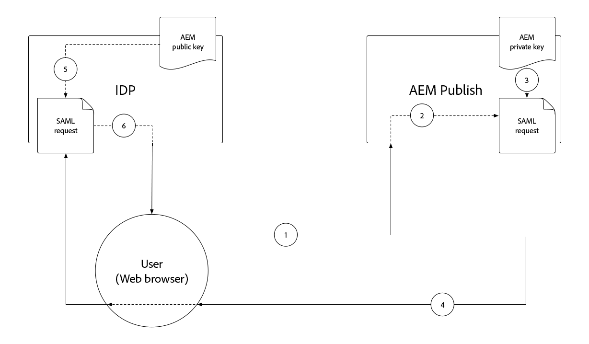

# Autenticação SAML 2.0{#saml-2-0-authentication}

Saiba como configurar e autenticar usuários finais (não autores de AEM) em um IDP compatível com SAML 2.0 de sua escolha.

## Qual SAML para AEM as a Cloud Service?

A integração do SAML 2.0 com o AEM Publish (ou Preview) permite que os usuários finais de uma experiência da Web baseada em AEM se autentiquem em um IDP (Identity Provider, Provedor de identidade) não-Adobe AEM e acessem o como um usuário nomeado e autorizado.

|                       | Autor do AEM | Publicação no AEM |
|-----------------------|:----------:|:-----------:|
| Suporte ao SAML 2.0 | ✘ | ✔ |

+++ Entender o fluxo do SAML 2.0 com AEM

O fluxo típico de uma integração AEM Publish SAML é o seguinte:

1. O usuário faz uma solicitação para o AEM Publicar o indica que a autenticação é necessária.
   + O usuário solicita um recurso protegido CUGs/ACL.
   + O usuário solicita um recurso que está sujeito a um Requisito de autenticação.
   + O usuário segue um link para o endpoint de logon do AEM (ou seja, `/system/sling/login`) que solicita explicitamente a ação de logon.
1. O AEM faz uma AuthnRequest ao IDP, solicitando que o IDP inicie o processo de autenticação.
1. O usuário é autenticado no IDP.
   + O IDP solicita as credenciais ao usuário.
   + O usuário já está autenticado com o IDP e não precisa fornecer mais credenciais.
1. O IDP gera uma asserção SAML contendo os dados do usuário e a assina usando o certificado privado do IDP.
1. O IDP envia a asserção SAML via HTTP POST, por meio do navegador do usuário na Web, para AEM Publish.
1. O AEM Publish recebe a asserção SAML e valida a integridade e autenticidade da asserção SAML usando o certificado público IDP.
1. A Publicação do AEM gerencia o registro do usuário AEM com base na configuração OSGi do SAML 2.0 e no conteúdo da Asserção SAML.
   + Cria usuário
   + Sincroniza os atributos do usuário
   + Atualiza a associação do grupo de usuários AEM
1. AEM Publish define o AEM `login-token` cookie na resposta HTTP, que é usada para autenticar solicitações subsequentes ao AEM Publish.
1. A Publicação do AEM redireciona o usuário para o URL na Publicação do AEM, conforme especificado pela `saml_request_path` cookie.

+++

## Passo a passo da configuração

>[!VIDEO](https://video.tv.adobe.com/v/343040?quality=12&learn=on)

Este vídeo aborda a configuração da integração do SAML 2.0 com o serviço de publicação as a Cloud Service do AEM e o uso do Okta como o IDP.

## Pré-requisitos

Os seguintes itens são necessários ao configurar a autenticação SAML 2.0:

+ Acesso do Gerenciador de implantação ao Cloud Manager
+ Acesso do administrador do AEM ao ambiente as a Cloud Service do AEM
+ Acesso de administrador ao IDP
+ Opcionalmente, acesso a um par de chaves público/privado usado para criptografar cargas SAML

O SAML 2.0 é compatível apenas com a autenticação de usuários para AEM Publish ou Preview. Para gerenciar a autenticação do AEM Author usando o e o IDP, [integrar o IDP ao Adobe IMS](https://helpx.adobe.com/br/enterprise/using/set-up-identity.html).


## Instalar certificado público do IDP no AEM

O certificado público do IDP é adicionado ao AEM Global Trust Store e usado para validar se a declaração SAML enviada pelo IDP é válida.

+++Fluxo de assinatura de asserção SAML


1. O usuário é autenticado no IDP.
1. O IDP gera uma asserção SAML contendo os dados do usuário.
1. O IDP assina a asserção SAML usando o certificado privado do IDP.
1. O IDP inicia um POST HTTP do lado do cliente para o ponto de extremidade SAML do AEM Publish (`.../saml_login`) que inclui a asserção SAML assinada.
1. AEM Publish recebe o POST HTTP contendo a asserção SAML assinada, que pode validar a assinatura usando o certificado público IDP.

+++


1. Obtenha o __certificado público__ do IDP. Esse certificado permite que o AEM valide a asserção SAML fornecida ao AEM pelo IDP.

   O certificado está no formato PEM e deve se parecer com:

   ```
   -----BEGIN CERTIFICATE-----
   MIIC4jCBAcoCCQC33wnybT5QZDANBgkqhkiG9w0BAQsFADAyMQswCQYDVQQGEwJV
   ...
   m0eo2USlSRTVl7QHRTuiuSThHpLKQQ==
   -----END CERTIFICATE-----
   ```

1. Faça logon no AEM Author como um Administrador do AEM.
1. Navegue até __Ferramentas > Segurança > Armazenamento de confiança__.
1. Crie ou abra o Armazenamento global de confiança. Se estiver criando um armazenamento global de confiança, armazene a senha em algum lugar seguro.
1. Expandir __Adicionar certificado do arquivo CER__.
1. Selecionar __Selecionar arquivo de certificado__ e carregue o arquivo de certificado fornecido pelo IDP.
1. Sair __Mapear certificado para usuário__ em branco.
1. Selecione __Enviar__.
1. O certificado recém-adicionado aparece acima do campo __Adicionar certificado do arquivo CRT__ seção.
1. Anote o __alias__, pois esse valor é usado no [Configuração OSGi do Manipulador de autenticação SAML 2.0](#saml-2-0-authentication-handler-osgi-configuration).
1. Selecionar __Salvar e fechar__.

O armazenamento global de confiança está configurado com o certificado público do IDP no AEM Author, mas como o SAML é usado apenas no AEM Publish, o armazenamento global de confiança deve ser replicado para AEM Publish para que o certificado público do IDP esteja acessível lá.


1. Navegue até __Ferramentas > Implantação > Pacotes__.
1. Criar um pacote
   + Nome do pacote: `Global Trust Store`
   + Versão: `1.0.0`
   + Grupo: `com.your.company`
1. Editar o novo __Armazenamento global de confiança__ pacote.
1. Selecione o __Filtros__ e adicione um filtro para o caminho raiz `/etc/truststore`.
1. Selecionar __Concluído__ e depois __Salvar__.
1. Selecione o __Build__ botão para a __Armazenamento global de confiança__ pacote.
1. Depois de criado, selecione __Mais__ > __Replicar__ para ativar o nó de armazenamento global de confiança (`/etc/truststore`) para AEM Publish.

## Criar armazenamento de chaves do serviço de autenticação{#authentication-service-keystore}

_A criação de um armazenamento de chaves para o serviço de autenticação é necessária quando o [Propriedade de configuração OSGi do manipulador de autenticação SAML 2.0 `handleLogout` está definida como `true`](#saml-20-authenticationsaml-2-0-authentication) ou quando [Autenticação AuthnRequest/criptografia de asserção SAML](#install-aem-public-private-key-pair) é obrigatório_

1. Faça logon no AEM Author como um Administrador AEM para fazer upload da chave privada.
1. Navegue até __Ferramentas > Segurança > Usuários__ e selecione __serviço de autenticação__ e selecione __Propriedades__ na barra de ação superior.
1. Selecione o __Armazenamento de chaves__ guia.
1. Crie ou abra o armazenamento de chaves. Se estiver criando um armazenamento de chaves, mantenha a senha segura.
   + A [o armazenamento de chaves público/privado está instalado neste armazenamento de chaves](#install-aem-public-private-key-pair) somente se a criptografia da assinatura AuthnRequest/asserção SAML for necessária.
   + Se essa integração SAML der suporte a logout, mas não a assinatura AuthnRequest/asserção SAML, um armazenamento de chaves vazio será suficiente.
1. Selecionar __Salvar e fechar__.
1. Criar um pacote contendo os dados atualizados __serviço de autenticação__ usuário.

   _Use a seguinte solução temporária usando pacotes:_

   1. Navegue até __Ferramentas > Implantação > Pacotes__.
   1. Criar um pacote
      + Nome do pacote: `Authentication Service`
      + Versão: `1.0.0`
      + Grupo: `com.your.company`
   1. Editar o novo __Armazenamento de Chave do Serviço de Autenticação__ pacote.
   1. Selecione o __Filtros__ e adicione um filtro para o caminho raiz `/home/users/system/cq:services/internal/security/<AUTHENTICATION SERVICE UUID>/keystore`.
      + A variável `<AUTHENTICATION SERVICE UUID>` pode ser encontrado navegando até __Ferramentas > Segurança > Usuários__ e selecionando __serviço de autenticação__ usuário. A UUID é a última parte do URL.
   1. Selecionar __Concluído__ e depois __Salvar__.
   1. Selecione o __Build__ botão para a __Armazenamento de Chave do Serviço de Autenticação__ pacote.
   1. Depois de criado, selecione __Mais__ > __Replicar__ para ativar o armazenamento de chaves do Serviço de autenticação para AEM Publish.

## Instalar par de chave pública/privada do AEM{#install-aem-public-private-key-pair}

_A instalação do par de chave pública/privada do AEM é opcional_

O AEM Publish pode ser configurado para assinar AuthnRequests (para IDP) e criptografar asserções SAML (para AEM). Isso é feito fornecendo uma chave privada para o AEM Publish e combinando a chave pública com o IDP.

+++ Entender o fluxo de assinatura AuthnRequest (opcional)

A AuthnRequest (a solicitação ao IDP do AEM Publish que inicia o processo de logon) pode ser assinada pelo AEM Publish. Para fazer isso, o AEM Publish assina a AuthnRequest usando a chave privada, e garante que o IDP valida a assinatura usando a chave pública. Isso garante ao IDP que o AuthnRequest foi iniciado e solicitado pelo AEM Publish, e não por terceiros mal-intencionados.



1. O usuário faz uma solicitação HTTP para AEM Publish que resulta em uma solicitação de autenticação SAML para o IDP.
1. AEM Publish gera a solicitação SAML para enviar ao IDP.
1. O AEM Publish assina a solicitação SAML usando a chave privada AEM.
1. AEM Publish inicia o AuthnRequest, um redirecionamento HTTP do lado do cliente para o IDP que contém a solicitação SAML assinada.
1. O IDP recebe o AuthnRequest e valida a assinatura usando a chave pública AEM, garantindo que o AEM Publish tenha iniciado o AuthnRequest.
1. O AEM Publish valida a integridade e a autenticidade da asserção SAML descriptografada usando o certificado público IDP.

+++

+++ Compreender o fluxo de criptografia de asserção SAML (opcional)

Toda a comunicação HTTP entre o IDP e a publicação do AEM deve ser por HTTPS e, portanto, segura por padrão. No entanto, conforme necessário, as afirmações SAML podem ser criptografadas caso seja necessário confidencialidade extra além da fornecida por HTTPS. Para fazer isso, o IDP criptografa os dados da SAML Assertion usando a chave privada e o AEM Publish descriptografa a asserção SAML usando a chave privada.


1. O usuário é autenticado no IDP.
1. O IDP gera uma asserção SAML contendo os dados do usuário e a assina usando o certificado privado do IDP.
1. O IDP criptografa a asserção SAML com a chave pública AEM, que requer a descriptografia da chave privada AEM.
1. A asserção SAML criptografada é enviada por meio do navegador web do usuário para AEM Publish.
1. AEM Publish recebe a asserção SAML e a decodifica usando a chave privada AEM.
1. O IDP solicita a autenticação do usuário.

+++

A assinatura de AuthnRequest e a criptografia de asserção SAML são opcionais, no entanto, ambas estão habilitadas, usando o [Propriedade de configuração OSGi do manipulador de autenticação SAML 2.0 `useEncryption`](#saml-20-authenticationsaml-2-0-authentication), o que significa que ambos ou nenhum dos dois pode ser usado.


1. Obtenha a chave pública, a chave privada (PKCS#8 no formato DER) e o arquivo da cadeia de certificados (pode ser a chave pública) usados para assinar o AuthnRequest e criptografar a asserção SAML. Normalmente, as chaves são fornecidas pela equipe de segurança da organização de TI.

   + Um par de chaves autoassinado pode ser gerado usando __openssl__:

   ```
   $ openssl req -x509 -sha256 -days 365 -newkey rsa:4096 -keyout aem-private.key -out aem-public.crt
   
   # Provide a password (keep in safe place), and other requested certificate information
   
   # Convert the keys to AEM's required format 
   $ openssl rsa -in aem-private.key -outform der -out aem-private.der
   $ openssl pkcs8 -topk8 -inform der -nocrypt -in aem-private.der -outform der -out aem-private-pkcs8.der
   ```

1. Faça upload da chave pública para o IDP.
   + Usar o `openssl` acima, a chave pública é a variável `aem-public.crt` arquivo.
1. Faça logon no AEM Author como um Administrador AEM para fazer upload da chave privada.
1. Navegue até __Ferramentas > Segurança > Armazenamento de confiança__ e selecione __serviço de autenticação__ e selecione __Propriedades__ na barra de ação superior.
1. Navegue até __Ferramentas > Segurança > Usuários__ e selecione __serviço de autenticação__ e selecione __Propriedades__ na barra de ação superior.
1. Selecione o __Armazenamento de chaves__ guia.
1. Crie ou abra o armazenamento de chaves. Se estiver criando um armazenamento de chaves, mantenha a senha segura.
1. Selecionar __Adicionar chave privada do arquivo DER__ e adicione a chave privada e o arquivo de cadeia ao AEM:
   + __Alias__: forneça um nome significativo, geralmente o nome do IDP.
   + __Arquivo de chave de privacidade__: Faça upload do arquivo de chave privada (PKCS#8 no formato DER).
      + Usar o `openssl` acima, este é o `aem-private-pkcs8.der` arquivo
   + __Selecionar arquivo da cadeia de certificados__: Faça upload do arquivo de cadeia que o acompanha (essa pode ser a chave pública).
      + Usar o `openssl` acima, este é o `aem-public.crt` arquivo
   + Selecionar __Enviar__
1. O certificado recém-adicionado aparece acima do campo __Adicionar certificado do arquivo CRT__ seção.
   + Anote o __alias__ como isso é usado no [Configuração OSGi do manipulador de autenticação SAML 2.0](#saml-20-authentication-handler-osgi-configuration)
1. Selecionar __Salvar e fechar__.
1. Criar um pacote contendo os dados atualizados __serviço de autenticação__ usuário.

   _Use a seguinte solução temporária usando pacotes:_

   1. Navegue até __Ferramentas > Implantação > Pacotes__.
   1. Criar um pacote
      + Nome do pacote: `Authentication Service`
      + Versão: `1.0.0`
      + Grupo: `com.your.company`
   1. Editar o novo __Armazenamento de Chave do Serviço de Autenticação__ pacote.
   1. Selecione o __Filtros__ e adicione um filtro para o caminho raiz `/home/users/system/cq:services/internal/security/<AUTHENTICATION SERVICE UUID>/keystore`.
      + A variável `<AUTHENTICATION SERVICE UUID>` pode ser encontrado navegando até __Ferramentas > Segurança > Usuários__ e selecionando __serviço de autenticação__ usuário. A UUID é a última parte do URL.
   1. Selecionar __Concluído__ e depois __Salvar__.
   1. Selecione o __Build__ botão para a __Armazenamento de Chave do Serviço de Autenticação__ pacote.
   1. Depois de criado, selecione __Mais__ > __Replicar__ para ativar o armazenamento de chaves do Serviço de autenticação para AEM Publish.

## Configurar o manipulador de autenticação SAML 2.0{#configure-saml-2-0-authentication-handler}

A configuração SAML do AEM é executada por meio de __Manipulador de autenticação Adobe Granite SAML 2.0__ Configuração do OSGi.
A configuração é uma configuração de fábrica OSGi, o que significa que um único serviço de Publicação as a Cloud Service de AEM pode ter várias configurações SAML cobrindo árvores de recursos discretas do repositório; isso é útil para implantações do AEM em vários sites.

+++ Glossário de configuração OSGi do Manipulador de autenticação SAML 2.0

### Configuração OSGi do Manipulador de autenticação SAML 2.0 do Adobe Granite{#configure-saml-2-0-authentication-handler-osgi-configuration}

|                                   | Propriedade OSGi | Obrigatório | Formato do valor | Valor padrão | Descrição |
|-----------------------------------|-------------------------------|:--------:|:---------------------:|---------------------------|-------------|
| Caminhos | `path` | ✔ | Matriz de string | `/` | Caminhos de AEM para os quais esse manipulador de autenticação é usado. |
| URL DO IDP | `idpUrl` | ✔ | String |                           | URL do IDP para o qual a solicitação de autenticação SAML é enviada. |
| Alias do certificado IDP | `idpCertAlias` | ✔ | String |                           | Alias do certificado IDP encontrado no AEM Global Trust Store |
| Redirecionamento HTTP IDP | `idpHttpRedirect` | ✘ | Booleano | `false` | Indica se há um Redirecionamento HTTP para o URL do IDP em vez de enviar uma AuthnRequest. Defina como `true` para autenticação iniciada por IDP. |
| Identificador do IDP | `idpIdentifier` | ✘ | String |                           | ID exclusiva do IDP para garantir a exclusividade do usuário e do grupo do AEM. Se estiver vazio, a variável `serviceProviderEntityId` é usado em seu lugar. |
| URL do serviço do consumidor de asserção | `assertionConsumerServiceURL` | ✘ | String |                           | A variável `AssertionConsumerServiceURL` Atributo de URL na AuthnRequest especificando onde a variável `<Response>` deve ser enviada ao AEM. |
| Id de entidade da controladora | `serviceProviderEntityId` | ✔ | String |                           | Identifica exclusivamente o AEM para o IDP; geralmente, o nome do host AEM. |
| Criptografia da controladora | `useEncryption` | ✘ | Booleano | `true` | Indica se o IDP criptografa asserções SAML. Exige `spPrivateKeyAlias` e `keyStorePassword` a definir. |
| Alias da chave privada da controladora | `spPrivateKeyAlias` | ✘ | String |                           | O alias da chave privada no `authentication-service` armazenamento de chaves do usuário. Obrigatório se `useEncryption` está definida como `true`. |
| Senha do armazenamento de chave da controladora | `keyStorePassword` | ✘ | String |                           | A senha do armazenamento de chaves do usuário &#39;serviço de autenticação&#39;. Obrigatório se `useEncryption` está definida como `true`. |
| Redirecionamento padrão | `defaultRedirectUrl` | ✘ | String | `/` | O URL de redirecionamento padrão após a autenticação bem-sucedida. Pode ser relativo ao host AEM (por exemplo, `/content/wknd/us/en/html`). |
| Atributo de ID de usuário | `userIDAttribute` | ✘ | String | `uid` | O nome do atributo de asserção SAML que contém a ID do usuário AEM. Deixe em branco para utilizar `Subject:NameId`. |
| Criar usuários do AEM automaticamente | `createUser` | ✘ | Booleano | `true` | Indica se os usuários do AEM são criados na autenticação bem-sucedida. |
| Caminho intermediário do usuário do AEM | `userIntermediatePath` | ✘ | String |                           | Ao criar usuários do AEM, esse valor é usado como o caminho intermediário (por exemplo, `/home/users/<userIntermediatePath>/jane@wknd.com`). Exige `createUser` a ser definido como `true`. |
| Atributos de usuário do AEM | `synchronizeAttributes` | ✘ | Matriz de string |                           | Lista de mapeamentos de atributos SAML para armazenar no usuário AEM, no formato `[ "saml-attribute-name=path/relative/to/user/node" ]` (por exemplo, `[ "firstName=profile/givenName" ]`). Consulte a [lista completa de atributos nativos do AEM](#aem-user-attributes). |
| Adicionar usuário a grupos de AEM | `addGroupMemberships` | ✘ | Booleano | `true` | Indica se um usuário AEM é adicionado automaticamente a grupos de usuários AEM após a autenticação bem-sucedida. |
| Atributo de associação de grupo AEM | `groupMembershipAttribute` | ✘ | String | `groupMembership` | O nome do atributo de asserção SAML contendo uma lista de grupos de usuários AEM aos quais o usuário deve ser adicionado. Exige `addGroupMemberships` a ser definido como `true`. |
| Grupos AEM padrão | `defaultGroups` | ✘ | Matriz de string |                           | Uma lista de grupos de usuários AEM autenticados é sempre adicionada ao (por exemplo, `[ "wknd-user" ]`). Exige `addGroupMemberships` a ser definido como `true`. |
| Formato de NameIDPolicy | `nameIdFormat` | ✘ | String | `urn:oasis:names:tc:SAML:2.0:nameid-format:transient` | O valor do parâmetro de formato NameIDPolicy a ser enviado na mensagem AuthnRequest. |
| Armazenar resposta SAML | `storeSAMLResponse` | ✘ | Booleano | `false` | Indica se a variável `samlResponse` é armazenado no AEM `cq:User` nó. |
| Manipular logout | `handleLogout` | ✘ | Booleano | `false` | Indica se a solicitação de logout é tratada por esse manipulador de autenticação SAML. Exige `logoutUrl` a definir. |
| URL de saída | `logoutUrl` | ✘ | String |                           | URL do IDP para o qual a solicitação de logout do SAML é enviada. Obrigatório se `handleLogout` está definida como `true`. |
| Tolerância do relógio | `clockTolerance` | ✘ | Número inteiro | `60` | Tolerância de desvio do relógio IDP e AEM (SP) ao validar asserções SAML. |
| Método Digest | `digestMethod` | ✘ | String | `http://www.w3.org/2001/04/xmlenc#sha256` | O algoritmo de compilação que o IDP usa ao assinar uma mensagem SAML. |
| Método de assinatura | `signatureMethod` | ✘ | String | `http://www.w3.org/2001/04/xmldsig-more#rsa-sha256` | O algoritmo de assinatura que o IDP usa ao assinar uma mensagem SAML. |
| Tipo de sincronização de identidade | `identitySyncType` | ✘ | `default` ou `idp` | `default` | Não alterar `from` padrão para o AEM as a Cloud Service. |
| Classificação de serviço | `service.ranking` | ✘ | Número inteiro | `5002` | As configurações de classificação mais altas são preferidas para a mesma `path`. |

### Atributos de usuário do AEM{#aem-user-attributes}

O AEM usa os seguintes atributos de usuário, que podem ser preenchidos por meio da variável `synchronizeAttributes` propriedade na configuração OSGi do Manipulador de autenticação SAML 2.0 do Adobe Granite.  Qualquer atributo do IDP pode ser sincronizado com qualquer propriedade de usuário do AEM. No entanto, o mapeamento para o AEM usa propriedades de atributo (listadas abaixo) permite que o AEM as use naturalmente.

| Atributo de usuário | Caminho de propriedade relativa de `rep:User` nó |
|--------------------------------|--------------------------|
| Título (por exemplo, `Mrs`) | `profile/title` |
| Nome (ou seja, nome) | `profile/givenName` |
| Nome da família (ou seja, sobrenome) | `profile/familyName` |
| Cargo | `profile/jobTitle` |
| Endereço de e-mail | `profile/email` |
| Endereço | `profile/street` |
| Cidade | `profile/city` |
| Código postal | `profile/postalCode` |
| País | `profile/country` |
| Número de telefone | `profile/phoneNumber` |
| Sobre mim | `profile/aboutMe` |

+++

1. Crie um arquivo de configuração OSGi em seu projeto em `/ui.config/src/main/content/jcr_root/wknd-examples/osgiconfig/config.publish/com.adobe.granite.auth.saml.SamlAuthenticationHandler~saml.cfg.json` e abra no IDE.
   + Alterar `/wknd-examples/` ao seu `/<project name>/`
   + O identificador depois da variável `~` no nome do arquivo deve identificar exclusivamente essa configuração, portanto, pode ser o nome do IDP, como `...~okta.cfg.json`. O valor deve ser alfanumérico com hifens.
1. Cole o seguinte JSON no `com.adobe.granite.auth.saml.SamlAuthenticationHandler~...cfg.json` e atualize o `wknd` referências conforme necessário.

   ```json
   {
       "path": [ "/content/wknd", "/content/dam/wknd" ], 
       "idpCertAlias": "$[env:SAML_IDP_CERT_ALIAS;default=certalias___1652125559800]",
       "idpIdentifier": "$[env:SAML_IDP_ID;default=http://www.okta.com/exk4z55r44Jz9C6am5d7]",
       "idpUrl": "$[env:SAML_IDP_URL;default=https://dev-5511372.okta.com/app/dev-5511372_aemasacloudservice_1/exk4z55r44Jz9C6am5d7/sso/saml]",
       "serviceProviderEntityId": "$[env:SAML_AEM_ID;default=https://publish-p123-e456.adobeaemcloud.com]",
       "useEncryption": false,
       "createUser": true,
       "userIntermediatePath": "wknd/idp",
       "synchronizeAttributes":[
           "firstName=profile/givenName"
       ],
       "addGroupMemberships": true,
       "defaultGroups": [ 
           "wknd-users"
       ]
   }
   ```

1. Atualize os valores conforme exigido pelo projeto. Consulte a __Glossário de configuração OSGi do Manipulador de autenticação SAML 2.0__ acima para obter descrições das propriedades de configuração
1. É recomendável, mas não obrigatório, usar variáveis de ambiente OSGi e segredos, quando os valores puderem mudar fora de sincronia com o ciclo de lançamento ou quando os valores forem diferentes entre tipos de ambiente/camadas de serviço semelhantes. Valores padrão podem ser definidos com o uso de `$[env:..;default=the-default-value]"` conforme mostrado acima.

Configurações de OSGi por ambiente (`config.publish.dev`, `config.publish.stage`, e `config.publish.prod`) pode ser definida com atributos específicos se a configuração do SAML variar entre ambientes.

### Usar criptografia

Quando [criptografando a asserção AuthnRequest e SAML](#encrypting-the-authnrequest-and-saml-assertion), as seguintes propriedades são obrigatórias: `useEncryption`, `spPrivateKeyAlias`, e `keyStorePassword`. A variável `keyStorePassword` contém uma senha, portanto, o valor não deve ser armazenado no arquivo de configuração do OSGi, mas inserido usando [valores de configuração secreta](https://experienceleague.adobe.com/docs/experience-manager-cloud-service/content/implementing/deploying/configuring-osgi.html#secret-configuration-values)

+++Opcionalmente, atualize a configuração do OSGi para usar criptografia

1. Abertura `/ui.config/src/main/content/jcr_root/wknd-examples/osgiconfig/config.publish/com.adobe.granite.auth.saml.SamlAuthenticationHandler~saml.cfg.json` no IDE.
1. Adicionar as três propriedades `useEncryption`, `spPrivateKeyAlias`, e `keyStorePassword` conforme mostrado abaixo.

   ```json
   {
   "path": [ "/content/wknd", "/content/dam/wknd" ], 
   "idpCertAlias": "$[env:SAML_IDP_CERT_ALIAS;default=certalias___1234567890]",
   "idpIdentifier": "$[env:SAML_IDP_ID;default=http://www.okta.com/abcdef1235678]",
   "idpUrl": "$[env:SAML_IDP_URL;default=https://dev-5511372.okta.com/app/dev-123567890_aemasacloudservice_1/abcdef1235678/sso/saml]",
   "serviceProviderEntityId": "$[env:SAML_AEM_ID;default=https://publish-p123-e456.adobeaemcloud.com]",
   "useEncryption": true,
   "spPrivateKeyAlias": "$[env:SAML_AEM_KEYSTORE_ALIAS;default=aem-saml-encryption]",
   "keyStorePassword": "$[secret:SAML_AEM_KEYSTORE_PASSWORD]",
   "createUser": true,
   "userIntermediatePath": "wknd/idp"
   "synchronizeAttributes":[
       "firstName=profile/givenName"
   ],
   "addGroupMemberships": true,
   "defaultGroups": [ 
       "wknd-users"
   ]
   }
   ```

1. As três propriedades de configuração do OSGi necessárias para criptografia são:

+ `useEncryption` definir como `true`
+ `spPrivateKeyAlias` contém o alias de entrada do keystore para a chave privada usada pela integração SAML.
+ `keyStorePassword` contém um [Variável de configuração secreta OSGi](https://experienceleague.adobe.com/docs/experience-manager-cloud-service/content/implementing/deploying/configuring-osgi.html#secret-configuration-values) contendo o `authentication-service` senha do keystore do usuário.

+++

## Configurar filtro Referenciador

Durante o processo de autenticação SAML, o IDP inicia um POST HTTP do lado do cliente para o AEM Publish&#39;s `.../saml_login` ponto final. Se o IDP e o AEM Publish existem em origens diferentes, o AEM Publish __Filtro referenciador__ é configurado por meio da configuração OSGi para permitir HTTP POSTs da origem do IDP.

1. Crie (ou edite) um arquivo de configuração OSGi em seu projeto em `/ui.config/src/main/content/jcr_root/wknd-examples/osgiconfig/config.publish/org.apache.sling.security.impl.ReferrerFilter.cfg.json`.
   + Alterar `/wknd-examples/` ao seu `/<project name>/`
1. Assegure a `allow.empty` o valor está definido como `true`, o `allow.hosts` (ou se preferir, `allow.hosts.regexp`) contém a origem do IDP e `filter.methods` inclui `POST`. A configuração do OSGi deve ser semelhante a:

   ```json
   {
       "allow.empty": true,
       "allow.hosts.regexp": [ ],
       "allow.hosts": [ 
           "$[env:SAML_IDP_REFERRER;default=dev-123567890.okta.com]"
       ],
       "filter.methods": [
           "POST",
       ],
       "exclude.agents.regexp": [ ]
   }
   ```

A Publicação do AEM oferece suporte a uma única configuração de filtro Referenciador, portanto, mescle os requisitos de configuração do SAML com qualquer configuração existente.

Configurações de OSGi por ambiente (`config.publish.dev`, `config.publish.stage`, e `config.publish.prod`) pode ser definida com atributos específicos se a variável `allow.hosts` (ou `allow.hosts.regex`) variam entre os ambientes.

## Configurar o CORS (Cross-Origin Resource Sharing, Compartilhamento de recursos entre origens)

Durante o processo de autenticação SAML, o IDP inicia um POST HTTP do lado do cliente para o AEM Publish&#39;s `.../saml_login` ponto final. Se o IDP e o AEM Publish existirem em hosts/domínios diferentes, o AEM Publish __Compartilhamento de recursos de origem CRoss (CORS)__ deve ser configurado para permitir POSTs HTTP do host/domínio do IDP.

Esta solicitação HTTP POST `Origin` O cabeçalho geralmente tem um valor diferente do host de publicação do AEM, exigindo a configuração do CORS.

Ao testar a autenticação SAML no SDK AEM local (`localhost:4503`), o IDP pode definir as `Origin` cabeçalho para `null`. Em caso afirmativo, adicione `"null"` para o `alloworigin` lista.

1. Crie um arquivo de configuração OSGi em seu projeto em `/ui.config/src/main/content/jcr_root/wknd-examples/osgiconfig/config.publish/com.adobe.granite.cors.impl.CORSPolicyImpl~saml.cfg.json`
   + Alterar `/wknd-examples/` ao nome do seu projeto
   + O identificador depois da variável `~` no nome do arquivo deve identificar exclusivamente essa configuração, portanto, pode ser o nome do IDP, como `...CORSPolicyImpl~okta.cfg.json`. O valor deve ser alfanumérico com hifens.
1. Cole o seguinte JSON no `com.adobe.granite.cors.impl.CORSPolicyImpl~...cfg.json` arquivo.

```json
{
    "alloworigin": [ 
        "$[env:SAML_IDP_ORIGIN;default=https://dev-1234567890.okta.com]", 
        "null"
    ],
    "allowedpaths": [ 
        ".*/saml_login"
    ],
    "supportedmethods": [ 
        "POST"
    ]
}
```

Configurações de OSGi por ambiente (`config.publish.dev`, `config.publish.stage`, e `config.publish.prod`) pode ser definida com atributos específicos se a variável `alloworigin` e `allowedpaths` O varia entre os ambientes.

## Configurar o Dispatcher do AEM para permitir POSTs HTTP SAML

Após a autenticação bem-sucedida para o IDP, o IDP orquestrará um POST HTTP de volta para AEM registrado `/saml_login` ponto final (configurado no IDP). Esta POST HTTP para `/saml_login` O está bloqueado por padrão no Dispatcher, portanto, deve ser permitido explicitamente usando a seguinte regra do Dispatcher:

1. Abertura `dispatcher/src/conf.dispatcher.d/filters/filters.any` no IDE.
1. Adicione à parte inferior do arquivo uma regra de permissão para HTTP POSTs a URLs que terminam com `/saml_login`.

```
...

# Allow SAML HTTP POST to ../saml_login end points
/0190 { /type "allow" /method "POST" /url "*/saml_login" }
```

Se a reescrita de URL no servidor Web Apache estiver configurada (`dispatcher/src/conf.d/rewrites/rewrite.rules`), assegurar que os pedidos de `.../saml_login` Os pontos finais não são danificados acidentalmente.

## Implantando configuração SAML

As configurações do OSGi devem ser confirmadas no Git e implantadas no AEM as a Cloud Service usando o Cloud Manager.

```
$ git remote -v            
adobe   https://git.cloudmanager.adobe.com/myOrg/myCloudManagerGit/ (fetch)
adobe   https://git.cloudmanager.adobe.com/myOrg/myCloudManagerGit/ (push)
$ git add .
$ git commit -m "SAML 2.0 configurations"
$ git push adobe saml-auth:develop
```

Implante a ramificação Git do Cloud Manager de destino (neste exemplo, `develop`), usando um pipeline de implantação de empilhamento completo.
