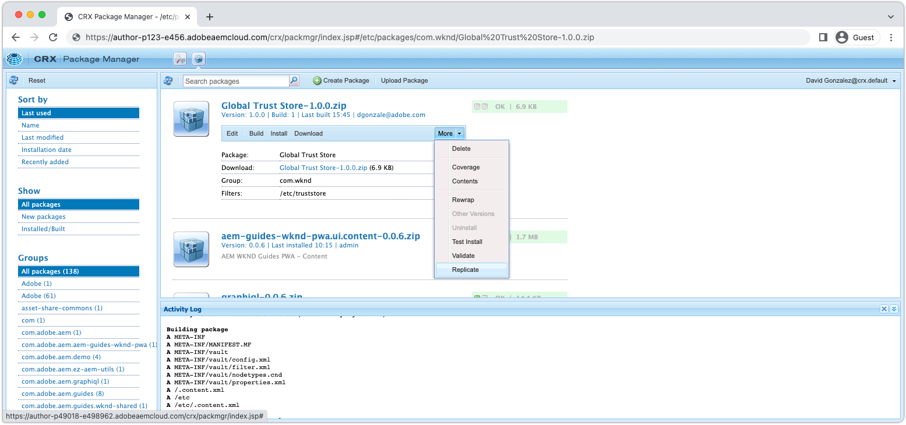

# Autenticação SAML 2.0{#saml-2-0-authentication}

Saiba como configurar e autenticar usuários finais (não autores de AEM) em um IDP compatível com SAML 2.0 de sua escolha.

## Que SAML AEM as a Cloud Service?

A integração do SAML 2.0 com a Publicação do AEM (ou Visualização) permite que os usuários finais de uma experiência da Web com base em AEM sejam autenticados para um não Adobe IDP (Provedor de identidade) e acessem o AEM como um usuário nomeado e autorizado.

|  | Autor do AEM | AEM Publish |
|-----------------------|:----------:|:-----------:|
| Suporte para SAML 2.0 | ✘ | ✔ |

+++ Entenda o fluxo do SAML 2.0 com AEM

O fluxo típico de uma integração SAML de publicação do AEM é o seguinte:

1. O usuário faz uma solicitação para o AEM Publish; o indica que a autenticação é necessária.
   + O usuário solicita um recurso protegido por CUGs/ACL.
   + O usuário solicita um recurso sujeito a um Requisito de autenticação.
   + O usuário segue um link para AEM endpoint de logon (ou seja, `/system/sling/login`) que solicita explicitamente a ação de logon.
1. AEM faz uma AuthnRequest ao IDP, solicitando que o IDP inicie o processo de autenticação.
1. O usuário é autenticado no IDP.
   + O usuário é solicitado pelo IDP para obter credenciais.
   + O usuário já está autenticado no IDP e não precisa fornecer mais credenciais.
1. O IDP gera uma asserção SAML contendo os dados do usuário e a assina usando o certificado privado do IDP.
1. O IDP envia a asserção SAML via HTTP POST, por meio do navegador da Web do usuário, para o AEM Publish.
1. O AEM Publish recebe a asserção SAML e valida a integridade e a autenticidade da asserção SAML usando o certificado público IDP.
1. O AEM Publish gerencia o registro de usuário AEM com base na configuração do OSGi SAML 2.0 e o conteúdo da Asserção SAML.
   + Cria usuário
   + Sincroniza atributos do usuário
   + Atualizações AEM associação de grupo de usuários
1. A publicação do AEM define o AEM `login-token` cookie na resposta HTTP, que é usado para autenticar solicitações subsequentes para o AEM Publish.
1. A publicação do AEM redireciona o usuário para o URL na publicação do AEM, conforme especificado pelo `saml_request_path` cookie.

+++

## Apresentação da configuração

>[!VIDEO](https://video.tv.adobe.com/v/343040?quality=12&learn=on)

Este vídeo aborda a configuração da integração do SAML 2.0 com AEM serviço de publicação as a Cloud Service e o uso do Okta como IDP.

## Pré-requisitos

Os itens a seguir são necessários ao configurar a autenticação SAML 2.0:

+ Acesso do Gerenciador de implantação ao Cloud Manager
+ AEM Acesso do administrador a AEM ambiente as a Cloud Service
+ Acesso do administrador ao IDP
+ Como opção, acesso a um par de chaves público/privado usado para criptografar cargas SAML

O SAML 2.0 é compatível apenas com a autenticação de usuários para a Publicação ou Visualização do AEM. Para gerenciar a autenticação do autor do AEM usando o e o IDP, [integrar o IDP ao Adobe IMS](https://helpx.adobe.com/br/enterprise/using/set-up-identity.html).


## Instalar o certificado público IDP no AEM

O certificado público do IDP é adicionado AEM Armazenamento de Confiança Global e usado para validar a asserção de SAML enviada pelo IDP é válido.

+++fluxo de assinatura de asserção SAML


1. O usuário é autenticado no IDP.
1. O IDP gera uma asserção SAML contendo os dados do usuário.
1. O IDP assina a asserção SAML usando o certificado privado do IDP.
1. O IDP inicia um POST HTTP no lado do cliente para o terminal SAML do AEM Publish (`.../saml_login`) que inclui a asserção SAML assinada.
1. O AEM Publish recebe o POST HTTP contendo a asserção SAML assinada, e pode validar a assinatura usando o certificado público IDP.

+++


1. Obtenha o __certificado público__ do IDP. Esse certificado permite que o AEM valide a asserção SAML fornecida ao AEM pelo IDP.

   O certificado está no formato PEM e deve ser semelhante a:

   ```
   -----BEGIN CERTIFICATE-----
   MIIC4jCBAcoCCQC33wnybT5QZDANBgkqhkiG9w0BAQsFADAyMQswCQYDVQQGEwJV
   ...
   m0eo2USlSRTVl7QHRTuiuSThHpLKQQ==
   -----END CERTIFICATE-----
   ```

1. Faça logon no AEM Author como um administrador de AEM.
1. Navegar para __Ferramentas > Segurança > Armazenamento de confiança__.
1. Crie ou abra o Armazenamento de Confiança Global. Se estiver criando um Armazenamento de Confiança Global, armazene a senha em algum lugar seguro.
1. Expandir __Adicionar certificado do arquivo CER__.
1. Selecionar __Selecionar arquivo de certificado__ e faça upload do arquivo de certificado fornecido pelo IDP.
1. Sair __Mapear certificado para usuário__ em branco.
1. Selecione __Enviar__.
1. O certificado recém-adicionado aparece acima da __Adicionar certificado do arquivo CRT__ seção.
1. Anote o __alias__, pois esse valor é usado na variável [Configuração OSGi do Manipulador de Autenticação SAML 2.0](#saml-2-0-authentication-handler-osgi-configuration).
1. Selecionar __Salvar e fechar__.

O Armazenamento de confiança global é configurado com o certificado público do IDP no Autor do AEM, mas como o SAML é usado apenas na Publicação do AEM, o Armazenamento de confiança global deve ser replicado para Publicação do AEM para que o certificado público do IDP esteja acessível lá.



1. Navegue até __Ferramentas > Implantação > Pacotes__.
1. Criar um pacote
   + Nome do pacote: `Global Trust Store`
   + Versão: `1.0.0`
   + Grupo: `com.your.company`
1. Edite o novo __Armazenamento de Confiança Global__ pacote.
1. Selecione o __Filtros__ e adicionar um filtro para o caminho raiz `/etc/truststore`.
1. Selecionar __Concluído__ e depois __Salvar__.
1. Selecione o __Criar__ para o __Armazenamento de Confiança Global__ pacote.
1. Depois de criado, selecione __Mais__ > __Replicar__ para ativar o nó da Loja de Confiança Global (`/etc/truststore`) para Publicação no AEM.

## Criar repositório de chaves de serviço de autenticação{#authentication-service-keystore}

_A criação de um repositório de chaves para o serviço de autenticação é necessária quando a função [Propriedade de configuração OSGi do manipulador de autenticação SAML 2.0 `handleLogout` está definida como `true`](#saml-20-authenticationsaml-2-0-authentication) ou quando [Autenticação de asserção AuthnRequest/SAML](#install-aem-public-private-key-pair) é obrigatório_

1. Faça logon no AEM Author como Administrador do AEM para fazer upload da chave privada.
1. Navegar para __Ferramentas > Segurança > Usuários__ e selecione __serviço de autenticação__ e selecione __Propriedades__ na barra de ação superior.
1. Selecione o __Armazenamento de chaves__ guia .
1. Crie ou abra o repositório de chaves. Se estiver criando um armazenamento de chaves, mantenha a senha segura.
   + A [keystore público/privado está instalado neste keystore](#install-aem-public-private-key-pair) somente se a criptografia de asserção AuthnRequest signing/SAML for necessária.
   + Se essa integração SAML suportar logout, mas não a asserção de assinatura/SAML de AuthnRequest , um armazenamento de chaves vazio será suficiente.
1. Selecionar __Salvar e fechar__.
1. Crie um pacote contendo o __serviço de autenticação__ usuário.

   _Use a seguinte solução temporária usando pacotes:_

   1. Navegue até __Ferramentas > Implantação > Pacotes__.
   1. Criar um pacote
      + Nome do pacote: `Authentication Service`
      + Versão: `1.0.0`
      + Grupo: `com.your.company`
   1. Edite o novo __Armazenamento de Chave do Serviço de Autenticação__ pacote.
   1. Selecione o __Filtros__ e adicionar um filtro para o caminho raiz `/home/users/system/cq:services/internal/security/<AUTHENTICATION SERVICE UUID>/keystore`.
      + O `<AUTHENTICATION SERVICE UUID>` pode ser encontrado navegando até __Ferramentas > Segurança > Usuários__ e selecionando __serviço de autenticação__ usuário. A UUID é a última parte do URL.
   1. Selecionar __Concluído__ e depois __Salvar__.
   1. Selecione o __Criar__ para o __Armazenamento de Chave do Serviço de Autenticação__ pacote.
   1. Depois de criado, selecione __Mais__ > __Replicar__ para ativar o armazenamento de chaves do Serviço de autenticação na publicação do AEM.

## Instalar AEM par de chaves públicas/privadas{#install-aem-public-private-key-pair}

_A instalação do par de chaves públicas/privadas AEM é opcional_

A Publicação do AEM pode ser configurada para assinar as Solicitações de Autor (para o IDP) e criptografar asserções de SAML (para AEM). Isso é feito fornecendo uma chave privada para o AEM Publish e é a chave pública correspondente ao IDP.

+++ Entender o fluxo de assinatura AuthnRequest (opcional)

O AuthnRequest (a solicitação para o IDP da publicação do AEM que inicia o processo de logon) pode ser assinado pelo AEM Publish. Para fazer isso, o AEM Publish assina o AuthnRequest usando a chave privada, de que o IDP valida a assinatura usando a chave pública. Isso garante ao IDP que o AuthnRequest foi iniciado e solicitado pelo AEM Publish, e não por um terceiro mal-intencionado.


1. O usuário faz uma solicitação HTTP para o AEM Publish que resulta em uma solicitação de autenticação SAML para o IDP.
1. O AEM Publish gera a solicitação SAML para enviar ao IDP.
1. AEM Publish assina a solicitação de SAML usando AEM chave privada.
1. AEM Publish inicia o AuthnRequest, um redirecionamento HTTP do lado do cliente para o IDP que contém a solicitação SAML assinada.
1. O IDP recebe o AuthnRequest e valida a assinatura usando AEM chave pública, garantindo que o AEM Publish inicie o AuthnRequest.
1. O AEM Publish então valida a integridade e a autenticidade da asserção SAML descriptografada usando o certificado público IDP.

+++

+++ Entenda o fluxo de criptografia de asserção SAML (opcional)

Todas as comunicações HTTP entre o IDP e o AEM Publish devem ser via HTTPS e, portanto, seguras por padrão. No entanto, conforme necessário, as asserções de SAML podem ser criptografadas no caso de uma confidencialidade extra ser exigida além da fornecida pelo HTTPS. Para fazer isso, o IDP criptografa os dados de Asserção SAML usando a chave privada e o AEM Publish descriptografa a asserção SAML usando a chave privada.


1. O usuário é autenticado no IDP.
1. O IDP gera uma asserção SAML contendo os dados do usuário e a assina usando o certificado privado do IDP.
1. O IDP então criptografa a asserção SAML com AEM chave pública, o que requer a chave privada AEM para descriptografar.
1. A asserção de SAML criptografada é enviada por meio do navegador da Web do usuário para o AEM Publish.
1. O AEM Publish recebe a asserção SAML e a decodifica usando AEM chave privada.
1. O IDP solicita que o usuário se autentique.

+++

A assinatura AuthnRequest e a criptografia de asserção SAML são opcionais, no entanto, ambas são ativadas, usando o [Propriedade de configuração OSGi do manipulador de autenticação SAML 2.0 `useEncryption`](#saml-20-authenticationsaml-2-0-authentication), o que significa que ambos ou nenhum dos dois pode ser usado.


1. Obtenha a chave pública, a chave privada (PKCS#8 no formato DER) e o arquivo da cadeia de certificados (esta pode ser a chave pública) usados para assinar o AuthnRequest e criptografar a asserção SAML. As chaves são normalmente fornecidas pela equipe de segurança da organização de TI.

   + Um par de chaves autoassinado pode ser gerado usando __openssl__:

   ```
   $ openssl req -x509 -sha256 -days 365 -newkey rsa:4096 -keyout aem-private.key -out aem-public.crt
   
   # Provide a password (keep in safe place), and other requested certificate information
   
   # Convert the keys to AEM's required format 
   $ openssl rsa -in aem-private.key -outform der -out aem-private.der
   $ openssl pkcs8 -topk8 -inform der -nocrypt -in aem-private.der -outform der -out aem-private-pkcs8.der
   ```

1. Faça upload da chave pública para o IDP.
   + Usar o `openssl` acima, a chave pública é a variável `aem-public.crt` arquivo.
1. Faça logon no AEM Author como Administrador do AEM para fazer upload da chave privada.
1. Navegar para __Ferramentas > Segurança > Armazenamento de confiança__ e selecione __serviço de autenticação__ e selecione __Propriedades__ na barra de ação superior.
1. Navegar para __Ferramentas > Segurança > Usuários__ e selecione __serviço de autenticação__ e selecione __Propriedades__ na barra de ação superior.
1. Selecione o __Armazenamento de chaves__ guia .
1. Crie ou abra o repositório de chaves. Se estiver criando um armazenamento de chaves, mantenha a senha segura.
1. Selecionar __Adicionar chave privada do arquivo DER__ e adicione a chave privada e o arquivo de cadeia ao AEM:
   + __Alias__: Forneça um nome significativo, geralmente o nome do IDP.
   + __Arquivo de chave privada__: Carregue o arquivo de chave privada (PKCS#8 no formato DER).
      + Usar o `openssl` acima, este é o método `aem-private-pkcs8.der` arquivo
   + __Selecionar arquivo da cadeia de certificados__: Fazer upload do arquivo de cadeia de acompanhamento (essa pode ser a chave pública).
      + Usar o `openssl` acima, este é o método `aem-public.crt` arquivo
   + Selecione __Enviar__
1. O certificado recém-adicionado aparece acima da __Adicionar certificado do arquivo CRT__ seção.
   + Anote o __alias__ como é usado no [Configuração do OSGi do manipulador de autenticação SAML 2.0](#saml-20-authentication-handler-osgi-configuration)
1. Selecionar __Salvar e fechar__.
1. Crie um pacote contendo o __serviço de autenticação__ usuário.

   _Use a seguinte solução temporária usando pacotes:_

   1. Navegue até __Ferramentas > Implantação > Pacotes__.
   1. Criar um pacote
      + Nome do pacote: `Authentication Service`
      + Versão: `1.0.0`
      + Grupo: `com.your.company`
   1. Edite o novo __Armazenamento de Chave do Serviço de Autenticação__ pacote.
   1. Selecione o __Filtros__ e adicionar um filtro para o caminho raiz `/home/users/system/cq:services/internal/security/<AUTHENTICATION SERVICE UUID>/keystore`.
      + O `<AUTHENTICATION SERVICE UUID>` pode ser encontrado navegando até __Ferramentas > Segurança > Usuários__ e selecionando __serviço de autenticação__ usuário. A UUID é a última parte do URL.
   1. Selecionar __Concluído__ e depois __Salvar__.
   1. Selecione o __Criar__ para o __Armazenamento de Chave do Serviço de Autenticação__ pacote.
   1. Depois de criado, selecione __Mais__ > __Replicar__ para ativar o armazenamento de chaves do Serviço de autenticação na publicação do AEM.

## Configurar o manipulador de autenticação SAML 2.0{#configure-saml-2-0-authentication-handler}

AEM configuração do SAML é executada por meio do __Manipulador de autenticação do Adobe Granite SAML 2.0__ Configuração do OSGi.
A configuração é uma configuração de fábrica OSGi, o que significa que um único serviço de publicação as a Cloud Service AEM pode ter várias configurações SAML cobrindo árvores de recursos discretas do repositório; isso é útil para implantações de AEM de vários sites.

+++ Glossário de configuração do OSGi do Manipulador de Autenticação SAML 2.0

### Configuração OSGi do Manipulador de Autenticação do Adobe Granite SAML 2.0{#configure-saml-2-0-authentication-handler-osgi-configuration}

|  | Propriedade OSGi | Obrigatório | Formato do valor | Valor padrão | Descrição |
|-----------------------------------|-------------------------------|:--------:|:---------------------:|---------------------------|-------------|
| Caminhos | `path` | ✔ | Matriz de sequência | `/` | AEM caminhos para os quais esse manipulador de autenticação é usado. |
| URL do IDP | `idpUrl` | ✔ | String |  | URL IDP para a qual a solicitação de autenticação SAML é enviada. |
| alias do certificado IDP | `idpCertAlias` | ✔ | String |  | O alias do certificado IDP encontrado no AEM Global Trust Store |
| Redirecionamento HTTP IDP | `idpHttpRedirect` | ✘ | Booleano | `false` | Indica se um redirecionamento HTTP para o URL do IDP em vez de enviar um AuthnRequest. Defina como `true` para autenticação iniciada pelo IDP. |
| Identificador do IDP | `idpIdentifier` | ✘ | String |  | Id de IDP exclusiva para garantir AEM exclusividade de usuários e grupos. Se estiver vazio, a variável `serviceProviderEntityId` é usada em vez disso. |
| URL do serviço de consumidor de asserção | `assertionConsumerServiceURL` | ✘ | String |  | O `AssertionConsumerServiceURL` Atributo de URL no AuthnRequest especificando onde a variável `<Response>` deve ser enviada para AEM. |
| ID da entidade SP | `serviceProviderEntityId` | ✔ | String |  | Identifica exclusivamente AEM ao IDP; geralmente o nome do host AEM. |
| Criptografia de SP | `useEncryption` | ✘ | Booleano | `true` | Indica se o IDP criptografa asserções SAML. Exige `spPrivateKeyAlias` e `keyStorePassword` a ser definido. |
| alias da chave privada do SP | `spPrivateKeyAlias` | ✘ | String |  | O alias da chave privada no `authentication-service` repositório de chaves do usuário. Obrigatório se `useEncryption` está definida como `true`. |
| Senha do armazenamento de chaves do SP | `keyStorePassword` | ✘ | String |  | A senha do armazenamento de chaves do usuário &#39;authentication-service&#39;. Obrigatório se `useEncryption` está definida como `true`. |
| Redirecionamento padrão | `defaultRedirectUrl` | ✘ | String | `/` | O URL de redirecionamento padrão após a autenticação bem-sucedida. Pode ser relativo ao host do AEM (por exemplo, `/content/wknd/us/en/html`). |
| Atributo de ID de usuário | `userIDAttribute` | ✘ | String | `uid` | O nome do atributo de asserção SAML contendo o ID de usuário do usuário AEM. Deixe em branco para usar a variável `Subject:NameId`. |
| Criar usuários de AEM automaticamente | `createUser` | ✘ | Booleano | `true` | Indica se AEM usuários foram criados na autenticação bem-sucedida. |
| Caminho intermediário do usuário AEM | `userIntermediatePath` | ✘ | String |  | Ao criar AEM usuários, esse valor é usado como o caminho intermediário (por exemplo, `/home/users/<userIntermediatePath>/jane@wknd.com`). Exige `createUser` a ser definido como `true`. |
| AEM atributos do usuário | `synchronizeAttributes` | ✘ | Matriz de sequência |  | Lista de mapeamentos de atributos SAML a serem armazenados no usuário AEM, no formato `[ "saml-attribute-name=path/relative/to/user/node" ]` (por exemplo, `[ "firstName=profile/givenName" ]`). Consulte a [lista completa de atributos de AEM nativos](#aem-user-attributes). |
| Adicionar usuário a grupos AEM | `addGroupMemberships` | ✘ | Booleano | `true` | Indica se um usuário AEM é adicionado automaticamente a AEM grupos de usuários após uma autenticação bem-sucedida. |
| Atributo de associação de grupo AEM | `groupMembershipAttribute` | ✘ | String | `groupMembership` | O nome do atributo de asserção SAML contendo uma lista de AEM grupos de usuários aos quais o usuário deve ser adicionado. Exige `addGroupMemberships` a ser definido como `true`. |
| Grupos de AEM padrão | `defaultGroups` | ✘ | Matriz de sequência |  | Uma lista de AEM grupos de usuários aos quais os usuários autenticados são sempre adicionados (por exemplo, `[ "wknd-user" ]`). Exige `addGroupMemberships` a ser definido como `true`. |
| Formato NameIDPolicy | `nameIdFormat` | ✘ | String | `urn:oasis:names:tc:SAML:2.0:nameid-format:transient` | O valor do parâmetro NameIDPolicy format para enviar na mensagem AuthnRequest . |
| Armazenar resposta SAML | `storeSAMLResponse` | ✘ | Booleano | `false` | Indica se a variável `samlResponse` é armazenado no AEM `cq:User` nó . |
| Gerenciar logout | `handleLogout` | ✘ | Booleano | `false` | Indica se a solicitação de logout é tratada por este manipulador de autenticação SAML. Exige `logoutUrl` a ser definido. |
| URL de logout | `logoutUrl` | ✘ | String |  | URL do IDP para o qual a solicitação de logout do SAML é enviada. Obrigatório se `handleLogout` está definida como `true`. |
| Tolerância de relógio | `clockTolerance` | ✘ | Número inteiro | `60` | A tolerância de desvio de clock do IDP e do AEM (SP) ao validar asserções de SAML. |
| Método Digest | `digestMethod` | ✘ | String | `http://www.w3.org/2001/04/xmlenc#sha256` | O algoritmo de resumo que o IDP usa ao assinar uma mensagem SAML. |
| Método de assinatura | `signatureMethod` | ✘ | String | `http://www.w3.org/2001/04/xmldsig-more#rsa-sha256` | O algoritmo de assinatura que o IDP usa ao assinar uma mensagem SAML. |
| Tipo de sincronização de identidade | `identitySyncType` | ✘ | `default` ou `idp` | `default` | Não alterar `from` padrão para AEM as a Cloud Service. |
| Classificação do serviço | `service.ranking` | ✘ | Número inteiro | `5002` | As configurações de classificação mais altas são preferidas para o mesmo `path`. |

### AEM atributos do usuário{#aem-user-attributes}

O AEM usa os seguintes atributos de usuário, que podem ser preenchidos por meio da variável `synchronizeAttributes` na configuração OSGi do Manipulador de Autenticação do Adobe Granite SAML 2.0.  Todos os atributos do IDP podem ser sincronizados com qualquer propriedade de usuário AEM, no entanto, o mapeamento para AEM usar propriedades de atributo (listado abaixo) permite AEM usá-los naturalmente.

| Atributo do usuário | Caminho da propriedade relativa de `rep:User` nó |
|--------------------------------|--------------------------|
| Título (por exemplo, `Mrs`) | `profile/title` |
| Nome próprio (ou seja, nome) | `profile/givenName` |
| Nome da família (ou seja, sobrenome) | `profile/familyName` |
| Cargo | `profile/jobTitle` |
| Endereço de e-mail | `profile/email` |
| Endereço | `profile/street` |
| Cidade | `profile/city` |
| Código postal | `profile/postalCode` |
| País | `profile/country` |
| Número de telefone | `profile/phoneNumber` |
| Sobre mim | `profile/aboutMe` |

+++

1. Crie um arquivo de configuração OSGi no seu projeto em `/ui.config/src/main/content/jcr_root/wknd-examples/osgiconfig/config.publish/com.adobe.granite.auth.saml.SamlAuthenticationHandler~saml.cfg.json` e abra no IDE.
   + Alterar `/wknd-examples/` para `/<project name>/`
   + O identificador após o `~` no nome do arquivo deve identificar exclusivamente essa configuração, de modo que pode ser o nome do IDP, como `...~okta.cfg.json`. O valor deve ser alfanumérico com hifens.
1. Cole o seguinte JSON no `com.adobe.granite.auth.saml.SamlAuthenticationHandler~...cfg.json` e atualize o `wknd` referências, conforme necessário.

   ```json
   {
       "path": [ "/content/wknd", "/content/dam/wknd" ], 
       "idpCertAlias": "$[env:SAML_IDP_CERT_ALIAS;default=certalias___1652125559800]",
       "idpIdentifier": "$[env:SAML_IDP_ID;default=http://www.okta.com/exk4z55r44Jz9C6am5d7]",
       "idpUrl": "$[env:SAML_IDP_URL;default=https://dev-5511372.okta.com/app/dev-5511372_aemasacloudservice_1/exk4z55r44Jz9C6am5d7/sso/saml]",
       "serviceProviderEntityId": "$[env:SAML_AEM_ID;default=https://publish-p123-e456.adobeaemcloud.com]",
       "useEncryption": false,
       "createUser": true,
       "userIntermediatePath": "wknd/idp",
       "synchronizeAttributes":[
           "firstName=profile/givenName"
       ],
       "addGroupMemberships": true,
       "defaultGroups": [ 
           "wknd-users"
       ]
   }
   ```

1. Atualize os valores conforme exigido pelo seu projeto. Consulte a __Glossário de configuração do OSGi do Manipulador de Autenticação SAML 2.0__ acima para descrições de propriedades de configuração
1. É recomendável, mas não obrigatório, usar variáveis e segredos de ambiente OSGi, quando os valores podem mudar fora de sincronia com o ciclo de lançamento ou quando os valores são diferentes entre tipos de ambiente/níveis de serviço semelhantes. Os valores padrão podem ser definidos usando o `$[env:..;default=the-default-value]"` como mostrado acima.

Configurações OSGi por ambiente (`config.publish.dev`, `config.publish.stage`e `config.publish.prod`) pode ser definido com atributos específicos se a configuração do SAML variar entre ambientes.

### Usar criptografia

When [criptografando a asserção AuthnRequest e SAML](#encrypting-the-authnrequest-and-saml-assertion), as seguintes propriedades são obrigatórias: `useEncryption`, `spPrivateKeyAlias`e `keyStorePassword`. O `keyStorePassword` contém uma senha, portanto, o valor não deve ser armazenado no arquivo de configuração OSGi, mas sim injetado usando [valores de configuração secreta](https://experienceleague.adobe.com/docs/experience-manager-cloud-service/content/implementing/deploying/configuring-osgi.html#secret-configuration-values)

+++Opcionalmente, atualize a configuração do OSGi para usar a criptografia

1. Abrir `/ui.config/src/main/content/jcr_root/wknd-examples/osgiconfig/config.publish/com.adobe.granite.auth.saml.SamlAuthenticationHandler~saml.cfg.json` no IDE.
1. Adicione as três propriedades `useEncryption`, `spPrivateKeyAlias`e `keyStorePassword` conforme mostrado abaixo.

   ```json
   {
   "path": [ "/content/wknd", "/content/dam/wknd" ], 
   "idpCertAlias": "$[env:SAML_IDP_CERT_ALIAS;default=certalias___1234567890]",
   "idpIdentifier": "$[env:SAML_IDP_ID;default=http://www.okta.com/abcdef1235678]",
   "idpUrl": "$[env:SAML_IDP_URL;default=https://dev-5511372.okta.com/app/dev-123567890_aemasacloudservice_1/abcdef1235678/sso/saml]",
   "serviceProviderEntityId": "$[env:SAML_AEM_ID;default=https://publish-p123-e456.adobeaemcloud.com]",
   "useEncryption": true,
   "spPrivateKeyAlias": "$[env:SAML_AEM_KEYSTORE_ALIAS;default=aem-saml-encryption]",
   "keyStorePassword": "$[secret:SAML_AEM_KEYSTORE_PASSWORD]",
   "createUser": true,
   "userIntermediatePath": "wknd/idp"
   "synchronizeAttributes":[
       "firstName=profile/givenName"
   ],
   "addGroupMemberships": true,
   "defaultGroups": [ 
       "wknd-users"
   ]
   }
   ```

1. As três propriedades de configuração do OSGi necessárias para criptografia são:

+ `useEncryption` defina como `true`
+ `spPrivateKeyAlias` contém o alias de entrada do repositório de chaves para a chave privada usada pela integração SAML.
+ `keyStorePassword` contém um [Variável de configuração secreta OSGi](https://experienceleague.adobe.com/docs/experience-manager-cloud-service/content/implementing/deploying/configuring-osgi.html#secret-configuration-values) contendo o `authentication-service` senha do keystore do usuário.

+++

## Configurar filtro Referenciador

Durante o processo de autenticação do SAML, o IDP inicia um POST HTTP do lado do cliente para o AEM Publish&#39;s `.../saml_login` ponto final. Se o IDP e o AEM Publish existirem em uma origem diferente, o AEM Publish __Filtro referenciador__ é configurado pela configuração OSGi para permitir POSTs HTTP a partir da origem do IDP.

1. Crie (ou edite) um arquivo de configuração OSGi em seu projeto em `/ui.config/src/main/content/jcr_root/wknd-examples/osgiconfig/config.publish/org.apache.sling.security.impl.ReferrerFilter.cfg.json`.
   + Alterar `/wknd-examples/` para `/<project name>/`
1. Verifique se a `allow.empty` é definido como `true`, o `allow.hosts` (ou se preferir, `allow.hosts.regexp`) contém a origem do IDP e `filter.methods` inclui `POST`. A configuração do OSGi deve ser semelhante a:

   ```json
   {
       "allow.empty": true,
       "allow.hosts.regexp": [ ],
       "allow.hosts": [ 
           "$[env:SAML_IDP_REFERRER;default=dev-123567890.okta.com]"
       ],
       "filter.methods": [
           "POST",
       ],
       "exclude.agents.regexp": [ ]
   }
   ```

O AEM Publish é compatível com uma única configuração de filtro Referenciador, portanto, mescle os requisitos de configuração do SAML com qualquer configuração existente.

Configurações OSGi por ambiente (`config.publish.dev`, `config.publish.stage`e `config.publish.prod`) pode ser definida com atributos específicos se a variável `allow.hosts` ou `allow.hosts.regex`) variam entre ambientes.

## Configure o CORS (Cross-Origin Resource Sharing)

Durante o processo de autenticação do SAML, o IDP inicia um POST HTTP do lado do cliente para o AEM Publish&#39;s `.../saml_login` ponto final. Se a publicação do IDP e do AEM existir em diferentes hosts/domínios, a publicação do AEM __Compartilhamento de recursos de origem CR (CORS)__ deve ser configurado para permitir POSTs HTTP a partir do host/domínio do IDP.

Esta solicitação HTTP POST `Origin` geralmente tem um valor diferente do host AEM Publish, exigindo a configuração do CORS.

Ao testar a autenticação SAML no SDK local do AEM (`localhost:4503`), o IDP pode definir a variável `Origin` cabeçalho para `null`. Em caso afirmativo, adicione `"null"` para `alloworigin` lista.

1. Crie um arquivo de configuração OSGi no seu projeto em `/ui.config/src/main/content/jcr_root/wknd-examples/osgiconfig/config.publish/com.adobe.granite.cors.impl.CORSPolicyImpl~saml.cfg.json`
   + Alterar `/wknd-examples/` para o nome do projeto
   + O identificador após o `~` no nome do arquivo deve identificar exclusivamente essa configuração, de modo que pode ser o nome do IDP, como `...CORSPolicyImpl~okta.cfg.json`. O valor deve ser alfanumérico com hifens.
1. Cole o seguinte JSON no `com.adobe.granite.cors.impl.CORSPolicyImpl~...cfg.json` arquivo.

```json
{
    "alloworigin": [ 
        "$[env:SAML_IDP_ORIGIN;default=https://dev-1234567890.okta.com]", 
        "null"
    ],
    "allowedpaths": [ 
        ".*/saml_login"
    ],
    "supportedmethods": [ 
        "POST"
    ]
}
```

Configurações OSGi por ambiente (`config.publish.dev`, `config.publish.stage`e `config.publish.prod`) pode ser definida com atributos específicos se a variável `alloworigin` e `allowedpaths` varia entre ambientes.

## Configure AEM Dispatcher para permitir POSTs HTTP SAML

Após a autenticação bem-sucedida no IDP, o IDP orquestrará um POST HTTP de volta para AEM registrado `/saml_login` ponto final (configurado no IDP). Este POST HTTP para `/saml_login` é bloqueado por padrão no Dispatcher, portanto, deve ser permitido explicitamente usando a seguinte regra do Dispatcher:

1. Abrir `dispatcher/src/conf.dispatcher.d/filters/filters.any` no IDE.
1. Adicionar à parte inferior do arquivo, uma regra de permissão para POSTs HTTP a URLs que terminem com `/saml_login`.

```
...

# Allow SAML HTTP POST to ../saml_login end points
/0190 { /type "allow" /method "POST" /url "*/saml_login" }
```

Se a regravação de URL no servidor Web Apache estiver configurada (`dispatcher/src/conf.d/rewrites/rewrite.rules`), assegurar que os pedidos de `.../saml_login` os pontos finais não são danificados acidentalmente.

## Ativar a sincronização de dados e encapsular tokens

Depois que o fluxo de autenticação SAML cria um usuário na Publicação AEM, o nó do usuário AEM é autenticável no nível de serviço de Publicação AEM.
Isso requer [sincronização de dados](https://experienceleague.adobe.com/docs/experience-manager-cloud-service/content/sites/authoring/personalization/user-and-group-sync-for-publish-tier.html#data-synchronization) e [tokens encapsulados](https://experienceleague.adobe.com/docs/experience-manager-cloud-service/content/sites/authoring/personalization/user-and-group-sync-for-publish-tier.html#sticky-sessions-and-encapsulated-tokens) para ser habilitado pelo Suporte do Adobe no serviço de publicação do AEM.

Envie uma solicitação para o Suporte ao cliente do Adobe (via [AdminConsole](https://adminconsole.adobe.com) > Suporte) solicitando:

> A sincronização de dados e os tokens encapsulados são ativados no serviço AEM Publish para o Programa X e o Ambiente Y.

## Implantação da configuração do SAML

As configurações do OSGi devem ser comprometidas com o Git e implantadas AEM as a Cloud Service usando o Cloud Manager.

```
$ git remote -v            
adobe   https://git.cloudmanager.adobe.com/myOrg/myCloudManagerGit/ (fetch)
adobe   https://git.cloudmanager.adobe.com/myOrg/myCloudManagerGit/ (push)
$ git add .
$ git commit -m "SAML 2.0 configurations"
$ git push adobe saml-auth:develop
```

Implante a ramificação Git do Cloud Manager de destino (neste exemplo, `develop`), usando um pipeline de implantação de Pilha cheia.
