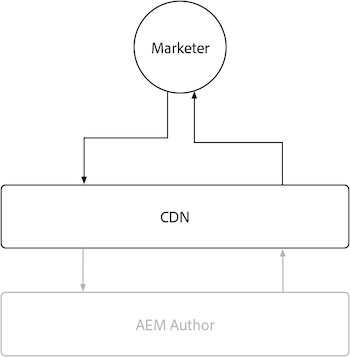

# Autor do AEM

O AEM Author tem armazenamento em cache limitado devido à natureza altamente dinâmica e sensível a permissões do conteúdo que oferece. Em geral, não é recomendável personalizar o armazenamento em cache para o autor do AEM e, em vez disso, depender das configurações de cache fornecidas pelo Adobe para garantir uma experiência eficiente.

{align="center"}

Embora a personalização do armazenamento em cache no AEM Author não seja incentivada, é útil compreender que o AEM Author tem um CDN gerenciado por Adobe, mas não tem um Dispatcher de AEM. Lembre-se de que todas as configurações do AEM Dispatcher são ignoradas no AEM Author, pois ele não tem um AEM Dispatcher.

## CDN

O serviço de Autor do AEM usa um CDN, no entanto, seu objetivo é aprimorar a entrega de recursos do produto e não deve ser configurado extensivamente, permitindo que funcione como está.

{align="center"}

O AEM Author CDN fica entre o usuário final, normalmente um profissional de marketing ou autor de conteúdo, e o AEM Author. Ele armazena em cache arquivos imutáveis, como ativos estáticos que potencializam a experiência de criação do AEM, e não conteúdo criado.

O CDN do autor do AEM armazena em cache vários tipos de recursos que podem ser de interesse, incluindo um [TTL personalizável em consultas persistentes](https://experienceleague.adobe.com/docs/experience-manager-cloud-service/content/headless/graphql-api/persisted-queries.html?author-instances), e uma [TTL longo em bibliotecas de clientes personalizadas](https://experienceleague.adobe.com/docs/experience-manager-cloud-service/content/implementing/content-delivery/caching.html#client-side-libraries).

### Vida útil do cache padrão

Os seguintes recursos voltados para o cliente são armazenados em cache pelo CDN do autor do AEM e têm a seguinte vida útil de cache padrão:

| Tipo de conteúdo | Vida útil do cache padrão da CDN |
|:------------ |:---------- |
| [Consultas persistentes (JSON)](https://experienceleague.adobe.com/docs/experience-manager-cloud-service/content/headless/graphql-api/persisted-queries.html?author-instances) | 1 minuto |
| [Bibliotecas de clientes (JS/CSS)](https://experienceleague.adobe.com/docs/experience-manager-cloud-service/content/implementing/content-delivery/caching.html#client-side-libraries) | 30 dias |
| [Todo o resto](https://experienceleague.adobe.com/docs/experience-manager-cloud-service/content/implementing/content-delivery/caching.html#other-content) | Não armazenado em cache |

## AEM Dispatcher

O serviço de Autor do AEM não inclui o AEM Dispatcher e usa somente o [CDN](#cdn) para armazenamento em cache
