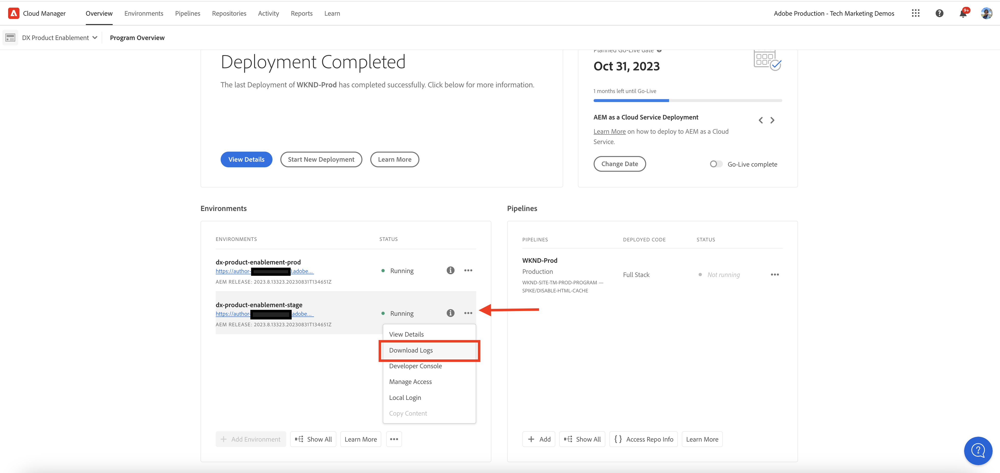

# Análise da taxa de acertos do cache do CDN

O conteúdo armazenado em cache na CDN reduz a latência experimentada pelos usuários do site, que não precisam aguardar a solicitação para retornar à publicação do Apache/Dispatcher ou do AEM. Com isso em mente, vale a pena otimizar a taxa de ocorrência do cache do CDN para maximizar a quantidade de conteúdo armazenável em cache no CDN.

Saiba como analisar o AEM as a Cloud Service fornecido **Logs da CDN** e obter insights, como **taxa de acertos do cache**, e **principais URLs de _SENHORITA_ e _PASS_ tipos de cache**, para fins de otimização.

Os logs CDN estão disponíveis no formato JSON, que contém vários campos, incluindo `url`, `cache`. Para obter mais informações, consulte [Formato de Log da CDN](https://experienceleague.adobe.com/docs/experience-manager-cloud-service/content/implementing/developing/logging.html?lang=en#cdn-log:~:text=Toggle%20Text%20Wrapping-,Log%20Format,-The%20CDN%20logs). A variável `cache` O campo fornece informações sobre _estado do cache_ e seus valores possíveis são HIT, MISS ou PASS. Vamos analisar os detalhes de valores possíveis.

| Estado do cache   Valor possível | Descrição |
|------------------------------------|:-----------------------------------------------------:|
| HIT | Os dados solicitados são _encontrado no cache da CDN e não requer que seja feita uma busca_ ao servidor AEM. |
| SENHORITA | Os dados solicitados são _não encontrado no cache da CDN e deve ser solicitado_ do servidor AEM. |
| PASS | Os dados solicitados são _explicitamente definido para não ser armazenado em cache_ e sempre ser recuperado do servidor AEM. |

Para o propósito deste tutorial, a variável [Projeto WKND do AEM](https://github.com/adobe/aem-guides-wknd) é implantado no ambiente as a Cloud Service AEM e um pequeno teste de desempenho é acionado usando [Apache JMeter](https://jmeter.apache.org/).

Este tutorial está estruturado para orientá-lo pelo seguinte processo:
1. Baixar logs CDN por meio do Cloud Manager
1. Análise desses logs CDN, que pode ser executada com duas abordagens: um painel instalado localmente ou um Jupityer Notebook acessado remotamente (para aqueles que licenciam o Adobe Experience Platform)
1. Otimização da configuração do cache da CDN

## Baixar logs CDN

Para baixar os logs de CDN, siga estas etapas:

1. Faça logon no Cloud Manager, em [my.cloudmanager.adobe.com](https://my.cloudmanager.adobe.com/) e selecione sua organização e programa.

1. Para um ambiente AEMCS desejado, selecione **Baixar logs** no menu reticências.

   {width="500" zoomable="yes"}

1. No **Baixar logs** , selecione a **Publish** no menu suspenso, depois clique no ícone de download ao lado da guia **cdn** linha.

   {width="500" zoomable="yes"}

Se o arquivo de log baixado for de _hoje_ a extensão do arquivo é `.log` caso contrário, para arquivos de log anteriores, a extensão será `.log.gz`.

## Analisar logs de CDN baixados

Para obter insights, como a taxa de acertos do cache e os principais URLs dos tipos de cache MISS e PASS, analise o arquivo de log de CDN baixado. Esses insights ajudam a otimizar o [Configuração do cache da CDN](https://experienceleague.adobe.com/docs/experience-manager-cloud-service/content/implementing/content-delivery/caching.html?lang=pt-BR) e aprimorar o desempenho do site.

Para analisar os logs CDN, este artigo apresenta duas opções: a **Elasticsearch, Logstash e Kibana (ELK)** [ferramentas do painel](https://github.com/adobe/AEMCS-CDN-Log-Analysis-ELK-Tool) e [Jupyter Notebook](https://jupyter.org/). A ferramenta de painel ELK pode ser instalada localmente em seu notebook, enquanto a ferramenta Jupityr Notebook pode ser acessada remotamente [como parte do Adobe Experience Platform](https://experienceleague.adobe.com/docs/experience-platform/data-science-workspace/jupyterlab/analyze-your-data.html?lang=en) sem instalar software adicional, para quem licenciou o Adobe Experience Platform.

### Opção 1: usar ferramentas de painel ELK

A variável [Pilha ELK](https://www.elastic.co/elastic-stack) O é um conjunto de ferramentas que fornecem uma solução escalável para pesquisar, analisar e visualizar os dados. Consiste em Elasticsearch, Logstash e Kibana.

Para identificar os principais detalhes, vamos usar o [AEMCS-CDN-Log-Analysis-ELK-Tool](https://github.com/adobe/AEMCS-CDN-Log-Analysis-ELK-Tool) projeto de ferramentas do painel. Este projeto fornece um contêiner Docker da pilha ELK e um painel Kibana pré-configurado para analisar os logs CDN.

1. Siga as etapas de [Como configurar o container ELK Docker](https://github.com/adobe/AEMCS-CDN-Log-Analysis-ELK-Tool#how-to-set-up-the-elk-docker-container) e certifique-se de importar o **Taxa de acertos do cache do CDN** Painel Kibana.

1. Para identificar a taxa de acertos do cache do CDN e os URLs principais, siga estas etapas:

   1. Copie os arquivos de log da CDN baixados na pasta específica do ambiente.

   1. Abra o **Taxa de acertos do cache do CDN** painel clicando no canto superior esquerdo Menu de navegação > Analytics > Painel > Taxa de ocorrência do cache do CDN.

      {width="500" zoomable="yes"}

   1. Selecione o intervalo de tempo desejado no canto superior direito.

      {width="500" zoomable="yes"}

   1. A variável **Taxa de acertos do cache do CDN** O painel de controle é autoexplicativo.

   1. A variável _Análise da solicitação total_ exibe os seguintes detalhes:
      - Taxas de cache por tipo de cache
      - Contagens de cache por tipo de cache

      {width="500" zoomable="yes"}

   1. A variável _Análise por solicitação ou tipos MIME_ exibe os seguintes detalhes:
      - Taxas de cache por tipo de cache
      - Contagens de cache por tipo de cache
      - Principais URLs MISS e PASS

      {width="500" zoomable="yes"}

#### Filtrar por nome de ambiente ou ID de programa

Para filtrar os logs assimilados por nome de ambiente, siga as etapas abaixo:

1. No painel Taxa de acertos do cache CDN, clique no **Adicionar filtro** ícone.

   {width="500" zoomable="yes"}

1. No **Adicionar filtro** , selecione a `aem_env_name.keyword` no menu suspenso e `is` operador e nome de ambiente desejado para o próximo campo e, por fim, clique em _Adicionar filtro_.

   {width="500" zoomable="yes"}

#### Filtrar por nome de host

Para filtrar os logs assimilados por nome de host, siga as etapas abaixo:

1. No painel Taxa de acertos do cache CDN, clique no **Adicionar filtro** ícone.

   {width="500" zoomable="yes"}

1. No **Adicionar filtro** , selecione a `host.keyword` no menu suspenso e `is` operador e nome de host desejado para o próximo campo e, por fim, clique em _Adicionar filtro_.

   {width="500" zoomable="yes"}

Da mesma forma, adicione mais filtros ao painel com base nos requisitos de análise.

### Opção 2: usar o Jupyter Notebook

Para aqueles que preferem não instalar o software localmente (ou seja, a ferramenta do painel ELK da seção anterior), há outra opção, mas ela requer uma licença para a Adobe Experience Platform.

A variável [Jupyter Notebook](https://jupyter.org/) O é um aplicativo web de código aberto que permite criar documentos com código, texto e visualização. Ele é usado para transformação de dados, visualização e modelagem estatística. Ele pode ser acessado remotamente [como parte do Adobe Experience Platform](https://experienceleague.adobe.com/docs/experience-platform/data-science-workspace/jupyterlab/analyze-your-data.html?lang=en).

#### Baixando o arquivo de Bloco de Anotações Python Interativo

Primeiro, baixe o [AEM-as-a-CloudService - Análise de registros CDN - Jupyter Notebook](./assets/cdn-logs-analysis/aemcs_cdn_logs_analysis.ipynb) , que ajudará na análise de logs da CDN. Esse arquivo &quot;Interative Python Notebook&quot; é autoexplicativo, no entanto, os principais destaques de cada seção são:

- **Instalar bibliotecas adicionais**: instala o `termcolor` e `tabulate` Bibliotecas Python.
- **Carregar logs CDN**: carrega o arquivo de log do CDN usando `log_file` valor da variável; atualize seu valor. Também transforma esse log de CDN em [Quadro de dados Pandas](https://pandas.pydata.org/docs/reference/frame.html).
- **Realizar análise**: o primeiro bloco de código é _Exibir resultado da análise para total, HTML, JS/CSS e solicitações de imagem_; ele fornece gráficos de porcentagem de acertos de cache, barras e pizza.
O segundo bloco de código é _Os 5 principais URLs de solicitação de MISS e PASS para HTML, JS/CSS e Imagem_; ele exibe URLs e suas contagens no formato de tabela.

#### Execução do Jupyter Notebook

Em seguida, execute o Jupyter Notebook no Adobe Experience Platform, seguindo estas etapas:

1. Faça logon na [Adobe Experience Cloud](https://experience.adobe.com/), na Página inicial > **Acesso rápido** seção > clique no botão **Experience Platform**

   {width="500" zoomable="yes"}

1. Na página inicial do Adobe Experience Platform > seção Ciência de dados >, clique no link **Notebooks** item de menu. Para iniciar o ambiente do Jupyter Notebooks, clique no link **JupyterLab** guia.

   {width="500" zoomable="yes"}

1. No menu JupyterLab, usando o **Fazer upload de arquivos** , carregue o arquivo de log CDN baixado e `aemcs_cdn_logs_analysis.ipynb` arquivo.

   {width="500" zoomable="yes"}

1. Abra o `aemcs_cdn_logs_analysis.ipynb` clicando duas vezes no arquivo.

1. No **Carregar arquivo de log do CDN** do bloco de anotações, atualize a `log_file` valor.

   {width="500" zoomable="yes"}

1. Para executar a célula selecionada e avançar, clique no **Reproduzir** ícone.

   {width="500" zoomable="yes"}

1. Depois de executar o **Exibir resultado da análise para total, HTML, JS/CSS e solicitações de imagem** célula de código, a saída exibe os gráficos de porcentagem de taxa de ocorrência do cache, barra e pizza.

   {width="500" zoomable="yes"}

1. Depois de executar o **Os 5 principais URLs de solicitação de MISS e PASS para HTML, JS/CSS e Imagem** célula de código, a saída exibe os 5 principais URLs de solicitação MISS e PASS.

   {width="500" zoomable="yes"}

Você pode aprimorar o Jupyter Notebook para analisar os logs de CDN com base em seus requisitos.

## Otimização da configuração do cache da CDN

Depois de analisar os logs de CDN, você pode otimizar a configuração do cache de CDN para melhorar o desempenho do site. A prática recomendada do AEM é ter uma taxa de acerto de cache de 90% ou mais.

Para obter mais informações, consulte [Otimizar configuração do cache da CDN](https://experienceleague.adobe.com/docs/experience-manager-cloud-service/content/implementing/content-delivery/caching.html#caching).

O projeto WKND do AEM tem uma configuração de CDN de referência. Para obter mais informações, consulte [Configuração da CDN](https://github.com/adobe/aem-guides-wknd/blob/main/dispatcher/src/conf.d/available_vhosts/wknd.vhost#L137-L190) do `wknd.vhost` arquivo.
