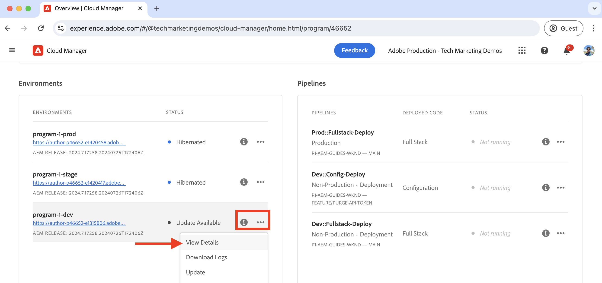

# Como limpar o cache da CDN

Saiba como limpar ou remover a resposta HTTP em cache do CDN da AEM as a Cloud Service. Usando o recurso de autoatendimento chamado **Limpar Token de API**, você pode limpar o cache de um recurso específico, de um grupo de recursos e de todo o cache.

Neste tutorial, você aprenderá a configurar e usar o Token da API de Limpeza para limpar o cache CDN do site de exemplo [WKND](https://github.com/adobe/aem-guides-wknd) do AEM usando o recurso de autoatendimento.

>[!VIDEO](https://video.tv.adobe.com/v/3432948?quality=12&learn=on)

## Invalidação de cache versus limpeza explícita

Há duas maneiras de remover os recursos em cache do CDN:

1. **Invalidação de cache:** É o processo de remover os recursos em cache da CDN com base nos cabeçalhos de cache como `Cache-Control`, `Surrogate-Control` ou `Expires`. O valor de atributo `max-age` do cabeçalho de cache é usado para determinar o tempo de vida do cache dos recursos, também conhecido como TTL (Time To Live) de cache. Quando o tempo de vida do cache expira, os recursos em cache são removidos automaticamente do cache CDN.

1. **Limpeza explícita:** é o processo de remover manualmente os recursos em cache do cache do CDN antes que o TTL expire. A limpeza explícita é útil quando você deseja remover os recursos em cache imediatamente. No entanto, aumenta o tráfego para o servidor de origem.

Quando os recursos em cache são removidos do cache CDN, a próxima solicitação do mesmo recurso busca a versão mais recente do servidor de origem.

## Configurar o token da API de limpeza

Vamos saber como configurar o token da API de limpeza para limpar o cache do CDN.

### Configurar a regra CDN

O token da API de limpeza é criado ao configurar a regra CDN no código do projeto do AEM.

1. Abra o arquivo `cdn.yaml` na pasta `config` principal do seu projeto do AEM. Por exemplo, o arquivo cdn.yaml[&#x200B; do projeto &#x200B;](https://github.com/adobe/aem-guides-wknd/blob/main/config/cdn.yaml)WKND.

1. Adicionar a seguinte regra CDN ao arquivo `cdn.yaml`:

```yaml
kind: "CDN"
version: "1"
metadata:
  envTypes: ["dev", "stage", "prod"]
data:  
  authentication: # The main authentication configuration
    authenticators: # The list of authenticators
       - name: purge-auth # The name of the authenticator
         type: purge  # The type of the authenticator, must be purge
         purgeKey1: ${{CDN_PURGEKEY_081324}} # The first purge key, must be referenced by the Cloud Manager secret-type environment variable name ${{CDN_EDGEKEY_073124}}
         purgeKey2: ${{CDN_PURGEKEY_111324}} # The second purge key, must be referenced by the Cloud Manager secret-type environment variable name ${{CDN_EDGEKEY_111324}}. It is used for the rotation of secrets without any interruptions.
    rules: # The list of authentication rules
       - name: purge-auth-rule # The name of the rule
         when: { reqProperty: tier, equals: "publish" } # The condition when the rule should be applied
         action: # The action to be taken when the rule is applied
           type: authenticate # The type of the action, must be authenticate
           authenticator: purge-auth # The name of the authenticator to be used, must match the name from the above authenticators list               
```

Na regra acima, `purgeKey1` e `purgeKey2` são adicionados desde o início para suportar a rotação de segredos sem interrupções. No entanto, você pode começar com apenas `purgeKey1` e adicionar `purgeKey2` mais tarde ao girar os segredos.

1. Salve, confirme e envie as alterações para o repositório upstream do Adobe.

### Criar variável de ambiente do Cloud Manager

Em seguida, crie as variáveis de ambiente do Cloud Manager para armazenar o valor do token da API de limpeza.

1. Faça logon no Cloud Manager em [my.cloudmanager.adobe.com](https://my.cloudmanager.adobe.com/) e selecione sua organização e programa.

1. Na seção __Ambientes__, clique nas **reticências** (...) ao lado do ambiente desejado e selecione **Exibir Detalhes**.

   

1. Em seguida, selecione a guia **Configuração** e clique no botão **Adicionar configuração**.

1. Na caixa de diálogo **Configuração do Ambiente**, insira os seguintes detalhes:
   - **Nome**: insira o nome da variável de ambiente. Deve corresponder ao valor `purgeKey1` ou `purgeKey2` do arquivo `cdn.yaml`.
   - **Valor**: insira o valor do token da API de limpeza.
   - **Serviço Aplicado**: Selecione a opção **Todos**.
   - **Tipo**: selecione a opção **Segredo**.
   - Clique no botão **Adicionar**.

   

1. Repita as etapas acima para criar a segunda variável de ambiente para o valor `purgeKey2`.

1. Clique em **Salvar** para salvar e aplicar as alterações.

### Implantar a regra CDN

Por fim, implante a regra CDN configurada no ambiente do AEM as a Cloud Service usando o pipeline do Cloud Manager.

1. Na Cloud Manager, navegue até a seção **Pipelines**.

1. Crie um novo pipeline ou selecione o pipeline existente que implanta apenas os arquivos **Config**. Para obter etapas detalhadas, consulte [Criar um pipeline de configuração](https://experienceleague.adobe.com/pt-br/docs/experience-manager-learn/cloud-service/security/traffic-filter-and-waf-rules/how-to-setup#deploy-rules-through-cloud-manager).

1. Clique no botão **Executar** para implantar a regra CDN.

   

## Usar o token da API de limpeza

Para limpar o cache do CDN, chame o URL de domínio específico do serviço do AEM com o token da API de limpeza. A sintaxe para limpar o cache é a seguinte:

```
PURGE <URL> HTTP/1.1
Host: <AEM_SERVICE_SPECIFIC_DOMAIN>
X-AEM-Purge-Key: <PURGE_API_TOKEN>
X-AEM-Purge: <PURGE_TYPE>
Surrogate-Key: <SURROGATE_KEY>
```

Em que:

- **PURGE`<URL>`**: o método `PURGE` é seguido pelo caminho de URL do recurso que você deseja limpar.
- **Host:`<AEM_SERVICE_SPECIFIC_DOMAIN>`**: especifica o domínio do serviço AEM.
- **X-AEM-Purge-Key:`<PURGE_API_TOKEN>`**: um cabeçalho personalizado que contém o valor do token da API de limpeza.
- **X-AEM-Purge:`<PURGE_TYPE>`**: um cabeçalho personalizado que especifica o tipo de operação de limpeza. O valor pode ser `hard`, `soft` ou `all`. A tabela a seguir descreve cada tipo de expurgação:

  | Tipo de Expurgação | Descrição |
  |:------------:|:-------------:|
  | rígido (padrão) | Remove o recurso em cache imediatamente. Evite-o, pois isso aumenta o tráfego para o servidor de origem. |
  | suave | Marca o recurso em cache como obsoleto e busca a versão mais recente do servidor de origem. |
  | todas | Remove todos os recursos em cache do cache do CDN. |

- **Chave-Substituta:`<SURROGATE_KEY>`**: (Opcional) Um cabeçalho personalizado que especifica as chaves substitutas (separadas por espaço) dos grupos de recursos a serem removidos. A chave substituta é usada para agrupar os recursos e deve ser definida no cabeçalho de resposta do recurso.

>[!TIP]
>
>Nos exemplos abaixo, o `X-AEM-Purge: hard` é usado para fins de demonstração. Você pode substituí-lo por `soft` ou `all` de acordo com suas necessidades. Tenha cuidado ao usar o tipo de limpeza `hard`, pois ele aumenta o tráfego para o servidor de origem.

### Limpar o cache de um recurso específico

Neste exemplo, o comando `curl` limpa o cache do recurso `/us/en.html` no site do WKND implantado em um ambiente do AEM as a Cloud Service.

```bash
curl -X PURGE "https://publish-p46652-e1315806.adobeaemcloud.com/us/en.html" \
-H "X-AEM-Purge-Key: 123456789" \
-H "X-AEM-Purge: hard"
```

Ao limpar com êxito, uma resposta `200 OK` é retornada com conteúdo JSON.

```json
{ "status": "ok", "id": "1000098-1722961031-13237063" }
```

### Limpar o cache para um grupo de recursos

Neste exemplo, o comando `curl` limpa o cache do grupo de recursos com a chave substituta `wknd-assets`. O cabeçalho de resposta `Surrogate-Key` está definido em [`wknd.vhost`](https://github.com/adobe/aem-guides-wknd/blob/main/dispatcher/src/conf.d/available_vhosts/wknd.vhost#L176), por exemplo:

```http
<VirtualHost *:80>
    ...

    # Core Component Image Component: long-term caching (30 days) for immutable URLs, background refresh to avoid MISS
    <LocationMatch "^/content/.*\.coreimg.*\.(?i:jpe?g|png|gif|svg)$">
        Header set Cache-Control "max-age=2592000,stale-while-revalidate=43200,stale-if-error=43200,public,immutable" "expr=%{REQUEST_STATUS} < 400"
        # Set Surrogate-Key header to group the cache of WKND assets, thus it can be flushed independtly
        Header set Surrogate-Key "wknd-assets"
        Header set Age 0
    </LocationMatch>

    ...
</VirtualHost>
```

```bash
curl -X PURGE "https://publish-p46652-e1315806.adobeaemcloud.com" \
-H "Surrogate-Key: wknd-assets" \
-H "X-AEM-Purge-Key: 123456789" \
-H "X-AEM-Purge: hard"
```

Ao limpar com êxito, uma resposta `200 OK` é retornada com conteúdo JSON.

```json
{ "wknd-assets": "10027-1723478994-2597809-1" }
```

### Limpar todo o cache

Neste exemplo, usando o comando `curl`, o cache inteiro é removido do site WKND de amostra implantado no ambiente do AEM as a Cloud Service.

```bash
curl -X PURGE "https://publish-p46652-e1315806.adobeaemcloud.com/" \
-H "X-AEM-Purge-Key: 123456789" \
-H "X-AEM-Purge: all"
```

Ao limpar com êxito, uma resposta `200 OK` é retornada com conteúdo JSON.

```json
{"status":"ok"}
```

### Verificar a limpeza do cache

Para verificar a limpeza do cache, acesse o URL do recurso no navegador da Web e revise os cabeçalhos de resposta. O valor do cabeçalho `X-Cache` deve ser `MISS`.


