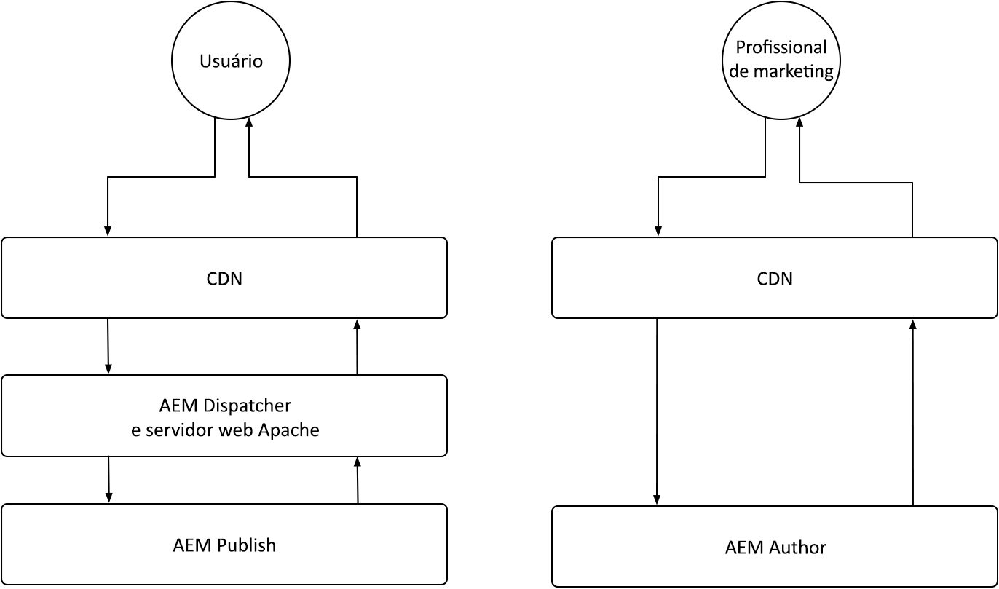

# Armazenamento em cache as a Cloud Service do AEM

No AEM as a Cloud Service, entender o armazenamento em cache é fundamental. O armazenamento em cache envolve o armazenamento e a reutilização de dados obtidos anteriormente para melhorar a eficiência do sistema e reduzir os tempos de carga. Esse mecanismo acelera significativamente a entrega de conteúdo, aumenta o desempenho do site e otimiza a experiência do usuário.

O AEM as a Cloud Service tem várias camadas de armazenamento em cache e estratégias diferentes entre os serviços de Autor e Publicação.

{align="center"}

## Armazenamento em cache do AEM

O AEM as a Cloud Service tem uma estratégia robusta e configurável de armazenamento em cache de várias camadas, incluindo um CDN, AEM Dispatcher e, opcionalmente, um CDN gerenciado pelo cliente. O armazenamento em cache entre camadas pode ser ajustado para otimizar o desempenho, garantindo que o AEM forneça apenas as melhores experiências. O AEM tem diferentes preocupações com o armazenamento em cache para os serviços de Autor e Publicação. Explore as estratégias de armazenamento em cache para cada serviço abaixo.

    

    

        

          <figure class="image is-16by9">
            
          </figure>
        

        

          

            
<a href="./publish.md" title="Armazenamento em cache do serviço de publicação do AEM">Armazenamento em cache do serviço de publicação do AEM</a>

            
O serviço de Publicação do AEM AEM usa um CDN e um Dispatcher gerenciados para otimizar as experiências da Web do usuário final.

            <a href="./publish.md" class="spectrum-Button spectrum-Button--outline spectrum-Button--primary spectrum-Button--sizeM">
              Saiba mais
            </a>
          

        

      

    

    

        

            

            <figure class="image is-16by9">
                
            </figure>
            

            

            

                
<a href="./author.md" title="Armazenamento em cache do serviço do autor no AEM">Armazenamento em cache do serviço do autor no AEM</a>

                
O serviço de Autor do AEM usa uma CDN gerenciada para fornecer experiências de criação otimizadas.

                <a href="./author.md" class="spectrum-Button spectrum-Button--outline spectrum-Button--primary spectrum-Button--sizeM">
                Saiba mais
                </a>
            

            

        

    

