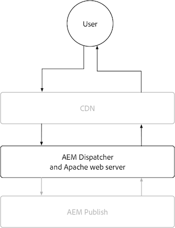

# Publicação no AEM

O serviço de Publicação do AEM tem duas camadas principais de armazenamento em cache: a AEM as a Cloud Service CDN e a AEM Dispatcher. Opcionalmente, um CDN gerenciado pelo cliente pode ser colocado na frente do CDN do AEM as a Cloud Service. A CDN da AEM as a Cloud Service fornece entrega de borda de conteúdo, garantindo que as experiências sejam entregues com baixa latência a usuários em todo o mundo. O AEM Dispatcher fornece armazenamento em cache diretamente na frente do AEM Publish e é usado para reduzir a carga desnecessária no próprio AEM Publish.

{align="center"}

## CDN

O armazenamento em cache do AEM as a Cloud Service CDN é controlado por cabeçalhos de cache de resposta HTTP e tem como objetivo armazenar em cache o conteúdo para otimizar um equilíbrio entre a atualização e o desempenho. A CDN fica entre o usuário final e o Dispatcher do AEM e é usada para armazenar em cache o conteúdo o mais próximo possível do usuário final, garantindo uma experiência com desempenho.

{align="center"}

Configurar como o conteúdo do CDN armazena em cache é limitado à configuração de cabeçalhos de cache em respostas HTTP. Normalmente, esses cabeçalhos de cache são definidos nas configurações do AEM Dispatcher vhost usando o `mod_headers`, mas também podem ser definidos no código Java™ personalizado em execução no próprio AEM Publish.

### Quando as solicitações/respostas HTTP são armazenadas em cache?

O AEM as a Cloud Service CDN armazena em cache somente respostas HTTP e todos os critérios a seguir devem ser atendidos:

+ O status da resposta HTTP é `2xx` ou `3xx`
+ O método de solicitação HTTP é `GET` ou `HEAD`
+ Pelo menos um dos seguintes cabeçalhos de resposta HTTP está presente: `Cache-Control`, `Surrogate-Control` ou `Expires`
+ A resposta HTTP pode ser qualquer tipo de conteúdo, incluindo HTML, JSON, CSS, JS e arquivos binários.

Por padrão, as respostas HTTP não armazenadas em cache pelo [AEM Dispatcher](#aem-dispatcher) têm automaticamente todos os cabeçalhos de cache de resposta HTTP removidos para evitar o armazenamento em cache no CDN. Este comportamento pode ser cuidadosamente substituído usando `mod_headers` com a diretiva `Header always set ...` quando necessário.

### O que é armazenado em cache?

O AEM as a Cloud Service CDN armazena em cache o seguinte:

+ Corpo da resposta HTTP
+ Cabeçalhos de resposta HTTP

Normalmente, uma solicitação/resposta HTTP para um único URL é armazenada em cache como um único objeto. No entanto, a CDN pode lidar com o armazenamento em cache de vários objetos para uma única URL, quando o cabeçalho `Vary` é definido na resposta HTTP. Evite especificar `Vary` em cabeçalhos cujos valores não tenham um conjunto de valores rigidamente controlado, pois isso pode resultar em muitos erros de cache, reduzindo a taxa de acertos do cache. Para dar suporte ao armazenamento em cache de solicitações variáveis no AEM Dispatcher, [revise a documentação de armazenamento em cache de variantes](https://experienceleague.adobe.com/docs/experience-manager-learn/cloud-service/developing/advanced/variant-caching.html?lang=pt-BR).

### Vida útil do cache{#cdn-cache-life}

O CDN de Publicação do AEM é baseado em TTL (time-to-live), o que significa que a vida do cache é determinada pelos cabeçalhos de resposta HTTP `Cache-Control`, `Surrogate-Control` ou `Expires`. Se os cabeçalhos de cache de resposta HTTP não forem definidos pelo projeto e os [critérios de qualificação](#when-are-http-requestsresponses-cached) forem atendidos, o Adobe definirá uma vida de cache padrão de 10 minutos (600 segundos).

Veja como os cabeçalhos de cache influenciam a vida útil do cache CDN:

+ O cabeçalho de resposta HTTP [`Cache-Control`](https://developer.fastly.com/reference/http/http-headers/Cache-Control/) instrui o navegador da Web e a CDN sobre quanto tempo armazenar a resposta em cache. O valor é em segundos. Por exemplo, `Cache-Control: max-age=3600` instrui o navegador da Web a armazenar a resposta em cache por uma hora. Esse valor é ignorado pela CDN se o cabeçalho de resposta HTTP `Surrogate-Control` também estiver presente.
+ O cabeçalho de resposta HTTP [`Surrogate-Control`](https://developer.fastly.com/reference/http/http-headers/Surrogate-Control/) instrui a CDN do AEM sobre quanto tempo armazenar a resposta em cache. O valor é em segundos. Por exemplo, `Surrogate-Control: max-age=3600` instrui a CDN a armazenar a resposta em cache por uma hora.
+ O cabeçalho de resposta HTTP [`Expires`](https://developer.fastly.com/reference/http/http-headers/Expires/) instrui o CDN (e o navegador da Web) do AEM sobre por quanto tempo a resposta em cache é válida. O valor é uma data. Por exemplo, `Expires: Sat, 16 Sept 2023 09:00:00 EST` instrui o navegador da Web a armazenar a resposta em cache até a data e a hora especificadas.

Use o `Cache-Control` para controlar a vida útil do cache quando ele for o mesmo para o navegador e para o CDN. Use `Surrogate-Control` quando o navegador da Web deve armazenar a resposta em cache por um tempo diferente do CDN.

#### Vida útil do cache padrão

Se uma resposta HTTP for qualificada para o armazenamento em cache do AEM Dispatcher [por qualificadores acima](#when-are-http-requestsresponses-cached), os valores a seguir serão os valores padrão, a menos que a configuração personalizada esteja presente.

| Tipo de conteúdo | Vida útil do cache padrão da CDN |
|:------------ |:---------- |
| [HTML/JSON/XML](https://experienceleague.adobe.com/docs/experience-manager-cloud-service/content/implementing/content-delivery/caching.html?lang=pt-BR#html-text) | 5 minutos |
| [Assets (imagens, vídeos, documentos e assim por diante)](https://experienceleague.adobe.com/docs/experience-manager-cloud-service/content/implementing/content-delivery/caching.html?lang=pt-BR#images) | 10 minutos |
| [Consultas persistentes (JSON)](https://experienceleague.adobe.com/docs/experience-manager-cloud-service/content/headless/graphql-api/persisted-queries.html?lang=pt-BR&publish-instances) | 2 horas |
| [Bibliotecas de clientes (JS/CSS)](https://experienceleague.adobe.com/docs/experience-manager-cloud-service/content/implementing/content-delivery/caching.html?lang=pt-BR#client-side-libraries) | 30 dias |
| [Outros](https://experienceleague.adobe.com/docs/experience-manager-cloud-service/content/implementing/content-delivery/caching.html?lang=pt-BR#other-content) | Não armazenado em cache |

### Como personalizar regras de cache

[Configurar como o conteúdo do cache do CDN](https://experienceleague.adobe.com/docs/experience-manager-cloud-service/content/implementing/content-delivery/caching.html?lang=pt-BR#disp) é limitado a definir cabeçalhos de cache em respostas HTTP. Normalmente, esses cabeçalhos de cache são definidos nas configurações de `vhost` do AEM Dispatcher usando `mod_headers`, mas também podem ser definidos no código Java™ personalizado em execução no próprio AEM Publish.

## AEM Dispatcher

{align="center"}

### Quando as solicitações/respostas HTTP são armazenadas em cache?

As respostas HTTP para solicitações HTTP correspondentes são armazenadas em cache quando todos os critérios a seguir são atendidos:

+ O método de solicitação HTTP é `GET` ou `HEAD`
   + `HEAD` As solicitações HTTP armazenam em cache apenas os cabeçalhos de resposta HTTP. Eles não têm corpos de resposta.
+ O status da resposta HTTP é `200`
+ A resposta HTTP NÃO é para um arquivo binário.
+ O caminho da URL da solicitação HTTP termina com uma extensão, por exemplo: `.html`, `.json`, `.css`, `.js`, etc.
+ As solicitações HTTP não contêm autorização e não são autenticadas pela AEM.
   + No entanto, o armazenamento em cache de solicitações autenticadas [pode ser habilitado globalmente](https://experienceleague.adobe.com/docs/experience-manager-dispatcher/using/configuring/dispatcher-configuration.html?lang=pt-BR#caching-when-authentication-is-used) ou seletivamente via [armazenamento em cache sensível a permissões](https://experienceleague.adobe.com/docs/experience-manager-dispatcher/using/configuring/permissions-cache.html?lang=pt-BR).
+ A solicitação HTTP não contém parâmetros de consulta.
   + No entanto, a configuração de [Parâmetros de consulta ignorados](https://experienceleague.adobe.com/docs/experience-manager-dispatcher/using/configuring/dispatcher-configuration.html?lang=pt-BR#ignoring-url-parameters) permite que solicitações HTTP com os parâmetros de consulta ignorados sejam armazenadas em cache/servidas do cache.
+ O caminho da solicitação HTTP [corresponde a uma regra de permissão Dispatcher e não corresponde a uma regra de negação](https://experienceleague.adobe.com/docs/experience-manager-dispatcher/using/configuring/dispatcher-configuration.html?lang=pt-BR#specifying-the-documents-to-cache).
+ A resposta HTTP não tem nenhum dos seguintes cabeçalhos de resposta HTTP definidos pelo AEM Publish:

   + `no-cache`
   + `no-store`
   + `must-revalidate`

### O que é armazenado em cache?

O AEM Dispatcher armazena em cache o seguinte:

+ Corpo da resposta HTTP
+ Cabeçalhos de resposta HTTP especificados na [configuração de cabeçalhos de cache](https://experienceleague.adobe.com/docs/experience-manager-dispatcher/using/configuring/dispatcher-configuration.html?lang=pt-BR#caching-http-response-headers) do Dispatcher. Consulte a configuração padrão fornecida com o [Arquétipo de projeto do AEM](https://github.com/adobe/aem-project-archetype/blob/develop/src/main/archetype/dispatcher.cloud/src/conf.dispatcher.d/available_farms/default.farm#L106-L113).
   + `Cache-Control`
   + `Content-Disposition`
   + `Content-Type`
   + `Expires`
   + `Last-Modified`
   + `X-Content-Type-Options`

### Vida útil do cache

O AEM Dispatcher armazena em cache respostas HTTP usando as seguintes abordagens:

+ Até que a invalidação seja acionada por meio de mecanismos como a publicação ou despublicação do conteúdo.
+ TTL (vida útil) quando explicitamente [configurado na configuração do Dispatcher](https://experienceleague.adobe.com/docs/experience-manager-dispatcher/using/configuring/dispatcher-configuration.html?lang=pt-BR#configuring-time-based-cache-invalidation-enablettl). Veja a configuração padrão no [Arquétipo de Projeto do AEM](https://github.com/adobe/aem-project-archetype/blob/develop/src/main/archetype/dispatcher.cloud/src/conf.dispatcher.d/available_farms/default.farm#L122-L127) revisando a configuração `enableTTL`.

#### Vida útil do cache padrão

Se uma resposta HTTP for qualificada para o armazenamento em cache do AEM Dispatcher [por qualificadores acima](#when-are-http-requestsresponses-cached-1), os valores a seguir serão os valores padrão, a menos que a configuração personalizada esteja presente.

| Tipo de conteúdo | Vida útil do cache padrão da CDN |
|:------------ |:---------- |
| [HTML/JSON/XML](https://experienceleague.adobe.com/docs/experience-manager-cloud-service/content/implementing/content-delivery/caching.html?lang=pt-BR#html-text) | Até a invalidação |
| [Assets (imagens, vídeos, documentos e assim por diante)](https://experienceleague.adobe.com/docs/experience-manager-cloud-service/content/implementing/content-delivery/caching.html?lang=pt-BR#images) | Nunca |
| [Consultas persistentes (JSON)](https://experienceleague.adobe.com/docs/experience-manager-cloud-service/content/headless/graphql-api/persisted-queries.html?lang=pt-BR&publish-instances) | 1 minuto |
| [Bibliotecas de clientes (JS/CSS)](https://experienceleague.adobe.com/docs/experience-manager-cloud-service/content/implementing/content-delivery/caching.html?lang=pt-BR#client-side-libraries) | 30 dias |
| [Outros](https://experienceleague.adobe.com/docs/experience-manager-cloud-service/content/implementing/content-delivery/caching.html?lang=pt-BR#other-content) | Até a invalidação |

### Como personalizar regras de cache

O cache do AEM Dispatcher pode ser configurado por meio da [configuração do Dispatcher](https://experienceleague.adobe.com/docs/experience-manager-dispatcher/using/configuring/dispatcher-configuration.html?lang=pt-BR#configuring-the-dispatcher-cache-cache), incluindo:

+ O que é armazenado em cache
+ Quais partes do cache são invalidadas ao publicar/desfazer a publicação
+ Quais parâmetros de consulta de solicitação HTTP são ignorados ao avaliar o cache
+ Quais cabeçalhos de resposta HTTP são armazenados em cache
+ Ativar ou desativar o armazenamento em cache TTL
+ ... e muito mais

Usar `mod_headers` para definir cabeçalhos de cache, a configuração `vhost`, não afetará o cache do Dispatcher (baseado em TTL), pois eles são adicionados à resposta HTTP depois que o AEM Dispatcher processa a resposta. Para afetar o armazenamento em cache do Dispatcher por meio de cabeçalhos de resposta HTTP, é necessário o código Java™ personalizado em execução no AEM Publish que define os cabeçalhos de resposta HTTP apropriados.
