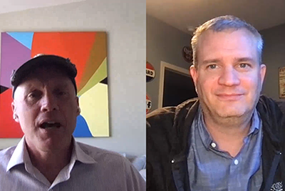

# Cloud 5

## Introdução

Bem-vindo ao Cloud 5 Series da AEM Engineering. Um dos principais problemas na fase de implementação de qualquer produto é ter amostras de código suficientes e/ou demonstrações ao vivo dessas amostras, ferramenta ou APIs. O objetivo desta série é fornecer informações úteis sobre AEM as a Cloud Service em 5 minutos ou menos.

Visite o [Caixa de Sugestão](https://forms.office.com/r/74P5Xz4UH0) para enviar ideias de tópico.

## Temporada 1

Cada estação varia muito e será lançada de acordo com uma programação fixa. Os tópicos da temporada 1 são impulsionados principalmente por solicitações anteriores que encontramos em nossos envolvimentos diários com clientes e parceiros. Visite esta página para obter atualizações semanais ou siga-nos na rede social de sua escolha.

<table>
  <tr>
   <td>
      
      

         <a href="./cloud5-aem-cdn-part1.md"><strong>AEM CDN Deep Dive (parte 1)</strong></a>         
          <em>com Darin Kuntze &amp; James Talbot, Arquitetos da nuvem sênior</em>
      

      

         
         A Parte 1 é uma análise do CDN AEM as a Cloud Service e como usá-lo em sua implementação.
      

     </td>   
     <td>
      
      

         <a href="./cloud5-aem-cdn-part2.md"><strong>AEM CDN Deep Dive (parte 2)</strong></a>
          <em>com Darin Kuntze &amp; James Talbot, Arquitetos da nuvem sênior</em>
      

      

         
         A Parte 2 é uma continuação do nosso olhar para a CDN AEM as a Cloud Service. Respondemos a algumas das perguntas e mitos mais comuns sobre quais recursos você obtém com a nova CDN.
      

   </td>
     <td>
        
      

         <a href="./cloud5-aem-log-files.md"><strong>Arquivos de registro e registro</strong></a>
          <em>com Darin Kuntze &amp; James Talbot, Arquitetos da nuvem sênior</em>
      

      

         
         Esta é uma rápida análise de como acessar logs em AEM as a Cloud Service, incluindo como acessá-los por meio da interface do usuário e das APIs.
      

   </td> 
  </tr>
  <tr>
   <td>
        
      

        <a href="./cloud5-getting-login-token-integrations.md"><strong>Integração com tokens de acesso</strong></a>        
          <em>com Darin Kuntze &amp; James Talbot, Arquitetos da nuvem sênior</em>
      

      

         
         Uma rápida visão geral e demonstração da interação com tokens de logon para fazer a integração funcionar nos ambientes do serviço de nuvem.
      

     </td>   
     <td>
        
      

        <a href="./cloud5-aem-dispatcher-cloud.md"><strong>Dispatcher na nuvem</strong></a>
          <em>com Darin Kuntze &amp; James Talbot, Arquitetos da nuvem sênior</em>
      

      

         
        Darin e James discutem o Dispatcher na AEM Cloud, incluindo algumas práticas recomendadas e diferenças do AMS/No local. 
      

   </td>
     <td>
        
      

         <a href="./cloud5-aem-content-migration-part-1.md"><strong>Migração (parte 1)</strong></a>
          <em>com Darin Kuntze &amp; James Talbot, Arquitetos da nuvem sênior e Dr. Applesmith</em>
      

      

         
         Parte um (de dois) de nossas dicas e truques para migrar para a nuvem. Nosso foco principal na primeira parte é a prática recomendada e o pré-trabalho que o preparam para migrar.
      

   </td> 
  </tr>
<tr>
   <td>
        
      

        <a href="./cloud5-aem-content-migration-part-2.md"><strong>Migração (parte 2)</strong></a>     
          <em>com Darin Kuntze &amp; James Talbot, Arquitetos da nuvem sênior</em>
      

      

         
         Parte dois (de dois) de nossas dicas e truques para migrar para a nuvem. A segunda parte é principalmente sobre o uso das ferramentas disponíveis para migração.
      

     </td>   
     <td>
      
      

         <strong>Validador do Dispatcher</strong>
          <em>com Darin Kuntze &amp; James Talbot, Arquitetos da nuvem sênior</em>
      

      

         
         A 22 de abril de 2022
      

   </td>
     <td>
      
      

         <strong>Dicas de indexação e pesquisa</strong>
          <em>com Darin Kuntze &amp; James Talbot, Arquitetos da nuvem sênior</em>
      

      

         
         Em breve 29 de abril de 2022
      

   </td> 
  </tr>
    <tr>
        <td>
            
            

                <strong>Adobe App Builder</strong>         
                <em>com Darin Kuntze &amp; James Talbot, Arquitetos de Nuvem Sênior e Convidado Especial</em>
            

            
 
                Em 6 de maio de 2022
            

        </td>
        <td></td>
        <td></td>
    </tr>
</table>