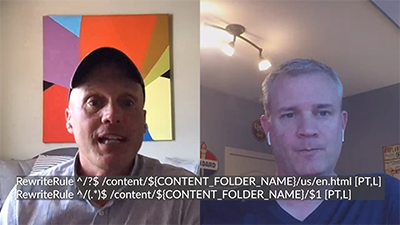

# Cloud 5

>[!VIDEO](https://video.tv.adobe.com/v/346567?quality=12&learn=on)

## Introdução

Bem-vindo à segunda temporada da Série Cloud 5 da AEM Engineering. Um dos principais problemas na fase de implementação de qualquer produto é ter amostras de código suficientes e/ou demonstrações ao vivo dessas amostras, ferramenta ou APIs. O objetivo desta série é fornecer informações úteis sobre AEM as a Cloud Service em 5 minutos ou menos.

## Caixa de Sugestão

Visite o [Caixa de Sugestão](https://forms.office.com/r/74P5Xz4UH0) para enviar ideias de tópico.

## Temporada 2

Cada estação varia em comprimento e é lançada de acordo com uma programação fixa. Os tópicos da segunda temporada são impulsionados principalmente por solicitações anteriores que encontramos em nossos envolvimentos diários com clientes e parceiros. Visite esta página para obter atualizações semanais ou siga-nos na rede social de sua escolha.

<table>
    <tr>
        <td>
            
            

                <a href="season-2/cloud5-experience-v-content-fragments.md"><strong>Fragmentos</strong></a>        
                 <em>com Darin Kuntze &amp; James Talbot, Arquitetos da nuvem sênior</em>
            

            

                 
                Uma análise detalhada das diferenças entre fragmentos de experiência e conteúdo. Spoiler: todo mundo ganha.
            

        </td>   
         <td>
            
            

                <a href="season-2/cloud5-repo-modernizer.md"><strong>Repository Modernizer</strong></a> 
                <em>com Darin Kuntze &amp; James Talbot, Arquitetos da nuvem sênior</em>
            

            

                 
                Insight rápido sobre o uso do modernizador de repositório para reestruturar pacotes de projeto existentes para pacotes discretos compatíveis com o AEM as a cloud service.
            

         </td>
         <td>
            
            

                  <a href="season-2/cloud5-admin-console.md"><strong>Admin Console</strong></a>
                <em>com Darin Kuntze &amp; James Talbot, Arquitetos da nuvem sênior</em>
            

            

             
               Darin e James discutem algumas coisas comuns que as pessoas devem saber sobre o Admin Console, o provisionamento e o acesso.
            

         </td> 
  </tr>
  <tr>
         <td>
            
            

                  <a href="season-2/cloud5-sling-job-scheduler.md"><strong>Trabalhos Sling</strong></a>
                <em>com Darin Kuntze &amp; James Talbot, Arquitetos da nuvem sênior</em>
            

            

             
               Darin e James discutem sobre arranjos e coisas para procurar por agendamento de empregos e consumo no AEM como um serviço em nuvem.
            

         </td> 
         <td>
            
            

                  <a href="season-2/cloud5-repoinit.md"><strong>Inicializador do Repositório Sling</strong></a>
                <em>com Darin Kuntze &amp; James Talbot, Arquitetos da nuvem sênior</em>
            

            

             
              Aprenda alguns truques para desbloquear o poder de usar o Sling Repository Initializer, também conhecido como repontaria.
            

         </td>   
     <td>
            
      

         <a href="season-2/cloud5-fix-your-cache.md"><strong>Corrigir seu... Cache</strong></a>
          <em>com Damian Langsweirdt &amp; James Talbot, Arquitetos da Nuvem Sênior</em>
      

      

          
             Explore áreas para otimizar seu cache e acelerar a execução de seu site AEM as a Cloud Service.
      

   </td> 
  </tr>
<tr>
   <td>
           
      

            <a href="season-2/cloud5-fix-your-rewrites.md"><strong>Corrigir seu... Regravações</strong></a>
          <em>com Darin Kuntze &amp; James Talbot, Arquitetos da nuvem sênior</em>
      

      

         
         Insight rápido sobre coisas que ajudarão a acelerar o desenvolvimento de reescrita e a otimização AEM as a Cloud Service.
      

     </td>   
     <td>
            
      

            <a href="season-2/cloud5-mocm-experience-audit.md"><strong>Mistérios do Cloud Manager.. Auditoria de experiência</strong></a>
          <em>com Darin Kuntze, Arquiteto da Nuvem Sênior</em>
      

      

         
        Explore as noções básicas do Cloud Manager e seus recursos de Auditoria de experiência.
      

   </td>
     <td>
            
      

            <a href="season-2/cloud5-mocm-unit-tests.md"><strong>Mistérios do Cloud Manager.. Testes de unidade</strong></a>
          <em>com Darin Kuntze &amp; Bryan Stopp, Arquitetos da nuvem sênior</em>
      

      

         
        Darin e Bryan discutem como o Cloud Manager integra a execução de teste de unidade e o relatório de cobertura de código ao seu pipeline de CI/CD para ajudar a incentivar e promover as práticas recomendadas de teste de unidade AEM código.
      

   </td> 
  </tr>
    <tr>
        <td>
               
            

                <a href="season-2/cloud5-mocm-functional-tests.md"><strong>Mistérios do Cloud Manager.. Testes funcionais</strong> </a>        
                <em>com Darin Kuntze &amp; Bryan Stopp, Arquitetos da nuvem sênior</em>
            

            
 
                Darin e Bryan discutem diferentes tipos de testes funcionais integrados ao processo de implantação as a Cloud Service do AEM para garantir a qualidade e confiabilidade de seu código.
            

        </td>
        <td></td>
        <td></td>
    </tr>
</table>
