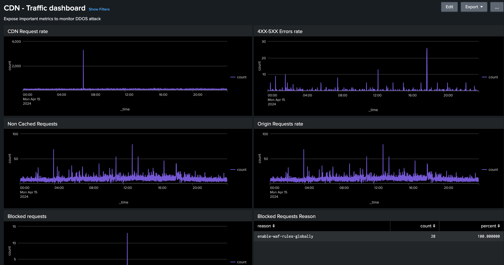

# Ferramentas de análise de log da CDN

Saiba mais sobre o _Ferramentas de Análise de Log da AEM Cloud Service CDN_ esse Adobe fornece e como ele ajuda a obter insights sobre o desempenho do CDN e a implementação do AEM.
 
>[!VIDEO](https://video.tv.adobe.com/v/3429177?quality=12&learn=on)

## Visão geral

A variável [Ferramentas de análise de registros CDN as a Cloud Service do AEM](https://github.com/adobe/AEMCS-CDN-Log-Analysis-Tooling) O oferece painéis pré-criados que podem ser integrados com o [Splunk](https://www.splunk.com/en_us/products/observability-cloud.html) ou o [Pilha ELK](https://www.elastic.co/elastic-stack) para monitoramento e análise em tempo real dos logs do CDN.

Com essa ferramenta, você pode obter monitoramento em tempo real e detecção proativa de problemas. Dessa forma, garantir uma entrega de conteúdo otimizada e medidas de segurança apropriadas contra ataques de DoS (Negação de Serviço) e DDoS (Negação de Serviço Distribuída).

## Principais recursos

- Análise simplificada de registros
- Monitoramento em tempo real
- Integração contínua
- Painéis para
   - Identificar possíveis ameaças à segurança
   - Experiência mais rápida do usuário final

## Visão geral do painel

Para iniciar rapidamente a análise de registro, o Adobe fornece painéis pré-construídos para pilhas Splunk e ELK.

- **Taxa de acertos do cache do CDN**: fornece insights sobre a taxa de acertos do cache total e a contagem total de solicitações por status HIT, PASS e MISS. Ele também fornece os principais URLs de HIT, PASS e MISS.

  

- **Painel de tráfego CDN**: fornece insights sobre o tráfego por meio da taxa de solicitação de CDN e Origem, taxas de erro 4xx e 5xx e solicitações não armazenadas em cache. Ele também fornece o máximo de solicitações CND e Origin por segundo por endereço IP de cliente e mais insights para otimizar as configurações de CDN.

  

- **Painel WAF**: fornece insights por meio de solicitações analisadas, sinalizadas e bloqueadas. Ele também fornece os principais ataques pelo WAF Flag ID, os 100 principais invasores pelo IP do cliente, país e agente do usuário e mais insights para otimizar as configurações do WAF.

  

## Integração do Splunk

Para organizações que utilizam [Splunk](https://www.splunk.com/en_us/products/observability-cloud.html) e que ativaram o encaminhamento de logs do AEMCS para as instâncias do Splunk podem importar rapidamente os painéis pré-criados. Essa configuração facilita a análise de registro acelerada, fornecendo insights acionáveis para otimizar implementações de AEM e mitigar ameaças à segurança, como ataques de DOS.

Você pode começar a usar o [Painéis do Splunk para a Análise de Log do AEM CS CDN](https://github.com/adobe/AEMCS-CDN-Log-Analysis-Tooling/blob/main/Splunk/READEME.md#splunk-dashboards-for-aemcs-cdn-log-analysis) guia.

## Integração de ELK

A variável [Pilha ELK](https://www.elastic.co/elastic-stack), compreendendo Elasticsearch, Logstash e Kibana, é outra opção poderosa para análise de log. É útil para organizações que não têm acesso a uma configuração do Splunk ou recursos de encaminhamento de logs. A configuração da pilha ELK localmente é simples, a ferramenta fornece o arquivo Docker Compose para começar rapidamente. Em seguida, você pode importar os painéis pré-criados e assimilar os logs de CDN baixados usando o Adobe Cloud Manager.

Você pode começar a usar o [Contêiner ELK Docker para análise de log do AEM CS CDN](https://github.com/adobe/AEMCS-CDN-Log-Analysis-Tooling/blob/main/ELK/README.md#elk-docker-container-for-aemcs-cdn-log-analysis) guia.
