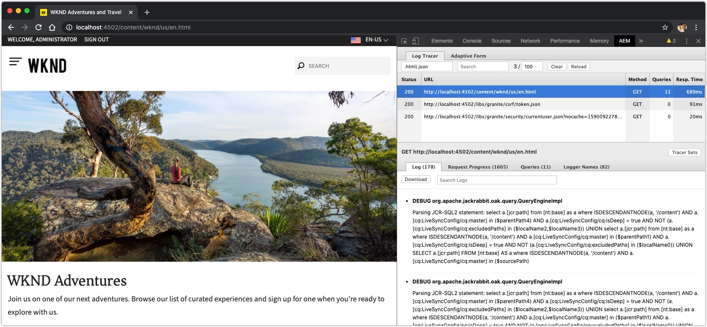

# Outras ferramentas para depurar o SDK do AEM

Várias outras ferramentas podem ajudar na depuração do seu aplicativo na inicialização rápida local do SDK do AEM.

## CRXDE Lite

O CRXDE Lite é uma interface baseada na Web para interagir com o JCR, o repositório de dados do AEM. O CRXDE Lite oferece visibilidade total sobre o JCR, incluindo nós, propriedades, valores de propriedade e permissões.

O CRXDE Lite está localizado em:

+ Ferramentas > Geral > CRXDE Lite
+ ou diretamente em [http://localhost:4502/crx/de/index.jsp](http://localhost:4502/crx/de/index.jsp)

## Explicar consulta

Explique a ferramenta baseada na Web de Query no início rápido local do SDK do AEM, que fornece informações importantes sobre como o AEM interpreta e executa consultas, e uma ferramenta inestimável para garantir que as consultas estejam sendo executadas de maneira eficiente pelo AEM.

Explicar Consulta está localizado em:

+ Ferramentas > Diagnóstico > Desempenho da Consulta > Guia Explicar Consulta
+ [http://localhost:4502/libs/granite/operations/content/diagnosistools/queryPerformance.html](http://localhost:4502/libs/granite/operations/content/diagnosistools/queryPerformance.html)  > Guia Explicar consulta

## QueryBuilder Debugger

O QueryBuilder Debugger é uma ferramenta baseada na Web que ajuda a depurar e entender as consultas de pesquisa usando a sintaxe [QueryBuilder](https://docs.adobe.com/content/help/en/experience-manager-65/developing/platform/query-builder/querybuilder-api.html) do AEM.

O QueryBuilder Debugger está localizado em:

+ [http://localhost:4502/libs/cq/search/content/querydebug.html](http://localhost:4502/libs/cq/search/content/querydebug.html)

## Sling Log Tracer e o plug-in AEM Chrome

[O Sling Log Tracer](https://sling.apache.org/documentation/bundles/log-tracers.html), que vem com o início rápido local do SDK do AEM, permite o rastreamento detalhado de solicitações HTTP, expondo informações de depuração profundas por solicitação. A configuração [Log Tracer OSGi deve ser configurada](https://sling.apache.org/documentation/bundles/log-tracers.html#configuration-1) para habilitar esse recurso.

O plug-in de código aberto [AEM Chrome](https://chrome.google.com/webstore/detail/aem-chrome-plug-in/ejdcnikffjleeffpigekhccpepplaode?hl=en-US) para o [navegador Web Google Chrome](https://www.google.com/chrome/), integra-se ao Rastreador de log, expondo as informações de depuração diretamente nas Ferramentas de Desenvolvimento do Chrome.

_O plug-in AEM Chrome é uma ferramenta de código aberto e a Adobe não fornece suporte para ele._

