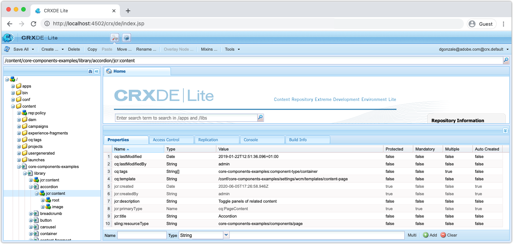
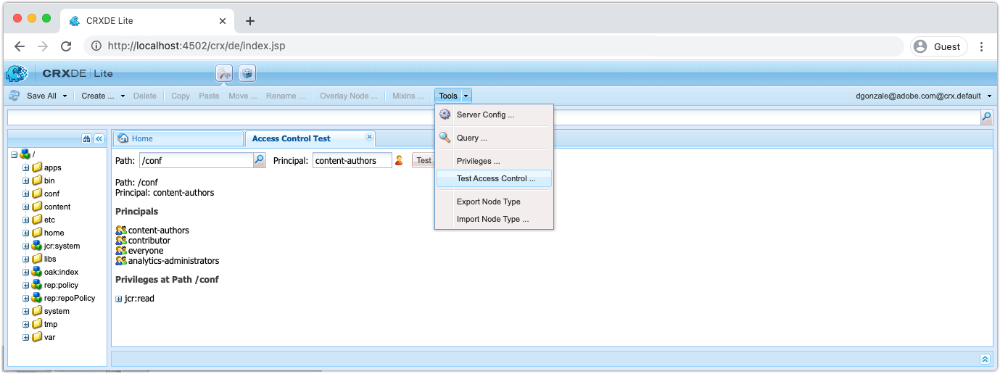

# Outras ferramentas para depuração do SDK do AEM

Uma variedade de outras ferramentas pode ajudar na depuração do aplicativo no quickstart local do SDK do AEM.

## CRXDE Lite

CRXDE Lite é uma interface baseada na web para interagir com o repositório de dados JCR, AEM. O CRXDE Lite fornece visibilidade total do JCR, incluindo nós, propriedades, valores de propriedade e permissões.

CRXDE Lite está localizado em:

+ Ferramentas > Geral > CRXDE Lite
+ ou diretamente em [http://localhost:4502/crx/de/index.jsp](http://localhost:4502/crx/de/index.jsp)

### Depuração de conteúdo

O CRXDE Lite fornece acesso direto ao JCR. O conteúdo visível via CRXDE Lite é limitado pelas permissões concedidas ao usuário, o que significa que você pode não conseguir ver ou modificar tudo no JCR, dependendo do seu acesso.

+ A estrutura JCR é navegada e manipulada usando o painel de navegação esquerdo
+ Selecionar um nó no painel de navegação esquerdo expõe as propriedades do nó no painel inferior.
   + As propriedades podem ser adicionadas, removidas ou alteradas no painel
+ Clicar duas vezes em um nó de arquivo na navegação à esquerda abre o conteúdo do arquivo no painel superior direito
+ Toque no botão Salvar tudo na parte superior esquerda para manter as alterações ou na seta para baixo ao lado de Salvar tudo para Reverter as alterações não salvas.

Quaisquer alterações feitas diretamente no SDK do AEM por meio do CRXDE Lite podem ser difíceis de rastrear e administrar. Conforme apropriado, garantir que as alterações feitas por meio do CRXDE Lite retornem aos pacotes de conteúdo mutável do projeto AEM (`ui.content`) e comprometido com o Git. Idealmente, todas as alterações de conteúdo de aplicativos se originam da base de código e fluem para o SDK do AEM por meio de implantações, em vez de fazer alterações diretamente no SDK do AEM por meio do CRXDE Lite.

### Depuração de controles de acesso

O CRXDE Lite fornece uma maneira de testar e avaliar o controle de acesso em um nó específico para um usuário ou grupo específico (também conhecido como principal).

Para acessar o console Testar controle de acesso no CRXDE Lite, navegue até:

+ CRXDE Lite > Ferramentas > Testar controle de acesso ...

1. Usando o campo Caminho, selecione um Caminho JCR para avaliar
1. Usando o campo Principal, selecione o usuário ou grupo para avaliar o caminho em relação a
1. Toque no botão Testar

Os resultados são exibidos abaixo:

+ __Caminho__ reitera o caminho que foi avaliado
+ __Principal__ reitera o usuário ou grupo cujo caminho foi avaliado
+ __Principais__ lista todos os principais dos quais o principal selecionado faz parte.
   + Isso é útil para entender as associações de grupo transitivo que podem fornecer permissões por herança
+ __Privilégios no caminho__ lista todas as permissões JCR que o principal selecionado tem no caminho avaliado

## Explicar consulta

Explicar a ferramenta baseada na Web Query no início rápido local do SDK do AEM, que fornece informações importantes sobre como o AEM interpreta e executa consultas, e uma ferramenta inestimável para garantir que as consultas estejam sendo executadas de maneira eficiente pelo AEM.

A Explicar consulta está localizada em:

+ Ferramentas > Diagnóstico > Desempenho da consulta > Guia Explicar consulta
+ [http://localhost:4502/libs/granite/operations/content/diagnosistools/queryPerformance.html](http://localhost:4502/libs/granite/operations/content/diagnosistools/queryPerformance.html) Guia Consulta > Explicar

## QueryBuilder Debugger

O QueryBuilder debugger é uma ferramenta baseada na Web que ajuda a depurar e entender consultas de pesquisa usando AEM [QueryBuilder](https://experienceleague.adobe.com/docs/experience-manager-65/developing/platform/query-builder/querybuilder-api.html) sintaxe.

O QueryBuilder Debugger está localizado em:

+ [http://localhost:4502/libs/cq/search/content/querydebug.html](http://localhost:4502/libs/cq/search/content/querydebug.html)
