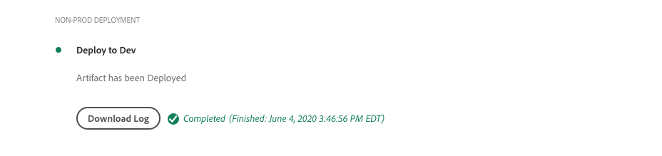

# Depuração de AEM como criação e implantações de Cloud Service

O Adobe Cloud Manager facilita a criação e as implantações de código para AEM como Cloud Service. As falhas podem ocorrer durante as etapas do processo de compilação, exigindo ação para resolvê-las. Este guia aborda a compreensão de falhas comuns na implantação e como abordá-las da melhor forma.


## Validação

A etapa de validação simplesmente garante que as configurações básicas do Cloud Manager sejam válidas. Falhas de validação comuns incluem:

### O ambiente está em um estado inválido

+ __Mensagem de erro:__ o ambiente está em um estado inválido.
   
+ __Causa:__ o ambiente do público alvo do pipeline está em um estado de transição no qual ele não pode aceitar novas construções.
+ __Resolução:__ Aguarde o estado resolver para um estado em execução (ou atualize o estado disponível). Se o ambiente estiver sendo excluído, recrie-o ou escolha um ambiente diferente para o qual criar.

### Não é possível localizar o ambiente associado ao pipeline

+ __Mensagem de erro:__ o ambiente está marcado como excluído.
   
+ __Causa:__ o ambiente que o pipeline está configurado para usar foi excluído.
Mesmo se um novo ambiente com o mesmo nome for recriado, o Cloud Manager não associará automaticamente o pipeline ao ambiente com o mesmo nome.
+ __Resolução:__ edite a configuração do pipeline e selecione novamente o ambiente para o qual implantar.

### Não é possível localizar a ramificação Git associada ao pipeline

+ __Mensagem de erro:pipeline__ inválido: XXXXXX. Motivo=Ramificação=xxxx não encontrado no repositório.
   
+ __Causa:__ a ramificação Git que o pipeline está configurado para usar foi excluída.
+ __Resolução:__ recrie a ramificação Git ausente usando exatamente o mesmo nome, ou reconfigure o pipeline para ser criado a partir de uma ramificação diferente existente.

## Compilação e teste de unidade


A fase de Compilação e Teste de Unidade executa uma compilação Maven (`mvn clean package`) do projeto com check-out da ramificação Git configurada do pipeline.

Os erros identificados nesta fase devem ser reproduzidos na construção local do projeto, com as seguintes exceções:

+ Uma dependência maven não disponível em [Maven Central](https://search.maven.org/) é usada, e o repositório Maven que contém a dependência é:
   + Inacessível do Cloud Manager, como um repositório Maven interno privado, ou o repositório Maven requer autenticação e as credenciais incorretas foram fornecidas.
   + Não explicitamente registrado no `pom.xml` do projeto. Observe que, a inclusão de repositórios Maven é desencorajada, pois aumenta os tempos de construção.
+ Os testes de unidade falharam devido a problemas de tempo. Isso pode ocorrer quando os testes de unidade são sensíveis ao tempo. Um indicador forte está confiando em `.sleep(..)` no código de teste.
+ O uso de plug-ins Maven não suportados.

## Digitalização de código


A digitalização de código executa análise de código estático usando uma combinação de práticas recomendadas específicas de Java e AEM.

A verificação de código resultará em uma falha de compilação se houver uma vulnerabilidade de Segurança crítica no código. As violações menores podem ser substituídas, mas é recomendável que sejam corrigidas. Observe que a digitalização de código é imperfeita e pode resultar em [falsos positivos](https://docs.adobe.com/content/help/en/experience-manager-cloud-service/implementing/developing/understand-test-results.html#dealing-with-false-positives).

Para resolver problemas de digitalização de código, baixe o relatório formatado por CSV fornecido pelo Cloud Manager por meio do botão **Download Details** e reveja quaisquer entradas.

Para obter mais detalhes, consulte AEM regras específicas, consulte Documentação do Cloud Manager [regras de verificação de código personalizadas específicas AEM](https://docs.adobe.com/content/help/en/experience-manager-cloud-manager/using/how-to-use/custom-code-quality-rules.html).

## Criar imagens


A imagem de compilação é responsável por combinar os artefatos de código criados na etapa de teste de compilação e unidade com a versão AEM, para formar um único artefato implantável.

Embora quaisquer problemas de compilação e compilação de código sejam encontrados durante a criação e o teste de unidade, pode haver problemas de configuração ou estruturais identificados ao tentar combinar o artefato de compilação personalizado com a versão AEM.

### Configurações OSGi do duplicado

Quando várias configurações OSGi são resolvidas pelo modo de execução do ambiente AEM público alvo, a etapa Criar imagem falha com o erro:

```
[ERROR] Unable to convert content-package [/tmp/packages/enduser.all-1.0-SNAPSHOT.zip]: 
Configuration ‘com.example.ExampleComponent’ already defined in Feature Model ‘com.example.groupId:example.all:slingosgifeature:xxxxx:X.X’, 
set the ‘mergeConfigurations’ flag to ‘true’ if you want to merge multiple configurations with same PID
```

#### Causa 1

+ __Causa:__ o pacote AEM, com vários pacotes de código, e a mesma configuração OSGi é fornecida por mais de um dos pacotes de código, resultando em um conflito, resultando na etapa Construir imagem incapaz de decidir qual deve ser usado, falhando a compilação. Observe que isso não se aplica às configurações de fábrica OSGi, desde que tenham nomes exclusivos.
+ __Resolução:__ analise todos os pacotes de código (incluindo quaisquer pacotes de códigos de terceiros incluídos) que estão sendo implantados como parte do aplicativo AEM, procurando configurações OSGi de duplicado que resolvem, por meio do modo de execução, para o ambiente de público alvo. A orientação da mensagem de erro de &quot;definir o sinalizador mergeConfigurations como true&quot; não é possível em AEM como um serviço da Cloud e deve ser ignorada.

#### Causa 2

+ __Causa:__ o projeto do AEM inclui incorretamente o mesmo pacote de código duas vezes, resultando na duplicação de qualquer configuração OSGi contida nesse pacote.
+ __Resolução:__ analise todos os pacotes pom.xml incorporados no projeto inteiro e verifique se eles têm a  `filevault-package-maven-plugin` [](https://docs.adobe.com/content/help/en/experience-manager-cloud-service/implementing/developing/aem-project-content-package-structure.html#cloud-manager-target) configuração definida como  `<cloudManagerTarget>none</cloudManagerTarget>`.

### Script de redirecionamento malformado

Os scripts de redirecionamento definem o conteúdo da linha de base, os usuários, as ACLs etc. Em AEM como Cloud Service, scripts de redirecionamento são aplicados durante a criação de imagem, no entanto, no início rápido local AEM SDK são aplicados quando a configuração de fábrica de redirecionamento OSGi é ativada. Por esse motivo, scripts Repoinit podem falhar silenciosamente (com registro) AEM início rápido local do SDK, mas causar falha na etapa Criar imagem, interrompendo a implantação.

+ __Causa:__ um script de recondução está malformado. Observe que isso pode deixar o repositório em um estado incompleto, já que qualquer script reapontado após a falha será executado no repositório.
+ __Resolução:__ analise o início rápido local do SDK AEM quando a configuração do OSGi do script de redirecionamento for implantada para determinar se e quais são os erros.

### Dependência de conteúdo reapontado insatisfeita

Os scripts de redirecionamento definem o conteúdo da linha de base, os usuários, as ACLs etc. Em AEM início rápido local do SDK, os scripts de redirecionamento são aplicados quando a configuração de fábrica OSGi reindicada é ativada, ou em outras palavras, depois que o repositório está ativo e pode ter ocorrido alterações de conteúdo diretamente ou por meio de pacotes de conteúdo. Em AEM como um Cloud Service, os scripts de redirecionamento são aplicados durante a criação de imagem em um repositório que pode não conter o conteúdo do qual o script de redirecionamento depende.

+ __Causa:__ um script repoinit depende de um conteúdo que não existe.
+ __Resolução:__ verifique se o conteúdo do script repoinit depende de existe. Geralmente, isso indica scripts de redirecionamento inadequadamente definidos que estão faltando diretivas que definem essas estruturas de conteúdo ausentes, mas necessárias. Isso pode ser reproduzido localmente, excluindo AEM, descompactando o Jar e adicionando a configuração OSGi reapontada que contém o script reponteiro para a pasta de instalação e iniciando a AEM. O erro será apresentado no arquivo error.log do AEM SDK local quickstart.


### A versão dos componentes principais do aplicativo é maior que a versão implantada

_Esse problema afeta apenas ambientes que não sejam de produção e NÃO atualizem automaticamente para a versão mais recente do AEM._

AEM como Cloud Service inclui automaticamente a versão mais recente dos Componentes principais em cada versão AEM, o que significa que após um AEM como ambiente ser atualizado, automática ou manualmente, a versão mais recente dos Componentes principais foi implantada nele.

É possível que a etapa Criar imagem falhe quando:

+ O aplicativo de implantação atualiza a versão de dependência dos Componentes principais no projeto `core` (pacote OSGi)
+ O aplicativo de implantação é implantado em uma caixa de proteção (não de produção) AEM como um ambiente Cloud Service que não foi atualizado para usar uma versão AEM que contém a nova versão dos Componentes principais.

Para evitar essa falha, sempre que uma Atualização do AEM como ambiente estiver disponível, inclua a atualização como parte da próxima compilação/implantação e sempre verifique se as atualizações foram incluídas após o aumento da versão dos Componentes principais na base de código do aplicativo.

+ __Sintomas:__
a etapa Build Image falha com um relatórios ERROR que 
`com.adobe.cq.wcm.core.components...` os pacotes em intervalos de versão específicos não puderam ser importados pelo  `core` projeto.

   ```
   [ERROR] Bundle com.example.core:0.0.3-SNAPSHOT is importing package(s) Package com.adobe.cq.wcm.core.components.models;version=[12.13,13) in start level 20 but no bundle is exporting these for that start level in the required version range.
   [ERROR] Analyser detected errors on feature 'com.adobe.granite:aem-ethos-app-image:slingosgifeature:aem-runtime-application-publish-dev:1.0.0-SNAPSHOT'. See log output for error messages.
   [INFO] ------------------------------------------------------------------------
   [INFO] BUILD FAILURE
   [INFO] ------------------------------------------------------------------------
   ```

+ __Causa:__  o pacote OSGi do aplicativo (definido no  `core` projeto) importa classes Java da dependência principal dos Componentes principais, em um nível de versão diferente do que é implantado no AEM como Cloud Service.
+ __Resolução:__
   + Usando o Git, reverta para uma confirmação em funcionamento que existe antes do incremento da versão do Componente Principal. Encaminhe essa confirmação para uma ramificação Git do Gerenciador de nuvem e execute uma Atualização do ambiente dessa ramificação. Isso fará a atualização do AEM como Cloud Service para a versão mais recente do AEM, que incluirá a versão mais recente dos Componentes principais. Quando o AEM como Cloud Service for atualizado para a versão mais recente do AEM, que terá a versão mais recente dos Componentes principais, reimplante o código que falhou originalmente.
   + Para reproduzir esse problema localmente, verifique se a versão AEM do SDK é a mesma AEM versão de lançamento que o AEM como um ambiente Cloud Service.


### Criar um caso de suporte para Adobe

Se as abordagens de solução de problemas acima não resolverem o problema, crie um caso de suporte a Adobe via:

+ [Adobe Admin Console](https://adminconsole.adobe.com) > Guia Suporte > Criar caso

   _Se você for membro de várias Organizações de Adobe, verifique se a Organização de Adobe que apresenta falha no pipeline está selecionada no alternador de Organizações de Adobe antes de criar o gabinete._

## Implantar em

A etapa Implantar para é responsável por tirar o artefato de código gerado na Imagem de criação, start novos serviços de autor e publicação do AEM usando-o e, quando bem-sucedido, remove qualquer serviço antigo de autor e publicação do AEM. Os pacotes e índices de conteúdo variável também são instalados e atualizados nesta etapa.

Familiarize-se com [AEM como um Cloud Service logs](./logs.md) antes de depurar a etapa Implantar. O registro `aemerror` contém informações sobre o start e o encerramento de pods que podem ser pertinentes para a Implantação em problemas. Observe que o log disponível por meio do botão Download Log na etapa Deploy to do Cloud Manager não é o `aemerror` log e não contém informações detalhadas relacionadas ao start de seus aplicativos.



Os três principais motivos pelos quais a Implantação para a etapa pode falhar:

### O pipeline do Gerenciador de nuvem contém uma versão AEM antiga

+ __Causa:__ um pipeline do Gerenciador de nuvem contém uma versão mais antiga do AEM do que a implantada no ambiente do público alvo. Isso pode acontecer quando um pipeline é reutilizado e apontado para um novo ambiente que está executando uma versão posterior do AEM. Isso pode ser identificado verificando se a versão AEM do ambiente é maior que a versão AEM do pipeline.
   
+ __Resolução:__
   + Se o ambiente do público alvo tiver uma atualização disponível, selecione Atualizar nas ações do ambiente e execute a criação novamente.
   + Se o ambiente do público alvo não tiver uma atualização disponível, isso significa que ele está executando a versão mais recente do AEM. Para resolver isso, exclua o pipeline e recrie-o.


### Tempo limite do Gerenciador de nuvem

O código executado durante o start do serviço de AEM recém-implantado demora tanto que o Gerenciador de nuvem expira antes que a implantação possa ser concluída. Nesses casos, a implantação pode eventualmente ser bem-sucedida, até mesmo se o status do Gerenciador de nuvem for reportado como Falhou.

+ __Causa: o código__ personalizado pode executar operações, como query grandes ou conversas de conteúdo, acionadas precocemente no pacote OSGi ou ciclos de vida do componente, atrasando significativamente o tempo de inicialização do start da AEM.
+ __Resolução:__ analise a implementação do código que é executado no início do ciclo de vida do pacote OSGi e analise os  `aemerror` logs para os serviços de autor e publicação do AEM no momento da falha (tempo de log no GMT), conforme mostrado pelo Gerenciador de nuvem, e procure mensagens de log indicando quaisquer processos de execução de log personalizados.

### Código ou configuração incompatível

A maioria das violações de código e configuração são capturadas anteriormente na compilação, no entanto, é possível que o código personalizado ou a configuração seja incompatível com o AEM como um Cloud Service e não seja detectado até que seja executado no container.

+ __Causa: o código__ personalizado pode chamar operações demoradas, como query grandes ou conversas de conteúdo, acionadas precocemente no pacote OSGi ou nos ciclos de vida do componente, atrasando significativamente o tempo de ativação do start da AEM.
+ __Resolução:__ analise os  `aemerror` registros dos serviços de autor e publicação do AEM na hora (tempo de registro em GMT) da falha, conforme mostrado pelo Gerenciador de nuvem.
   1. Revise os registros para verificar se há ERROS lançados pelas classes Java fornecidas pelo aplicativo personalizado. Se algum problema for encontrado, resolva, empurre o código fixo e reconstrua o pipeline.
   1. Analise os registros para ver se há ERROS reportados por aspectos de AEM que você está estendendo/interagindo no aplicativo personalizado e investigue-os; esses ERROS podem não ser atribuídos diretamente às classes Java. Se algum problema for encontrado, resolva, empurre o código fixo e reconstrua o pipeline.

### Incluir /var no pacote de conteúdo

`/var` é silencioso que contém uma variedade de conteúdo temporário em tempo de execução. Inclusão de `/var` em pacotes de conteúdo (por exemplo, `ui.content`) implantado pelo Cloud Manager pode fazer com que a etapa Implantar falhe.

Esse problema é difícil de identificar, pois não resulta em falha na implantação inicial, somente em implantações subsequentes. Os sintomas notáveis incluem:

+ A implantação inicial é bem-sucedida, no entanto, o conteúdo mutável novo ou alterado, que faz parte da implantação, não parece existir no serviço de publicação de AEM.
+ A ativação/remoção de ativação de conteúdo no autor de AEM está bloqueada
+ As implantações subsequentes falham na etapa Implantar para, com a falha da etapa Implantar para após aproximadamente 60 minutos.

Para validar esse problema, é a causa do comportamento de falha:

1. Determinar que pelo menos um pacote de conteúdo que faz parte da implantação, grava em `/var`.
1. Verifique se a fila de distribuição primária (em negrito) está bloqueada em:
   + Autor do AEM > Ferramentas > Implantação > Distribuição
      
1. Em caso de falha na implantação subsequente, baixe os registros &quot;Implantar para&quot; do Gerenciador da Cloud usando o botão Download do log:

   

   ... e verifique se há aproximadamente 60 minutos entre as declarações de log:

   ```
   2020-01-01T01:01:02+0000 Begin deployment in aem-program-x-env-y-dev [CorrelationId: 1234]
   ```

   ... e ...

   ```
   2020-01-01T02:04:10+0000 Failed deployment in aem-program-x-env-y-dev
   ```

   Observe que esse log não conterá esses indicadores nas implantações iniciais que relatam como bem-sucedidas, em vez de somente nas implantações subsequentes que falham.

+ __Causa:__ AEM usuário do serviço de replicação usado para implantar pacotes de conteúdo no serviço de publicação de AEM não pode gravar  `/var` no AEM Publish. Isso resulta na falha da implantação do pacote de conteúdo no serviço de publicação de AEM.
+ __Resolução:__ as seguintes maneiras de resolver esses problemas são listadas na ordem de preferência:
   1. Se os recursos `/var` não forem necessários, remova quaisquer recursos em `/var` dos pacotes de conteúdo que são implantados como parte do seu aplicativo.
   2. Se os recursos `/var` forem necessários, defina as estruturas do nó usando [repoinit](https://docs.adobe.com/content/help/en/experience-manager-cloud-service/implementing/deploying/overview.html#repoinit). Os scripts de redirecionamento podem ser direcionados para Autor de AEM, Publicação de AEM ou ambos, por meio de modos de execução OSGi.
   3. Se os recursos `/var` forem necessários apenas AEM autor e não puderem ser razoavelmente modelados usando [repoinit](https://docs.adobe.com/content/help/en/experience-manager-cloud-service/implementing/deploying/overview.html#repoinit), mova-os para um pacote de conteúdo discreto, que só está instalado no AEM Author por [incorporação](https://docs.adobe.com/content/help/en/experience-manager-cloud-service/implementing/developing/aem-project-content-package-structure.html#embeddeds) no pacote `all` numa pasta de modo de execução do AEM Author (`<target>/apps/example-packages/content/install.author</target>`).
   4. Forneça ACLs apropriadas para o usuário do serviço `sling-distribution-importer` conforme descrito neste [Adobe KB](https://helpx.adobe.com/in/experience-manager/kb/cm/cloudmanager-deploy-fails-due-to-sling-distribution-aem.html).

### Criar um caso de suporte para Adobe

Se as abordagens de solução de problemas acima não resolverem o problema, crie um caso de suporte a Adobe via:

+ [Adobe Admin Console](https://adminconsole.adobe.com) > Guia Suporte > Criar caso

   _Se você for membro de várias Organizações de Adobe, verifique se a Organização de Adobe que apresenta falha no pipeline está selecionada no alternador de Organizações de Adobe antes de criar o gabinete._
