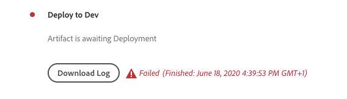

# Depuração AEM criação e implantações as a Cloud Service

O Adobe Cloud Manager facilita a criação do código e as implantações em AEM as a Cloud Service. Falhas podem ocorrer durante as etapas do processo de compilação, exigindo ação para resolvê-las. Este guia aborda a compreensão de falhas comuns na implantação e como abordá-las da melhor maneira.


## Validação

A etapa de validação simplesmente garante a validade das configurações básicas do Cloud Manager. As falhas comuns de validação incluem:

### O ambiente está em um estado inválido

+ __Mensagem de erro:__ O ambiente está em um estado inválido.
   
+ __Causa:__ O ambiente de destino do pipeline está em um estado transitório em que não pode aceitar novas construções.
+ __Resolução:__ Aguarde até que o estado resolva para um estado em execução (ou atualize disponível). Se o ambiente estiver sendo excluído, recrie o ambiente ou escolha um ambiente diferente para criar.

### Não é possível encontrar o ambiente associado ao pipeline

+ __Mensagem de erro:__ O ambiente é marcado como excluído.
   
+ __Causa:__ O ambiente que o pipeline está configurado para usar foi excluído.
Mesmo que um novo ambiente com o mesmo nome seja recriado, o Cloud Manager não reassociará automaticamente o pipeline a esse mesmo ambiente nomeado.
+ __Resolução:__ Edite a configuração do pipeline e selecione novamente o ambiente para implantar.

### Não é possível encontrar a ramificação Git associada ao pipeline

+ __Mensagem de erro:__ pipeline inválido: XXXXXX. Motivo=Ramificação=xxxx não encontrado no repositório.
   
+ __Causa:__ A ramificação Git que o pipeline está configurado para usar foi excluída.
+ __Resolução:__ Recrie a ramificação Git ausente usando exatamente o mesmo nome ou reconfigure o pipeline para criar a partir de uma ramificação diferente e existente.

## Teste de compilação e unidade


A fase Criar e Testar unidade executa uma compilação Maven (`mvn clean package`) do projeto com check-out da ramificação Git configurada do pipeline.

Os erros identificados nesta fase devem ser reproduzidos na construção local do projeto, com as seguintes exceções:

+ Uma dependência maven não disponível em [Maven Central](https://search.maven.org/) é usado e o repositório Maven contendo a dependência é:
   + Inacessível a partir do Cloud Manager, como um repositório Maven interno privado ou o repositório Maven requer autenticação e as credenciais incorretas foram fornecidas.
   + Não explicitamente registrado no `pom.xml`. Observe que, a inclusão de repositórios Maven não é incentivada, pois aumenta os tempos de criação.
+ Os testes de unidade falham devido a problemas de tempo. Isso pode ocorrer quando os testes de unidade são sensíveis ao tempo. Um indicador forte depende de `.sleep(..)` no código de teste.
+ O uso de plug-ins Maven não suportados.

## Verificação de código


A verificação de código executa a análise de código estático usando uma combinação de práticas recomendadas específicas de Java e AEM.

A verificação de código resulta em uma falha de criação se houver uma vulnerabilidade de segurança crítica no código. É possível substituir menos violações, mas é recomendável corrigi-las. Observe que a digitalização de código é imperfeita e pode resultar em [falsos positivos](https://experienceleague.adobe.com/docs/experience-manager-cloud-service/implementing/using-cloud-manager/test-results/overview-test-results.html#dealing-with-false-positives).

Para resolver problemas de digitalização de código, baixe o relatório em formato CSV fornecido pelo Cloud Manager por meio da **Detalhes de download** e revise quaisquer entradas.

Para obter mais detalhes, consulte AEM regras específicas, consulte as documentações do Cloud Manager&quot; [regras de varredura de código AEM específicas personalizadas](https://experienceleague.adobe.com/docs/experience-manager-cloud-manager/using/how-to-use/custom-code-quality-rules.html).

## Criar imagens


A imagem de build é responsável por combinar os artefatos de código criados na etapa Criar e testar a unidade com a versão do AEM, para formar um único artefato implantável.

Embora todos os problemas de compilação e criação de código sejam encontrados durante o teste de compilação e unidade, pode haver problemas de configuração ou estruturais identificados ao tentar combinar o artefato de compilação personalizado com a versão de AEM.

### Duplicar configurações de OSGi

Quando várias configurações de OSGi são resolvidas via runmode para o ambiente de AEM de destino, a etapa Criar imagem falha com o erro:

```
[ERROR] Unable to convert content-package [/tmp/packages/enduser.all-1.0-SNAPSHOT.zip]: 
Configuration 'com.example.ExampleComponent' already defined in Feature Model 'com.example.groupId:example.all:slingosgifeature:xxxxx:X.X', 
set the 'mergeConfigurations' flag to 'true' if you want to merge multiple configurations with same PID
```

#### Causa 1

+ __Causa:__ O pacote &quot;tudo&quot; do projeto AEM contém vários pacotes de código e a mesma configuração OSGi é fornecida por mais de um dos pacotes de código, resultando em um conflito, resultando na etapa &quot;Criar imagem&quot; incapaz de decidir qual deve ser usada, falhando assim a criação. Observe que isso não se aplica às configurações de fábrica OSGi, desde que elas tenham nomes exclusivos.
+ __Resolução:__ Revise todos os pacotes de código (incluindo quaisquer pacotes de código de terceiros incluídos) que estão sendo implantados como parte do aplicativo AEM, procurando por configurações OSGi duplicadas que resolvem, por meio do modo de execução, para o ambiente de destino. A orientação da mensagem de erro de &quot;definir o sinalizador mergeConfigurations como true&quot; não é possível no AEM as a Cloud service e deve ser ignorada.

#### Causa 2

+ __Causa:__ O AEM do projeto inclui incorretamente o mesmo pacote de código duas vezes, resultando na duplicação de qualquer configuração OSGi contida nesse pacote.
+ __Resolução:__ Revise todos os pacotes pom.xml incorporados ao projeto inteiro e verifique se eles têm a variável `filevault-package-maven-plugin` [configuração](https://experienceleague.adobe.com/docs/experience-manager-cloud-service/implementing/developing/aem-project-content-package-structure.html#cloud-manager-target) defina como `<cloudManagerTarget>none</cloudManagerTarget>`.

### Script de reponteiro malformado

Os scripts de redirecionamento definem o conteúdo da linha de base, os usuários, as ACLs, etc. Em AEM as a Cloud Service, os scripts de realocação são aplicados durante a Criação de imagem, no entanto, na inicialização rápida local AEM SDK, eles são aplicados quando a configuração de fábrica de reponteiro OSGi é ativada. Por causa disso, os scripts Repoinit podem falhar silenciosamente (com registro) AEM inicialização rápida local do SDK, mas fazem com que a etapa Criar imagem falhe, interrompendo a implantação.

+ __Causa:__ Um script de reindicação está malformado. Isso pode deixar o repositório em um estado incompleto, pois qualquer script de repontaria após a falha do script não será executado no repositório.
+ __Resolução:__ Revise a inicialização rápida local AEM do SDK quando a configuração OSGi do script de redirecionamento é implantada para determinar se e quais são os erros.

### Dependência de conteúdo de reindicação insatisfeita

Os scripts de redirecionamento definem o conteúdo da linha de base, os usuários, as ACLs, etc. Em AEM inicialização rápida local do SDK, os scripts de redirecionamento são aplicados quando a configuração de fábrica OSGi de redirecionamento é ativada, ou em outras palavras, depois que o repositório está ativo e pode ter incorrido em alterações de conteúdo diretamente ou por meio de pacotes de conteúdo. Em AEM as a Cloud Service, os scripts de reponteiro são aplicados durante a criação de imagem em relação a um repositório que pode não conter conteúdo do qual o script de reponteiro depende.

+ __Causa:__ Um script repoinit depende de conteúdo que não existe.
+ __Resolução:__ Certifique-se de que o conteúdo do script reponteiro depende existe. Geralmente, isso indica scripts de redirecionamento inadequadamente definidos, que estão sem diretivas que definem essas estruturas de conteúdo ausentes, mas obrigatórias. Isso pode ser reproduzido localmente excluindo o AEM, descompactando o Jar e adicionando a configuração OSGi de reapontar que contém o script de reapontar para a pasta de instalação e iniciando o AEM. O erro se apresentará no error.log do AEM SDK local quickstart.


### A versão dos Componentes principais do aplicativo é maior que a versão implantada

_Esse problema afeta apenas ambientes não relacionados à produção que NÃO são atualizados automaticamente para a versão mais recente do AEM._

AEM as a Cloud Service inclui automaticamente a versão mais recente dos Componentes principais em cada versão de AEM, o que significa que, depois que um ambiente as a Cloud Service é atualizado automaticamente ou manualmente, a versão mais recente dos Componentes principais foi implantada nele.

É possível que a etapa Criar imagem falhe quando:

+ O aplicativo de implantação atualiza a versão de dependência maven dos Componentes principais no `core` Projeto (pacote OSGi)
+ O aplicativo de implantação é implantado em um sandbox (não de produção) AEM ambiente as a Cloud Service que não foi atualizado para usar uma versão AEM que contém a nova versão dos Componentes principais .

Para evitar essa falha, sempre que uma Atualização do ambiente as a Cloud Service AEM estiver disponível, inclua a atualização como parte da próxima build/implantação e sempre garanta que as atualizações sejam incluídas após incrementar a versão dos Componentes principais na base de código do aplicativo.

+ __Sintomas:__
A etapa Criar imagem falha com um relatório de ERROR que 
`com.adobe.cq.wcm.core.components...` os pacotes em intervalos de versão específicos não puderam ser importados pelo `core` projeto.

   ```
   [ERROR] Bundle com.example.core:0.0.3-SNAPSHOT is importing package(s) Package com.adobe.cq.wcm.core.components.models;version=[12.13,13) in start level 20 but no bundle is exporting these for that start level in the required version range.
   [ERROR] Analyser detected errors on feature 'com.adobe.granite:aem-ethos-app-image:slingosgifeature:aem-runtime-application-publish-dev:1.0.0-SNAPSHOT'. See log output for error messages.
   [INFO] ------------------------------------------------------------------------
   [INFO] BUILD FAILURE
   [INFO] ------------------------------------------------------------------------
   ```

+ __Causa:__  O pacote OSGi do aplicativo (definido na variável `core` projeto) importa classes Java da dependência principal dos Componentes principais, em um nível de versão diferente do que é implantado AEM as a Cloud Service.
+ __Resolução:__
   + Usando o Git, reverta para uma confirmação de trabalho que existe antes do incremento da versão do Componente principal. Encaminhe essa confirmação para uma ramificação Git do Cloud Manager e execute uma Atualização do ambiente a partir dessa ramificação. Essa atualização será AEM as a Cloud Service para a versão mais recente do AEM, que incluirá a versão mais recente dos Componentes principais. Quando o AEM as a Cloud Service for atualizado para a versão mais recente do AEM, que terá a versão mais recente dos Componentes principais, reimplante o código que falhou originalmente.
   + Para reproduzir esse problema localmente, verifique se a versão do SDK do AEM é a mesma AEM versão de lançamento que o ambiente AEM as a Cloud Service está usando.


### Criar um caso de suporte ao Adobe

Se as abordagens de solução de problemas acima não resolverem o problema, crie um caso de suporte Adobe, por meio de:

+ [Adobe Admin Console](https://adminconsole.adobe.com) > Guia Suporte > Criar caso

   _Se você for membro de várias Orgs do Adobe, verifique se o pipeline Adobe com falha está selecionado no alternador de Orgs do Adobe antes de criar o caso._

## Implantar em

A etapa Implantar em é responsável por obter o artefato de código gerado na Criar imagem, iniciar novos serviços de Autor e Publicação do AEM usando e, após o sucesso, remover qualquer serviço antigo de Autor e Publicação do AEM. Pacotes e índices de conteúdo variável também são instalados e atualizados nesta etapa.

Familiarize-se com [AEM registros as a Cloud Service](./logs.md) antes de depurar a etapa Implantar em . O `aemerror` o log contém informações sobre a inicialização e o desligamento de pods que podem ser pertinentes para a implantação para problemas. Observe que o log disponível por meio do botão Download Log na etapa Implantar no Cloud Manager não é o `aemerror` e não contém informações detalhadas sobre a inicialização de seus aplicativos.


Os três principais motivos pelos quais a etapa Implantar em pode falhar:

### O pipeline do Cloud Manager contém uma versão antiga do AEM

+ __Causa:__ Um pipeline do Cloud Manager contém uma versão mais antiga do AEM do que a implantada no ambiente de destino. Isso pode ocorrer quando um pipeline é reutilizado e apontado para um novo ambiente que está executando uma versão posterior do AEM. Isso pode ser identificado verificando se a versão de AEM do ambiente é maior que a versão de AEM do pipeline.
   
+ __Resolução:__
   + Se o ambiente de destino tiver uma atualização disponível, selecione Atualizar a partir das ações do ambiente e execute novamente a build.
   + Se o ambiente de destino não tiver uma Atualização disponível, significa que ele está executando a versão mais recente do AEM. Para resolver isso, exclua o pipeline e recrie-o.


### Tempo limite do Cloud Manager

O código em execução durante a inicialização do serviço de AEM recém-implantado demora tanto que o Cloud Manager expire antes que a implantação possa ser concluída. Nesses casos, a implantação poderá eventualmente ter êxito, mesmo se o status do Cloud Manager for relatado como Failed.

+ __Causa:__ O código personalizado pode executar operações, como consultas grandes ou travessias de conteúdo, acionadas desde o início no pacote OSGi ou nos ciclos de vida do componente, atrasando significativamente o tempo de inicialização do AEM.
+ __Resolução:__ Revise a implementação do código que é executado no início do ciclo de vida do pacote OSGi e analise o `aemerror` Registros para os serviços de Autor e Publicação do AEM na hora da falha (tempo de log em GMT), conforme mostrado pelo Cloud Manager, e procure mensagens de log indicando quaisquer processos de log personalizados em execução.

### Código ou configuração incompatível

A maioria das violações de código e configuração é capturada anteriormente na build, no entanto, é possível que o código ou a configuração personalizados sejam incompatíveis com o AEM as a Cloud Service e não sejam detectados até que seja executado no container.

+ __Causa:__ O código personalizado pode invocar operações demoradas, como consultas grandes ou travessias de conteúdo, acionadas desde o início no pacote OSGi ou em ciclos de vida de componentes, atrasando significativamente o tempo de inicialização do AEM.
+ __Resolução:__ Revise o `aemerror` Registros para os serviços de Autor e Publicação do AEM ao longo do tempo (tempo de log em GMT) da falha, conforme mostrado pelo Cloud Manager.
   1. Revise os logs para verificar se há ERROS gerados pelas classes Java fornecidas pelo aplicativo personalizado. Se algum problema for encontrado, resolva, empurre o código fixo e recrie o pipeline.
   1. Revise os registros para quaisquer ERROS relatados por aspectos de AEM que você está estendendo/interagindo no aplicativo personalizado e investigue-os; esses ERROS podem não ser atribuídos diretamente às classes Java. Se algum problema for encontrado, resolva, empurre o código fixo e recrie o pipeline.

### Inclusão de /var no pacote de conteúdo

`/var` O é mutável que contém uma variedade de conteúdo temporário em tempo de execução. Incluindo `/var` em pacotes de conteúdo (por exemplo, `ui.content`) implantado por meio do Cloud Manager pode causar falha na etapa Implantar .

Esse problema é difícil de identificar, pois não resulta em falha na implantação inicial, somente em implantações subsequentes. Os sintomas notáveis incluem:

+ A implantação inicial foi bem-sucedida, embora o conteúdo mutável novo ou alterado, que faz parte da implantação, não pareça existir no serviço de publicação do AEM.
+ A ativação/desativação de conteúdo no AEM Author está bloqueada
+ As implantações subsequentes falharão na etapa Implantar em , com a falha da etapa Implantar em após aproximadamente 60 minutos.

Para validar esse problema, é a causa do comportamento com falha:

1. Determinar que pelo menos um pacote de conteúdo que faz parte da implantação grava em `/var`.
1. Verifique se a fila de distribuição primária (em negrito) está bloqueada em:
   + Autor do AEM > Ferramentas > Implantação > Distribuição
      
1. Ao falhar na implantação subsequente, baixe os registros &quot;Implantar em&quot; do Cloud Manager usando o botão Baixar log:

   

   ... e verifique se há aproximadamente 60 minutos entre as declarações de log:

   ```
   2020-01-01T01:01:02+0000 Begin deployment in aem-program-x-env-y-dev [CorrelationId: 1234]
   ```

   ... e ...

   ```
   2020-01-01T02:04:10+0000 Failed deployment in aem-program-x-env-y-dev
   ```

   Observe que esse log não conterá esses indicadores nas implantações iniciais que relatam como bem-sucedidas, em vez de somente nas implantações subsequentes com falha.

+ __Causa:__ AEM usuário do serviço de replicação usado para implantar pacotes de conteúdo no serviço de publicação do AEM não pode gravar no `/var` na publicação do AEM. Isso resulta na falha da implantação do pacote de conteúdo no serviço de publicação do AEM.
+ __Resolução:__ As seguintes maneiras de resolver esses problemas são listadas na ordem de preferência:
   1. Se a variável `/var` os recursos não são necessários para remover recursos de `/var` de pacotes de conteúdo que são implantados como parte de seu aplicativo.
   2. Se a variável `/var` os recursos são necessários, defina as estruturas do nó usando [repoinit](https://experienceleague.adobe.com/docs/experience-manager-cloud-service/implementing/deploying/overview.html#repoinit). Os scripts de realocação podem ser direcionados para Autor do AEM, Publicação do AEM ou ambos, por meio de modos de execução OSGi.
   3. Se a variável `/var` os recursos são necessários apenas AEM autor e não podem ser razoavelmente modelados usando [repoinit](https://experienceleague.adobe.com/docs/experience-manager-cloud-service/implementing/deploying/overview.html#repoinit), mova-os para um pacote de conteúdo discreto, que é instalado somente no AEM Author por [incorporação](https://experienceleague.adobe.com/docs/experience-manager-cloud-service/implementing/developing/aem-project-content-package-structure.html#embeddeds) no `all` pacote em uma pasta do modo de execução do AEM Author (`<target>/apps/example-packages/content/install.author</target>`).
   4. Forneça ACLs apropriadas para a `sling-distribution-importer` usuário de serviço conforme descrito neste [Adobe KB](https://helpx.adobe.com/in/experience-manager/kb/cm/cloudmanager-deploy-fails-due-to-sling-distribution-aem.html).

### Criar um caso de suporte ao Adobe

Se as abordagens de solução de problemas acima não resolverem o problema, crie um caso de suporte Adobe, por meio de:

+ [Adobe Admin Console](https://adminconsole.adobe.com) > Guia Suporte > Criar caso

   _Se você for membro de várias Orgs do Adobe, verifique se o pipeline Adobe com falha está selecionado no alternador de Orgs do Adobe antes de criar o caso._
