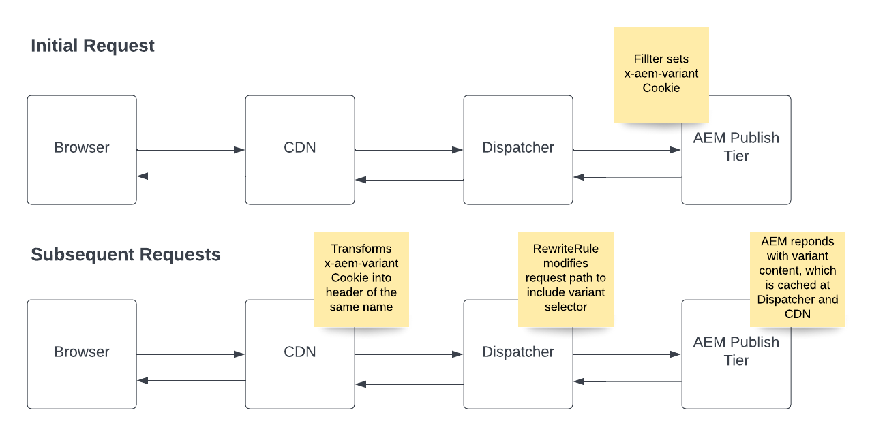

# Armazenamento em cache de variantes de página

Saiba como configurar e usar o AEM as a cloud service para suportar o armazenamento em cache de variantes de página.

## Exemplo de casos de uso

+ Qualquer provedor de serviços que ofereça um conjunto diferente de ofertas de serviço e as opções de preço correspondentes com base na localização geográfica do usuário e no cache de páginas com conteúdo dinâmico deve ser gerenciado no CDN e no Dispatcher.

+ Um cliente de varejo tem lojas em todo o país e cada loja tem diferentes ofertas com base em onde está localizada, e o cache de páginas com conteúdo dinâmico deve ser gerenciado no CDN e no Dispatcher.

## Visão geral da solução

+ Identifique a chave da variante e o número de valores que ela pode ter. No nosso exemplo, variamos de acordo com o estado dos EUA, portanto, o número máximo é 50. É pequeno o suficiente para não causar problemas com os limites de variante na CDN. [Revisar seção de limitações da variante](#variant-limitations).

+ O código AEM deve definir o cookie __&quot;x-aem-variant&quot;__ ao estado preferido do visitante (por exemplo, `Set-Cookie: x-aem-variant=NY`) na resposta HTTP correspondente da solicitação HTTP inicial.

+ Solicitações subsequentes do visitante enviam esse cookie (por exemplo, `"Cookie: x-aem-variant=NY"`) e o cookie é transformado no nível da CDN em um cabeçalho predefinido (ou seja, `x-aem-variant:NY`) que é transmitido ao dispatcher.

+ Uma regra de regravação do Apache modifica o caminho da solicitação para incluir o valor do cabeçalho no URL da página como um Seletor do Apache Sling (por exemplo, `/page.variant=NY.html`). Isso permite que o AEM Publish veicule conteúdo diferente com base no seletor e no Dispatcher para armazenar em cache uma página por variante.

+ A resposta enviada pelo AEM Dispatcher deve conter um cabeçalho de resposta HTTP `Vary: x-aem-variant`. Isso instrui o CDN a armazenar cópias de cache diferentes para valores de cabeçalho diferentes.

>[!TIP]
>
>Sempre que um cookie é definido (por exemplo, Set-Cookie: x-aem-variant=NY) a resposta não deve ser armazenada em cache (deve ter Cache-Control: private ou Cache-Control: no-cache)

## Fluxo de solicitação HTTP



>[!NOTE]
>
>O fluxo de solicitação HTTP inicial acima deve ocorrer antes que qualquer conteúdo que use variantes seja solicitado.

## Uso

1. Para demonstrar o recurso, usaremos [WKND](https://experienceleague.adobe.com/docs/experience-manager-learn/getting-started-wknd-tutorial-develop/overview.html?lang=pt-BR)Como exemplo, a implementação do.

1. Implementar um [SlingServletFilter](https://sling.apache.org/documentation/the-sling-engine/filters.html) no AEM para definir `x-aem-variant` cookie na resposta HTTP, com um valor de variante.

1. CDN do AEM transforma automaticamente `x-aem-variant` cookie em um cabeçalho HTTP de mesmo nome.

1. Adicione uma regra mod_rewrite do Apache Web Server ao `dispatcher` projeto, que modifica o caminho da solicitação para incluir o seletor de variante.

1. Implante o filtro e reescreva as regras usando o Cloud Manager.

1. Teste o fluxo de solicitação geral.

## Amostras de código

+ Exemplo de SlingServletFilter para definir `x-aem-variant` cookie com um valor no AEM.

   ```
   package com.adobe.aem.guides.wknd.core.servlets.filters;
   
   import javax.servlet.*;
   import java.io.IOException;
   
   import org.apache.sling.api.SlingHttpServletRequest;
   import org.apache.sling.api.SlingHttpServletResponse;
   import org.apache.sling.servlets.annotations.SlingServletFilter;
   import org.apache.sling.servlets.annotations.SlingServletFilterScope;
   import org.osgi.service.component.annotations.Component;
   import org.slf4j.Logger;
   import org.slf4j.LoggerFactory;
   
   
   // Invoke filter on  HTTP GET /content/wknd.*.foo|bar.html|json requests.
   // This code and scope is for example purposes only, and will not interfere with other requests.
   @Component
   @SlingServletFilter(scope = {SlingServletFilterScope.REQUEST},
           resourceTypes = {"cq:Page"},
           pattern = "/content/wknd/.*",
           extensions = {"html", "json"},
           methods = {"GET"})
   public class PageVariantFilter implements Filter {
       private static final Logger log = LoggerFactory.getLogger(PageVariantFilter.class);
       private static final String VARIANT_COOKIE_NAME = "x-aem-variant";
   
       @Override
       public void init(FilterConfig filterConfig) throws ServletException { }
   
       @Override
       public void doFilter(ServletRequest servletRequest, ServletResponse servletResponse, FilterChain filterChain) throws IOException, ServletException {
           SlingHttpServletResponse slingResponse = (SlingHttpServletResponse) servletResponse;
           SlingHttpServletRequest slingRequest = (SlingHttpServletRequest) servletRequest;
   
           // Check is the variant was previously set
           final String existingVariant = slingRequest.getCookie(VARIANT_COOKIE_NAME).getValue();
   
           if (existingVariant == null) {
               // Variant has not been set, so set it now
               String newVariant = "NY"; // Hard coding as an example, but should be a calculated value
               slingResponse.setHeader("Set-Cookie", VARIANT_COOKIE_NAME + "=" + newVariant + "; Path=/; HttpOnly; Secure; SameSite=Strict");
               log.debug("x-aem-variant cookie is set with the value {}", newVariant);
           } else {
               log.debug("x-aem-variant previously set with value {}", existingVariant);
           }
   
           filterChain.doFilter(servletRequest, slingResponse);
       }
   
       @Override
       public void destroy() { }
   }
   ```

+ Exemplo de regra de regravação no __dispatcher/src/conf.d/rewrite.rules__ arquivo que é gerenciado como código-fonte no Git e implantado usando o Cloud Manager.

   ```
   ...
   
   RewriteCond %{REQUEST_URI} ^/us/.*  
   RewriteCond %{HTTP:x-aem-variant} ^.*$  
   RewriteRule ^([^?]+)\.(html.*)$ /content/wknd$1.variant=%{HTTP:x-aem-variant}.$2 [PT,L] 
   
   ...
   ```

## Limitações da variante

+ O AEM CDN pode gerenciar até 200 variações. Isso significa que `x-aem-variant` pode ter até 200 valores únicos. Para obter mais informações, consulte [Limites de configuração da CDN](https://docs.fastly.com/en/guides/resource-limits).

+ Tenha cuidado para garantir que a chave de variante escolhida nunca exceda esse número.  Por exemplo, uma ID de usuário não é uma boa chave, pois facilmente excederia 200 valores para a maioria dos sites, enquanto os estados/territórios em um país são mais adequados se houver menos de 200 estados nesse país.

>[!NOTE]
>
>Quando as variantes excederem 200, a CDN responderá com a resposta &quot;Muitas variantes&quot; em vez do conteúdo da página.
