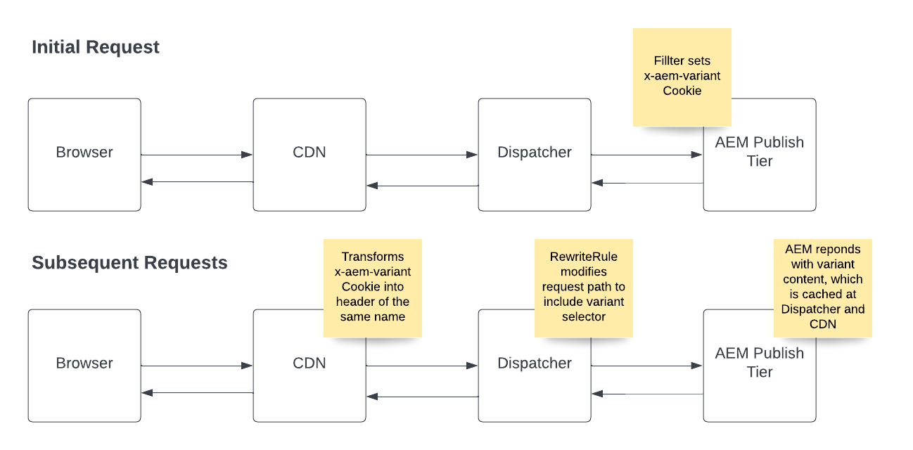

# Armazenamento em cache de variantes de página

As experiências da Web geralmente precisam adaptar o conteúdo para públicos diferentes, seja por localização geográfica, personalização ou experimentação. Neste tutorial, você aprenderá a configurar o Adobe Experience Manager (AEM) as a Cloud Service para armazenar em cache com eficiência e atender a várias variantes de página usando o cookie `x-aem-variant`, garantindo flexibilidade e alto desempenho em escala.

Em um alto nível, a abordagem envolve a configuração do código do seu projeto um cookie `x-aem-variant` específico do visitante (por exemplo, com base na localização), que é então transformado em um cabeçalho de solicitação no CDN. Esse valor é incorporado ao URL da solicitação por meio de uma regra de regravação do dispatcher, permitindo que o AEM renderize a variante correta e, ao mesmo tempo, permita que o CDN e o dispatcher armazenem em cache uma versão separada da página para cada variante.

## Exemplo de casos de uso

+ Qualquer provedor de serviços que ofereça um conjunto diferente de ofertas de serviço e as opções de preço correspondentes com base na localização geográfica do usuário e no cache de páginas com conteúdo dinâmico deve ser gerenciado na CDN e na Dispatcher.

+ Um cliente de varejo tem lojas em todo o país e cada loja tem diferentes ofertas com base em onde está localizada, e o cache de páginas com conteúdo dinâmico deve ser gerenciado na CDN e no Dispatcher.

## Visão geral da solução

+ Identifique a chave da variante e o número de valores que ela pode ter. No nosso exemplo, variamos de acordo com o estado dos EUA, portanto, o número máximo é 50. É pequeno o suficiente para não causar problemas com os limites de variante na CDN. [Revise a seção de limitações de variantes](#variant-limitations).

+ O código do projeto deve definir o cookie __&quot;x-aem-variant&quot;__ para o estado preferido do visitante (por exemplo, `Set-Cookie: x-aem-variant=NY`) na resposta HTTP correspondente da solicitação HTTP inicial. A AEM e a CDN gerenciada pela Adobe não determinam ou definem automaticamente `x-aem-variant`. Se esse cabeçalho/cookie estiver presente, é porque seu aplicativo o definiu. Esse cabeçalho pode ser definido por meio de um AEM Servlet personalizado ou um Filtro de Servlet do AEM (como mostrado na amostra de código abaixo).

+ Solicitações subsequentes do visitante enviam esse cookie (por exemplo, `"Cookie: x-aem-variant=NY"`) e o cookie é transformado no nível de CDN em um cabeçalho predefinido (ou seja, `x-aem-variant:NY`), que é passado para o Dispatcher.

+ Uma regra de regravação do Apache modifica o caminho da solicitação para incluir o valor do cabeçalho no URL da página como um Seletor do Apache Sling (por exemplo, `/page.variant=NY.html`). Isso permite que o AEM Publish disponibilize conteúdo diferente com base no seletor e no Dispatcher para armazenar em cache uma página por variante.

+ A resposta enviada pelo AEM Dispatcher deve conter um cabeçalho de resposta HTTP `Vary: x-aem-variant`. Isso instrui o CDN a armazenar cópias de cache diferentes para valores de cabeçalho diferentes.

>[!TIP]
>
>Sempre que um cookie é definido (por exemplo, Set-Cookie: x-aem-variant=NY) a resposta não deve ser armazenada em cache (deve ter Cache-Control: private ou Cache-Control: no-cache)

## Fluxo de solicitação HTTP



>[!NOTE]
>
>O fluxo de solicitação HTTP inicial acima deve ocorrer antes que qualquer conteúdo que use variantes seja solicitado.

## Uso

1. Para demonstrar o recurso, usaremos como exemplo a implementação do [WKND](https://experienceleague.adobe.com/docs/experience-manager-learn/getting-started-wknd-tutorial-develop/overview.html).

1. Implemente um [SlingServletFilter](https://sling.apache.org/documentation/the-sling-engine/filters.html) no AEM para definir o cookie `x-aem-variant` na resposta HTTP, com um valor de variante.

1. A CDN da AEM transforma automaticamente o cookie `x-aem-variant` em um cabeçalho HTTP de mesmo nome.

1. Adicione uma regra `mod_rewrite` do Apache Web Server ao projeto `dispatcher`, que modifica o caminho da solicitação para incluir o seletor de variantes.

1. Implante o filtro e reescreva as regras usando o Cloud Manager.

1. Teste o fluxo de solicitação geral.

## Amostras de código

+ SlingServletFilter de exemplo para definir o cookie `x-aem-variant` com um valor no AEM.

  ```
  package com.adobe.aem.guides.wknd.core.servlets.filters;
  
  import javax.servlet.*;
  import java.io.IOException;
  
  import org.apache.sling.api.SlingHttpServletRequest;
  import org.apache.sling.api.SlingHttpServletResponse;
  import org.apache.sling.servlets.annotations.SlingServletFilter;
  import org.apache.sling.servlets.annotations.SlingServletFilterScope;
  import org.osgi.service.component.annotations.Component;
  import org.slf4j.Logger;
  import org.slf4j.LoggerFactory;
  
  
  // Invoke filter on  HTTP GET /content/wknd.*.foo|bar.html|json requests.
  // This code and scope is for example purposes only, and will not interfere with other requests.
  @Component
  @SlingServletFilter(scope = {SlingServletFilterScope.REQUEST},
          resourceTypes = {"cq:Page"},
          pattern = "/content/wknd/.*",
          extensions = {"html", "json"},
          methods = {"GET"})
  public class PageVariantFilter implements Filter {
      private static final Logger log = LoggerFactory.getLogger(PageVariantFilter.class);
      private static final String VARIANT_COOKIE_NAME = "x-aem-variant";
  
      @Override
      public void init(FilterConfig filterConfig) throws ServletException { }
  
      @Override
      public void doFilter(ServletRequest servletRequest, ServletResponse servletResponse, FilterChain filterChain) throws IOException, ServletException {
          SlingHttpServletResponse slingResponse = (SlingHttpServletResponse) servletResponse;
          SlingHttpServletRequest slingRequest = (SlingHttpServletRequest) servletRequest;
  
          // Check is the variant was previously set
          final String existingVariant = slingRequest.getCookie(VARIANT_COOKIE_NAME).getValue();
  
          if (existingVariant == null) {
              // Variant has not been set, so set it now
              String newVariant = "NY"; // Hard coding as an example, but should be a calculated value
              slingResponse.setHeader("Set-Cookie", VARIANT_COOKIE_NAME + "=" + newVariant + "; Path=/; HttpOnly; Secure; SameSite=Strict");
              log.debug("x-aem-variant cookie is set with the value {}", newVariant);
          } else {
              log.debug("x-aem-variant previously set with value {}", existingVariant);
          }
  
          filterChain.doFilter(servletRequest, slingResponse);
      }
  
      @Override
      public void destroy() { }
  }
  ```

+ Exemplo de regra de regravação no arquivo __dispatcher/src/conf.d/rewrite.rules__, que é gerenciado como código-fonte no Git e implantado usando o Cloud Manager.

  ```
  ...
  
  RewriteCond %{REQUEST_URI} ^/us/.*  
  RewriteCond %{HTTP:x-aem-variant} ^.*$  
  RewriteRule ^([^?]+)\.(html.*)$ /content/wknd$1.variant=%{HTTP:x-aem-variant}.$2 [PT,L] 
  
  ...
  ```

## Limitações da variante

+ A CDN da AEM pode gerenciar até 200 variações. Isso significa que o cabeçalho `x-aem-variant` pode ter até 200 valores únicos. Para obter mais informações, reveja os [limites de configuração da CDN](https://docs.fastly.com/en/guides/resource-limits).

+ Tenha cuidado para garantir que a chave de variante escolhida nunca exceda esse número.  Por exemplo, uma ID de usuário não é uma boa chave, pois facilmente excederia 200 valores para a maioria dos sites, enquanto os estados/territórios em um país são mais adequados se houver menos de 200 estados nesse país.

>[!NOTE]
>
>Quando as variantes excederem 200, a CDN responderá com a resposta &quot;Muitas variantes&quot; em vez do conteúdo da página.
