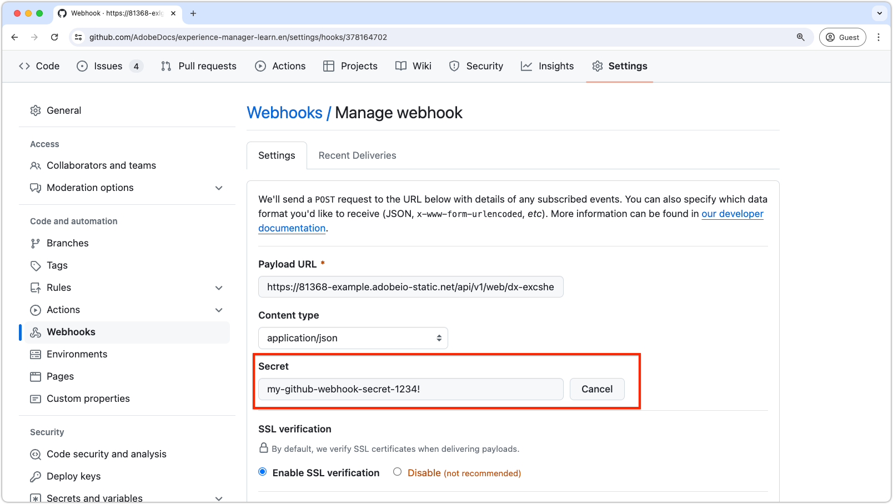

# Verificação de webhook do Github.com

Os webhooks permitem criar ou configurar integrações que assinam determinados eventos em GitHub.com. Quando um desses eventos é acionado, o GitHub envia uma carga de POST HTTP para o URL configurado do webhook. No entanto, por motivos de segurança, é importante verificar se a solicitação de webhook recebida é realmente do GitHub e não de um ator mal-intencionado. Este tutorial o orienta pelas etapas para verificar uma solicitação de webhook GitHub.com em uma ação Adobe App Builder usando um segredo compartilhado.

## Configurar segredo do GitHub no AppBuilder

1. **Adicionar segredo ao arquivo `.env`:**

   No arquivo `.env` do projeto App Builder, adicione uma chave personalizada para o segredo do webhook GitHub.com:

   ```env
   # Specify your secrets here
   # This file must not be committed to source control
   ...
   GITHUB_SECRET=my-github-webhook-secret-1234!
   ```

2. **Atualizar `ext.config.yaml` arquivo:**

   O arquivo `ext.config.yaml` deve ser atualizado para verificar a solicitação do webhook GitHub.com.

   - Defina a configuração `web` da ação do AppBuilder como `raw` para receber o corpo bruto da solicitação de GitHub.com.
   - Em `inputs` na configuração da ação do AppBuilder, adicione a chave `GITHUB_SECRET`, mapeando-a para o campo `.env` que contém o segredo. O valor dessa chave é o nome de campo `.env` prefixado com `$`.
   - Defina a anotação `require-adobe-auth` na configuração de ação do AppBuilder para `false` para permitir que a ação seja chamada sem a necessidade de autenticação de Adobe.

   O arquivo `ext.config.yaml` resultante deve ser mais ou menos assim:

   ```yaml
   operations:
     view:
       - type: web
         impl: index.html
   actions: actions
   web: web-src
   runtimeManifest:
     packages:
       dx-excshell-1:
         license: Apache-2.0
         actions:
           github-to-jira:
             function: actions/generic/index.js
             web: 'raw'
             runtime: nodejs:20
             inputs:
               LOG_LEVEL: debug
               GITHUB_SECRET: $GITHUB_SECRET
             annotations:
               require-adobe-auth: false
               final: true
   ```

## Adicionar código de verificação à ação do AppBuilder

Em seguida, adicione o código JavaScript fornecido abaixo (copiado da [documentação do GitHub.com](https://docs.github.com/en/webhooks/using-webhooks/validating-webhook-deliveries#javascript-example)) à sua ação do AppBuilder. Não deixe de exportar a função `verifySignature`.

```javascript
// src/dx-excshell-1/actions/generic/github-webhook-verification.js

let encoder = new TextEncoder();

async function verifySignature(secret, header, payload) {
    let parts = header.split("=");
    let sigHex = parts[1];

    let algorithm = { name: "HMAC", hash: { name: 'SHA-256' } };

    let keyBytes = encoder.encode(secret);
    let extractable = false;
    let key = await crypto.subtle.importKey(
        "raw",
        keyBytes,
        algorithm,
        extractable,
        [ "sign", "verify" ],
    );

    let sigBytes = hexToBytes(sigHex);
    let dataBytes = encoder.encode(payload);
    let equal = await crypto.subtle.verify(
        algorithm.name,
        key,
        sigBytes,
        dataBytes,
    );

    return equal;
}

function hexToBytes(hex) {
    let len = hex.length / 2;
    let bytes = new Uint8Array(len);

    let index = 0;
    for (let i = 0; i < hex.length; i += 2) {
        let c = hex.slice(i, i + 2);
        let b = parseInt(c, 16);
        bytes[index] = b;
        index += 1;
    }

    return bytes;
}

module.exports = { verifySignature };
```

## Implementar verificação na ação AppBuilder

Em seguida, verifique se a solicitação vem do GitHub, comparando a assinatura no cabeçalho da solicitação com a assinatura gerada pela função `verifySignature`.

Na ação `index.js` do AppBuilder, adicione o seguinte código à função `main`:


```javascript
// src/dx-excshell-1/actions/generic/index.js

const { verifySignature } = require("./github-webhook-verification");
...

// Main function that will be executed by Adobe I/O Runtime
async function main(params) {
  // Create a Logger
  const logger = Core.Logger("main", { level: params?.LOG_LEVEL || "info" });

  try {
    // Log parameters if LOG_LEVEL is 'debug'
    logger.debug(stringParameters(params));

    // Define required parameters and headers
    const requiredParams = [
      // Verifies the GITHUB_SECRET is present in the action's configuration; add other parameters here as needed.
      "GITHUB_SECRET"
    ];

    const requiredHeaders = [
      // Require the x-hub-signature-256 header, which GitHub.com populates with a sha256 hash of the payload
      "x-hub-signature-256"
    ];

    // Check for missing required parameters and headers
    const errorMessage = checkMissingRequestInputs(params, requiredParams, requiredHeaders);

    if (errorMessage) {
      // Return and log client errors
      return errorResponse(400, errorMessage, logger);
    }

    // Decode the request body (which is base64 encoded) to a string
    const body = Buffer.from(params.__ow_body, 'base64').toString('utf-8');

    // Verify the GitHub webhook signature
    const isSignatureValid = await verifySignature(
      params.GITHUB_SECRET,
      params.__ow_headers["x-hub-signature-256"],
      body
    );

    if (!isSignatureValid) {
      // GitHub signature verification failed
      return errorResponse(401, "Unauthorized", logger);
    } else {
      logger.debug("Signature verified");
    }

    // Parse the request body as JSON so its data is useful in the action
    const githubParams = JSON.parse(body) || {};

    // Optionally, merge the GitHub webhook request parameters with the action parameters
    const mergedParams = {
      ...params,
      ...githubParams
    };

    // Do work based on the GitHub webhook request
    doWork(mergedParams);

    return {
      statusCode: 200,
      body: { message: "GitHub webhook received and processed!" }
    };

  } catch (error) {
    // Log any server errors
    logger.error(error);
    // Return with 500 status code
    return errorResponse(500, "Server error", logger);
  }
}
```

## Configurar webhook no GitHub

De volta a GitHub.com, forneça o mesmo valor secreto para GitHub.com ao criar o webhook. Use o valor secreto especificado na chave `GITHUB_SECRET` do arquivo `.env`.

Em GitHub.com, vá para as configurações do repositório e edite o webhook. Nas configurações do webhook, forneça o valor do segredo no campo `Secret`. Clique em __Atualizar webhook__ na parte inferior para salvar as alterações.



Ao seguir essas etapas, você garante que sua ação do App Builder possa verificar com segurança se as solicitações de webhook recebidas são realmente do webhook GitHub.com.
